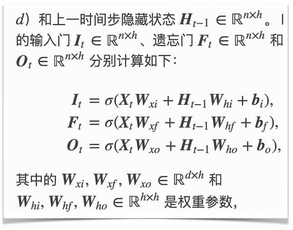
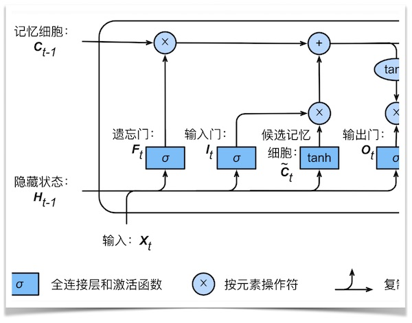
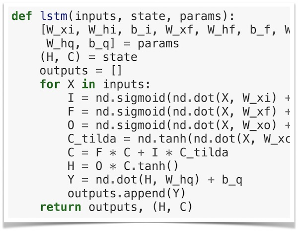

# 动手学深度学习

[](http://ci.d2l.ai/job/d2l-zh/job/master/)

[本书网址：zh.d2l.ai](https://zh.d2l.ai/) |  [如何安装和使用书中源代码](https://zh.d2l.ai/chapter_prerequisite/install.html)


<h5 align="center"><i>理解深度学习的最好方法是学以致用。</i></h5>

<p align="center">
  
  
  
  
</p>

本开源项目代表了我们的一种尝试：我们将教给读者概念、背景知识和代码；我们将在同一个地方阐述剖析问题所需的批判性思维、解决问题所需的数学知识，以及实现解决方案所需的工程技能。

我们的目标是创建一个为实现以下目标的统一资源：
1. 所有人均可在网上免费获取；
1. 提供足够的技术深度，从而帮助读者实际成为深度学习应用科学家：既理解数学原理，又能够实现并不断改进方法；
1. 包含可运行的代码，为读者展示如何在实际中解决问题。这样不仅直接将数学公式对应成实际代码，而且可以修改代码、观察结果并及时获取经验；
1. 允许我们和整个社区不断快速迭代内容，从而紧跟仍在高速发展的深度学习领域；
1. 由包含有关技术细节问答的论坛作为补充，使大家可以相互答疑并交换经验。

<h5 align="center">将本书（中英文版）用作教材或参考书的大学</h5>
<p align="center">
  
</p>

如果本书对你有帮助，请Star (★) 本仓库或引用本书的英文版：

```
@book{zhang2020dive,
    title={Dive into Deep Learning},
    author={Aston Zhang and Zachary C. Lipton and Mu Li and Alexander J. Smola},
    note={\url{https://d2l.ai}},
    year={2020}
}
```

## 更新

英文版全面改进了[预备知识](https://d2l.ai/chapter_preliminaries/index.html)一章，
新增了[推荐系统](https://d2l.ai/chapter_recommender-systems/index.html)一章和<a href="https://d2l.ai/chapter_appendix_math/index.html">深度学习的数学</a>一章。
欢迎关注英文版开源项目：[https://github.com/d2l-ai/d2l-en](https://github.com/d2l-ai/d2l-en)

## 英文版 *Dive into Deep Learning*

加州大学伯克利分校 2019 年春学期 [*Introduction to Deep Learning* 课程](http://courses.d2l.ai/berkeley-stat-157/index.html)教材（[含教学视频地址的中文版课件](https://github.com/d2l-ai/berkeley-stat-157/tree/master/slides-zh)）。


## 贡献

感谢[社区贡献者们](https://github.com/d2l-ai/d2l-zh/graphs/contributors)为每一位读者改进这本开源书。

[如何贡献](https://zh.d2l.ai/chapter_appendix/how-to-contribute.html) | [致谢](https://zh.d2l.ai/chapter_preface/preface.html#致谢) | [讨论或报告问题](https://discuss.gluon.ai) | [其他](INFO.md)
