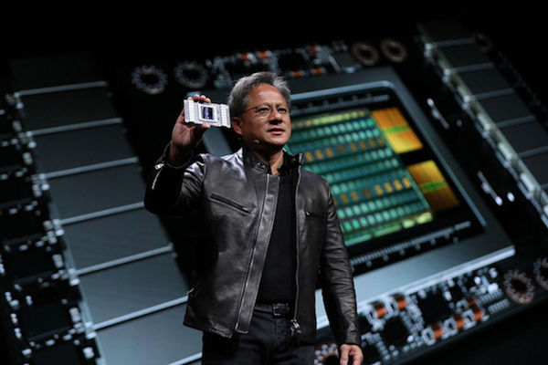
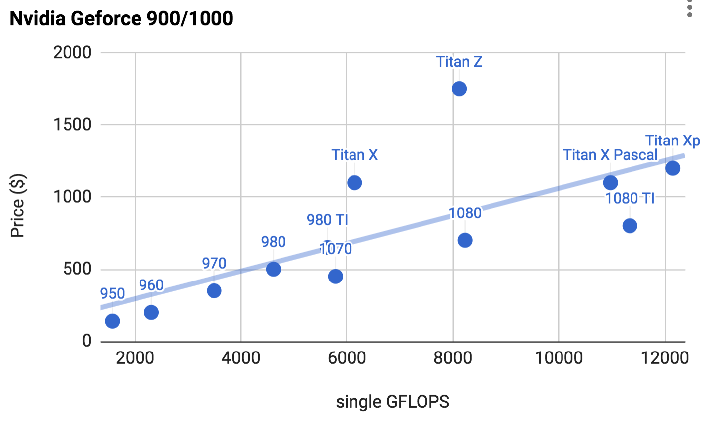
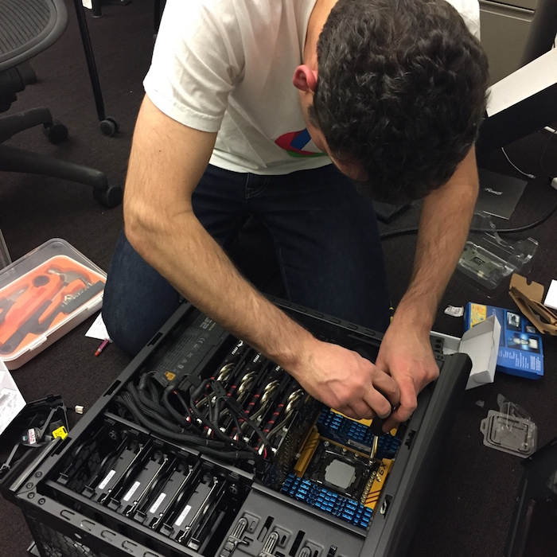
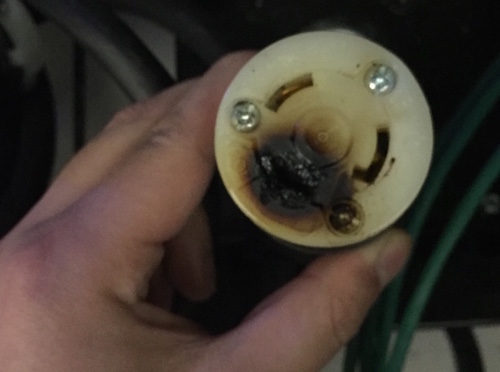

# GPU购买指南

深度学习训练通常需要大量的计算资源。GPU目前是深度学习最常使用的计算加速硬件。相对于CPU来说，GPU更便宜（达到同样的计算能力GPU一般便宜10倍），而且计算更加密集（一台服务器可以搭配8块或者16块GPU）。因此GPU数量通常是衡量深度学习计算能力的一个标准，同时Nvidia的创始人Jensen Huang也被人称深度学习教父。

（Nvidia CEO黄教主和他的战术核武器）

本章我们简要介绍GPU的购买须知。这里主要针对个人用户购买一两台自用的GPU服务器。而不是针对需要购买

- 100+台机器的大公司用户。请咨询专业数据中心维护人员，通常你们会考虑Nvidia Tesla P100或者V100。你可以完全跳过此节。
- 10+台机器的实验室和中小公司用户：不缺钱可以上Nvidia DGX-1，不然可以考虑购买如Supermicro之类性价比较高的服务器。此节的一些内容可以做为参考。

## 选择GPU

目前独立GPU主要有AMD和Nvidia两家厂商。其中Nvidia由于深度学习布局较早，深度学习框架支持更好，因此目前主要会选择Nvidia的卡。

Nvidia卡有面向个人用户（例如GTX系列）和企业用户（例如Tesla系列）两种。企业用户卡通常使用被动散热和增加了内存校验从而更加适合数据中心。但计算能力上两者相当。企业卡通常要贵上10倍，因此个人用户通常选用GTX系列。

Nvidia一般每一两年会更新一次大版本，例如目前最新的是1000系列。每个系列里面会有数个不同型号，对应不同的性能。

GPU的性能主要由下面三个主要参数构成：

1. 计算能力。通常我们关心的是32位浮点计算能力。当然，对于高玩来说也可以考虑16位浮点用来训练，8位整数来预测。
2. 内存大小。神经网络越深，或者训练时批量大小越大，所需要的GPU内存就越多。
3. 内存带宽。内存带宽要足够才能发挥出所有计算能力。

对于大部分用户来说，只要考虑计算能力就行了。内存不要太小就好，例如不要小于4GB。如果显卡同时要用来显示图形界面，那么推荐6G内存。内存带宽可以让厂家来纠结。

下图画了900和1000系列里各个卡的32位浮点计算能力和价格的对比（价格是wikipedia的推荐价格，真实价格通常会有浮动）。

我们可以读出两点信息：

1. 在同一个系列里面，通常价格和性能成正比
2. 1000系列性价比900高2倍左右。

如果大家继续比较GTX前面几代，也发现规律是类似的。根据这个我们推荐

1. 买新不买旧，因为目前看来GPU性能还是在快速迭代，贬值较快。
2. 量力购买。不缺钱直接上最好的，但入门的1050TI也不错。

## 整机配置

如果主要是用GPU来做计算，或者说主要是做深度学习训练，不需要购买高端的CPU。可以将主要预算花费在GPU上。所以整机配置可以参考网上推荐的中高档就好。

不过由于GPU的功耗，散热和体积，需要一些额外考虑。

- 机箱体积。GPU尺寸较大，通常不考虑太小的机箱。而且机箱自带的风扇要好。（下图里我们曾尝试在一个中等机箱里塞满4卡导致散热不好烧了2块GPU。）
  
- 电源。购买GPU时需要查下GPU的功耗，50w到300w不等。因此买电源时需要功率足够的。（我们倒是一开始就考虑了这个，但忘了不过载机房供电。下面是5台机器满负荷运行时烧掉了一个30A的电源接口。）
  
- 主板的PCIe卡槽。推荐使用PCIe 3.0 16x来保证足够的GPU到主内存带宽。如果是多卡的话，要仔细看主板说明，保证多卡一起使用时仍然是16x带宽。（有些主板插4卡时会降到8x甚至4x）

对于更具体的配置可以参考我们[走过的一些弯路](http://mli.github.io/gpu/2016/01/17/build-gpu-clusters/)，和来讨论区[交流大家的机器配置](https://discuss.gluon.ai/t/topic/1177)。
