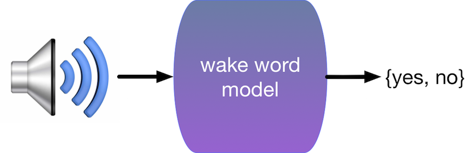
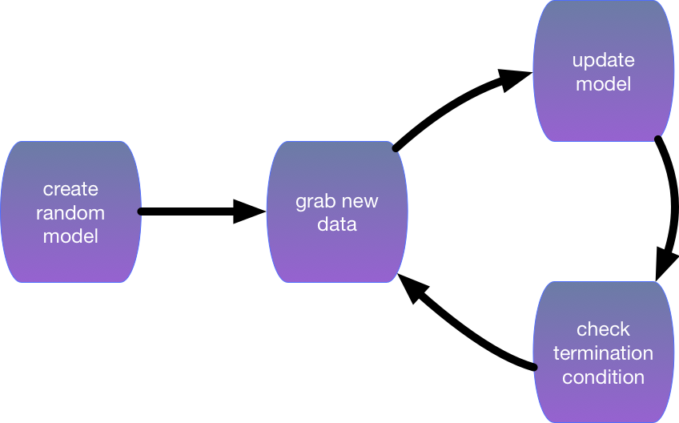
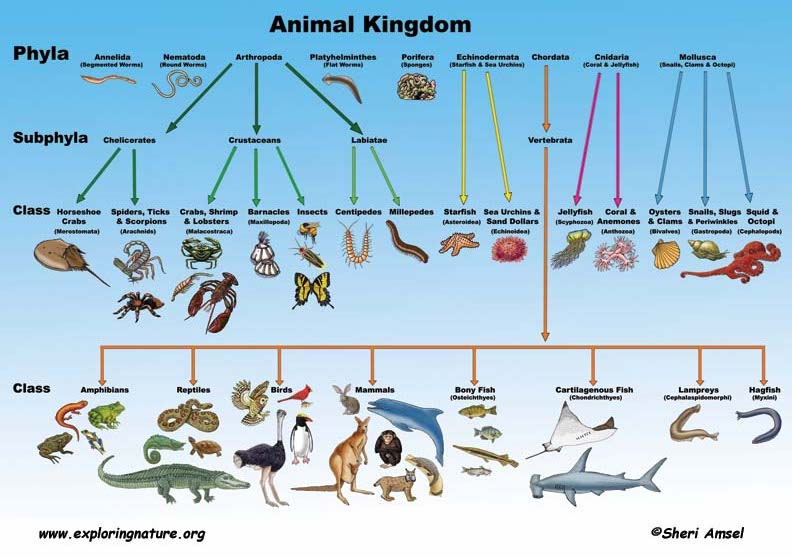
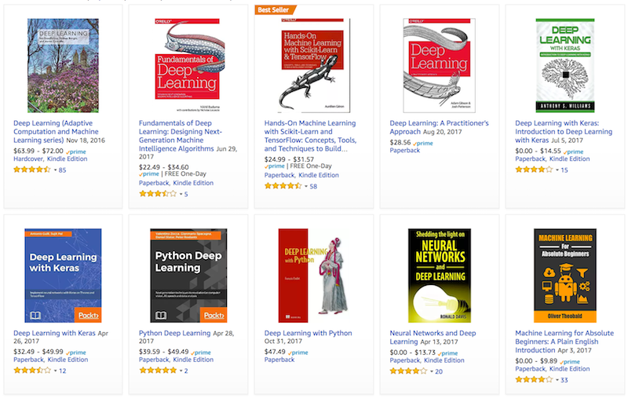
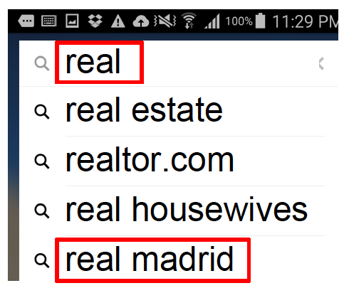
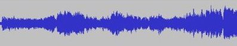

# 机器学习简介

本书作者跟广大程序员一样，在开始写作前需要取来一杯咖啡。我们跳进车准备出发，Alex掏出他的安卓喊一声“OK Google”唤醒语言助手，Mu操着他的中式英语命令到“去蓝瓶咖啡店”。手机这时马上显示出识别的命令，并且知道我们需要导航。接着它调出地图应用并给出数条路线方案，每条方案边上会有预估的到达时间并自动选择最快的线路。

好吧，这是一个虚构的例子，因为我们一般在办公室喝自己的手磨咖啡。但这个例子展示了在短短几秒钟里，我们跟数个机器学习模型进行了交互。

如果你从来没有使用过机器学习，你会想，这个不就是编程吗？或者，到底机器学习是什么？首先，我们确实是使用编程语言来实现机器学习模型，我们跟计算机其他领域一样，使用同样的编程语言和硬件。但不是每个程序都用了机器学习。对于第二个问题，精确定义机器学习就像定义什么是数学一样难，但我们试图在这章提供一些直观的解释。


## 一个例子

我们日常交互的大部分计算机程序可以使用最基本的命令来实现。当你把一个商品加进购物车时，你触发了电商的电子商务程序来把一个商品ID和你的用户ID插入到一个叫做购物车的数据库表格中。你可以在没有见到任何真正客户前来用最基本的程序指令来实现这个功能。如果你发现你可以这么做，那么你就不应该使用机器学习。

对于机器学习科学家来说，幸运的是大部分应用没有那么容易。回到前面那个例子，想象下如何写一个程序来回应唤醒词例如“Okay, Google”，“Siri”，和“Alexa”。如果你在一个只有你和代码编辑器的房间里写这个程序，你该怎么办？你可能会想像下面的程序

```python
if input_command == 'Okey, Google':
     run_voice_assistant()
```

但实际上你能拿到的只是麦克风里采集到的原始语音信号，可能是每秒44,000个样本点。那么需要些什么样的规则才能把这些样本点转成一个字符串呢？或者简单点，判断这些信号里是不是就是说了唤醒词。



如果你被这个问题困住了，不用担心。这就是我们为什么要机器学习。

虽然我们不知道怎么告诉机器去把语音信号转成对应的字符串，但我们自己可以。我们可以收集一个巨大的**数据集**里包含了大量语音信号，以及每个语音型号是不是对应我们要的唤醒词。在机器学习里，我们不直接设计一个系统去辨别唤醒词，而是写一个灵活的程序，它的行为可以根据在读取数据集的时候改变。所以我们不是去直接写一个唤醒词辨别器，而是一个程序，当提供一个巨大的有标注的数据集的时候它能辨别唤醒词。你可以认为这种方式是**利用数据编程**。换言之，我们需要用数据训练机器学习模型，其过程通常如下：

1. 初始化一个几乎什么也不能做的模型；
2. 抓一些有标注的数据集（例如音频段落及其是否为唤醒词的标注）；
3. 修改模型使得它在抓取的数据集上能够更准确执行任务（例如使得它在判断这些抓取的音频段落是否为唤醒词上判断更准确）；
4. 重复以上步骤2和3，直到模型看起来不错。



## 眼花缭乱的机器学习应用

机器学习背后的核心思想是，设计程序使得它可以在执行的时候提升它在某任务上的能力，而不是有着固定行为的程序。机器学习包括多种问题的定义，提供很多不同的算法，能解决不同领域的各种问题。我们之前讲到的是一个讲**监督学习**应用到语言识别的例子。

正因为机器学习提供多种工具可以利用数据来解决简单规则不能或者难以解决的问题，它被广泛应用在了搜索引擎、无人驾驶、机器翻译、医疗诊断、垃圾邮件过滤、玩游戏、人脸识别、数据匹配、信用评级和给图片加滤镜等任务中。

虽然这些问题各式各样，但他们有着共同的模式从而可以被机器学习模型解决。最常见的描述这些问题的方法是通过数学，但不像其他机器学习和神经网络的书那样，我们会主要关注真实数据和代码。下面我们来看点数据和代码。

## 用代码编程和用数据编程

这个例子灵感来自 [Joel Grus](http://joelgrus.com) 的一次 [应聘面试](http://joelgrus.com/2016/05/23/fizz-buzz-in-tensorflow/). 面试官让他写个程序来玩Fizz Buzz. 这是一个小孩子游戏。玩家从1数到100，如果数字被3整除，那么喊'fizz'，如果被5整除就喊'buzz'，如果两个都满足就喊'fizzbuzz'，不然就直接说数字。这个游戏玩起来就像是：

> 1 2 fizz 4 buzz fizz 7 8 fizz buzz 11 fizz 13 14 fizzbuzz 16 ...

传统的实现是这样的：

```{.python .input}
res = []
for i in range(1, 101):
    if i % 15 == 0:
        res.append('fizzbuzz')
    elif i % 3 == 0:
        res.append('fizz')
    elif i % 5 == 0:
        res.append('buzz')
    else:
        res.append(str(i))
print(' '.join(res))
```

对于经验丰富的程序员来说这个太不够一颗赛艇了。所以Joel尝试用机器学习来实现这个。为了让程序能学，他需要准备下面这个数据集：

* 数据 X ``[1, 2, 3, 4, ...]`` 和标注Y ``['fizz', 'buzz', 'fizzbuzz', identity]``
* 训练数据，也就是系统输入输出的实例。例如 ``[(2, 2), (6, fizz), (15, fizzbuzz), (23, 23), (40, buzz)]``
* 从输入数据中抽取的特征，例如 ``x -> [(x % 3), (x % 5), (x % 15)]``.

有了这些，Jeol利用TensorFlow写了一个[分类器](https://github.com/joelgrus/fizz-buzz-tensorflow)。对于不按常理出牌的Jeol，面试官一脸黑线。而且这个分类器不是总是对的。

显然，用原子弹杀鸡了。为什么不直接写几行简单而且保证结果正确的Python代码呢？当然，这里有很多一个简单Python脚本不能分类的例子，即使简单的3岁小孩解决起来毫无压力。

|  |  |  |  |
| :------------------: | :------------------: | :------------------: | :------------------: |
|          喵           |          喵           |          汪           |          汪           |

幸运的是，这个正是机器学习的用武之地。我们通过提供大量的含有猫和狗的图片来编程一个猫狗检测器，一般来说它就是一个函数，它会输出一个大的正数如果图片里面是猫，一个大的负数如果是狗，如果不确信就输出一个0附近的。当然，这是机器学习能做的最简单例子。

## 机器学习最简要素

成功的机器学习有四个要素：数据、转换数据的模型、衡量模型好坏的损失函数和一个调整模型权重来最小化损失函数的算法。

- **数据**。越多越好。事实上，数据是深度学习复兴的核心，因为复杂的非线性模型比其他机器学习需要更多的数据。数据的例子包括
  - 图片：例如你的手机图片，里面可能包含猫、狗、恐龙、高中同学聚会或者昨天的晚饭
  - 文本：邮件、新闻和微信聊天记录
  - 声音：有声书籍和电话记录
  - 结构数据：Jupyter notebook（里面有文本，图片和代码）、网页、租车单和电费表
- **模型**。通常数据和我们最终想要的相差很远，例如我们想知道照片中的人是不是在高兴，所以我们需要把一千万像素变成一个高兴度的概率值。通常我们需要在数据上应用数个非线性函数（例如神经网络）
- **损失函数**。我们需要对比模型的输出和真实值之间的误差。损失函数帮助我们决定2017年底亚马逊股票会不会价值1500美元。取决于我们想短线还是长线，这个函数可以很不一样。
- **训练**。通常一个模型里面有很多参数。我们通过最小化损失函数来学这些参数。不幸的是，即使我们做得很好也不能保证在新的没见过的数据上我们可以仍然做很好。
  - **训练误差**。这是模型在评估用来训练模型的数据集上的误差。这个类似于考试前我们在模拟试卷上拿到的分数。有一定的指向性，但不一定保证真实考试分数。
  - **测试误差**。这是模型在没见过的新数据上的误差，可能会跟训练误差不很一样（统计上叫过拟合）。这个类似于考前模考次次拿高分，但实际考起来却失误了。（笔者之一曾经做GRE真题时次次拿高分，高兴之下背了一遍红宝书就真上阵考试了，结果最终拿了一个刚刚够用的低分。后来意识到这是因为红宝书里包含了大量的真题。）

下面我们详细讨论一些不同的机器学习应用。

## 监督学习

监督学习描述的任务是，当给定输入x，如何通过在有标注输入和输出的数据上训练模型而能够预测输出y。从统计角度来说，监督学习主要关注如何估计条件概率P(y|x)。在实际情景中，监督学习最为常用。例如，给定一位患者的CT图像，预测该患者是否得癌症；给定英文句子，预测出它的正确中文翻译；给定本月公司财报数据，预测下个月该公司股票价格。

### 回归分析

回归分析也许是监督学习里最简单的一类任务。在该项任务里，输入是任意离散或连续的、单一或多个的变量，而输出是连续的数值。例如我们可以把本月公司财报数据抽取出若干特征，如营收总额、支出总额以及是否有负面报道，利用回归分析预测下个月该公司股票价格。

如果我们把模型预测的输出值和真实的输出值之间的差别定义为残差，常见的回归分析的损失函数包括训练数据的残差的平方和或者绝对值的和。机器学习的任务是找到一组模型参数使得损失函数最小化。我们会在之后的章节里详细介绍回归分析。

### 分类

值得一提的是，回归分析所关注的预测往往可以解答输出为**连续数值**的问题。当预测的输出是**离散的**类别时，这个监督学习任务就叫做分类。分类在我们日常生活中很常见。例如我们可以把本月公司财报数据抽取出若干特征，如营收总额、支出总额以及是否有负面报道，利用分类预测下个月该公司的CEO是否会离职。在计算机视觉领域，把一张图片识别成众多物品类别中的某一类，例如猫、狗等。



给定一个实例被抽取出的若干特征作为输入，我们的分类模型可以输出实例为各个类别的概率，并将概率最大的类别作为分类的结果。

### 标注

事实上，有一些看似分类的问题在实际中却难以归于分类。例如，把下面这张图无论分类成猫还是狗看上去都有些问题。


正如你所见，上图里既有猫又有狗。其实还没完呢，里面还有草啊、轮胎啊、石头啊等等。与其将上图仅仅分类为其中一类，倒不如把这张图里面我们所关心的类别都标注出来。比如，给定一张图片，我们希望知道里面是否有猫、是否有狗、是否有草等。给定一个输入，输出不定量的类别，这个就叫做标注任务。

这类任务有时候也叫做多标签分类。想象一下，人们可能会把多个标签同时标注在自己的某篇技术类博客文章上，例如“机器学习”、“科技”、“编程语言”、“云计算”、“安全与隐私”和“AWS”。这里面的标签其实有时候相互关联，比如“云计算”和“安全与隐私”。当一篇文章可能被标注的数量很大时，人力标注就显得很吃力。这就需要使用机器学习了。

### 搜索与排序

搜索与排序关注的问题更多的是如何把一堆对象排序。例如在信息检索领域，我们常常关注如何把一堆文档按照与检索条目的相关性排序。在互联网时代，由于搜索引擎的流行，我们更加关注如何对网页进行排序。互联网时代早期有一个著名的网页排序算法叫做``PageRank``。该算法的排序结果并不取决于特定的用户检索条目。这些排序结果可以更好地为所包含检索条目的网页进行排序。

### 推荐系统

推荐系统与搜索排序关系紧密，并广泛应用于购物网站、搜索引擎、新闻门户网站等等。推荐系统的主要目标是把用户可能感兴趣的东西推荐给用户。推荐算法用到的信息多种多样，例如用户的自我描述、对过往推荐的反应、社交网络、喜好等等。下图展示了亚马逊网站对笔者之一有关深度学习类书籍的推荐结果。




搜索引擎的搜索条目自动补全系统也是个好例子。它可根据用户输入的前几个字符把用户可能搜索的条目实时推荐自动补全。在笔者之一的某项工作里，如果系统发现用户刚刚开启了体育类的手机应用，当用户在搜索框拼出"real"时，搜索条目自动补全系统会把"real madrid"（皇家马德里，足球球队）推荐在比通常更频繁被检索的"real estate"（房地产）更靠前的位置，而不是总像下图中这样。




### 序列学习

序列学习也是一类近来备受关注的机器学习问题。在这类问题中，输入和输出不仅限于固定的数量。这类模型通常可以处理任意长度的输入序列，或者输出任意长度的序列。当输入和输出都是不定长的序列时，我们也把这类模型叫做``seq2seq``，例如语言翻译模型和语音转录文本模型。以下列举了一些常见的序列学习案例。

#### 语法分析

一个常见语法分析的例子是，给定一个文本序列，如何找出其中的命名实体，例如人物姓名、城市名称等。以下是一个这样的例子。其中Tom、Washington和Sally都是命名实体。

| `Tom wants to have dinner in Washington with Sally.` |
| ---------------------------------------- |
| `E   -     -  -    -      -  E          -    E` |

#### 语音识别

在语音识别的问题里，输入序列通常都是麦克风的声音，而输出是对通过麦克风所说的话的文本转录。这类问题通常有一个难点，例如声音通常都在特定的采样率采样，因为声音和文本之间不存在一一对应。换言之，语音识别是一类序列转换问题。这里的输出往往比输入短很多。

| `----D----e--e--e-----p----------- L----ea-------r---------ni-----ng-----` |
| ---------------------------------------- |
|       |

#### 文本转语音

这是语音识别问题的逆问题。这里的输入是一个文本序列，而输出才是声音序列。因此，这类问题的输出比输入长。

#### 机器翻译

机器翻译的目标是把一段话从一种语言翻译成另一种语言。目前，机器翻译时常会翻译出令人啼笑皆非的结果。主要来说，机器翻译的复杂程度非常高。同一个词在两种不同语言下的对应有时候是多对多。另外，符合语法或者语言习惯的语序调整也令问题更加复杂。

## 非监督学习

上述的机器学习问题和应用场景都是基于监督学习的。与监督学习不同，非监督学习不需要训练数据被标识。以图片分析为例，对监督学习来说，训练数据里的图片需要被标识为狗、猫或者别的动物，如此一来，一个分类模型被训练后就能把一张新图片识别为某种动物。而对非监督学习而言，例如聚类学习，可以把一堆无标识的图片自动聚合成若干类，其中每类分别对应一种动物。

以下我们简要介绍一些常见的非监督学习任务。

- **聚类**问题通常研究如何把一堆数据点分成若干类，从而使得同类数据点相似而非同类数据点不似。根据实际问题，我们需要定义相似性。
- **子空间估计**问题通常研究如何将原始数据向量在更低维度下表示。理想情况下，子空间的表示要具有代表性从而才能与原始数据接近。一个常用方法叫做主成分分析。
- **表征学习**希望在欧几里得空间中找到原始对象的表示方式，从而能在欧几里得空间里表示出原始对象的符号性质。例如我们希望找到城市的向量表示，从而使得我们可以进行这样的向量运算：罗马 - 意大利 + 法国 = 巴黎。
- **生成对抗网络**是最近一个很火的领域。这里描述数据的生成过程，并检查真实与生成的数据是否统计上相似。

## 小结

机器学习是一个庞大的领域。我们在此无法也无需介绍有关它的全部。有了这些背景知识铺垫，你是否对接下来的学习更有兴趣了呢？

**吐槽和讨论欢迎点**[这里](https://discuss.gluon.ai/t/topic/746)
