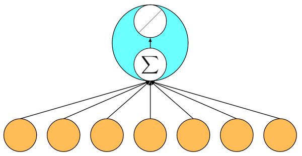

# 线性回归 --- 从0开始

虽然强大的深度学习框架可以减少很多重复性工作，但如果你过于依赖它提供的便利抽象，那么你可能不会很容易地理解到底深度学习是如何工作的。所以我们的第一个教程是如何只利用ndarray和autograd来实现一个线性回归的训练。

## 线性回归

给定一个数据点集合`X`和对应的目标值`y`，线性模型的目标是找一根线，其由向量`w`和位移`b`组成，来最好地近似每个样本`X[i]`和`y[i]`。用数学符号来表示就是我们将学`w`和`b`来预测，

$$\boldsymbol{\hat{y}} = X \boldsymbol{w} + b$$

并最小化所有数据点上的平方误差

$$\sum_{i=1}^n (\hat{y}_i-y_i)^2.$$

你可能会对我们把古老的线性回归作为深度学习的一个样例表示很奇怪。实际上线性模型是最简单但也可能是最有用的神经网络。一个神经网络就是一个由节点（神经元）和有向边组成的集合。我们一般把一些节点组成层，每一层使用下一层的节点作为输入，并输出给上面层使用。为了计算一个节点值，我们将输入节点值做加权和，然后再加上一个激活函数。对于线性回归而言，它是一个两层神经网络，其中第一层是（下图橙色点）输入，每个节点对应输入数据点的一个维度，第二层是单输出节点（下图绿色点），它使用身份函数（$f(x)=x$）作为激活函数。



## 创建数据集

这里我们使用一个人工数据集来把事情弄简单些，因为这样我们将知道真实的模型是什么样的。具体来说我们使用如下方法来生成数据

`y[i] = 2 * X[i][0] - 3.4 * X[i][1] + 4.2 + noise`

这里噪音服从均值0和标准差为0.01的正态分布。

```{.python .input  n=1}
from mxnet import ndarray as nd
from mxnet import autograd

num_inputs = 2
num_examples = 1000

true_w = [2, -3.4]
true_b = 4.2

X = nd.random_normal(shape=(num_examples, num_inputs))
y = true_w[0] * X[:, 0] + true_w[1] * X[:, 1] + true_b
y += .01 * nd.random_normal(shape=y.shape)

Xt = nd.random_normal(shape=(num_examples, num_inputs))
Yt = true_w[0] * Xt[:, 0] + true_w[1] * Xt[:, 1] + true_b
```

注意到`X`的每一行是一个长度为2的向量，而`y`的每一行是一个长度为1的向量（标量）。

```{.python .input  n=2}
print(X[0], y[0])
print(y.shape)

print(Xt[0], Yt[0])
print(Yt.shape)
```

```{.json .output n=2}
[
 {
  "name": "stdout",
  "output_type": "stream",
  "text": "\n[ 1.16307867  2.21220636]\n<NDArray 2 @cpu(0)> \n[-1.00153255]\n<NDArray 1 @cpu(0)>\n(1000,)\n\n[ 0.13263007  0.72455114]\n<NDArray 2 @cpu(0)> \n[ 2.00178599]\n<NDArray 1 @cpu(0)>\n(1000,)\n"
 }
]
```

## 数据读取

当我们开始训练神经网络的时候，我们需要不断读取数据块。这里我们定义一个函数它每次返回`batch_size`个随机的样本和对应的目标。我们通过python的`yield`来构造一个迭代器。

```{.python .input  n=3}
import random
batch_size = 10
def data_iter():
    # 产生一个随机索引
    idx = list(range(num_examples))
    random.shuffle(idx)
    for i in range(0, num_examples, batch_size):
        j = nd.array(idx[i:min(i+batch_size,num_examples)])
        yield nd.take(X, j), nd.take(y, j)
```

下面代码读取第一个随机数据块

```{.python .input  n=4}
for data, label in data_iter():
    print(data, label)
    break
```

```{.json .output n=4}
[
 {
  "name": "stdout",
  "output_type": "stream",
  "text": "\n[[ 0.88616693 -0.55615038]\n [ 0.74436289  0.28850451]\n [ 1.14745176  1.08816302]\n [-1.07601869 -0.2127033 ]\n [-0.66981024  0.30749828]\n [ 1.68393016  0.77373821]\n [ 0.5380863  -0.40720204]\n [-0.69395155  0.51240134]\n [ 0.81664836 -0.39319611]\n [-0.35159528  0.02315214]]\n<NDArray 10x2 @cpu(0)> \n[ 7.85006285  4.69725084  2.78988171  2.77930188  1.8178426   4.93909168\n  6.65605068  1.07841051  7.17354155  3.42905402]\n<NDArray 10 @cpu(0)>\n"
 }
]
```

## 初始化模型参数

下面我们随机初始化模型参数

```{.python .input  n=31}
w = nd.random_normal(shape=(num_inputs, 1))
b = nd.zeros((1,))
params = [w, b]
print(params)
```

```{.json .output n=31}
[
 {
  "name": "stdout",
  "output_type": "stream",
  "text": "[\n[[ 0.56107295]\n [ 0.71928096]]\n<NDArray 2x1 @cpu(0)>, \n[ 0.]\n<NDArray 1 @cpu(0)>]\n"
 }
]
```

之后训练时我们需要对这些参数求导来更新它们的值，所以我们需要创建它们的梯度。

```{.python .input  n=32}
for param in params:
    param.attach_grad()
```

## 定义模型

线性模型就是将输入和模型做乘法再加上偏移：

```{.python .input  n=46}
def net(X):
    return nd.dot(X, w) + b
```

## 损失函数

我们使用常见的平方误差来衡量预测目标和真实目标之间的差距。

```{.python .input  n=47}
def square_loss(yhat, y):
    # 注意这里我们把y变形成yhat的形状来避免自动广播
    return (yhat - y.reshape(yhat.shape)) ** 2
```

## 优化

虽然线性回归有显试解，但绝大部分模型并没有。所以我们这里通过随机梯度下降来求解。每一步，我们将模型参数沿着梯度的反方向走特定距离，这个距离一般叫学习率。（我们会之后一直使用这个函数，我们将其保存在[utils.py](../utils.py)。）

```{.python .input  n=48}
def SGD(params, lr):
    for param in params:
        param[:] = param - lr * param.grad
```

## 训练

现在我们可以开始训练了。训练通常需要迭代数据数次，一次迭代里，我们每次随机读取固定数个数据点，计算梯度并更新模型参数。

```{.python .input  n=49}
epochs = 5
learning_rate = .04
for e in range(epochs):
    total_loss = 0
    for data, label in data_iter():
        with autograd.record():
            output = net(data)
            loss = square_loss(output, label)
        loss.backward()
        SGD(params, learning_rate)
        total_loss += nd.sum(loss).asscalar()
    print("Epoch %d, average loss: %f" % (e, total_loss/num_examples))
```

```{.json .output n=49}
[
 {
  "name": "stdout",
  "output_type": "stream",
  "text": "Epoch 0, average loss: 0.000126\nEpoch 1, average loss: 0.000128\nEpoch 2, average loss: 0.000129\nEpoch 3, average loss: 0.000124\nEpoch 4, average loss: 0.000132\n"
 }
]
```

```{.python .input  n=18}
import random
batch_size = 10
def data_iter_test():
    i = list(range(num_examples))
    j = nd.array(i)
    yield nd.take(Xt, j), nd.take(Yt, j)
```

```{.python .input  n=19}
total_loss = 0
for data, label in data_iter_test():
    output = net(data)
    loss = square_loss(output, label)
    total_loss += nd.sum(loss).asscalar()
print("test average loss: %f" % (total_loss/num_examples))
```

```{.json .output n=19}
[
 {
  "name": "stdout",
  "output_type": "stream",
  "text": "test average loss: 0.000031\n"
 }
]
```

训练完成后我们可以比较学到的参数和真实参数

```{.python .input  n=13}
true_w, w
```

```{.json .output n=13}
[
 {
  "data": {
   "text/plain": "([2, -3.4], \n [[ 2.00169706]\n  [-3.39580774]]\n <NDArray 2x1 @cpu(0)>)"
  },
  "execution_count": 13,
  "metadata": {},
  "output_type": "execute_result"
 }
]
```

```{.python .input  n=14}
true_b, b
```

```{.json .output n=14}
[
 {
  "data": {
   "text/plain": "(4.2, \n [ 4.19669342]\n <NDArray 1 @cpu(0)>)"
  },
  "execution_count": 14,
  "metadata": {},
  "output_type": "execute_result"
 }
]
```

## 结论

我们现在看到仅仅使用NDArray和autograd我们可以很容易地实现一个模型。

## 练习

尝试用不同的学习率查看误差下降速度（收敛率）

**吐槽和讨论欢迎点**[这里](https://discuss.gluon.ai/t/topic/743)
