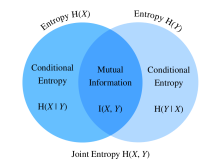

# Information Theory
:label:`sec_information_theory`

The universe is overflowing with information. Information provides a common language across disciplinary rifts: from Shakespeare's Sonnet to researchers' paper on Cornell ArXiv, from Van Gogh's printing Starry Night to Beethoven's music Symphony No. 5, from the first programming language Plankalkül to the state-of-the-art machine learning algorithms. Everything must follow the rules of information theory, no matter the format. With information theory, we can measure and compare how much information is present in different signals. In this section, we will investigate the fundamental concepts of information theory and applications of information theory in machine learning.

Before we get started, let's outline the relationship between machine learning and information theory. Machine learning aims to extract interesting signals from data and make critical predictions.  On the other hand, information theory studies encoding, decoding, transmitting, and manipulating information. As a result, information theory provides fundamental language for discussing the information processing in machine learned systems. For example, many machine learning applications use the cross-entropy loss as described in :numref:`sec_softmax`.  This loss can be directly derived from information theoretic considerations.


## Information

Let's start with the "soul" of information theory: information. *Information* can be encoded in anything with a particular sequence of one or more encoding formats. Suppose that we task ourselves with trying to define a notion of information.  What could be our starting point?

Consider the following thought experiment.  We have a friend with a deck of cards.  They will shuffle the deck, flip over some cards, and tell us statements about the cards.  We will try to assess the information content of each statement.

First, they flip over a card and tell us, "I see a card."  This provides us with no information at all.  We were already certain that this was the case so we hope the information should be zero.

Next, they flip over a card and say, "I see a heart."  This provides us some information, but in reality there are only $4$ different suits that were possible, each equally likely, so we are not surprised by this outcome.  We hope that whatever the measure of information, this event should have low information content.

Next, they flip over a card and say, "This is the $3$ of spades."  This is more information.  Indeed there were $52$ equally likely possible outcomes, and our friend told us which one it was.  This should be a medium amount of information.

Let's take this to the logical extreme.  Suppose that finally they flip over every card from the deck and read off the entire sequence of the shuffled deck.  There are $52!$ different orders to the deck, again all equally likely, so we need a lot of information to know which one it is.

Any notion of information we develop must conform to this intuition.  Indeed, in the next sections we will learn how to compute that these events have $0\text{ bits}$, $2\text{ bits}$, $~5.7\text{ bits}$, and $~225.6\text{ bits}$ of information respectively.

If we read through these thought experiments, we see a natural idea.  As a starting point, rather than caring about the knowledge, we may build off the idea that information represents the degree of surprise or the abstract possibility of the event. For example, if we want to describe an unusual event, we need a lot information. For a common event, we may not need much information.

In 1948, Claude E. Shannon published *A Mathematical Theory of Communication* :cite:`Shannon.1948` establishing the theory of information.  In his article, Shannon introduced the concept of information entropy for the first time. We will begin our journey here.


### Self-information

Since information embodies the abstract possibility of an event, how do we map the possibility to the number of bits? Shannon introduced the terminology *bit* as the unit of information, which was originally created by John Tukey. So what is a "bit" and why do we use it to measure information? Historically, an antique transmitter can only send or receive two types of code: $0$ and $1$.  Indeed, binary encoding is still in common use on all modern digital computers. In this way, any information is encoded by a series of $0$ and $1$. And hence, a series of binary digits of length $n$ contains $n$ bits of information.

Now, suppose that for any series of codes, each $0$ or $1$ occurs with a probability of $\frac{1}{2}$. Hence, an event $X$ with a series of codes of length $n$, occurs with a probability of $\frac{1}{2^n}$. At the same time, as we mentioned before, this series contains $n$ bits of information. So, can we generalize to a mathematical function which can transfer the probability $p$ to the number of bits? Shannon gave the answer by defining *self-information*

$$I(X) = - \log_2 (p),$$

as the *bits* of information we have received for this event $X$. Note that we will always use base-2 logarithms in this section. For the sake of simplicity, the rest of this section will omit the subscript 2 in the logarithm notation, i.e., $\log(.)$ always refers to $\log_2(.)$. For example, the code "0010" has a self-information

$$I(\text{"0010"}) = - \log (p(\text{"0010"})) = - \log \left( \frac{1}{2^4} \right) = 4 \text{ bits}.$$

We can calculate self information as shown below. Before that, let's first import all the necessary packages in this section.

```{.python .input}
#@tab mxnet
from mxnet import np
from mxnet.metric import NegativeLogLikelihood
from mxnet.ndarray import nansum
import random

def self_information(p):
    return -np.log2(p)

self_information(1 / 64)
```

```{.python .input}
#@tab pytorch
import torch
from torch.nn import NLLLoss

def nansum(x):
    # Define nansum, as pytorch doesn't offer it inbuilt.
    return x[~torch.isnan(x)].sum()

def self_information(p):
    return -torch.log2(torch.tensor(p)).item()

self_information(1 / 64)
```

```{.python .input}
#@tab tensorflow
import tensorflow as tf

def log2(x):
    return tf.math.log(x) / tf.math.log(2.)

def nansum(x):
    return tf.reduce_sum(tf.where(tf.math.is_nan(
        x), tf.zeros_like(x), x), axis=-1)

def self_information(p):
    return -log2(tf.constant(p)).numpy()

self_information(1 / 64)
```

## Entropy

As self-information only measures the information of a single discrete event, we need a more generalized measure for any random variable of either discrete or continuous distribution.


### Motivating Entropy

Let's try to get specific about what we want.  This will be an informal statement of what are known as the *axioms of Shannon entropy*.  It will turn out that the following collection of common-sense statements force us to a unique definition of information.  A formal version of these axioms, along with several others may be found in :cite:`Csiszar.2008`.

1.  The information we gain by observing a random variable does not depend on what we call the elements, or the presence of additional elements which have probability zero.
2.  The information we gain by observing two random variables is no more than the sum of the information we gain by observing them separately.  If they are independent, then it is exactly the sum.
3.  The information gained when observing (nearly) certain events is (nearly) zero.

While proving this fact is beyond the scope of our text, it is important to know that this uniquely determines the form that entropy must take.  The only ambiguity that these allow is in the choice of fundamental units, which is most often normalized by making the choice we saw before that the information provided by a single fair coin flip is one bit.

### Definition

For any random variable $X$ that follows a probability distribution $P$ with a probability density function (p.d.f.) or a probability mass function (p.m.f.) $p(x)$, we measure the expected amount of information through *entropy* (or *Shannon entropy*)

$$H(X) = - E_{x \sim P} [\log p(x)].$$
:eqlabel:`eq_ent_def`

To be specific, if $X$ is discrete, $$H(X) = - \sum_i p_i \log p_i \text{, where } p_i = P(X_i).$$

Otherwise, if $X$ is continuous, we also refer entropy as *differential entropy*

$$H(X) = - \int_x p(x) \log p(x) \; dx.$$

We can define entropy as below.

```{.python .input}
#@tab mxnet
def entropy(p):
    entropy = - p * np.log2(p)
    # Operator `nansum` will sum up the non-nan number
    out = nansum(entropy.as_nd_ndarray())
    return out

entropy(np.array([0.1, 0.5, 0.1, 0.3]))
```

```{.python .input}
#@tab pytorch
def entropy(p):
    entropy = - p * torch.log2(p)
    # Operator `nansum` will sum up the non-nan number
    out = nansum(entropy)
    return out

entropy(torch.tensor([0.1, 0.5, 0.1, 0.3]))
```

```{.python .input}
#@tab tensorflow
def entropy(p):
    return nansum(- p * log2(p))

entropy(tf.constant([0.1, 0.5, 0.1, 0.3]))
```

### Interpretations

You may be curious: in the entropy definition :eqref:`eq_ent_def`, why do we use an expectation of a negative logarithm? Here are some intuitions.

First, why do we use a *logarithm* function $\log$? Suppose that $p(x) = f_1(x) f_2(x) \ldots, f_n(x)$, where each component function $f_i(x)$ is independent from each other. This means that each $f_i(x)$ contributes independently to the total information obtained from $p(x)$. As discussed above, we want the entropy formula to be additive over independent random variables. Luckily, $\log$ can naturally turn a product of probability distributions to a summation of the individual terms.

Next, why do we use a *negative* $\log$? Intuitively, more frequent events should contain less information than less common events, since we often gain more information from an unusual case than from an ordinary one. However, $\log$ is monotonically increasing with the probabilities, and indeed negative for all values in $[0, 1]$.  We need to construct a monotonically decreasing relationship between the probability of events and their entropy, which will ideally be always positive (for nothing we observe should force us to forget what we have known). Hence, we add a negative sign in front of $\log$ function.

Last, where does the *expectation* function come from? Consider a random variable $X$. We can interpret the self-information ($-\log(p)$) as the amount of *surprise* we have at seeing a particular outcome.  Indeed, as the probability approaches zero, the surprise becomes infinite.  Similarly, we can interpret the entropy as the average amount of surprise from observing $X$. For example, imagine that a slot machine system emits statistical independently symbols ${s_1, \ldots, s_k}$ with probabilities ${p_1, \ldots, p_k}$ respectively. Then the entropy of this system equals to the average self-information from observing each output, i.e.,

$$H(S) = \sum_i {p_i \cdot I(s_i)} = - \sum_i {p_i \cdot \log p_i}.$$


### Properties of Entropy

By the above examples and interpretations, we can derive the following properties of entropy :eqref:`eq_ent_def`. Here, we refer to $X$ as an event and $P$ as the probability distribution of $X$.

* $H(X) \geq 0$ for all discrete $X$ (entropy can be negative for continuous $X$).

* If $X \sim P$ with a p.d.f. or a p.m.f. $p(x)$, and we try to estimate $P$ by a new probability distribution $Q$ with a p.d.f. or a p.m.f. $q(x)$, then $$H(X) = - E_{x \sim P} [\log p(x)] \leq  - E_{x \sim P} [\log q(x)], \text{ with equality if and only if } P = Q.$$  Alternatively, $H(X)$ gives a lower bound of the average number of bits needed to encode symbols drawn from $P$.

* If $X \sim P$, then $x$ conveys the maximum amount of information if it spreads evenly among all possible outcomes. Specifically, if the probability distribution $P$ is discrete with $k$-class $\{p_1, \ldots, p_k \}$, then $$H(X) \leq \log(k), \text{ with equality if and only if } p_i = \frac{1}{k}, \forall i.$$ If $P$ is a continuous random variable, then the story becomes much more complicated.  However, if we additionally impose that $P$ is supported on a finite interval (with all values between $0$ and $1$), then $P$ has the highest entropy if it is the uniform distribution on that interval.


## Mutual Information

Previously we defined entropy of a single random variable $X$, how about the entropy of a pair random variables $(X, Y)$?  We can think of these techniques as trying to answer the following type of question, "What information is contained in $X$ and $Y$ together compared to each separately?  Is there redundant information, or is it all unique?"

For the following discussion, we always use $(X, Y)$ as a pair of random variables that follows a joint probability distribution $P$ with a p.d.f. or a p.m.f. $p_{X, Y}(x, y)$, while $X$ and $Y$ follow probability distribution $p_X(x)$ and $p_Y(y)$, respectively.


### Joint Entropy

Similar to entropy of a single random variable :eqref:`eq_ent_def`, we define the *joint entropy* $H(X, Y)$ of a pair random variables $(X, Y)$ as

$$H(X, Y) = -E_{(x, y) \sim P} [\log p_{X, Y}(x, y)]. $$
:eqlabel:`eq_joint_ent_def`

Precisely, on the one hand, if $(X, Y)$ is a pair of discrete random variables, then

$$H(X, Y) = - \sum_{x} \sum_{y} p_{X, Y}(x, y) \log p_{X, Y}(x, y).$$

On the other hand, if $(X, Y)$ is a pair of continuous random variables, then we define the *differential joint entropy* as

$$H(X, Y) = - \int_{x, y} p_{X, Y}(x, y) \ \log p_{X, Y}(x, y) \;dx \;dy.$$

We can think of :eqref:`eq_joint_ent_def` as telling us the total randomness in the pair of random variables.  As a pair of extremes, if $X = Y$ are two identical random variables, then the information in the pair is exactly the information in one and we have $H(X, Y) = H(X) = H(Y)$.  On the other extreme, if $X$ and $Y$ are independent then $H(X, Y) = H(X) + H(Y)$.  Indeed we will always have that the information contained in a pair of random variables is no smaller than the entropy of either random variable and no more than the sum of both.

$$
H(X), H(Y) \le H(X, Y) \le H(X) + H(Y).
$$

Let's implement joint entropy from scratch.

```{.python .input}
#@tab mxnet
def joint_entropy(p_xy):
    joint_ent = -p_xy * np.log2(p_xy)
    # Operator `nansum` will sum up the non-nan number
    out = nansum(joint_ent.as_nd_ndarray())
    return out

joint_entropy(np.array([[0.1, 0.5], [0.1, 0.3]]))
```

```{.python .input}
#@tab pytorch
def joint_entropy(p_xy):
    joint_ent = -p_xy * torch.log2(p_xy)
    # Operator `nansum` will sum up the non-nan number
    out = nansum(joint_ent)
    return out

joint_entropy(torch.tensor([[0.1, 0.5], [0.1, 0.3]]))
```

```{.python .input}
#@tab tensorflow
def joint_entropy(p_xy):
    joint_ent = -p_xy * log2(p_xy)
    # Operator `nansum` will sum up the non-nan number
    out = nansum(joint_ent)
    return out

joint_entropy(tf.constant([[0.1, 0.5], [0.1, 0.3]]))
```

Notice that this is the same *code* as before, but now we interpret it differently as working on the joint distribution of the two random variables.


### Conditional Entropy

The joint entropy defined above the amount of information contained in a pair of random variables.  This is useful, but oftentimes it is not what we care about.  Consider the setting of machine learning.  Let's take $X$ to be the random variable (or vector of random variables) that describes the pixel values of an image, and $Y$ to be the random variable which is the class label.  $X$ should contain substantial information---a natural image is a complex thing.  However, the information contained in $Y$ once the image has been show should be low.  Indeed, the image of a digit should already contain the information about what digit it is unless the digit is illegible.  Thus, to continue to extend our vocabulary of information theory, we need to be able to reason about the information content in a random variable conditional on another.

In the probability theory, we saw the definition of the *conditional probability* to measure the relationship between variables. We now want to analogously define the *conditional entropy* $H(Y \mid X)$.  We can write this as

$$ H(Y \mid X) = - E_{(x, y) \sim P} [\log p(y \mid x)],$$
:eqlabel:`eq_cond_ent_def`

where $p(y \mid x) = \frac{p_{X, Y}(x, y)}{p_X(x)}$ is the conditional probability. Specifically, if $(X, Y)$ is a pair of discrete random variables, then

$$H(Y \mid X) = - \sum_{x} \sum_{y} p(x, y) \log p(y \mid x).$$

If $(X, Y)$ is a pair of continuous random variables, then the *differential conditional entropy* is similarly defined as

$$H(Y \mid X) = - \int_x \int_y p(x, y) \ \log p(y \mid x) \;dx \;dy.$$


It is now natural to ask, how does the *conditional entropy* $H(Y \mid X)$ relate to the entropy $H(X)$ and the joint entropy $H(X, Y)$?  Using the definitions above, we can express this cleanly:

$$H(Y \mid X) = H(X, Y) - H(X).$$

This has an intuitive interpretation: the information in $Y$ given $X$ ($H(Y \mid X)$) is the same as the information in both $X$ and $Y$ together ($H(X, Y)$) minus the information already contained in $X$.  This gives us the information in $Y$ which is not also represented in $X$.

Now, let's implement conditional entropy :eqref:`eq_cond_ent_def` from scratch.

```{.python .input}
#@tab mxnet
def conditional_entropy(p_xy, p_x):
    p_y_given_x = p_xy/p_x
    cond_ent = -p_xy * np.log2(p_y_given_x)
    # Operator `nansum` will sum up the non-nan number
    out = nansum(cond_ent.as_nd_ndarray())
    return out

conditional_entropy(np.array([[0.1, 0.5], [0.2, 0.3]]), np.array([0.2, 0.8]))
```

```{.python .input}
#@tab pytorch
def conditional_entropy(p_xy, p_x):
    p_y_given_x = p_xy/p_x
    cond_ent = -p_xy * torch.log2(p_y_given_x)
    # Operator `nansum` will sum up the non-nan number
    out = nansum(cond_ent)
    return out

conditional_entropy(torch.tensor([[0.1, 0.5], [0.2, 0.3]]),
                    torch.tensor([0.2, 0.8]))
```

```{.python .input}
#@tab tensorflow
def conditional_entropy(p_xy, p_x):
    p_y_given_x = p_xy/p_x
    cond_ent = -p_xy * log2(p_y_given_x)
    # Operator `nansum` will sum up the non-nan number
    out = nansum(cond_ent)
    return out

conditional_entropy(tf.constant([[0.1, 0.5], [0.2, 0.3]]),
                    tf.constant([0.2, 0.8]))
```

### Mutual Information

Given the previous setting of random variables $(X, Y)$, you may wonder: "Now that we know how much information is contained in $Y$ but not in $X$, can we similarly ask how much information is shared between $X$ and $Y$?" The answer will be the *mutual information* of $(X, Y)$, which we will write as $I(X, Y)$.

Rather than diving straight into the formal definition, let's practice our intuition by first trying to derive an expression for the mutual information entirely based on terms we have constructed before.  We wish to find the information shared between two random variables.  One way we could try to do this is to start with all the information contained in both $X$ and $Y$ together, and then we take off the parts that are not shared.  The information contained in both $X$ and $Y$ together is written as $H(X, Y)$.  We want to subtract from this the information contained in $X$ but not in $Y$, and the information contained in $Y$ but not in $X$.  As we saw in the previous section, this is given by $H(X \mid Y)$ and $H(Y \mid X)$ respectively.  Thus, we have that the mutual information should be

$$
I(X, Y) = H(X, Y) - H(Y \mid X) - H(X \mid Y).
$$

Indeed, this is a valid definition for the mutual information.  If we expand out the definitions of these terms and combine them, a little algebra shows that this is the same as

$$I(X, Y) = E_{x} E_{y} \left\{ p_{X, Y}(x, y) \log\frac{p_{X, Y}(x, y)}{p_X(x) p_Y(y)} \right\}. $$
:eqlabel:`eq_mut_ent_def`


We can summarize all of these relationships in image :numref:`fig_mutual_information`.  It is an excellent test of intuition to see why the following statements are all also equivalent to $I(X, Y)$.

* $H(X) - H(X \mid Y)$
* $H(Y) - H(Y \mid X)$
* $H(X) + H(Y) - H(X, Y)$


:label:`fig_mutual_information`


In many ways we can think of the mutual information :eqref:`eq_mut_ent_def` as principled extension of correlation coefficient we saw in :numref:`sec_random_variables`.  This allows us to ask not only for linear relationships between variables, but for the maximum information shared between the two random variables of any kind.

Now, let's implement mutual information from scratch.

```{.python .input}
#@tab mxnet
def mutual_information(p_xy, p_x, p_y):
    p = p_xy / (p_x * p_y)
    mutual = p_xy * np.log2(p)
    # Operator `nansum` will sum up the non-nan number
    out = nansum(mutual.as_nd_ndarray())
    return out

mutual_information(np.array([[0.1, 0.5], [0.1, 0.3]]),
                   np.array([0.2, 0.8]), np.array([[0.75, 0.25]]))
```

```{.python .input}
#@tab pytorch
def mutual_information(p_xy, p_x, p_y):
    p = p_xy / (p_x * p_y)
    mutual = p_xy * torch.log2(p)
    # Operator `nansum` will sum up the non-nan number
    out = nansum(mutual)
    return out

mutual_information(torch.tensor([[0.1, 0.5], [0.1, 0.3]]),
                   torch.tensor([0.2, 0.8]), torch.tensor([[0.75, 0.25]]))
```

```{.python .input}
#@tab tensorflow
def mutual_information(p_xy, p_x, p_y):
    p = p_xy / (p_x * p_y)
    mutual = p_xy * log2(p)
    # Operator `nansum` will sum up the non-nan number
    out = nansum(mutual)
    return out

mutual_information(tf.constant([[0.1, 0.5], [0.1, 0.3]]),
                   tf.constant([0.2, 0.8]), tf.constant([[0.75, 0.25]]))
```

### Properties of Mutual Information

Rather than memorizing the definition of mutual information :eqref:`eq_mut_ent_def`, you only need to keep in mind its notable properties:

* Mutual information is symmetric, i.e., $I(X, Y) = I(Y, X)$.
* Mutual information is non-negative, i.e., $I(X, Y) \geq 0$.
* $I(X, Y) = 0$ if and only if $X$ and $Y$ are independent. For example, if $X$ and $Y$ are independent, then knowing $Y$ does not give any information about $X$ and vice versa, so their mutual information is zero.
* Alternatively, if $X$ is an invertible function of $Y$, then $Y$ and $X$ share all information and $$I(X, Y) = H(Y) = H(X).$$

### Pointwise Mutual Information

When we worked with entropy at the beginning of this chapter, we were able to provide an interpretation of $-\log(p_X(x))$ as how *surprised* we were with the particular outcome.  We may give a similar interpretation to the logarithmic term in the mutual information, which is often referred to as the *pointwise mutual information*:

$$\mathrm{pmi}(x, y) = \log\frac{p_{X, Y}(x, y)}{p_X(x) p_Y(y)}.$$
:eqlabel:`eq_pmi_def`

We can think of :eqref:`eq_pmi_def` as measuring how much more or less likely the specific combination of outcomes $x$ and $y$ are compared to what we would expect for independent random outcomes.  If it is large and positive, then these two specific outcomes occur much more frequently than they would compared to random chance (*note*: the denominator is $p_X(x) p_Y(y)$ which is the probability of the two outcomes were independent), whereas if it is large and negative it represents the two outcomes happening far less than we would expect by random chance.

This allows us to interpret the mutual information :eqref:`eq_mut_ent_def` as the average amount that we were surprised to see two outcomes occurring together compared to what we would expect if they were independent.

### Applications of Mutual Information

Mutual information may be a little abstract in it pure definition, so how does it related to machine learning? In natural language processing, one of the most difficult problems is the *ambiguity resolution*, or the issue of the meaning of a word being unclear from context. For example, recently a headline in the news reported that "Amazon is on fire". You may wonder whether the company Amazon has a building on fire, or the Amazon rain forest is on fire.

In this case, mutual information can help us resolve this ambiguity. We first find the group of words that each has a relatively large mutual information with the company Amazon, such as e-commerce, technology, and online. Second, we find another group of words that each has a relatively large mutual information with the Amazon rain forest, such as rain, forest, and tropical. When we need to disambiguate "Amazon", we can compare which group has more occurrence in the context of the word Amazon.  In this case the article would go on to describe the forest, and make the context clear.


## Kullback–Leibler Divergence

As what we have discussed in :numref:`sec_linear-algebra`, we can use norms to measure distance between two points in space of any dimensionality.  We would like to be able to do a similar task with probability distributions.  There are many ways to go about this, but information theory provides one of the nicest.  We now explore the *Kullback–Leibler (KL) divergence*, which provides a way to measure if two distributions are close together or not.


### Definition

Given a random variable $X$ that follows the probability distribution $P$ with a p.d.f. or a p.m.f. $p(x)$, and we estimate $P$ by another probability distribution $Q$ with a p.d.f. or a p.m.f. $q(x)$. Then the *Kullback–Leibler (KL) divergence* (or *relative entropy*) between $P$ and $Q$ is

$$D_{\mathrm{KL}}(P\|Q) = E_{x \sim P} \left[ \log \frac{p(x)}{q(x)} \right].$$
:eqlabel:`eq_kl_def`

As with the pointwise mutual information :eqref:`eq_pmi_def`, we can again provide an interpretation of the logarithmic term:  $-\log \frac{q(x)}{p(x)} = -\log(q(x)) - (-\log(p(x)))$ will be large and positive if we see $x$ far more often under $P$ than we would expect for $Q$, and large and negative if we see the outcome far less than expected.  In this way, we can interpret it as our *relative* surprise at observing the outcome compared to how surprised we would be observing it from our reference distribution.

Let's implement the KL divergence from Scratch.

```{.python .input}
#@tab mxnet
def kl_divergence(p, q):
    kl = p * np.log2(p / q)
    out = nansum(kl.as_nd_ndarray())
    return out.abs().asscalar()
```

```{.python .input}
#@tab pytorch
def kl_divergence(p, q):
    kl = p * torch.log2(p / q)
    out = nansum(kl)
    return out.abs().item()
```

```{.python .input}
#@tab tensorflow
def kl_divergence(p, q):
    kl = p * log2(p / q)
    out = nansum(kl)
    return tf.abs(out).numpy()
```

### KL Divergence Properties

Let's take a look at some properties of the KL divergence :eqref:`eq_kl_def`.

* KL divergence is non-symmetric, i.e., there are $P,Q$ such that $$D_{\mathrm{KL}}(P\|Q) \neq D_{\mathrm{KL}}(Q\|P).$$
* KL divergence is non-negative, i.e., $$D_{\mathrm{KL}}(P\|Q) \geq 0.$$ Note that the equality holds only when $P = Q$.
* If there exists an $x$ such that $p(x) > 0$ and $q(x) = 0$, then $D_{\mathrm{KL}}(P\|Q) = \infty$.
* There is a close relationship between KL divergence and mutual information. Besides the relationship shown in :numref:`fig_mutual_information`, $I(X, Y)$ is also numerically equivalent with the following terms:
    1. $D_{\mathrm{KL}}(P(X, Y)  \ \| \ P(X)P(Y))$;
    1. $E_Y \{ D_{\mathrm{KL}}(P(X \mid Y) \ \| \ P(X)) \}$;
    1. $E_X \{ D_{\mathrm{KL}}(P(Y \mid X) \ \| \ P(Y)) \}$.

  For the first term, we interpret mutual information as the KL divergence between $P(X, Y)$ and the product of $P(X)$ and $P(Y)$, and thus is a measure of how different the joint distribution is from the distribution if they were independent. For the second term, mutual information tells us the average reduction in uncertainty about $Y$ that results from learning the value of the $X$'s distribution. Similarly to the third term.


### Example

Let's go through a toy example to see the non-symmetry explicitly.

First, let's generate and sort three tensors of length $10,000$: an objective tensor $p$ which follows a normal distribution $N(0, 1)$, and two candidate tensors $q_1$ and $q_2$ which follow normal distributions $N(-1, 1)$ and $N(1, 1)$ respectively.

```{.python .input}
#@tab mxnet
random.seed(1)

nd_len = 10000
p = np.random.normal(loc=0, scale=1, size=(nd_len, ))
q1 = np.random.normal(loc=-1, scale=1, size=(nd_len, ))
q2 = np.random.normal(loc=1, scale=1, size=(nd_len, ))

p = np.array(sorted(p.asnumpy()))
q1 = np.array(sorted(q1.asnumpy()))
q2 = np.array(sorted(q2.asnumpy()))
```

```{.python .input}
#@tab pytorch
torch.manual_seed(1)

tensor_len = 10000
p = torch.normal(0, 1, (tensor_len, ))
q1 = torch.normal(-1, 1, (tensor_len, ))
q2 = torch.normal(1, 1, (tensor_len, ))

p = torch.sort(p)[0]
q1 = torch.sort(q1)[0]
q2 = torch.sort(q2)[0]
```

```{.python .input}
#@tab tensorflow
tensor_len = 10000
p = tf.random.normal((tensor_len, ), 0, 1)
q1 = tf.random.normal((tensor_len, ), -1, 1)
q2 = tf.random.normal((tensor_len, ), 1, 1)

p = tf.sort(p)
q1 = tf.sort(q1)
q2 = tf.sort(q2)
```

Since $q_1$ and $q_2$ are symmetric with respect to the y-axis (i.e., $x=0$), we expect a similar value of KL divergence between $D_{\mathrm{KL}}(p\|q_1)$ and $D_{\mathrm{KL}}(p\|q_2)$. As you can see below, there is only a less than 3% off between $D_{\mathrm{KL}}(p\|q_1)$ and $D_{\mathrm{KL}}(p\|q_2)$.

```{.python .input}
#@tab all
kl_pq1 = kl_divergence(p, q1)
kl_pq2 = kl_divergence(p, q2)
similar_percentage = abs(kl_pq1 - kl_pq2) / ((kl_pq1 + kl_pq2) / 2) * 100

kl_pq1, kl_pq2, similar_percentage
```

In contrast, you may find that $D_{\mathrm{KL}}(q_2 \|p)$ and $D_{\mathrm{KL}}(p \| q_2)$ are off a lot, with around 40% off as shown below.

```{.python .input}
#@tab all
kl_q2p = kl_divergence(q2, p)
differ_percentage = abs(kl_q2p - kl_pq2) / ((kl_q2p + kl_pq2) / 2) * 100

kl_q2p, differ_percentage
```

## Cross-Entropy

If you are curious about applications of information theory in deep learning, here is a quick example. We define the true distribution $P$ with probability distribution $p(x)$, and the estimated distribution $Q$ with probability distribution $q(x)$, and we will use them in the rest of this section.

Say we need to solve a binary classification problem based on given $n$ data examples {$x_1, \ldots, x_n$}. Assume that we encode $1$ and $0$ as the positive and negative class label $y_i$ respectively, and our neural network is parameterized by $\theta$. If we aim to find a best $\theta$ so that $\hat{y}_i= p_{\theta}(y_i \mid x_i)$, it is natural to apply the maximum log-likelihood approach as was seen in :numref:`sec_maximum_likelihood`. To be specific, for true labels $y_i$ and predictions $\hat{y}_i= p_{\theta}(y_i \mid x_i)$, the probability to be classified as positive is $\pi_i= p_{\theta}(y_i = 1 \mid x_i)$. Hence, the log-likelihood function would be

$$
\begin{aligned}
l(\theta) &= \log L(\theta) \\
  &= \log \prod_{i=1}^n \pi_i^{y_i} (1 - \pi_i)^{1 - y_i} \\
  &= \sum_{i=1}^n y_i \log(\pi_i) + (1 - y_i) \log (1 - \pi_i). \\
\end{aligned}
$$

Maximizing the log-likelihood function $l(\theta)$ is identical to minimizing $- l(\theta)$, and hence we can find the best $\theta$ from here. To generalize the above loss to any distributions, we also called $-l(\theta)$ the *cross-entropy loss* $\mathrm{CE}(y, \hat{y})$, where $y$ follows the true distribution $P$ and $\hat{y}$ follows the estimated distribution $Q$.

This was all derived by working from the maximum likelihood point of view.  However, if we look closely we can see that terms like $\log(\pi_i)$ have entered into our computation which is a solid indication that we can understand the expression from an information theoretic point of view.


### Formal Definition

Like KL divergence, for a random variable $X$, we can also measure the divergence between the estimating distribution $Q$ and the true distribution $P$ via *cross-entropy*,

$$\mathrm{CE}(P, Q) = - E_{x \sim P} [\log(q(x))].$$
:eqlabel:`eq_ce_def`

By using properties of entropy discussed above, we can also interpret it as the summation of the entropy $H(P)$ and the KL divergence between $P$ and $Q$, i.e.,

$$\mathrm{CE} (P, Q) = H(P) + D_{\mathrm{KL}}(P\|Q).$$


We can implement the cross-entropy loss as below.

```{.python .input}
#@tab mxnet
def cross_entropy(y_hat, y):
    ce = -np.log(y_hat[range(len(y_hat)), y])
    return ce.mean()
```

```{.python .input}
#@tab pytorch
def cross_entropy(y_hat, y):
    ce = -torch.log(y_hat[range(len(y_hat)), y])
    return ce.mean()
```

```{.python .input}
#@tab tensorflow
def cross_entropy(y_hat, y):
    # `tf.gather_nd` is used to select specific indices of a tensor.
    ce = -tf.math.log(tf.gather_nd(y_hat, indices = [[i, j] for i, j in zip(
        range(len(y_hat)), y)]))
    return tf.reduce_mean(ce).numpy()
```

Now define two tensors for the labels and predictions, and calculate the cross-entropy loss of them.

```{.python .input}
#@tab mxnet
labels = np.array([0, 2])
preds = np.array([[0.3, 0.6, 0.1], [0.2, 0.3, 0.5]])

cross_entropy(preds, labels)
```

```{.python .input}
#@tab pytorch
labels = torch.tensor([0, 2])
preds = torch.tensor([[0.3, 0.6, 0.1], [0.2, 0.3, 0.5]])

cross_entropy(preds, labels)
```

```{.python .input}
#@tab tensorflow
labels = tf.constant([0, 2])
preds = tf.constant([[0.3, 0.6, 0.1], [0.2, 0.3, 0.5]])

cross_entropy(preds, labels)
```

### Properties

As alluded in the beginning of this section, cross-entropy :eqref:`eq_ce_def` can be used to define a loss function in the optimization problem. It turns out that the following are equivalent:

1. Maximizing predictive probability of $Q$ for distribution $P$, (i.e., $E_{x
\sim P} [\log (q(x))]$);
1. Minimizing cross-entropy $\mathrm{CE} (P, Q)$;
1. Minimizing the KL divergence $D_{\mathrm{KL}}(P\|Q)$.

The definition of cross-entropy indirectly proves the equivalent relationship between objective 2 and objective 3, as long as the entropy of true data $H(P)$ is constant.


### Cross-Entropy as An Objective Function of Multi-class Classification

If we dive deep into the classification objective function with cross-entropy loss $\mathrm{CE}$, we will find minimizing $\mathrm{CE}$ is equivalent to maximizing the log-likelihood function $L$.

To begin with, suppose that we are given a dataset with $n$ examples, and it can be classified into $k$-classes. For each data example $i$, we represent any $k$-class label $\mathbf{y}_i = (y_{i1}, \ldots, y_{ik})$ by *one-hot encoding*. To be specific, if the  example $i$ belongs to class $j$, then we set the $j$-th entry to $1$, and all other components to $0$, i.e.,

$$ y_{ij} = \begin{cases}1 & j \in J; \\ 0 &\text{otherwise.}\end{cases}$$

For instance, if a multi-class classification problem contains three classes $A$, $B$, and $C$, then the labels $\mathbf{y}_i$ can be encoded in {$A: (1, 0, 0); B: (0, 1, 0); C: (0, 0, 1)$}.


Assume that our neural network is parameterized by $\theta$. For true label vectors $\mathbf{y}_i$ and predictions $$\hat{\mathbf{y}}_i= p_{\theta}(\mathbf{y}_i \mid \mathbf{x}_i) = \sum_{j=1}^k y_{ij} p_{\theta} (y_{ij}  \mid  \mathbf{x}_i).$$

Hence, the *cross-entropy loss* would be

$$
\mathrm{CE}(\mathbf{y}, \hat{\mathbf{y}}) = - \sum_{i=1}^n \mathbf{y}_i \log \hat{\mathbf{y}}_i
 = - \sum_{i=1}^n \sum_{j=1}^k y_{ij} \log{p_{\theta} (y_{ij}  \mid  \mathbf{x}_i)}.\\
$$

On the other side, we can also approach the problem through maximum likelihood estimation. To begin with, let's quickly introduce a $k$-class multinoulli distribution. It is an extension of the Bernoulli distribution from binary class to multi-class. If a random variable $\mathbf{z} = (z_{1}, \ldots, z_{k})$ follows a $k$-class *multinoulli distribution* with probabilities $\mathbf{p} =$ ($p_{1}, \ldots, p_{k}$), i.e., $$p(\mathbf{z}) = p(z_1, \ldots, z_k) = \mathrm{Multi} (p_1, \ldots, p_k), \text{ where } \sum_{i=1}^k p_i = 1,$$ then the joint probability mass function(p.m.f.) of $\mathbf{z}$ is
$$\mathbf{p}^\mathbf{z} = \prod_{j=1}^k p_{j}^{z_{j}}.$$


It can be seen that the label of each data example, $\mathbf{y}_i$, is following a $k$-class multinoulli distribution with probabilities $\boldsymbol{\pi} =$ ($\pi_{1}, \ldots, \pi_{k}$). Therefore, the joint p.m.f. of each data example $\mathbf{y}_i$ is  $\mathbf{\pi}^{\mathbf{y}_i} = \prod_{j=1}^k \pi_{j}^{y_{ij}}.$
Hence, the log-likelihood function would be

$$
\begin{aligned}
l(\theta)
 = \log L(\theta)
 = \log \prod_{i=1}^n \boldsymbol{\pi}^{\mathbf{y}_i}
 = \log \prod_{i=1}^n \prod_{j=1}^k \pi_{j}^{y_{ij}}
 = \sum_{i=1}^n \sum_{j=1}^k y_{ij} \log{\pi_{j}}.\\
\end{aligned}
$$

Since in maximum likelihood estimation, we maximizing the objective function $l(\theta)$ by having $\pi_{j} = p_{\theta} (y_{ij}  \mid  \mathbf{x}_i)$. Therefore, for any multi-class classification, maximizing the above log-likelihood function $l(\theta)$ is equivalent to minimizing the CE loss $\mathrm{CE}(y, \hat{y})$.


To test the above proof, let's apply the built-in measure `NegativeLogLikelihood`. Using the same `labels` and `preds` as in the earlier example, we will get the same numerical loss as the previous example up to the 5 decimal place.

```{.python .input}
#@tab mxnet
nll_loss = NegativeLogLikelihood()
nll_loss.update(labels.as_nd_ndarray(), preds.as_nd_ndarray())
nll_loss.get()
```

```{.python .input}
#@tab pytorch
# Implementation of cross-entropy loss in PyTorch combines `nn.LogSoftmax()`
# and `nn.NLLLoss()`
nll_loss = NLLLoss()
loss = nll_loss(torch.log(preds), labels)
loss
```

```{.python .input}
#@tab tensorflow
def nll_loss(y_hat, y):
    # Convert labels to one-hot vectors.
    y = tf.keras.utils.to_categorical(y, num_classes= y_hat.shape[1])
    # We will not calculate negative log-likelihood from the definition.
    # Rather, we will follow a circular argument. Because NLL is same as
    # `cross_entropy`, if we calculate cross_entropy that would give us NLL
    cross_entropy = tf.keras.losses.CategoricalCrossentropy(
        from_logits = True, reduction = tf.keras.losses.Reduction.NONE)
    return tf.reduce_mean(cross_entropy(y, y_hat)).numpy()

loss = nll_loss(tf.math.log(preds), labels)
loss
```

## Summary

* Information theory is a field of study about encoding, decoding, transmitting, and manipulating information.
* Entropy is the unit to measure how much information is presented in different signals.
* KL divergence can also measure the divergence between two distributions.
* Cross-entropy can be viewed as an objective function of multi-class classification. Minimizing cross-entropy loss is equivalent to maximizing the log-likelihood function.


## Exercises

1. Verify that the card examples from the first section indeed have the claimed entropy.
1. Show that the KL divergence $D(p\|q)$ is nonnegative for all distributions $p$ and $q$. Hint: use Jensen's inequality, i.e., use the fact that $-\log x$ is a convex function.
1. Let's compute the entropy from a few data sources:
    * Assume that you are watching the output generated by a monkey at a typewriter. The monkey presses any of the $44$ keys of the typewriter at random (you can assume that it has not discovered any special keys or the shift key yet). How many bits of randomness per character do you observe?
    * Being unhappy with the monkey, you replaced it by a drunk typesetter. It is able to generate words, albeit not coherently. Instead, it picks a random word out of a vocabulary of $2,000$ words. Let's assume that the average length of a word is $4.5$ letters in English. How many bits of randomness per character do you observe now?
    * Still being unhappy with the result, you replace the typesetter by a high quality language model. The language model can currently obtain a perplexity as low as $15$ points per word. The character *perplexity* of a language model is defined as the inverse of the geometric mean of a set of probabilities, each probability is corresponding to a character in the word. To be specific, if the length of a given word is $l$, then  $\mathrm{PPL}(\text{word}) = \left[\prod_i p(\text{character}_i)\right]^{ -\frac{1}{l}} = \exp \left[ - \frac{1}{l} \sum_i{\log p(\text{character}_i)} \right].$  Assume that the test word has 4.5 letters, how many bits of randomness per character do you observe now?
1. Explain intuitively why $I(X, Y) = H(X) - H(X|Y)$.  Then, show this is true by expressing both sides as an expectation with respect to the joint distribution.
1. What is the KL Divergence between the two Gaussian distributions $\mathcal{N}(\mu_1, \sigma_1^2)$ and $\mathcal{N}(\mu_2, \sigma_2^2)$?

:begin_tab:`mxnet`
[Discussions](https://discuss.d2l.ai/t/420)
:end_tab:

:begin_tab:`pytorch`
[Discussions](https://discuss.d2l.ai/t/1104)
:end_tab:

:begin_tab:`tensorflow`
[Discussions](https://discuss.d2l.ai/t/1105)
:end_tab:
