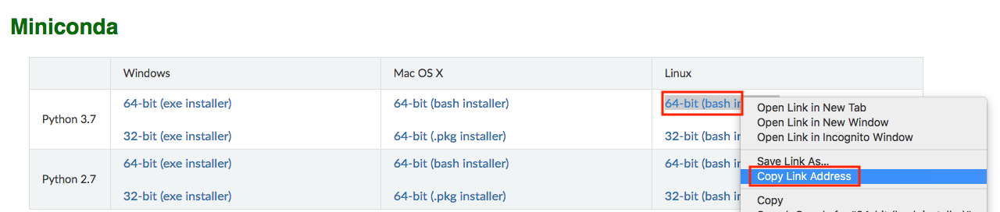

# 使用 AWS EC2 实例
:label:`sec_aws`

在本节中，我们将向您展示如何在原始 Linux 计算机上安装所有库。请记住，在 :numref:`sec_sagemaker` 中，我们讨论了如何使用 Amazon SageMaker，而在 AWS 上自己构建实例的成本更低。本演练包括以下几个步骤： 

1. 从 AWS EC2 请求 GPU Linux 实例。
1. 可选：安装 CUDA 或使用预装 CUDA 的 AMI。
1. 设置相应的 MxNet GPU 版本。

这个过程也适用于其他实例（和其他云），尽管有一些小的修改。在继续之前，您需要创建一个 AWS 账户，请参阅 :numref:`sec_sagemaker` 了解更多详细信息。 

## 创建和运行 EC2 实例

登录 AWS 账户后，单击 “EC2”（在 :numref:`fig_aws` 中用红框标记）进入 EC2 面板。 


:width:`400px`
:label:`fig_aws`

:numref:`fig_ec2` 显示了敏感账户信息灰显的 EC2 面板。 


:width:`700px`
:label:`fig_ec2`

### 预设位置选择附近的数据中心以减少延迟，例如 “俄勒冈州”（以 :numref:`fig_ec2` 右上角的红色框标记）。如果您位于中国，可以选择附近的亚太地区，例如首尔或东京。请注意，有些数据中心可能没有 GPU 实例。 

### 增加限制在选择实例之前，请点击左边栏中的 “限制” 标签来检查是否存在数量限制，如 :numref:`fig_ec2` 所示。:numref:`fig_limits` 展示了此类限制的示例。账户目前无法在每个地区打开 “p2.xlarge” 实例。如果您需要打开一个或多个实例，请单击 “请求限制提高” 链接以申请更高的实例配额。通常，处理申请需要一个工作日。 


:width:`700px`
:label:`fig_limits`

### 启动实例下一步，点击 :numref:`fig_ec2` 中红框标记的 “启动实例” 按钮以启动您的实例。 

我们首先选择合适的 AMI（AWS 计算机映像）。在搜索框中输入 “Ubuntu”（用 :numref:`fig_ubuntu` 中的红色框标记）。 


:width:`700px`
:label:`fig_ubuntu`

EC2 提供了许多不同的实例配置可供选择。对初学者来说，这有时会感到压倒性。以下是合适的机器表： 

| Name | GPU         | Notes                         |
|------|-------------|-------------------------------|
| g2   | Grid K520   | ancient                       |
| p2   | Kepler K80  | old but often cheap as spot   |
| g3   | Maxwell M60 | good trade-off                |
| p3   | Volta V100  | high performance for FP16     |
| g4   | Turing T4   | inference optimized FP16/INT8 |

上述所有服务器都有多种风格，表示使用的 GPU 数量。例如，p2.xlarge 有 1 个 GPU，一个 p2.16xlarge 有 16 个 GPU 和更多内存。有关更多详细信息，请参阅 [AWS EC2 documentation](https732293614)。 

** 注意：** 您必须使用带有合适的驱动程序的启用 GPU 的实例和启用 GPU 的 MxNet 版本。否则，你将看不到使用 GPU 的好处。


:width:`700px`
:label:`fig_p2x`

到目前为止，我们已经完成了启动 EC2 实例的七个步骤中的前两个，如 :numref:`fig_disk` 顶部所示。在此示例中，我们保留步骤 “3” 的默认配置。配置实例”、“5.添加标签” 和 “6.配置安全组”。点击 “4。添加存储空间” 并将默认硬盘大小增加到 64 GB（用红框标记为 :numref:`fig_disk`）。请注意，CUDA 本身已经占用了 4 GB。 


:width:`700px`
:label:`fig_disk`

最后，转到 “7。查看” 然后单击 “启动” 以启动配置的实例。系统现在将提示您选择用于访问实例的密钥对。如果您没有密钥对，请在 :numref:`fig_keypair` 的第一个下拉菜单中选择 “创建新密钥对” 以生成密钥对。随后，您可以为此菜单选择 “选择现有密钥对”，然后选择先前生成的密钥对。单击 “启动实例” 以启动创建的实例。 


:width:`500px`
:label:`fig_keypair`

如果生成了新密钥对，请确保下载密钥对并将其存储在安全的位置。这是你通过 SSH 进入服务器的唯一方法。单击 :numref:`fig_launching` 中显示的实例 ID 以查看此实例的状态。 


:width:`700px`
:label:`fig_launching`

### 连接到实例

如 :numref:`fig_connect` 所示，实例状态变为绿色后，右键单击该实例并选择 `Connect` 以查看实例访问方法。 


:width:`700px`
:label:`fig_connect`

如果这是一个新密钥，那么 SSH 必须不能公开查看才能正常工作。转到存储 `D2L_key.pem` 的文件夹（例如，下载文件夹），并确保密钥不能公开查看。

```bash
cd /Downloads  ## if D2L_key.pem is stored in Downloads folder
chmod 400 D2L_key.pem
```


:width:`400px`
:label:`fig_chmod`

现在，将 ssh 命令复制到 :numref:`fig_chmod` 的下方红框中，然后粘贴到命令行中：

```bash
ssh -i "D2L_key.pem" ubuntu@ec2-xx-xxx-xxx-xxx.y.compute.amazonaws.com
```

当命令行提示 “确定要继续连接（是/否）” 时，输入 “是”，然后按 Enter 键登录实例。 

你的服务器现在已准备好了。 

## 安装 CUDA

在安装 CUDA 之前，请务必使用最新的驱动程序更新实例。

```bash
sudo apt-get update && sudo apt-get install -y build-essential git libgfortran3
```

在这里我们下载 CUDA 10.1。访问 NVIDIA 的 [官方存储库]（https://developer.nvidia.com/cuda-downloads) to find the download link of CUDA 10.1 as shown in :numref:`fig_cuda`。 


:width:`500px`
:label:`fig_cuda`

复制说明并将其粘贴到终端中以安装 CUDA 10.1。

```bash
## Paste the copied link from CUDA website
wget https://developer.download.nvidia.com/compute/cuda/repos/ubuntu1804/x86_64/cuda-ubuntu1804.pin
sudo mv cuda-ubuntu1804.pin /etc/apt/preferences.d/cuda-repository-pin-600
wget http://developer.download.nvidia.com/compute/cuda/10.1/Prod/local_installers/cuda-repo-ubuntu1804-10-1-local-10.1.243-418.87.00_1.0-1_amd64.deb
sudo dpkg -i cuda-repo-ubuntu1804-10-1-local-10.1.243-418.87.00_1.0-1_amd64.deb
sudo apt-key add /var/cuda-repo-10-1-local-10.1.243-418.87.00/7fa2af80.pub
sudo apt-get update
sudo apt-get -y install cuda
```

安装程序后，运行以下命令查看 GPU。

```bash
nvidia-smi
```

最后，将 CUDA 添加到库路径以帮助其他图书馆找到它。

```bash
echo "export LD_LIBRARY_PATH=\${LD_LIBRARY_PATH}:/usr/local/cuda/lib64" >> ~/.bashrc
```

## 安装 MxNet 并下载 D2L 笔记本

首先，为了简化安装，您需要为 Linux 安装 [Miniconda](https://conda.io/en/latest/miniconda.html)。下载链接和文件名可能会发生变化，因此请访问 Miniconda 网站并点击 “复制链接地址”，如 :numref:`fig_miniconda` 所示。 


:width:`700px`
:label:`fig_miniconda`

```bash
# The link and file name are subject to changes
wget https://repo.anaconda.com/miniconda/Miniconda3-latest-Linux-x86_64.sh
sh Miniconda3-latest-Linux-x86_64.sh -b
```

安装 Miniconda 之后，运行以下命令激活 CUDA 和 conda。

```bash
~/miniconda3/bin/conda init
source ~/.bashrc
```

接下来，下载这本书的代码。

```bash
sudo apt-get install unzip
mkdir d2l-en && cd d2l-en
curl https://d2l.ai/d2l-en.zip -o d2l-en.zip
unzip d2l-en.zip && rm d2l-en.zip
```

然后创建 conda `d2l` 环境并输入 `y` 以继续安装。

```bash
conda create --name d2l -y
```

创建 `d2l` 环境后，激活它并安装 `pip`。

```bash
conda activate d2l
conda install python=3.7 pip -y
```

最后，安装 MxNet 和 `d2l` 软件包。后缀 `cu101` 意味着这是 CUDA 10.1 变体。对于不同的版本，只说 CUDA 10.0，你想要选择 `cu100`。

```bash
pip install mxnet-cu101==1.7.0
pip install git+https://github.com/d2l-ai/d2l-en
```

你可以快速测试一切是否顺利，如下所示：

```
$ python
>>> from mxnet import np, npx
>>> np.zeros((1024, 1024), ctx=npx.gpu())
```

## 运行 Jupyter

要远程运行 Jupyter，你需要使用 SSH 端口转发。毕竟，云中的服务器没有显示器或键盘。为此，请按如下方式从台式机（或笔记本电脑）登录服务器。

```
# This command must be run in the local command line
ssh -i "/path/to/key.pem" ubuntu@ec2-xx-xxx-xxx-xxx.y.compute.amazonaws.com -L 8889:localhost:8888
conda activate d2l
jupyter notebook
```

:numref:`fig_jupyter` 显示了运行 Jupyter 笔记本之后可能的输出。最后一行是端口 8888 的 URL。 


:width:`700px`
:label:`fig_jupyter`

由于您使用端口转发到 8889 端口，因此在本地浏览器中打开 URL 时需要替换端口号并使用 Jupyter 给出的密码。 

## 关闭使用的实例

由于云服务按使用时计费，因此您应关闭未使用的实例。请注意，还有其他选择：“停止” 实例意味着您将能够重新启动它。这类似于关闭常规服务器的电源。但是，停止的实例仍需为保留的硬盘空间收取少量费用。“终止” 删除与之关联的所有数据。这包括磁盘，因此您无法再次启动它。只有在你知道将来不需要它的情况下才能做到这一点。 

如果您想将实例用作更多实例的模板，请右键单击 :numref:`fig_connect` 中的示例，然后选择 “Image” $\rightarrow$ “创建” 以创建实例的映像。完成此操作后，选择 “实例状态” $\rightarrow$ “终止” 以终止实例。下次要使用此实例时，您可以按照本节中介绍的创建和运行 EC2 实例的步骤进行操作，根据保存的映像创建实例。唯一的区别是，在 “1 中。选择 :numref:`fig_ubuntu` 中显示的 AMI”，您必须使用左侧的 “我的 AMI” 选项来选择已保存的图像。创建的实例将保留存储在映像硬盘上的信息。例如，您不必重新安装 CUDA 和其他运行时环境。 

## 摘要

* 您可以按需启动和停止实例，而无需购买和构建自己的计算机。
* 您需要先安装合适的 GPU 驱动程序，然后才能使用它们。

## 练习

1. 云提供了便利，但并不便宜。了解如何启动 [spot instances](https://aws.amazon.com/ec2/spot/) 以了解如何降低价格。
1. 尝试不同的 GPU 服务器。他们有多快？
1. 尝试多 GPU 服务器。你能扩大东西的规模有多好？

[Discussions](https://discuss.d2l.ai/t/423)
