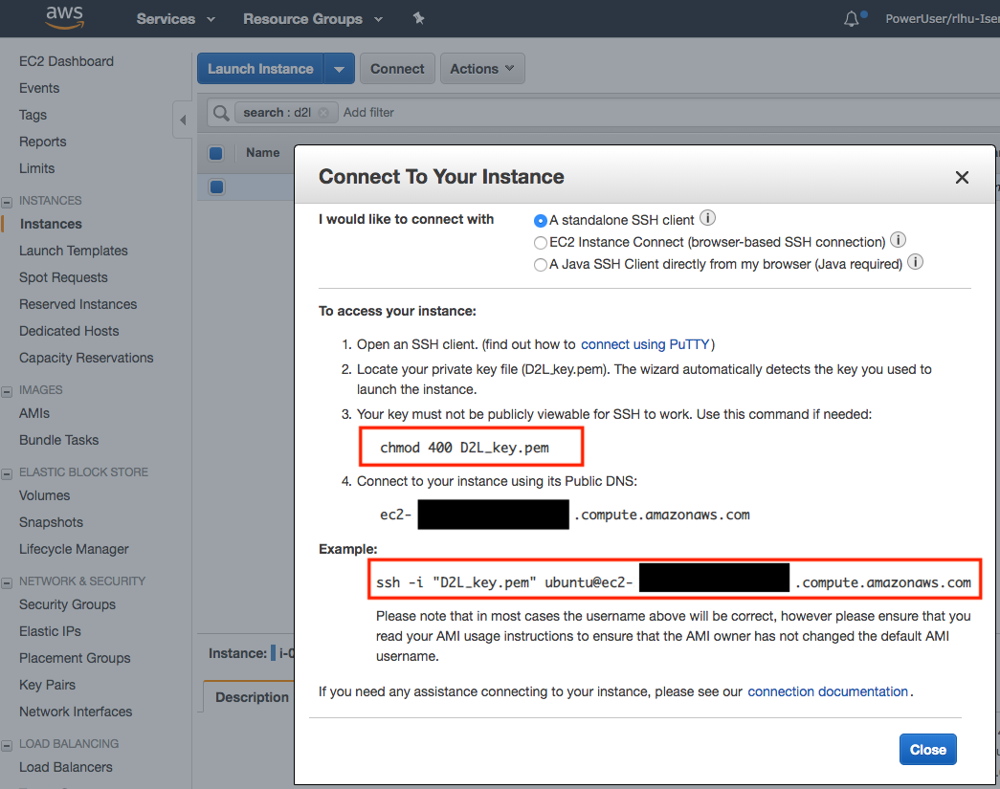
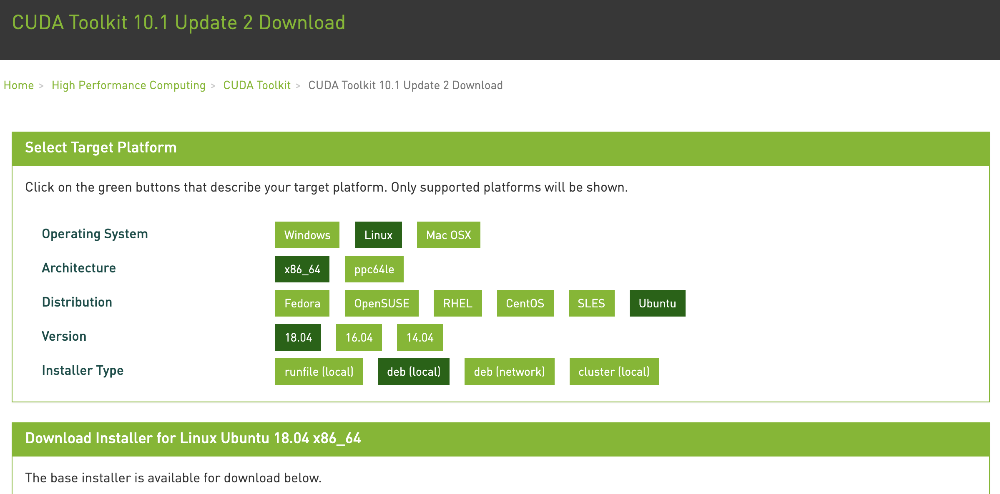

# Using AWS EC2 Instances
:label:`sec_aws`

In this section, we will show you how to install all libraries on a raw Linux machine. Recall that in :numref:`sec_sagemaker` we discussed how to use Amazon SageMaker, while building an instance by yourself costs less on AWS. The walkthrough includes three steps:

1. Request for a GPU Linux instance from AWS EC2.
1. Install CUDA (or use an Amazon Machine Image with preinstalled CUDA).
1. Install the deep learning framework and other libraries for running the code of the book.

This process applies to other instances (and other clouds), too, albeit with some minor modifications. Before going forward, you need to create an AWS account, see :numref:`sec_sagemaker` for more details.


## Creating and Running an EC2 Instance

After logging into your AWS account, click "EC2" (marked by the red box in :numref:`fig_aws`) to go to the EC2 panel.


:width:`400px`
:label:`fig_aws`

:numref:`fig_ec2` shows the EC2 panel with sensitive account information greyed out.


:width:`700px`
:label:`fig_ec2`

### Presetting Location
Select a nearby data center to reduce latency, e.g., "Oregon" (marked by the red box in the top-right of :numref:`fig_ec2`). If you are located in China,
you can select a nearby Asia Pacific region, such as Seoul or Tokyo. Please note
that some data centers may not have GPU instances.


### Increasing Limits

Before choosing an instance, check if there are quantity
restrictions by clicking the "Limits" label in the bar on the left as shown in
:numref:`fig_ec2`. 
:numref:`fig_limits` shows an example of such a
limitation. The account currently cannot open "p2.xlarge" instance per region. If
you need to open one or more instances, click on the "Request limit increase" link to
apply for a higher instance quota.
Generally, it takes one business day to
process an application.


:width:`700px`
:label:`fig_limits`


### Launching an Instance

Next, click the "Launch Instance" button marked by the red box in :numref:`fig_ec2` to launch your instance.

We begin by selecting a suitable Amazon Machine Image (AMI). Enter "Ubuntu" in the search box (marked by the red box in :numref:`fig_ubuntu`).


:width:`700px`
:label:`fig_ubuntu`

EC2 provides many different instance configurations to choose from. This can sometimes feel overwhelming to a beginner. :numref:`tab_ec2` lists different suitable machines.

:Different EC2 instance types

| Name | GPU         | Notes                         |
|------|-------------|-------------------------------|
| g2   | Grid K520   | ancient                       |
| p2   | Kepler K80  | old but often cheap as spot   |
| g3   | Maxwell M60 | good trade-off                |
| p3   | Volta V100  | high performance for FP16     |
| g4   | Turing T4   | inference optimized FP16/INT8 |
:label:`tab_ec2`

All these servers come in multiple flavors indicating the number of GPUs used. For example, a p2.xlarge has 1 GPU and a p2.16xlarge has 16 GPUs and more memory. For more details, see the [AWS EC2 documentation](https://aws.amazon.com/ec2/instance-types/) or a [summary page](https://www.ec2instances.info). For the purpose of illustration, a p2.xlarge will suffice (marked in the red box of :numref:`fig_p2x`).


:width:`700px`
:label:`fig_p2x`

Note that you should use a GPU-enabled instance with suitable drivers and a GPU-enabled deep learning framework. Otherwise you will not see any benefit from using GPUs.

So far, we have finished the first two of seven steps for launching an EC2 instance, as shown on the top of :numref:`fig_disk`. In this example, we keep the default configurations for the steps "3. Configure Instance", "5. Add Tags", and "6. Configure Security Group". Tap on "4. Add Storage" and increase the default hard disk size to 64 GB (marked in the red box of :numref:`fig_disk`). Note that CUDA by itself already takes up 4 GB.


:width:`700px`
:label:`fig_disk`


Finally, go to "7. Review" and click "Launch" to launch the configured
instance. The system will now prompt you to select the key pair used to access
the instance. If you do not have a key pair, select "Create a new key pair" in
the first drop-down menu in :numref:`fig_keypair` to generate a key pair. Subsequently,
you can select "Choose an existing key pair" for this menu and then select the
previously generated key pair. Click "Launch Instances" to launch the created
instance.


:width:`500px`
:label:`fig_keypair`

Make sure that you download the key pair and store it in a safe location if you
generated a new one. This is your only way to SSH into the server. Click the
instance ID shown in :numref:`fig_launching` to view the status of this instance.


:width:`700px`
:label:`fig_launching`

### Connecting to the Instance

As shown in :numref:`fig_connect`, after the instance state turns green, right-click the instance and select `Connect` to view the instance access method.


:width:`700px`
:label:`fig_connect`

If this is a new key, it must not be publicly viewable for SSH to work. Go to the folder where you store `D2L_key.pem` and 
execute the following command 
to make the key not publicly viewable:

```bash
chmod 400 D2L_key.pem
```



:width:`400px`
:label:`fig_chmod`


Now, copy the ssh command in the lower red box of :numref:`fig_chmod` and paste onto the command line:

```bash
ssh -i "D2L_key.pem" ubuntu@ec2-xx-xxx-xxx-xxx.y.compute.amazonaws.com
```


When the command line prompts "Are you sure you want to continue connecting (yes/no)", enter "yes" and press Enter to log into the instance.

Your server is ready now.


## Installing CUDA

Before installing CUDA, be sure to update the instance with the latest drivers.

```bash
sudo apt-get update && sudo apt-get install -y build-essential git libgfortran3
```


Here we download CUDA 10.1. Visit NVIDIA's [official repository](https://developer.nvidia.com/cuda-toolkit-archive) to find the download link as shown in :numref:`fig_cuda`.


:width:`500px`
:label:`fig_cuda`

Copy the instructions and paste them onto the terminal to install CUDA 10.1.

```bash
# The link and file name are subject to changes
wget https://developer.download.nvidia.com/compute/cuda/repos/ubuntu1804/x86_64/cuda-ubuntu1804.pin
sudo mv cuda-ubuntu1804.pin /etc/apt/preferences.d/cuda-repository-pin-600
wget http://developer.download.nvidia.com/compute/cuda/10.1/Prod/local_installers/cuda-repo-ubuntu1804-10-1-local-10.1.243-418.87.00_1.0-1_amd64.deb
sudo dpkg -i cuda-repo-ubuntu1804-10-1-local-10.1.243-418.87.00_1.0-1_amd64.deb
sudo apt-key add /var/cuda-repo-10-1-local-10.1.243-418.87.00/7fa2af80.pub
sudo apt-get update
sudo apt-get -y install cuda
```


After installing the program, run the following command to view the GPUs:

```bash
nvidia-smi
```


Finally, add CUDA to the library path to help other libraries find it.

```bash
echo "export LD_LIBRARY_PATH=\${LD_LIBRARY_PATH}:/usr/local/cuda/lib64" >> ~/.bashrc
```


## Installing Libraries for Running the Code

To run the code of this book,
just follow steps in :ref:`chap_installation`
for Linux users on the EC2 instance
and use the following tips 
for working on a remote Linux server:

* To download the bash script on the Miniconda installation page, right click the download link and select "Copy Link Address", then execute `wget [copied link address]`.
* After running `~/miniconda3/bin/conda init`, you may execute `source ~/.bashrc` instead of closing and reopening your current shell.


## Running the Jupyter Notebook remotely

To run the Jupyter Notebook remotely you need to use SSH port forwarding. After all, the server in the cloud does not have a monitor or keyboard. For this, log into your server from your desktop (or laptop) as follows:

```
# This command must be run in the local command line
ssh -i "/path/to/key.pem" ubuntu@ec2-xx-xxx-xxx-xxx.y.compute.amazonaws.com -L 8889:localhost:8888
```


Next, go to the location 
of the downloaded code of this book
on the EC2 instance,
then run:

```
conda activate d2l
jupyter notebook
```


:numref:`fig_jupyter` shows the possible output after you run the Jupyter Notebook. The last row is the URL for port 8888.


:width:`700px`
:label:`fig_jupyter`

Since you used port forwarding to port 8889,
copy the last row in the red box of :numref:`fig_jupyter`,
replace "8888" with "8889" in the URL,
and open it in your local browser.


## Closing Unused Instances

As cloud services are billed by the time of use, you should close instances that are not being used. Note that there are alternatives:

* "Stopping" an instance means that you will be able to start it again. This is akin to switching off the power for your regular server. However, stopped instances will still be billed a small amount for the hard disk space retained. 
* "Terminating" an instance will delete all data associated with it. This includes the disk, hence you cannot start it again. Only do this if you know that you will not need it in the future.

If you want to use the instance as a template for many more instances,
right-click on the example in :numref:`fig_connect` and select "Image" $\rightarrow$
"Create" to create an image of the instance. Once this is complete, select
"Instance State" $\rightarrow$ "Terminate" to terminate the instance. The next
time you want to use this instance, you can follow the steps in this section 
to create an instance based on
the saved image. The only difference is that, in "1. Choose AMI" shown in
:numref:`fig_ubuntu`, you must use the "My AMIs" option on the left to select your saved
image. The created instance will retain the information stored on the image hard
disk. For example, you will not have to reinstall CUDA and other runtime
environments.


## Summary

* We can launch and stop instances on demand without having to buy and build our own computer.
* We need to install CUDA before using the GPU-enabled deep learning framework.
* We can use port forwarding to run the Jupyter Notebook on a remote server.


## Exercises

1. The cloud offers convenience, but it does not come cheap. Find out how to launch [spot instances](https://aws.amazon.com/ec2/spot/) to see how to reduce costs.
1. Experiment with different GPU servers. How fast are they?
1. Experiment with multi-GPU servers. How well can you scale things up?


[Discussions](https://discuss.d2l.ai/t/423)
