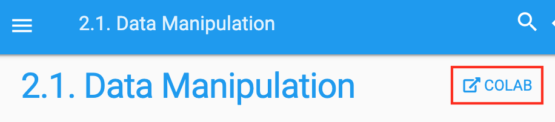
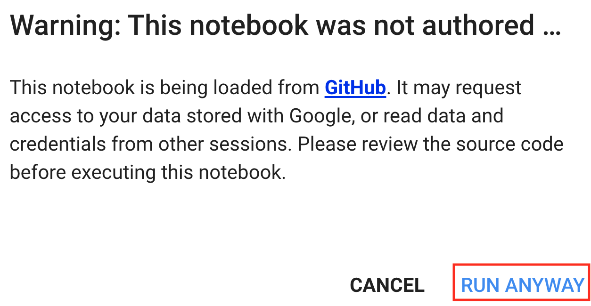

# 使用谷歌 Colab
:label:`sec_colab`

我们在 :numref:`sec_sagemaker` 和 :numref:`sec_aws` 和 :numref:`sec_aws` 中介绍了如何在 AWS 上运行这本书。另一种选择是在 [Google Colab](https://colab.research.google.com/) 上运行这本书，如果你有谷歌帐户，它会提供免费的 GPU。 

要在 Colab 上运行一个部分，你只需点击该部分标题右侧的 `Colab` 按钮，例如 :numref:`fig_colab` 中的按钮。  

:width:`300px`
:label:`fig_colab`

当你第一次执行代码单元格时，你将收到一条警告消息，如 :numref:`fig_colab2` 所示。你可以点击 “无论如何运行” 来忽略它。 

:width:`300px`
:label:`fig_colab2`

接下来，Colab 将您连接到实例以运行此笔记本。具体来说，如果需要 GPU（例如在调用 `d2l.try_gpu()` 函数时），我们将要求 Colab 自动连接到 GPU 实例。 

## 摘要

* 你可以使用谷歌 Colab 使用 GPU 运行本书的每个部分。

## 练习

1. 尝试使用 Google Colab 编辑并运行本书中的代码。

[Discussions](https://discuss.d2l.ai/t/424)
