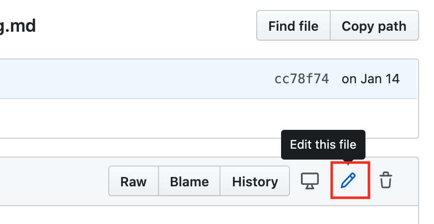
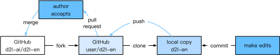
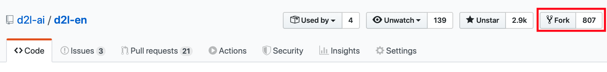
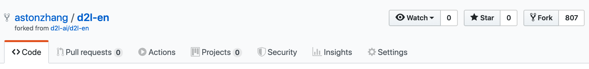
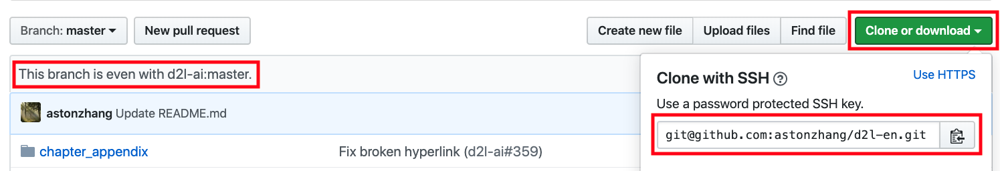
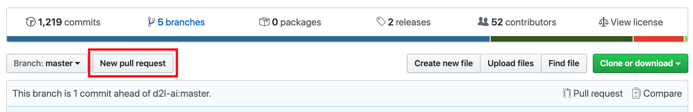
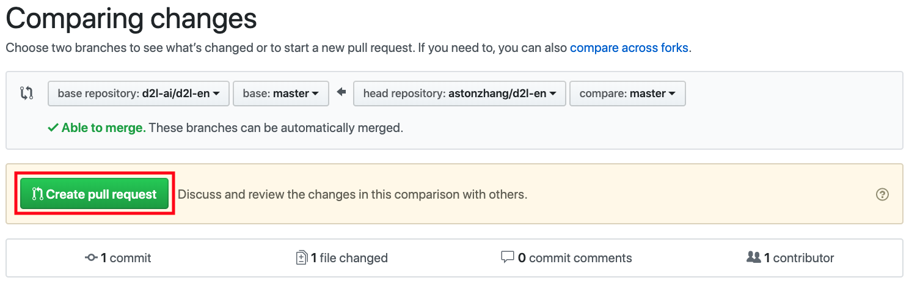

# Contributing to This Book
:label:`sec_how_to_contribute`

Contributions by [readers](https://github.com/d2l-ai/d2l-en/graphs/contributors) help us improve this book. If you find a typo, an outdated link, something where you think we missed a citation, where the code does not look elegant or where an explanation is unclear, please contribute back and help us help our readers. While in regular books the delay between print runs (and thus between typo corrections) can be measured in years, it typically takes hours to days to incorporate an improvement in this book. This is all possible due to version control and continuous integration (CI) testing. To do so you need to submit a [pull request](https://github.com/d2l-ai/d2l-en/pulls) to the GitHub repository. When your pull request is merged into the code repository by the authors, you will become a contributor.

## Submitting Minor Changes

The most common contributions are editing one sentence or fixing typos. We recommend you to find the source file in the [GitHub repository](https://github.com/d2l-ai/d2l-en) and edit the file directly. For example, you can search the file through the [Find file](https://github.com/d2l-ai/d2l-en/find/master) button (:numref:`fig_edit_file`) to locate the source file (a markdown file). Then you click the "Edit this file" button on the upper-right corner to make your changes in the markdown file.


:width:`300px`
:label:`fig_edit_file`

After you are done, fill in your change descriptions in the "Propose file change" panel on the page bottom and then click the "Propose file change" button. It will redirect you to a new page to review your changes (:numref:`fig_git_createpr`). If everything is good, you can submit a pull request by clicking the "Create pull request" button.

## Proposing Major Changes

If you plan to update a large portion of text or code, then you need to know a little bit more about the format this book is using. The source file is based on the [markdown format](https://daringfireball.net/projects/markdown/syntax) with a set of extensions through the [d2lbook](http://book.d2l.ai/user/markdown.html) package such as referring to equations, images, chapters, and citations. You can use any markdown editors to open these files and make your changes.

If you would like to change the code, we recommend you to use the Jupyter Notebook to open these markdown files as described in :numref:`sec_jupyter`. So that you can run and test your changes. Please remember to clear all outputs before submitting your changes, our CI system will execute the sections you updated to generate outputs.

Some sections may support multiple framework implementations.
If you add a new code block not for the default implementation, which is MXNet, please use `#@tab` to mark this block on the beginning line. For example, `#@tab pytorch` for a PyTorch code block, `#@tab tensorflow` for a TensorFlow code block, or `#@tab all` a shared code block for all implementations. You may refer to the [`d2lbook`](http://book.d2l.ai/user/code_tabs.html) package for more information.

## Submitting Major Changes

We suggest you to use the standard Git process to submit a major change. In a nutshell the process works as described in :numref:`fig_contribute`.


:label:`fig_contribute`

We will walk you through the steps in detail. If you are already familiar with Git you can skip this section. For concreteness we assume that the contributor's user name is "astonzhang".

### Installing Git

The Git open source book describes [how to install Git](https://git-scm.com/book/en/v2). This typically works via `apt install git` on Ubuntu Linux, by installing the Xcode developer tools on macOS, or by using GitHub's [desktop client](https://desktop.github.com). If you do not have a GitHub account, you need to sign up for one.

### Logging in to GitHub

Enter the [address](https://github.com/d2l-ai/d2l-en/) of the book's code repository in your browser. Click on the `Fork` button in the red box at the upper-right of :numref:`fig_git_fork`, to make a copy of the repository of this book. This is now *your copy* and you can change it any way you want.


:width:`700px`
:label:`fig_git_fork`


Now, the code repository of this book will be forked (i.e., copied) to your username, such as `astonzhang/d2l-en` shown at the upper-left of :numref:`fig_git_forked`.


:width:`700px`
:label:`fig_git_forked`

### Cloning the Repository

To clone the repository (i.e., to make a local copy) we need to get its repository address. The green button in :numref:`fig_git_clone` displays this. Make sure that your local copy is up to date with the main repository if you decide to keep this fork around for longer. For now simply follow the instructions in :ref:`chap_installation` to get started. The main difference is that you are now downloading *your own fork* of the repository.


:width:`700px`
:label:`fig_git_clone`

```
# Replace your_github_username with your GitHub username
git clone https://github.com/your_github_username/d2l-en.git
```


### Editing and Pushing

Now it is time to edit the book. It is best to edit it in the Jupyter Notebook following instructions in :numref:`sec_jupyter`. Make the changes and check that they are OK. Assume that we have modified a typo in the file `~/d2l-en/chapter_appendix_tools/how-to-contribute.md`.
You can then check which files you have changed.

At this point Git will prompt that the `chapter_appendix_tools/how-to-contribute.md` file has been modified.

```
mylaptop:d2l-en me$ git status
On branch master
Your branch is up-to-date with 'origin/master'.

Changes not staged for commit:
  (use "git add <file>..." to update what will be committed)
  (use "git checkout -- <file>..." to discard changes in working directory)

	modified:   chapter_appendix_tools/how-to-contribute.md
```


After confirming that this is what you want, execute the following command:

```
git add chapter_appendix_tools/how-to-contribute.md
git commit -m 'fix typo in git documentation'
git push
```


The changed code will then be in your personal fork of the repository. To request the addition of your change, you have to create a pull request for the official repository of the book.

### Submitting Pull Requests

As shown in :numref:`fig_git_newpr`, go to your fork of the repository on GitHub and select "New pull request". This will open up a screen that shows you the changes between your edits and what is current in the main repository of the book.


:width:`700px`
:label:`fig_git_newpr`


Finally, submit a pull request by clicking the button as shown in :numref:`fig_git_createpr`. Make sure to describe the changes you have made in the pull request.
This will make it easier for the authors to review it and to merge it with the book. Depending on the changes, this might get accepted right away, rejected, or more likely, you will get some feedback on the changes. Once you have incorporated them, you are good to go.


:width:`700px`
:label:`fig_git_createpr`


## Summary

* You can use GitHub to contribute to this book.
* You can edit the file on GitHub directly for minor changes.
* For a major change, please fork the repository, edit things locally, and only contribute back once you are ready.
* Pull requests are how contributions are being bundled up. Try not to submit huge pull requests since this makes them hard to understand and incorporate. Better send several smaller ones.


## Exercises

1. Star and fork the `d2l-ai/d2l-en` repository.
1. If you spot anything that needs improvement (e.g., missing a reference), submit a pull request. 
1. It is usually a better practice to create a pull request using a new branch. Learn how to do it with [Git branching](https://git-scm.com/book/en/v2/Git-Branching-Branches-in-a-Nutshell).

[Discussions](https://discuss.d2l.ai/t/426)
