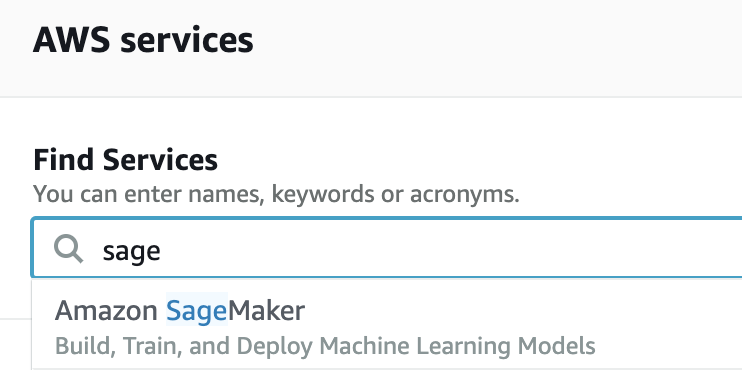
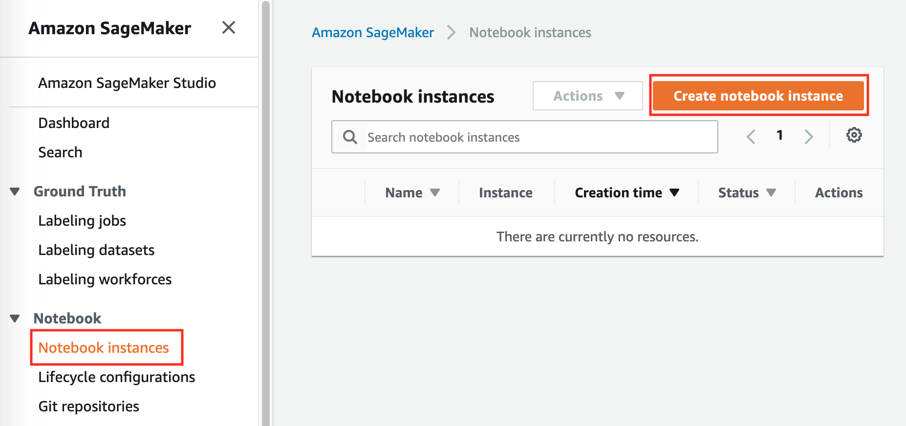
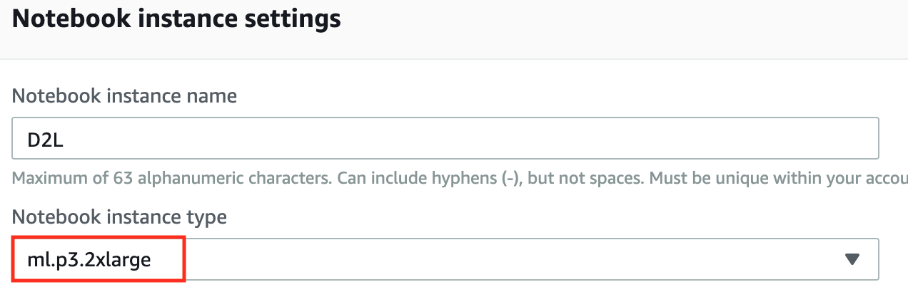
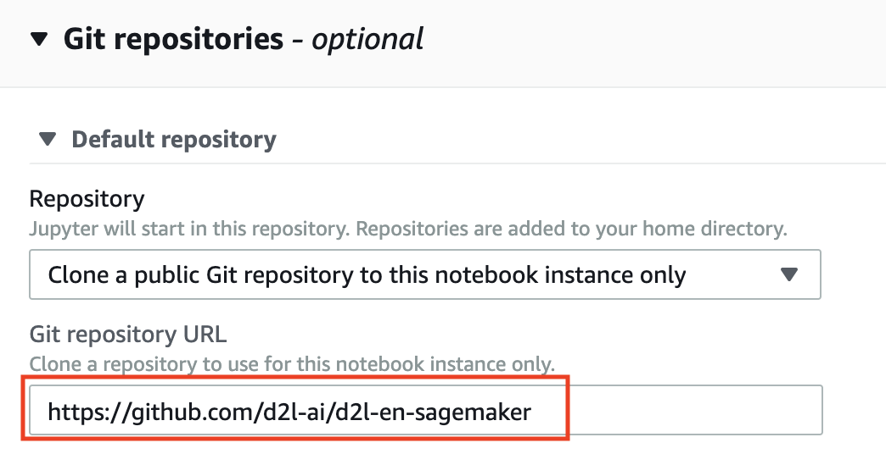
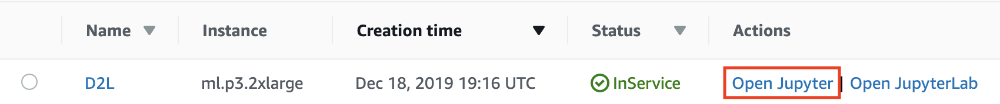
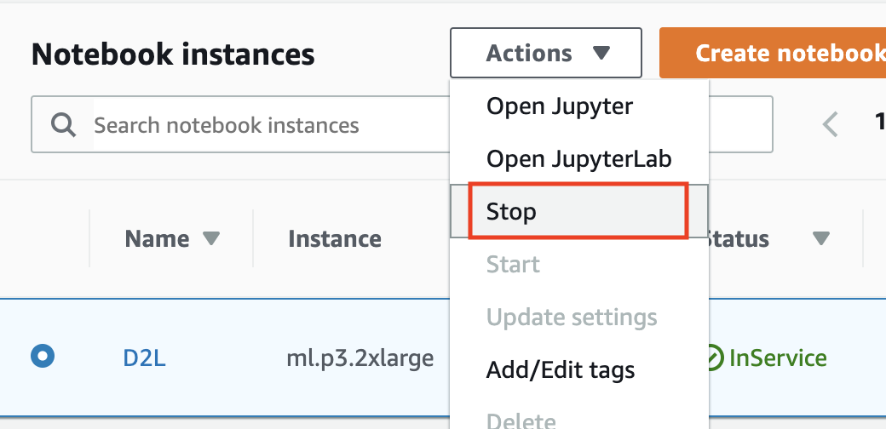
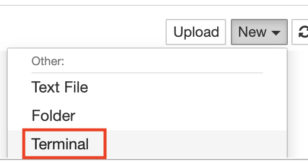

# 使用Amazon SageMaker
:label:`sec_sagemaker`

深度学习程序可能需要很多计算资源，这很容易超出你的本地计算机所能提供的范围。云计算服务允许你使用功能更强大的计算机更轻松地运行本书的GPU密集型代码。本节将介绍如何使用Amazon SageMaker运行本书的代码。

## 注册

首先，我们需要在注册一个帐户https://aws.amazon.com/。 为了增加安全性，鼓励使用双因素身份验证。设置详细的计费和支出警报也是一个好主意，以避免任何意外，例如，当忘记停止运行实例时。登录AWS帐户后，转到[console](http://console.aws.amazon.com/)并搜索“Amazon SageMaker”（参见 :numref:`fig_sagemaker`），然后单击它打开SageMaker面板。


:width:`300px`
:label:`fig_sagemaker`

## 创建SageMaker实例

接下来，让我们创建一个notebook实例，如 :numref:`fig_sagemaker-create`所示。


:width:`400px`
:label:`fig_sagemaker-create`

SageMaker提供多个具有不同计算能力和价格的[实例类型](https://aws.amazon.com/sagemaker/pricing/instance-types/)。创建notebook实例时，可以指定其名称和类型。在 :numref:`fig_sagemaker-create-2`中，我们选择`ml.p3.2xlarge`：使用一个Tesla V100 GPU和一个8核CPU，这个实例的性能足够本书的大部分内容使用。


:width:`400px`
:label:`fig_sagemaker-create-2`

:begin_tab:`mxnet`
用于与SageMaker一起运行的ipynb格式的整本书可从https://github.com/d2l-ai/d2l-en-sagemaker获得。
我们可以指定此GitHub存储库URL（ :numref:`fig_sagemaker-create-3`），以允许SageMaker在创建实例时克隆它。
:end_tab:

:begin_tab:`pytorch`
用于与SageMaker一起运行的ipynb格式的整本书可从https://github.com/d2l-ai/d2l-pytorch-sagemaker获得。
我们可以指定此GitHub存储库URL（ :numref:`fig_sagemaker-create-3`），以允许SageMaker在创建实例时克隆它。
:end_tab:

:begin_tab:`tensorflow`
用于与SageMaker一起运行的ipynb格式的整本书可从https://github.com/d2l-ai/d2l-tensorflow-sagemaker获得。
我们可以指定此GitHub存储库URL（ :numref:`fig_sagemaker-create-3`），以允许SageMaker在创建实例时克隆它。
:end_tab:


:width:`400px`
:label:`fig_sagemaker-create-3`

## 运行和停止实例

创建实例可能需要几分钟的时间。当实例准备就绪时，单击它旁边的“Open Jupyter”链接（ :numref:`fig_sagemaker-open`），以便你可以在此实例上编辑并运行本书的所有Jupyter Notebook（类似于 :numref:`sec_jupyter`中的步骤）。


:width:`400px`
:label:`fig_sagemaker-open`

完成工作后，不要忘记停止实例以避免进一步收费（ :numref:`fig_sagemaker-stop`）。


:width:`300px`
:label:`fig_sagemaker-stop`

## 更新Notebook

:begin_tab:`mxnet`
这本开源书的notebook将定期在GitHub上的[d2l-ai/d2l-en-sagemaker](https://github.com/d2l-ai/d2l-en-sagemaker)存储库中更新。要更新至最新版本，你可以在SageMaker实例（ :numref:`fig_sagemaker-terminal`）上打开终端。
:end_tab:

:begin_tab:`pytorch`
这本开源书的notebook将定期在GitHub上的[d2l-ai/d2l-pytorch-sagemaker](https://github.com/d2l-ai/d2l-pytorch-sagemaker)存储库中更新。要更新至最新版本，你可以在SageMaker实例（ :numref:`fig_sagemaker-terminal`）上打开终端。
:end_tab:

:begin_tab:`tensorflow`
这本开源书的notebook将定期在GitHub上的[d2l-ai/d2l-tensorflow-sagemaker](https://github.com/d2l-ai/d2l-tensorflow-sagemaker)存储库中更新。要更新至最新版本，你可以在SageMaker实例（ :numref:`fig_sagemaker-terminal`）上打开终端。
:end_tab:


:width:`300px`
:label:`fig_sagemaker-terminal`

你可能希望在从远程存储库提取更新之前提交本地更改。否则，只需在终端中使用以下命令放弃所有本地更改：

:begin_tab:`mxnet`

```bash
cd SageMaker/d2l-en-sagemaker/
git reset --hard
git pull
```


:end_tab:

:begin_tab:`pytorch`

```bash
cd SageMaker/d2l-pytorch-sagemaker/
git reset --hard
git pull
```


:end_tab:

:begin_tab:`tensorflow`

```bash
cd SageMaker/d2l-tensorflow-sagemaker/
git reset --hard
git pull
```


:end_tab:

## 小结

* 我们可以使用Amazon SageMaker创建一个GPU的notebook实例来运行本书的密集型代码。
* 我们可以通过Amazon SageMaker实例上的终端更新notebooks。

## 练习

1. 使用Amazon SageMaker编辑并运行任何需要GPU的部分。
1. 打开终端以访问保存本书所有notebooks的本地目录。

[Discussions](https://discuss.d2l.ai/t/5732)
