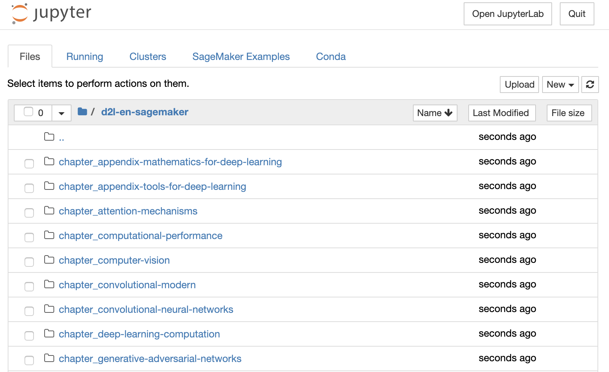

# Using Amazon SageMaker
:label:`sec_sagemaker`

Many deep learning applications require a significant amount of computation. Your local machine might be too slow to solve these problems in a reasonable amount of time. Cloud computing services give you access to more powerful computers to run the GPU-intensive portions of this book. This tutorial will guide you through Amazon SageMaker: a service that allows you to run this book easily.


## Registering and Logging In

First, we need to register an account at https://aws.amazon.com/. We encourage you to use two-factor authentication for additional security. It is also a good idea to set up detailed billing and spending alerts to avoid any unexpected surprises in case you forget to stop any running instance.
Note that you will need a credit card.
After logging into your AWS account, go to your [console](http://console.aws.amazon.com/) and search for "SageMaker" (see :numref:`fig_sagemaker`) then click to open the SageMaker panel.


:width:`300px`
:label:`fig_sagemaker`


## Creating a SageMaker Instance

Next, let us create a notebook instance as described in :numref:`fig_sagemaker-create`.


:width:`400px`
:label:`fig_sagemaker-create`

SageMaker provides multiple [instance types](https://aws.amazon.com/sagemaker/pricing/instance-types/) of different computational power and prices.
When creating an instance, we can specify the instance name and choose its type.
In :numref:`fig_sagemaker-create-2`, we choose `ml.p3.2xlarge`. With one Tesla V100 GPU and an 8-core CPU, this instance is powerful enough for most chapters.


:width:`400px`
:label:`fig_sagemaker-create-2`

:begin_tab:`mxnet`
A Jupyter notebook version of this book for fitting SageMaker is available at https://github.com/d2l-ai/d2l-en-sagemaker. We can specify this GitHub repository URL to let SageMaker clone this repository during instance creation, as shown in :numref:`fig_sagemaker-create-3`.
:end_tab:

:begin_tab:`pytorch`
A Jupyter notebook version of this book for fitting SageMaker is available at https://github.com/d2l-ai/d2l-pytorch-sagemaker. We can specify this GitHub repository URL to let SageMaker clone this repository during instance creation, as shown in :numref:`fig_sagemaker-create-3`.
:end_tab:

:begin_tab:`tensorflow`
A Jupyter notebook version of this book for fitting SageMaker is available at https://github.com/d2l-ai/d2l-tensorflow-sagemaker. We can specify this GitHub repository URL to let SageMaker clone this repository during instance creation, as shown in :numref:`fig_sagemaker-create-3`.
:end_tab:


:width:`400px`
:label:`fig_sagemaker-create-3`


## Running and Stopping an Instance

It may take a few minutes before the instance is ready.
When it is ready, you can click on the "Open Jupyter" link as shown in :numref:`fig_sagemaker-open`.


:width:`400px`
:label:`fig_sagemaker-open`

Then, as shown in :numref:`fig_sagemaker-jupyter`, you may navigate through the Jupyter server running on this instance.


:width:`400px`
:label:`fig_sagemaker-jupyter`

Running and editing Jupyter notebooks on the SageMaker instance is similar to what we have discussed in :numref:`sec_jupyter`.
After finishing your work, do not forget to stop the instance to avoid further charging, as shown in :numref:`fig_sagemaker-stop`.


:width:`300px`
:label:`fig_sagemaker-stop`


## Updating Notebooks

:begin_tab:`mxnet`
We will regularly update the notebooks in the [d2l-ai/d2l-en-sagemaker](https://github.com/d2l-ai/d2l-en-sagemaker) GitHub repository. You can simply use the `git pull` command to update to the latest version.
:end_tab:

:begin_tab:`pytorch`
We will regularly update the notebooks in the [d2l-ai/d2l-pytorch-sagemaker](https://github.com/d2l-ai/d2l-pytorch-sagemaker) GitHub repository. You can simply use the `git pull` command to update to the latest version.
:end_tab:

:begin_tab:`tensorflow`
We will regularly update the notebooks in the [d2l-ai/d2l-tensorflow-sagemaker](https://github.com/d2l-ai/d2l-tensorflow-sagemaker) GitHub repository. You can simply use the `git pull` command to update to the latest version.
:end_tab:

First, you need to open a terminal as shown in :numref:`fig_sagemaker-terminal`.


:width:`300px`
:label:`fig_sagemaker-terminal`

You may want to commit your local changes before pulling the updates. Alternatively, you can simply ignore all your local changes with the following commands in the terminal.

:begin_tab:`mxnet`
```bash
cd SageMaker/d2l-en-sagemaker/
git reset --hard
git pull
```
:end_tab:

:begin_tab:`pytorch`
```bash
cd SageMaker/d2l-pytorch-sagemaker/
git reset --hard
git pull
```
:end_tab:

:begin_tab:`tensorflow`
```bash
cd SageMaker/d2l-tensorflow-sagemaker/
git reset --hard
git pull
```
:end_tab:

## Summary

* We can launch and stop a Jupyter server through Amazon SageMaker to run this book.
* We can update notebooks via the terminal on the Amazon SageMaker instance.


## Exercises

1. Try to edit and run the code in this book using Amazon SageMaker.
1. Access the source code directory via the terminal.


[Discussions](https://discuss.d2l.ai/t/422)
