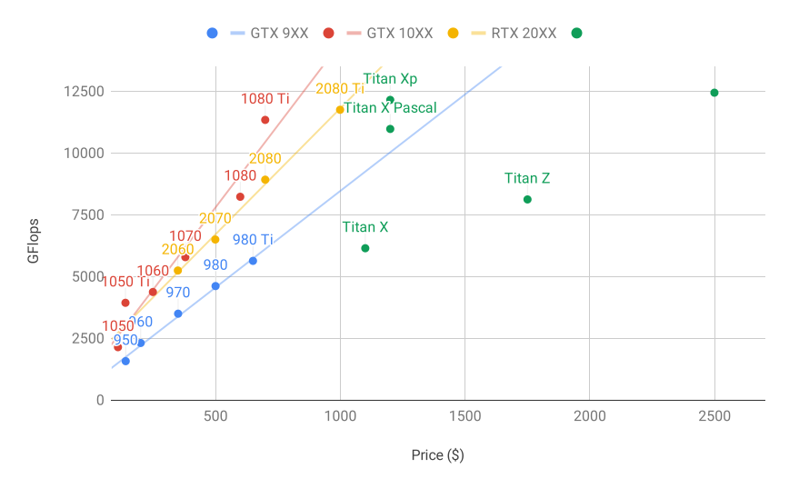
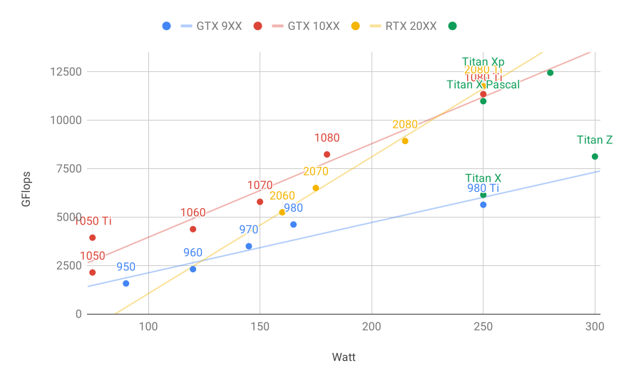

# Selecting Servers and GPUs
:label:`sec_buy_gpu`

Deep learning training generally requires large amounts of computation. At present GPUs are the most cost-effective hardware accelerators for deep learning. In particular, compared with CPUs, GPUs are cheaper and offer higher performance, often by over an order of magnitude. Furthermore, a single server can support multiple GPUs, up to 8 for high end servers. More typical numbers are up to 4 GPUs for an engineering workstation, since heat, cooling, and power requirements escalate quickly beyond what an office building can support. For larger deployments, cloud computing (e.g., Amazon's [P3](https://aws.amazon.com/ec2/instance-types/p3/) and [G4](https://aws.amazon.com/blogs/aws/in-the-works-ec2-instances-g4-with-nvidia-t4-gpus/) instances) is a much more practical solution.

## Selecting Servers

There is typically no need to purchase high-end CPUs with many threads since much of the computation occurs on the GPUs. That said, due to the global interpreter lock (GIL) in Python single-thread performance of a CPU can matter in situations where we have 4--8 GPUs. All things equal this suggests that CPUs with a smaller number of cores but a higher clock frequency might be a more economical choice. For example, when choosing between a 6-core 4 GHz and an 8-core 3.5 GHz CPU, the former is much preferable, even though its aggregate speed is less.
An important consideration is that GPUs use lots of power and thus dissipate lots of heat. This requires very good cooling and a large enough chassis to use the GPUs. Follow the guidelines below if possible:

1. **Power Supply**. GPUs use significant amounts of power. Budget with up to 350W per device (check for the *peak demand* of the graphics card rather than typical demand, since efficient code can use lots of energy). If your power supply is not up to the demand you will find that your system becomes unstable.
1. **Chassis Size**. GPUs are large and the auxiliary power connectors often need extra space. Also, large chassis are easier to cool.
1. **GPU Cooling**. If you have a large number of GPUs you might want to invest in water cooling. Also, aim for *reference designs* even if they have fewer fans, since they are thin enough to allow for air intake between the devices. If you buy a multi-fan GPU it might be too thick to get enough air when installing multiple GPUs and you will run into thermal throttling.
1. **PCIe Slots**. Moving data to and from the GPU (and exchanging it between GPUs) requires lots of bandwidth. We recommend PCIe 3.0 slots with 16 lanes. If you mount multiple GPUs, be sure to carefully read the motherboard description to ensure that 16$\times$ bandwidth is still available when multiple GPUs are used at the same time and that you are getting PCIe 3.0 as opposed to PCIe 2.0 for the additional slots. Some motherboards downgrade to 8$\times$ or even 4$\times$ bandwidth with multiple GPUs installed. This is partly due to the number of PCIe lanes that the CPU offers.

In short, here are some recommendations for building a deep learning server:

* **Beginner**. Buy a low end GPU with low power consumption (cheap gaming GPUs suitable for deep learning use 150-200W). If you are lucky your current computer will support it.
* **1 GPU**. A low-end CPU with 4 cores will be sufficient and most motherboards suffice. Aim for at least 32 GB DRAM and invest into an SSD for local data access. A power supply with 600W should be sufficient. Buy a GPU with lots of fans.
* **2 GPUs**. A low-end CPU with 4-6 cores will suffice. Aim for 64 GB DRAM and invest into an SSD. You will need in the order of 1000W for two high-end GPUs. In terms of mainboards, make sure that they have *two* PCIe 3.0 x16 slots. If you can, get a mainboard that has two free spaces (60mm spacing) between the PCIe 3.0 x16 slots for extra air. In this case, buy two GPUs with lots of fans.
* **4 GPUs**. Make sure that you buy a CPU with relatively fast single-thread speed (i.e., high clock frequency). You will probably need a CPU with a larger number of PCIe lanes, such as an AMD Threadripper. You will likely need relatively expensive mainboards to get 4 PCIe 3.0 x16 slots since they probably need a PLX to multiplex the PCIe lanes. Buy GPUs with reference design that are narrow and let air in between the GPUs. You need a 1600--2000W power supply and the outlet in your office might not support that. This server will probably run *loud and hot*. You do not want it under your desk. 128 GB of DRAM is recommended. Get an SSD (1--2 TB NVMe) for local storage and a bunch of hard disks in RAID configuration to store your data.
* **8 GPUs**. You need to buy a dedicated multi-GPU server chassis with multiple redundant power supplies (e.g., 2+1 for 1600W per power supply). This will require dual socket server CPUs, 256 GB ECC DRAM, a fast network card (10 GBE recommended), and you will need to check whether the servers support the *physical form factor* of the GPUs. Airflow and wiring placement differ significantly between consumer and server GPUs (e.g., RTX 2080 vs. Tesla V100). This means that you might not be able to install the consumer GPU in a server due to insufficient clearance for the power cable or lack of a suitable wiring harness (as one of the coauthors painfully discovered).

## Selecting GPUs

At present, AMD and NVIDIA are the two main manufacturers of dedicated GPUs. NVIDIA was the first to enter the deep learning field and provides better support for deep learning frameworks via CUDA. Therefore, most buyers choose NVIDIA GPUs.

NVIDIA provides two types of GPUs, targeting individual users (e.g., via the GTX and RTX series) and enterprise users (via its Tesla series). The two types of GPUs provide comparable compute power. However, the enterprise user GPUs generally use (passive) forced cooling, more memory, and ECC (error correcting) memory. These GPUs are more suitable for data centers and usually cost ten times more than consumer GPUs.

If you are a large company with 100+ servers you should consider the NVIDIA Tesla series or alternatively use GPU servers in the cloud. For a lab or a small to medium company with 10+ servers the NVIDIA RTX series is likely most cost effective. You can buy preconfigured servers with Supermicro or Asus chassis that hold 4--8 GPUs efficiently.

GPU vendors typically release a new generation every one to two years, such as the GTX 1000 (Pascal) series released in 2017 and the RTX 2000 (Turing) series released in 2019. Each series offers several different models that provide different performance levels. GPU performance is primarily a combination of the following three parameters:

1. **Compute Power**. Generally we look for 32-bit floating-point compute power. 16-bit floating point training (FP16) is also entering the mainstream. If you are only interested in prediction, you can also use 8-bit integer. The latest generation of Turing GPUs offers 4-bit acceleration. Unfortunately at present the algorithms to train low-precision networks are not widespread yet.
1. **Memory Size**. As your models become larger or the batches used during training grow bigger, you will need more GPU memory. Check for HBM2 (High Bandwidth Memory) vs. GDDR6 (Graphics DDR) memory. HBM2 is faster but much more expensive.
1. **Memory Bandwidth**. You can only get the most out of your compute power when you have sufficient memory bandwidth. Look for wide memory buses if using GDDR6.

For most users, it is enough to look at compute power. Note that many GPUs offer different types of acceleration. For example, NVIDIA's TensorCores accelerate a subset of operators by 5$\times$. Ensure that your libraries support this. The GPU memory should be no less than 4 GB (8 GB is much better). Try to avoid using the GPU also for displaying a GUI (use the built-in graphics instead). If you cannot avoid it, add an extra 2 GB of RAM for safety.

:numref:`fig_flopsvsprice` compares the 32-bit floating-point compute power and price of the various GTX 900, GTX 1000 and RTX 2000 series models. The prices are the suggested prices found on Wikipedia.

:label:`fig_flopsvsprice`

We can see a number of things:

1. Within each series, price and performance are roughly proportional. Titan models command a significant premium for the benefit of larger amounts of GPU memory. However, the newer models offer better cost effectiveness, as can be seen by comparing the 980 Ti and 1080 Ti. The price does not appear to improve much for the RTX 2000 series. However, this is due to the fact that they offer far superior low precision performance (FP16, INT8, and INT4).
2. The performance-to-cost ratio of the GTX 1000 series is about two times greater than the 900 series.
3. For the RTX 2000 series the price is an *affine* function of the price.

:label:`fig_wattvsprice`

:numref:`fig_wattvsprice` shows how energy consumption scales mostly linearly with the amount of computation. Second, later generations are more efficient. This seems to be contradicted by the graph corresponding to the RTX 2000 series. However, this is a consequence of the TensorCores that draw disproportionately much energy.

## Summary

* Watch out for power, PCIe bus lanes, CPU single thread speed, and cooling when building a server.
* You should purchase the latest GPU generation if possible.
* Use the cloud for large deployments.
* High density servers may not be compatible with all GPUs. Check the mechanical and cooling specifications before you buy.
* Use FP16 or lower precision for high efficiency.

[Discussions](https://discuss.d2l.ai/t/425)
