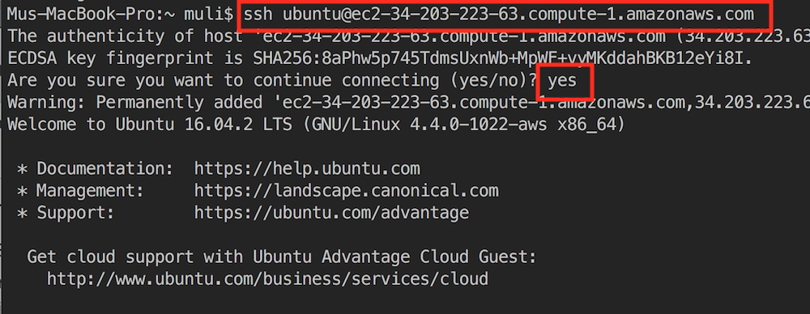
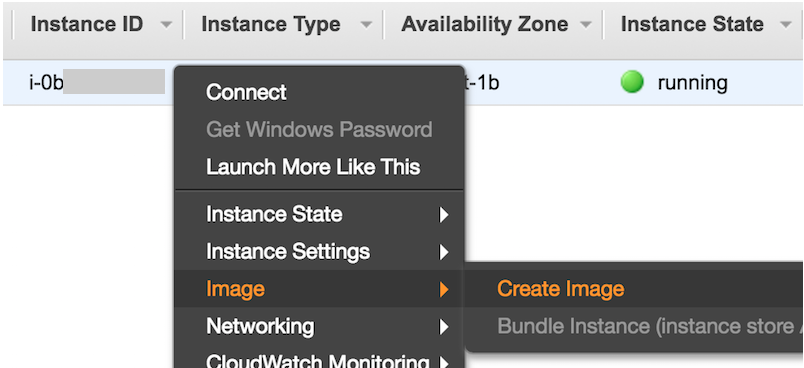

# 在AWS上运行教程

本节我们一步步讲解如何从0开始在AWS上申请CPU或者GPU机器并运行教程。

## 申请账号并登陆

首先我们需要在[https://aws.amazon.com/](https://aws.amazon.com/)上面创建账号，通常这个需要一张信用卡。不熟悉的同学可以自行搜索“如何注册aws账号”。【注意】AWS中国需要公司实体才能注册，个人用户请注册AWS全球账号。

登陆后点击EC2进入EC2面板：


## 选择并运行EC2实例

【可选】进入面板后可以在右上角选择离我们较近的数据中心来减低延迟。例如国内用户可以选亚太地区数据中心。

【注意】有些数据中心可能没有GPU实例。

然后点击启动实例来选择操作系统和实例类型。


在接下来的操作系统里面选Ubuntu 16.06:


EC2提供大量的有着不同配置的实例。这里我们选择了`p2.xlarge`，它有一个K80 GPU。我们也可以选择有更多GPU的实例例如`p2.16xlarge`，或者有新一点GPU的`g3`系列。我们也可以选择只有CPU的实例，例如`c4`系列。每个不同实例的机器配置和收费可以参考 [ec2instances.info](http://www.ec2instances.info/).


【注意】选择某个类型的样例前我们需要在`Limits`里检查下这个是不是有数量限制。例如这个账号的`p2.xlarge`限制是最多一个区域开一个。如果需要更多，需要点右边来申请更多的实例容量（通常需要一个工作日来处理）。


然后我们在存储那里将默认的硬盘从8GB增大的40GB. 因为安装CUDA需要4GB空间，所以最小推荐20GB（只有CPU的话不需要CUDA，可以更少）。


其他的项我们都选默认，然后可以启动了。这时候会跳出选项选择`key pair`，这是用来之后访问机器的秘钥（EC2默认不支持密码访问）。如果没有的话可以选择生成一对秘钥。


然后点击实例的ID可以查看当前实例的状态


状态变绿后右击点`Connect`就可以看到如何访问这个实例的说明了


例如我们这里



##安装依赖包 

成功登陆后我们先更新并安装编译需要的包。

```bash
sudo apt-get update && sudo apt-get install -y build-essential git libgfortran3
```

### 安装CUDA

【注意】只有CPU的实例可以跳过步骤。

我们去Nvidia官网下载CUDA并安装。选择正确的版本并获取下载地址。

【注意】目前CUDA默认下载9.0版，但`mxnet-cu90`的daily build还不完善。建议使用下面命令安装8.0版。


然后使用`wget`下载并且安装

```bash
wget https://developer.nvidia.com/compute/cuda/8.0/Prod2/local_installers/cuda_8.0.61_375.26_linux-run
sudo sh cuda_8.0.61_375.26_linux-run
```

这里需要回答几个问题。

```
accept/decline/quit: accept
Install NVIDIA Accelerated Graphics Driver for Linux-x86_64 375.26?
(y)es/(n)o/(q)uit: y
Do you want to install the OpenGL libraries?
(y)es/(n)o/(q)uit [ default is yes ]: y
Do you want to run nvidia-xconfig?
(y)es/(n)o/(q)uit [ default is no ]: n
Install the CUDA 8.0 Toolkit?
(y)es/(n)o/(q)uit: y
Enter Toolkit Location
 [ default is /usr/local/cuda-8.0 ]:
Do you want to install a symbolic link at /usr/local/cuda?
(y)es/(n)o/(q)uit: y
Install the CUDA 8.0 Samples?
(y)es/(n)o/(q)uit: n
```

安装完成后运行

```bash
nvidia-smi
```

就可以看到这个实例的GPU了。最后将CUDA加入到library path方便之后安装的库找到它。

```bash
echo "export LD_LIBRARY_PATH=\${LD_LIBRARY_PATH}:/usr/local/cuda-8.0/lib64" >>.bashrc
```

### 安装MXNet

先安装Miniconda

```bash
wget https://repo.continuum.io/miniconda/Miniconda3-latest-Linux-x86_64.sh
bash Miniconda3-latest-Linux-x86_64.sh
```

需要回答下面几个问题

```
Do you accept the license terms? [yes|no]
[no] >>> yes
Do you wish the installer to prepend the Miniconda3 install location
to PATH in your /home/ubuntu/.bashrc ? [yes|no]
[no] >>> yes
```

运行一次`bash`让CUDA和conda生效。

下载本教程，安装并激活conda环境

```bash
git clone https://github.com/mli/gluon-tutorials-zh
cd gluon-tutorials-zh
conda env create -f environment.yml
source activate gluon
```

默认环境里安装了只有CPU的版本。现在我们替换成GPU版本。

```bash
pip uninstall -y mxnet
pip install --pre mxnet-cu80

```

同时安装notedown插件来让jupter读写markdown文件。

```bash
pip install https://github.com/mli/notedown/tarball/master
jupyter notebook --generate-config
echo "c.NotebookApp.contents_manager_class = 'notedown.NotedownContentsManager'" >>~/.jupyter/jupyter_notebook_config.py

```

## 运行

并运行Jupyter notebook。

```bash
jupyter notebook
```

如果成功的话会看到类似的输出


因为我们的实例没有暴露8888端口，所以我们可以在本地启动ssh从实例映射到本地

```bash
ssh -i "XXX.pem" -L8888:locallhost:8888 ubuntu@XXXX.XXXX.compute.amazonaws.com
```

 然后把jupyter log里的URL复制到本地浏览器就行了。

【注意】如果本地运行了Jupyter notebook，那么8888端口就可能被占用了。要么关掉本地jupyter，要么把端口映射改成别的。例如，假设aws使用默认8888端口，我们可以在本地启动ssh从实例映射到本地8889端口：

```bash
ssh -i "XXX.pem" -N -f -L localhost:8889:localhost:8888 ubuntu@XXXX.XXXX.compute.amazonaws.com
```

然后在本地浏览器打开localhost:8889，这时会提示需要token值。接下来，我们将aws上jupyter log里的token值（例如上图里：...localhost:8888/?token=`token值`）复制粘贴即可。


## 后续

因为云服务按时间计费，通常我们不用时需要把样例关掉，到下次要用时再开。如果是停掉（Stop)，下次可以直接继续用，但硬盘空间会计费。如果是终结(Termination)，我们一般会先把操作系统做镜像，下次开始时直接使用镜像（AMI）（上面的教程使用了Ubuntu 16.06 AMI）就行了，不需要再把上面流程走一次。



每次重新开始后，我们建议升级下教程（记得保存自己的改动）

```bash
cd gluon-tutorials-zh
git pull
```

和MXNet版本

```bash
source activate gluon
pip install -U --pre mxnet-cu80
```

## 总结

云上可以很方便的获取计算资源和配置环境

## 练习

云很方便，但不便宜。研究下它的价格，和看看如何节省开销。
