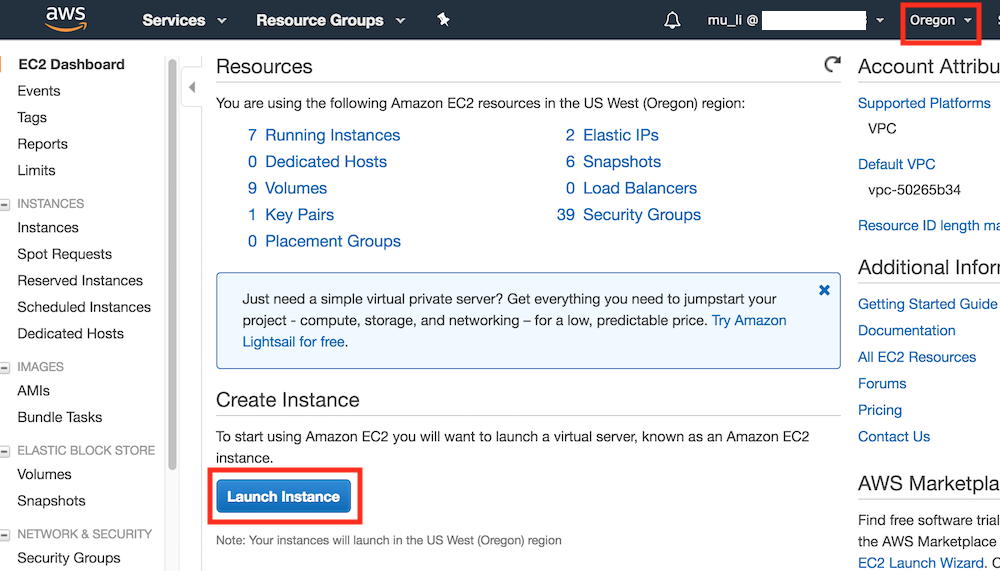
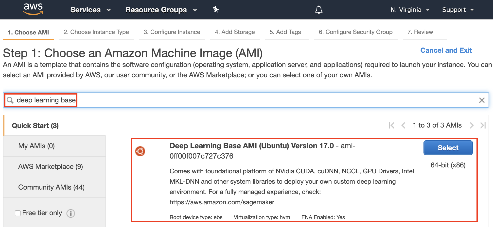
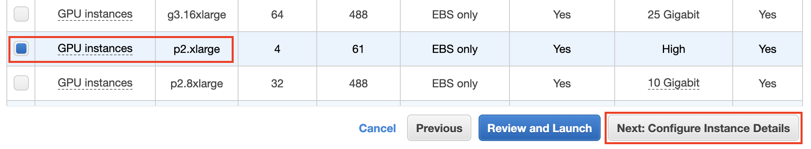
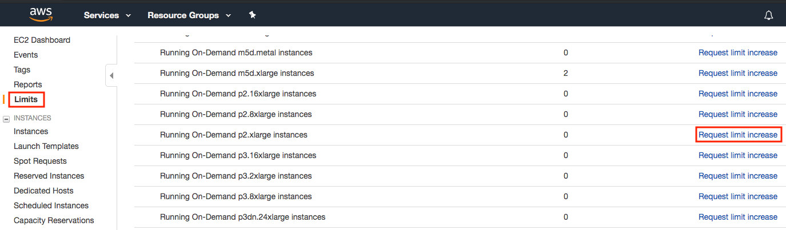
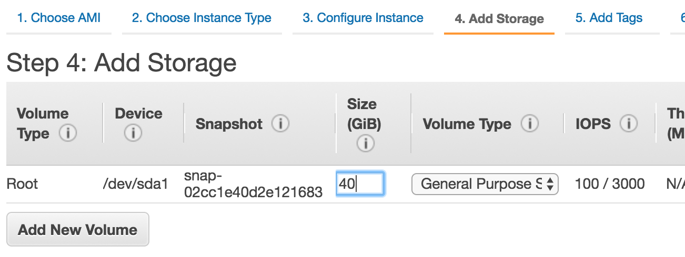
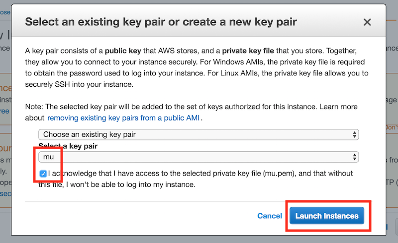
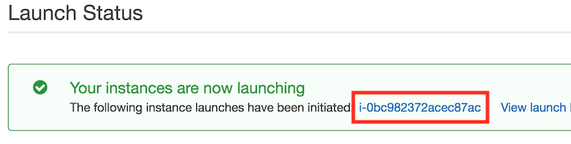
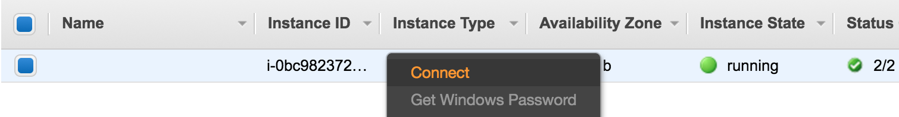
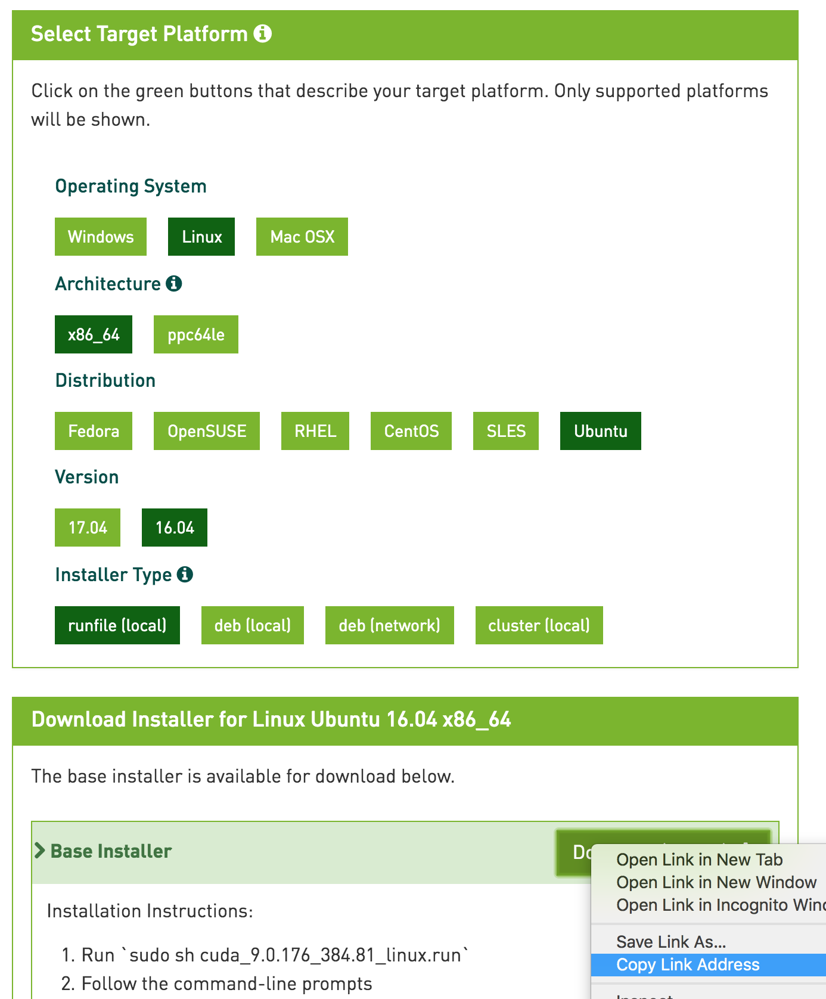
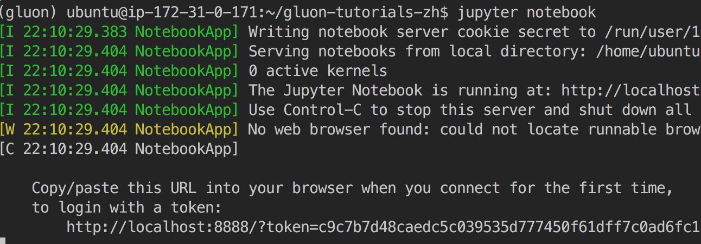

# 使用AWS运行代码

当本地机器的计算资源有限时，可以通过云计算服务获取更强大的计算资源来运行本书中的深度学习代码。本节将介绍如何在AWS（亚马逊的云计算服务）上申请实例并通过Jupyter记事本运行代码。本节中的例子有如下两个步骤。

1. 申请含一个K80 GPU的p2.xlarge实例。
2. 安装CUDA及相应GPU版本的MXNet。

申请其他类型的实例或安装其他版本的MXNet的方法与本节类似。


## 申请账号并登陆

首先，我们需要在[AWS官方网站](https://aws.amazon.com/)上创建账号。这通常需要一张信用卡。需要注意的是，AWS中国需要公司实体才能注册。如果你是个人用户，请注册AWS全球账号。

登录AWS账号后，点击图11.8红框中的“EC2”进入EC2面板。


## 创建并运行EC2实例

图11.9展示了EC2面板的界面。在图11.9右上角红框处选择离我们较近的数据中心来降低延迟。我们可以选亚太地区，如Asia Pacific（Seoul）。注意，有些数据中心可能没有GPU实例。点击图11.9下方红框内“Launch Instance”按钮启动实例。




图11.10的最上面一行显示了配置实例所需的7个步骤。在第一步“1. Choose AMI”中，选择Ubuntu 16.04作为操作系统。



EC2提供了大量不同配置的实例。如图11.11所示，在第二步“2. Choose Instance Type”中，选择有一个K80 GPU的p2.xlarge实例。我们也可以选择像p2.16xlarge这样有多个GPU的实例。如果想比较不同实例的机器配置和收费，可参考 https://www.ec2instances.info/ 。



建议在选择实例前先在图11.9左栏“Limits”标签里检查下有无数量限制。如图11.12所示，该账号的限制是最多在一个区域开一个p2.xlarge实例。如果需要开更多实例，可以通过点击右边“Request limit increase”链接来申请更大的实例容量。这通常需要一个工作日来处理。



我们将保持第三步“3. Configure Instance”、第五步“5. Add Tags”和第六步“6. Configure Security Group”中的默认配置不变。点击第四步“4. Add Storage”，如图11.13所示，将默认的硬盘大小增大到40 GB。注意，安装CUDA需要4 GB左右空间。




最后，在第七步“7. Review”中点击“Launch”来启动配置好的实例。这时候会提示我们选择用来访问实例的密钥。如果没有的话，可以选择图11.14中第一个下拉菜单的“Create a new key pair”选项来生成秘钥。之后，我们通过该下拉菜单的“Choose an existing key pair”选项选择生成好的密钥。点击“Launch Instances”按钮启动创建好的实例。



点击图11.15所示的实例ID就可以查看该实例的状态了。



如图11.16所示，当实例状态（Instance State）变绿后，右击实例并选择“Connect”，这时就可以看到访问该实例的方法了。例如，在命令行输入以下命令：

```
ssh -i "/path/to/key.pem" ubuntu@ec2-xx-xxx-xxx-xxx.y.compute.amazonaws.com
```

其中`/path/to/key.pem`是本地存放访问实例的密钥的路径。当命令行提示“Are you sure you want to continue connecting (yes/no)”时，键入“yes”并按回车键即可登录创建好的实例。




为了使用GPU版本的MXNet，我们还需要在创建好的实例上安装CUDA（参考“安装CUDA”小节）。实际上，我们也可以直接创建已安装CUDA的实例，例如，在第一步“1. Choose AMI”中，选择“Deep Learning Base AMI (Ubuntu) Version XX.X”，并保持后面步骤不变。登录实例后，运行`cat README`命令查看实例上已安装的CUDA各版本（假设含9.0）。如果希望将CUDA的默认版本设为9.0，依次运行命令`sudo rm /usr/local/cuda`和`sudo ln -s /usr/local/cuda-9.0 /usr/local/cuda`。之后，即可跳过以下小节的CUDA安装步骤。


## 安装CUDA

下面介绍CUDA的安装步骤。首先，更新并安装编译需要的包：

```
sudo apt-get update && sudo apt-get install -y build-essential git libgfortran3
```

NVIDIA一般每年会更新一次CUDA主版本。这里我们下载CUDA 9.0（也可使用MXNet支持的其他版本）。访问[NVIDIA官方网站](https://developer.nvidia.com/cuda-90-download-archive)获取正确版本的CUDA 9.0的下载地址，如图11.17所示。




获取下载地址后，下载并安装CUDA 9.0，例如：

```
# 以NVIDIA官方网站上的下载链接和安装文件名为准
wget https://developer.nvidia.com/compute/cuda/9.0/Prod/local_installers/cuda_9.0.176_384.81_linux-run
sudo sh cuda_9.0.176_384.81_linux-run
```

点击Ctrl+C跳出文档浏览，并回答以下几个问题。

```
Do you accept the previously read EULA?
accept/decline/quit: accept
Install NVIDIA Accelerated Graphics Driver for Linux-x86_64 384.81?
(y)es/(n)o/(q)uit: y
Do you want to install the OpenGL libraries?
(y)es/(n)o/(q)uit [ default is yes ]: y
Do you want to run nvidia-xconfig?
This will ... vendors.
(y)es/(n)o/(q)uit [ default is no ]: n
Install the CUDA 9.0 Toolkit?
(y)es/(n)o/(q)uit: y
Enter Toolkit Location
 [ default is /usr/local/cuda-9.0 ]:
Do you want to install a symbolic link at /usr/local/cuda?
(y)es/(n)o/(q)uit: y
Install the CUDA 9.0 Samples?
(y)es/(n)o/(q)uit: n
```

当安装完成后，运行下面的命令就可以看到该实例的GPU了。

```
nvidia-smi
```

最后，将CUDA加入到库的路径中，以方便其他库找到它。如果使用其他版本或其他路径，需要修改以下命令中的字符串“/usr/local/cuda-9.0”。

```
echo "export LD_LIBRARY_PATH=\${LD_LIBRARY_PATH}:/usr/local/cuda-9.0/lib64" >> ~/.bashrc
```


## 获取本书的代码并安装GPU版的MXNet

我们已在[“获取和运行本书的代码”](../chapter_prerequisite/install.md)一节中介绍了Linux用户获取本书的代码并安装运行环境的方法。首先，安装Linux版的[Miniconda](https://conda.io/en/latest/miniconda.html)，例如

```
# 以Miniconda官方网站上的下载链接和安装文件名为准
wget https://repo.anaconda.com/miniconda/Miniconda3-latest-Linux-x86_64.sh
sudo sh Miniconda3-latest-Linux-x86_64.sh
```

这时需要回答下面几个问题（如当conda版本为4.6.14时）:

```
Do you accept the license terms? [yes|no]
[no] >>> yes
Do you wish the installer to initialize Miniconda3
by running conda init? [yes|no]
[no] >>> yes
```

安装完成后，运行一次`source ~/.bashrc`让CUDA和conda生效。接下来，下载本书的代码，安装并激活conda环境。如未安装`unzip`，可运行命令`sudo apt install unzip`安装。

```
mkdir d2l-zh && cd d2l-zh
curl https://zh.d2l.ai/d2l-zh-1.0.zip -o d2l-zh.zip
unzip d2l-zh.zip && rm d2l-zh.zip
conda env create -f environment.yml
conda activate gluon
```

默认conda环境里安装了CPU版本的MXNet。现在我们将它替换成GPU版本的MXNet。因为CUDA的版本是9.0，所以安装`mxnet-cu90`。一般来说，如果CUDA版本是$X.Y$，那么相应安装`mxnet-cuXY`。

```
pip uninstall mxnet
pip install mxnet-cu90==X.Y.Z  # X.Y.Z应替换为本书的代码依赖的版本号
```

## 运行Jupyter记事本

现在就可以运行Jupyter记事本了：

```
jupyter notebook
```

图11.18显示了运行后可能的输出，其中最后一行为8888端口下的URL。



由于创建的实例并没有暴露8888端口，我们可以在本地命令行启动ssh从实例映射到本地8889端口。

```
# 该命令须在本地命令行运行
ssh -i "/path/to/key.pem" ubuntu@ec2-xx-xxx-xxx-xxx.y.compute.amazonaws.com -L 8889:localhost:8888
```

最后，把图11.18中运行Jupyter记事本后输出的最后一行URL复制到本地浏览器，并将8888改为8889，点击回车键即可从本地浏览器通过Jupyter记事本运行实例上的代码。

## 关闭不使用的实例

因为云服务按使用时长计费，我们通常会在不使用实例时将其关闭。

如果较短时间内还会重新开启实例，右击图11.16中的示例，选择“Instance State” $\rightarrow$ “Stop”将实例停止，等下次使用时选择“Instance State” $\rightarrow$ “Start”重新开启实例。这种情况下，开启的实例将保留其停止前硬盘上的存储（例如，无须再安装CUDA和其他运行环境）。然而，停止状态的实例也会因其所保留的硬盘空间而产生少量计费。

如果较长时间内不会重新开启实例，右击图11.16中的示例，选择“Image” $\rightarrow$ “Create”创建镜像。然后，选择“Instance State” $\rightarrow$ “Terminate”将实例终止（硬盘不再产生计费）。当下次使用时，可按本节中创建并运行EC2实例的步骤重新创建一个基于保存的镜像的实例。唯一的区别在于，在图11.10的第一步“1. Choose AMI”中，需要通过左栏“My AMIs”选择之前保存的镜像。这样创建的实例将保留镜像上硬盘的存储，例如，无须再安装CUDA和其他运行环境。

## 小结

* 可以通过云计算服务获取更强大的计算资源来运行本书中的深度学习代码。

## 练习

* 云很方便，但不便宜。研究一下它的价格，看看如何节省开销。


## 扫码直达[讨论区](https://discuss.gluon.ai/t/topic/6154)


