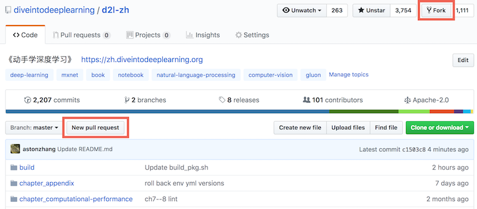
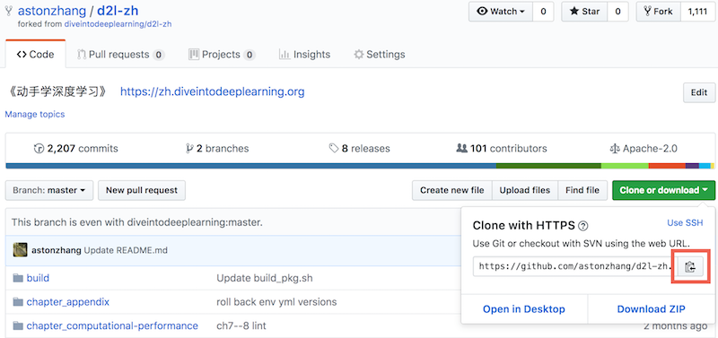
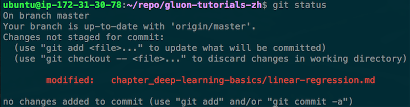
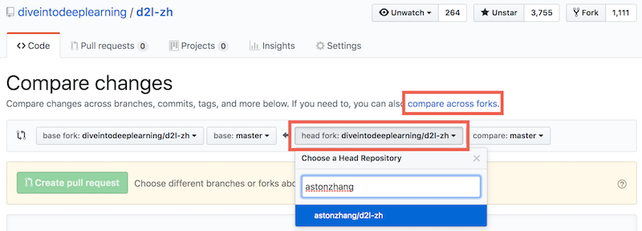
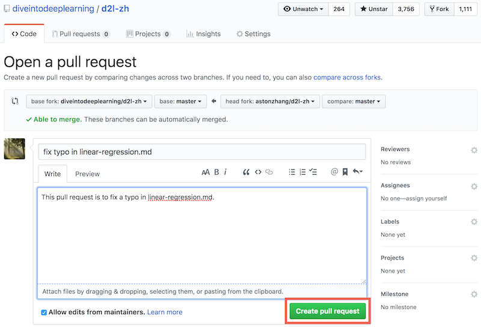
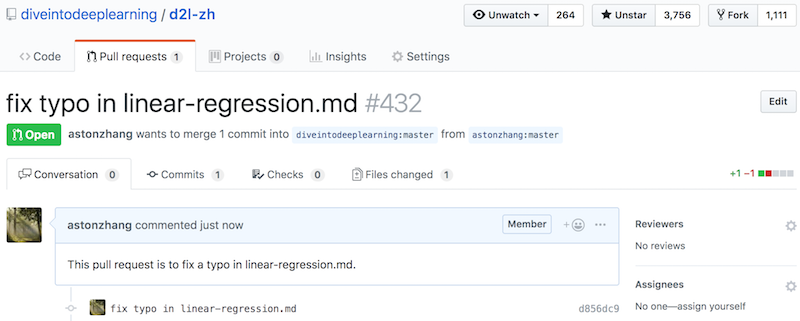

# 如何为本书贡献

我们在“致谢”部分感谢了本书的所有贡献者，并列出他们的GitHub ID或姓名。每位贡献者也将在本书出版时获得一本贡献者专享的赠书。

你可以在本书的GitHub代码库查看贡献者列表 [1]。如果你希望成为本书的贡献者之一，需要安装Git并为本书的GitHub代码库提交pull request [2]。当你的pull request被本书作者合并进了代码库后，你就成为了本书的贡献者。

本节介绍为本书贡献的基本Git操作步骤。

下列操作步骤假设贡献者的GitHub ID为“astonzhang”。

第一步，安装Git。Git的开源书里详细介绍了安装Git的方法 [3]。如果你没有GitHub账号，需要注册一个账号 [4]。

第二步，登录GitHub。在浏览器输入本书的代码库地址 [2]。点击图11.20右上方红框中的“Fork”按钮获得一份本书的代码库。




这时，本书的代码库会复制到你的用户名下，例如图11.21左上方显示的“你的GitHub用户名/d2l-zh”。



第三步，点击图11.21右方的“Clone or download”绿色按钮，并点击红框中的按钮复制位于你的用户名下的代码库地址。按[“获取和运行本书的代码”](../chapter_prerequisite/install.md)一节中介绍的方法进入命令行模式。假设我们希望将代码库保存在本地的`~/repo`路径之下。进入该路径，键入`git clone `并粘贴位于你的用户名下的代码库地址。执行以下命令：

```
# 将your_GitHub_ID替换成你的GitHub用户名
git clone https://github.com/your_GitHub_ID/d2l-zh.git
```

这时，本地的`~/repo/d2l-zh`路径下将包含本书的代码库中的所有文件。

第四步，编辑本地路径下的本书的代码库。假设我们修改了`~/repo/d2l-zh/chapter_deep-learning-basics/linear-regression.md`文件中的一个错别字。在命令行模式中进入路径`~/repo/d2l-zh`，执行命令

```
git status
```

此时Git将提示chapter_deep-learning-basics/linear-regression.md文件已被修改，如图11.22所示。



确认将提交该修改的文件后，执行以下命令：

```
git add chapter_deep-learning-basics/linear-regression.md
git commit -m 'fix typo in linear-regression.md'
git push
```

其中的`'fix typo in linear-regression.md'`是描述提交改动的信息，也可以替换为其他有意义的描述信息。


第五步，再次在浏览器输入本书的代码库地址 [2]。点击图11.20左方红框中的“New pull request”按钮。在弹出的页面中，点击图11.23右方红框中的“compare across forks”链接，再点击下方红框中的“head fork: d2l-ai/d2l-zh”按钮。在弹出的文本框中输入你的GitHub用户名，在下拉菜单中选择“你的GitHub用户名/d2l-zh”，如图11.23所示。





第六步，如图11.24所示，在标题和正文的文本框中描述想要提交的pull request。点击红框中的“Create pull request”绿色按钮提交pull request。




提交完成后，我们会看到图11.25所示的页面中显示pull request已提交。




## 小结

* 可以通过使用GitHub为本书做贡献。


## 练习

* 如果你觉得本书某些地方可以改进，尝试提交一个pull request。


## 参考文献

[1] 本书的贡献者列表。https://github.com/d2l-ai/d2l-zh/graphs/contributors

[2] 本书的代码库地址。https://github.com/d2l-ai/d2l-zh

[3] 安装Git。https://git-scm.com/book/zh/v2

[4] GitHub网址。https://github.com/

## 扫码直达[讨论区](https://discuss.gluon.ai/t/topic/7570)


