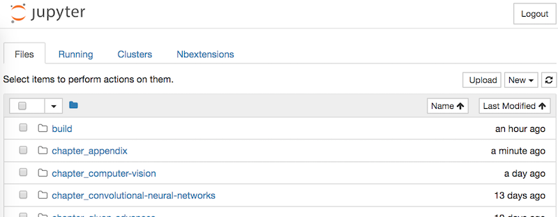
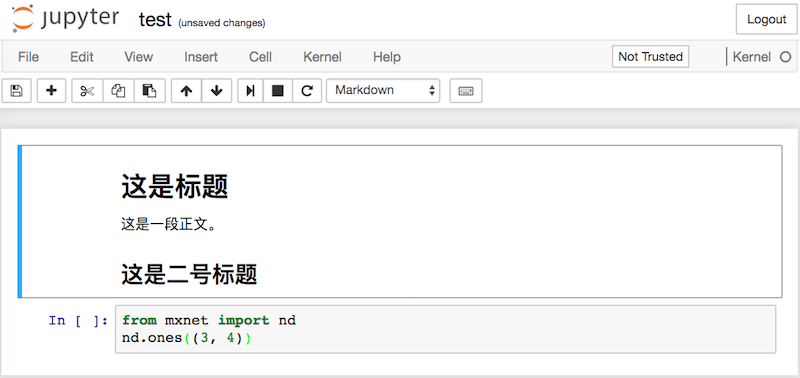
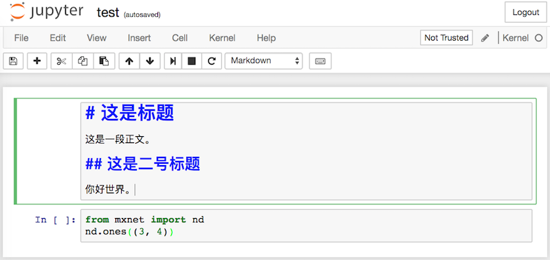
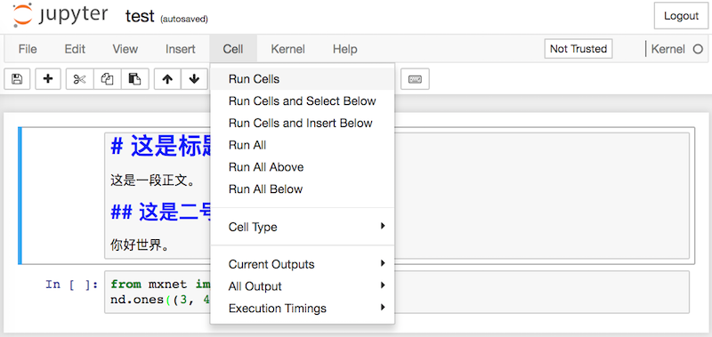
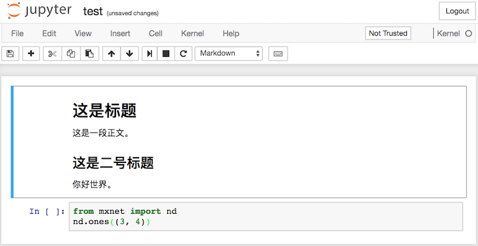
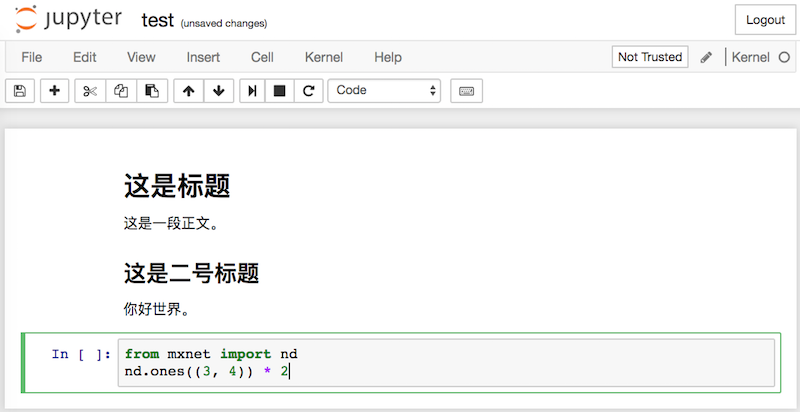
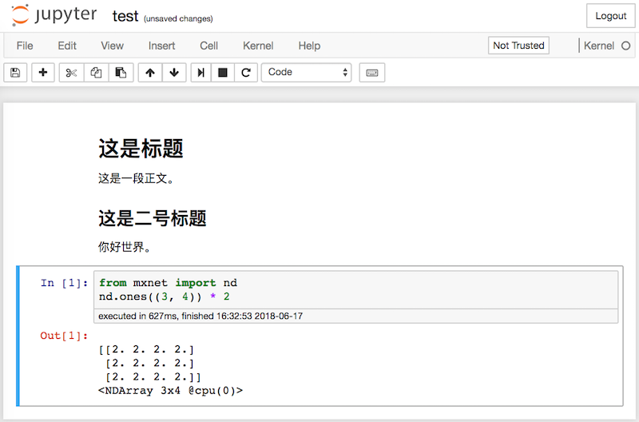

# 使用Jupyter记事本

本节介绍如何使用Jupyter记事本编辑和运行本书的代码。请确保你已按照[“获取和运行本书的代码”](../chapter_prerequisite/install.md)一节中的步骤安装好Jupyter记事本并获取了本书的代码。


## 在本地编辑和运行本书的代码

下面我们介绍如何在本地使用Jupyter记事本来编辑和运行本书的代码。假设本书的代码所在的本地路径为`xx/yy/d2l-zh/`。在命令行模式下进入该路径（`cd xx/yy/d2l-zh`），然后运行命令`jupyter notebook`。这时在浏览器打开 http://localhost:8888 （通常会自动打开）就可以看到Jupyter记事本的界面和本书的代码所在的各个文件夹，如图11.1所示。




我们可以通过点击网页上显示的文件夹访问其中的记事本文件。它们的后缀通常是“ipynb”。
简洁起见，我们创建一个临时的test.ipynb文件，点击后所显示的内容如图11.2所示。该记事本包括了格式化文本单元（markdown cell）和代码单元（code cell），其中格式化文本单元中的内容包括“这是标题”和“这是一段正文。”，代码单元中包括两行Python代码。




双击格式化文本单元，进入编辑模式。在该单元的末尾添加一段新文本“你好世界。”，如图11.3所示。




如图11.4所示，点击菜单栏的“Cell” $\rightarrow$ “Run Cells”，运行编辑好的单元。




运行完以后，图11.5展示了编辑后的格式化文本单元。




接下来，点击代码单元。在最后一行代码后添加乘以2的操作 `* 2`，如图11.6所示。




我们也可以用快捷键运行单元（默认Ctrl + Enter），并得到图11.7所示的输出结果。




当一个记事本包含的单元较多时，我们可以点击菜单栏的“Kernel” $\rightarrow$ “Restart & Run All”，以运行整个记事本中的所有单元。点击菜单栏的“Help” $\rightarrow$ “Edit Keyboard Shortcuts”后可以根据自己的偏好编辑快捷键。


## 高级选项

下面介绍有关使用Jupyter记事本的一些高级选项。你可以根据自己的兴趣参考其中的内容。

### 用Jupyter记事本读写GitHub源文件

如果想为本书内容做贡献，需要修改在GitHub上markdown格式的源文件（后缀为.md）。通过notedown插件，就可以使用Jupyter记事本修改并运行markdown格式的源代码。Linux/macOS用户可以执行以下命令获得GitHub源文件并激活运行环境：

```
git clone https://github.com/d2l-ai/d2l-zh.git
cd d2l-zh
conda env create -f environment.yml
# 若conda版本低于4.4，运行source activate gluon；Windows用户则运行activate gluon
conda activate gluon
```

下面安装notedown插件，运行Jupyter记事本并加载插件：

```
pip install https://github.com/mli/notedown/tarball/master
jupyter notebook --NotebookApp.contents_manager_class='notedown.NotedownContentsManager'
```

如果想每次运行Jupyter记事本时默认开启notedown插件，可以参考下面的步骤。

首先，执行下面的命令生成Jupyter记事本配置文件（如果已经生成，可以跳过）：

```
jupyter notebook --generate-config
```

然后，将下面这一行加入到Jupyter记事本配置文件（一般在用户主目录下的隐藏文件夹`.jupyter`中的`jupyter_notebook_config.py`）的末尾

```
c.NotebookApp.contents_manager_class = 'notedown.NotedownContentsManager'
```

之后，只需要运行`jupyter notebook`命令即可默认开启notedown插件。


### 在远端服务器上运行Jupyter记事本

有时候，我们希望在远端服务器上运行Jupyter记事本，并通过本地计算机上的浏览器访问。如果本地计算机上安装了Linux或者macOS（Windows通过putty等第三方软件也能支持），那么可以使用端口映射：

```
ssh myserver -L 8888:localhost:8888
```

以上`myserver`是远端服务器地址。然后我们可以使用 http://localhost:8888 打开运行Jupyter记事本的远端服务器`myserver`。我们将在下一节详细介绍如何在AWS实例上运行Jupyter记事本。

### 运行计时

我们可以通过ExecutionTime插件来对Jupyter记事本的每个代码单元的运行计时。下面是安装该插件的命令：

```
pip install jupyter_contrib_nbextensions
jupyter contrib nbextension install --user
jupyter nbextension enable execute_time/ExecuteTime
```

## 小结

* 可以使用Jupyter记事本编辑和运行本书的代码。

## 练习

* 尝试在本地编辑和运行本书的代码。


## 扫码直达[讨论区](https://discuss.gluon.ai/t/topic/6965)


