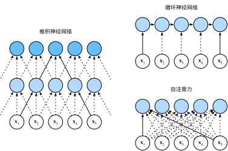

# Self-Attention and Positional Encoding
:label:`sec_self-attention-and-positional-encoding`

In deep learning,
we often use CNNs or RNNs to encode a sequence.
Now with attention mechanisms.
imagine that we feed a sequence of tokens
into attention pooling
so that
the same set of tokens
act as queries, keys, and values.
Specifically,
each query attends to all the key-value pairs
and generates one attention output.
Since the queries, keys, and values
come from the same place,
this performs
*self-attention* :cite:`Lin.Feng.Santos.ea.2017,Vaswani.Shazeer.Parmar.ea.2017`, which is also called *intra-attention* :cite:`Cheng.Dong.Lapata.2016,Parikh.Tackstrom.Das.ea.2016,Paulus.Xiong.Socher.2017`.
In this section,
we will discuss sequence encoding using self-attention,
including using additional information for the sequence order.

```{.python .input}
from d2l import mxnet as d2l
import math
from mxnet import autograd, np, npx
from mxnet.gluon import nn
npx.set_np()
```

```{.python .input}
#@tab pytorch
from d2l import torch as d2l
import math
import torch
from torch import nn
```

## Self-Attention

Given a sequence of input tokens
$\mathbf{x}_1, \ldots, \mathbf{x}_n$ where any $\mathbf{x}_i \in \mathbb{R}^d$ ($1 \leq i \leq n$),
its self-attention outputs
a sequence of the same length
$\mathbf{y}_1, \ldots, \mathbf{y}_n$,
where

$$\mathbf{y}_i = f(\mathbf{x}_i, (\mathbf{x}_1, \mathbf{x}_1), \ldots, (\mathbf{x}_n, \mathbf{x}_n)) \in \mathbb{R}^d$$

according to the definition of attention pooling $f$ in
:eqref:`eq_attn-pooling`.
Using multi-head attention,
the following code snippet
computes the self-attention of a tensor
with shape (batch size, number of time steps or sequence length in tokens, $d$).
The output tensor has the same shape.

```{.python .input}
num_hiddens, num_heads = 100, 5
attention = d2l.MultiHeadAttention(num_hiddens, num_heads, 0.5)
attention.initialize()
```

```{.python .input}
#@tab pytorch
num_hiddens, num_heads = 100, 5
attention = d2l.MultiHeadAttention(num_hiddens, num_hiddens, num_hiddens,
                                   num_hiddens, num_heads, 0.5)
attention.eval()
```

```{.python .input}
#@tab all
batch_size, num_queries, valid_lens = 2, 4, d2l.tensor([3, 2])
X = d2l.ones((batch_size, num_queries, num_hiddens))
attention(X, X, X, valid_lens).shape
```

## Comparing CNNs, RNNs, and Self-Attention
:label:`subsec_cnn-rnn-self-attention`

Let us
compare architectures for mapping
a sequence of $n$ tokens
to another sequence of equal length,
where each input or output token is represented by
a $d$-dimensional vector.
Specifically,
we will consider CNNs, RNNs, and self-attention.
We will compare their
computational complexity, 
sequential operations,
and maximum path lengths.
Note that sequential operations prevent parallel computation,
while a shorter path between
any combination of sequence positions
makes it easier to learn long-range dependencies within the sequence :cite:`Hochreiter.Bengio.Frasconi.ea.2001`.



:label:`fig_cnn-rnn-self-attention`

Consider a convolutional layer whose kernel size is $k$.
We will provide more details about sequence processing
using CNNs in later chapters.
For now,
we only need to know that
since the sequence length is $n$,
the numbers of input and output channels are both $d$,
the computational complexity of the convolutional layer is $\mathcal{O}(knd^2)$.
As :numref:`fig_cnn-rnn-self-attention` shows,
CNNs are hierarchical  so 
there are $\mathcal{O}(1)$ sequential operations
and the maximum path length is $\mathcal{O}(n/k)$.
For example, $\mathbf{x}_1$ and $\mathbf{x}_5$
are within the receptive field of a two-layer CNN
with kernel size 3 in :numref:`fig_cnn-rnn-self-attention`.

When updating the hidden state of RNNs,
multiplication of the $d \times d$ weight matrix
and the $d$-dimensional hidden state has 
a computational complexity of $\mathcal{O}(d^2)$.
Since the sequence length is $n$,
the computational complexity of the recurrent layer
is $\mathcal{O}(nd^2)$.
According to :numref:`fig_cnn-rnn-self-attention`,
there are $\mathcal{O}(n)$ sequential operations
that cannot be parallelized
and the maximum path length is also $\mathcal{O}(n)$.

In self-attention,
the queries, keys, and values 
are all $n \times d$ matrices.
Consider the scaled dot-product attention in
:eqref:`eq_softmax_QK_V`,
where a $n \times d$ matrix is multiplied by
a $d \times n$ matrix,
then the output $n \times n$ matrix is multiplied
by a $n \times d$ matrix.
As a result,
the self-attention
has a $\mathcal{O}(n^2d)$ computational complexity.
As we can see in :numref:`fig_cnn-rnn-self-attention`,
each token is directly connected
to any other token via self-attention.
Therefore,
computation can be parallel with $\mathcal{O}(1)$ sequential operations
and the maximum path length is also $\mathcal{O}(1)$.

All in all,
both CNNs and self-attention enjoy parallel computation
and self-attention has the shortest maximum path length.
However, the quadratic computational complexity with respect to the sequence length
makes self-attention prohibitively slow for very long sequences.


## Positional Encoding
:label:`subsec_positional-encoding`


Unlike RNNs that recurrently process
tokens of a sequence one by one,
self-attention ditches
sequential operations in favor of 
parallel computation.
To use the sequence order information,
we can inject
absolute or relative
positional information
by adding *positional encoding*
to the input representations.
Positional encodings can be 
either learned or fixed.
In the following, 
we describe a fixed positional encoding
based on sine and cosine functions :cite:`Vaswani.Shazeer.Parmar.ea.2017`.

Suppose that
the input representation $\mathbf{X} \in \mathbb{R}^{n \times d}$ contains the $d$-dimensional embeddings for $n$ tokens of a sequence.
The positional encoding outputs
$\mathbf{X} + \mathbf{P}$
using a positional embedding matrix $\mathbf{P} \in \mathbb{R}^{n \times d}$ of the same shape,
whose element on the $i^\mathrm{th}$ row 
and the $(2j)^\mathrm{th}$
or the $(2j + 1)^\mathrm{th}$ column is

$$\begin{aligned} p_{i, 2j} &= \sin\left(\frac{i}{10000^{2j/d}}\right),\\p_{i, 2j+1} &= \cos\left(\frac{i}{10000^{2j/d}}\right).\end{aligned}$$
:eqlabel:`eq_positional-encoding-def`

At first glance,
this trigonometric-function
design looks weird.
Before explanations of this design,
let us first implement it in the following `PositionalEncoding` class.

```{.python .input}
#@save
class PositionalEncoding(nn.Block):
    def __init__(self, num_hiddens, dropout, max_len=1000):
        super(PositionalEncoding, self).__init__()
        self.dropout = nn.Dropout(dropout)
        # Create a long enough `P`
        self.P = d2l.zeros((1, max_len, num_hiddens))
        X = d2l.arange(max_len).reshape(-1, 1) / np.power(
            10000, np.arange(0, num_hiddens, 2) / num_hiddens)
        self.P[:, :, 0::2] = np.sin(X)
        self.P[:, :, 1::2] = np.cos(X)

    def forward(self, X):
        X = X + self.P[:, :X.shape[1], :].as_in_ctx(X.ctx)
        return self.dropout(X)
```

```{.python .input}
#@tab pytorch
#@save
class PositionalEncoding(nn.Module):
    def __init__(self, num_hiddens, dropout, max_len=1000):
        super(PositionalEncoding, self).__init__()
        self.dropout = nn.Dropout(dropout)
        # Create a long enough `P`
        self.P = d2l.zeros((1, max_len, num_hiddens))
        X = d2l.arange(max_len, dtype=torch.float32).reshape(
            -1, 1) / torch.pow(10000, torch.arange(
            0, num_hiddens, 2, dtype=torch.float32) / num_hiddens)
        self.P[:, :, 0::2] = torch.sin(X)
        self.P[:, :, 1::2] = torch.cos(X)

    def forward(self, X):
        X = X + self.P[:, :X.shape[1], :].to(X.device)
        return self.dropout(X)
```

In the positional embedding matrix $\mathbf{P}$,
rows correspond to positions within a sequence
and columns represent different positional encoding dimensions.
In the example below,
we can see that
the $6^{\mathrm{th}}$ and the $7^{\mathrm{th}}$
columns of the positional embedding matrix 
have a higher frequency than 
the $8^{\mathrm{th}}$ and the $9^{\mathrm{th}}$
columns.
The offset between 
the $6^{\mathrm{th}}$ and the $7^{\mathrm{th}}$ (same for the $8^{\mathrm{th}}$ and the $9^{\mathrm{th}}$) columns
is due to the alternation of sine and cosine functions.

```{.python .input}
encoding_dim, num_steps = 32, 60
pos_encoding = PositionalEncoding(encoding_dim, 0)
pos_encoding.initialize()
X = pos_encoding(np.zeros((1, num_steps, encoding_dim)))
P = pos_encoding.P[:, :X.shape[1], :]
d2l.plot(d2l.arange(num_steps), P[0, :, 6:10].T, xlabel='Row (position)',
         figsize=(6, 2.5), legend=["Col %d" % d for d in d2l.arange(6, 10)])
```

```{.python .input}
#@tab pytorch
encoding_dim, num_steps = 32, 60
pos_encoding = PositionalEncoding(encoding_dim, 0)
pos_encoding.eval()
X = pos_encoding(d2l.zeros((1, num_steps, encoding_dim)))
P = pos_encoding.P[:, :X.shape[1], :]
d2l.plot(d2l.arange(num_steps), P[0, :, 6:10].T, xlabel='Row (position)',
         figsize=(6, 2.5), legend=["Col %d" % d for d in d2l.arange(6, 10)])
```

### Absolute Positional Information

To see how the monotonically decreased frequency
along the encoding dimension relates to absolute positional information,
let us print out the binary representations of $0, 1, \ldots, 7$.
As we can see,
the lowest bit, the second-lowest bit, and the third-lowest bit alternate on every number, every two numbers, and every four numbers, respectively.

```{.python .input}
#@tab all
for i in range(8):
    print(f'{i} in binary is {i:>03b}')
```

In binary representations,
a higher bit has a lower frequency than a lower bit.
Similarly,
as demonstrated in the heat map below,
the positional encoding decreases
frequencies along the encoding dimension
by using trigonometric functions.
Since the outputs are float numbers,
such continuous representations
are more space-efficient
than binary representations.

```{.python .input}
P = np.expand_dims(np.expand_dims(P[0, :, :], 0), 0)
d2l.show_heatmaps(P, xlabel='Column (encoding dimension)',
                  ylabel='Row (position)', figsize=(3.5, 4), cmap='Blues')
```

```{.python .input}
#@tab pytorch
P = P[0, :, :].unsqueeze(0).unsqueeze(0)
d2l.show_heatmaps(P, xlabel='Column (encoding dimension)',
                  ylabel='Row (position)', figsize=(3.5, 4), cmap='Blues')
```

### Relative Positional Information

Besides capturing absolute positional information,
the above positional encoding
also allows
a model to easily learn to attend by relative positions.
This is because
for any fixed position offset $\delta$,
the positional encoding at position $i + \delta$
can be represented by a linear projection
of that at position $i$.


This projection can be explained
mathematically.
Denoting
$\omega_j = 1/10000^{2j/d}$,
any pair of $(p_{i, 2j}, p_{i, 2j+1})$ 
in :eqref:`eq_positional-encoding-def`
can 
be linearly projected to $(p_{i+\delta, 2j}, p_{i+\delta, 2j+1})$
for any fixed offset $\delta$:

$$\begin{aligned}
&\begin{bmatrix} \cos(\delta \omega_j) & \sin(\delta \omega_j) \\  -\sin(\delta \omega_j) & \cos(\delta \omega_j) \\ \end{bmatrix}
\begin{bmatrix} p_{i, 2j} \\  p_{i, 2j+1} \\ \end{bmatrix}\\
=&\begin{bmatrix} \cos(\delta \omega_j) \sin(i \omega_j) + \sin(\delta \omega_j) \cos(i \omega_j) \\  -\sin(\delta \omega_j) \sin(i \omega_j) + \cos(\delta \omega_j) \cos(i \omega_j) \\ \end{bmatrix}\\
=&\begin{bmatrix} \sin\left((i+\delta) \omega_j\right) \\  \cos\left((i+\delta) \omega_j\right) \\ \end{bmatrix}\\
=& 
\begin{bmatrix} p_{i+\delta, 2j} \\  p_{i+\delta, 2j+1} \\ \end{bmatrix},
\end{aligned}$$

where the $2\times 2$ projection matrix does not depend on any position index $i$.

## Summary

* In self-attention, the queries, keys, and values all come from the same place.
* Both CNNs and self-attention enjoy parallel computation and self-attention has the shortest maximum path length. However, the quadratic computational complexity with respect to the sequence length makes self-attention prohibitively slow for very long sequences.
* To use the sequence order information, we can inject absolute or relative positional information by adding positional encoding to the input representations.

## Exercises

1. Suppose that we design a deep architecture to represent a sequence by stacking self-attention layers with positional encoding. What could be issues?
1. Can you design a learnable positional encoding method?

:begin_tab:`mxnet`
[Discussions](https://discuss.d2l.ai/t/1651)
:end_tab:

:begin_tab:`pytorch`
[Discussions](https://discuss.d2l.ai/t/1652)
:end_tab:
