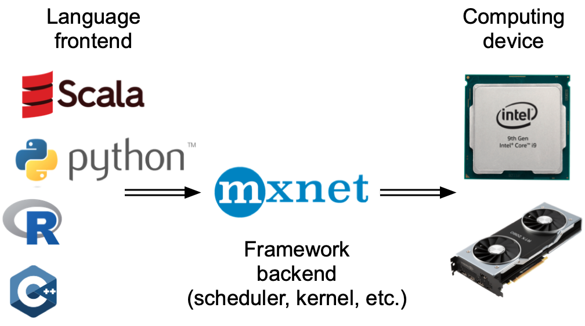
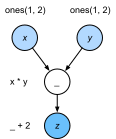
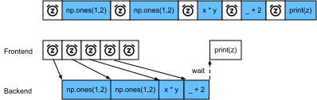

# Asynchronous Computation
:label:`sec_async`

Today's computers are highly parallel systems, consisting of multiple CPU cores (often multiple threads per core), multiple processing elements per GPU, and often multiple GPUs per device. In short, we can process many different things at the same time, often on different devices. Unfortunately Python is not a great way of writing parallel and asynchronous code, at least not without some extra help. After all, Python is single-threaded and this is unlikely to change in the future. Deep learning frameworks such as MXNet and TensorFlow adopt an *asynchronous programming* model to improve performance,
while PyTorch uses Python's own scheduler leading to a different performance trade-off.
For PyTorch, by default, GPU operations are asynchronous. When you call a function that uses the GPU, the operations are enqueued to the particular device, but not necessarily executed until later. This allows us to execute more computations in parallel, including operations on the CPU or other GPUs.

Hence, understanding how asynchronous programming works helps us to develop more efficient programs, by proactively reducing computational requirements and mutual dependencies. This allows us to reduce memory overhead and increase processor utilization.

```{.python .input}
from d2l import mxnet as d2l
import numpy, os, subprocess
from mxnet import autograd, gluon, np, npx
from mxnet.gluon import nn
npx.set_np()
```

```{.python .input}
#@tab pytorch
from d2l import torch as d2l
import numpy, os, subprocess
import torch
from torch import nn
```

## Asynchrony via Backend

:begin_tab:`mxnet`
For a warmup consider the following toy problem: we want to generate a random matrix and multiply it. Let us do that both in NumPy and in `mxnet.np` to see the difference.
:end_tab:

:begin_tab:`pytorch`
For a warmup consider the following toy problem: we want to generate a random matrix and multiply it. Let us do that both in NumPy and in PyTorch tensor to see the difference.
Note that PyTorch `tensor` is defined on a GPU.
:end_tab:

```{.python .input}
with d2l.Benchmark('numpy'):
    for _ in range(10):
        a = numpy.random.normal(size=(1000, 1000))
        b = numpy.dot(a, a)

with d2l.Benchmark('mxnet.np'):
    for _ in range(10):
        a = np.random.normal(size=(1000, 1000))
        b = np.dot(a, a)
```

```{.python .input}
#@tab pytorch
# Warmup for GPU computation
device = d2l.try_gpu()
a = torch.randn(size=(1000, 1000), device=device)
b = torch.mm(a, a)

with d2l.Benchmark('numpy'):
    for _ in range(10):
        a = numpy.random.normal(size=(1000, 1000))
        b = numpy.dot(a, a)

with d2l.Benchmark('torch'):
    for _ in range(10):
        a = torch.randn(size=(1000, 1000), device=device)
        b = torch.mm(a, a)
```

:begin_tab:`mxnet`
The benchmark output via MXNet is orders of magnitude faster. Since both are executed on the same processor something else must be going on.
Forcing MXNet to finish all the backend computation prior to returning shows what happened previously: computation is executed by the backend while the frontend returns control to Python.
:end_tab:

:begin_tab:`pytorch`
The benchmark output via PyTorch is orders of magnitude faster.
NumPy dot product is executed on the CPU processor while
PyTorch matrix multiplication is executed on GPU and hence the latter
is expected to be much faster. But the huge time difference suggests something
else must be going on.
By default, GPU operations are asynchronous in PyTorch.
Forcing PyTorch to finish all computation prior to returning shows
what happened previously: computation is being executed by the backend
while the frontend returns control to Python.
:end_tab:

```{.python .input}
with d2l.Benchmark():
    for _ in range(10):
        a = np.random.normal(size=(1000, 1000))
        b = np.dot(a, a)
    npx.waitall()
```

```{.python .input}
#@tab pytorch
with d2l.Benchmark():
    for _ in range(10):
        a = torch.randn(size=(1000, 1000), device=device)
        b = torch.mm(a, a)
    torch.cuda.synchronize(device)
```

:begin_tab:`mxnet`
Broadly speaking, MXNet has a frontend for direct interactions with users, e.g., via Python, as well as a backend used by the system to perform the computation. 
As shown in :numref:`fig_frontends`, users can write MXNet programs in various frontend languages, such as Python, R, Scala, and C++. Regardless of the frontend programming language used, the execution of MXNet programs occurs primarily in the backend of C++ implementations. Operations issued by the frontend language are passed on to the backend for execution. 
The backend manages its own threads that continuously collect and execute queued tasks. Note that for this to work the backend must be able to keep track of the dependencies between various steps in the computational graph. Hence, it is not possible to parallelize operations that depend on each other.
:end_tab:

:begin_tab:`pytorch`
Broadly speaking, PyTorch has a frontend for direct interaction with the users, e.g., via Python, as well as a backend used by the system to perform the computation. 
As shown in :numref:`fig_frontends`, users can write PyTorch programs in various frontend languages, such as Python and C++. Regardless of the frontend programming language used, the execution of PyTorch programs occurs primarily in the backend of C++ implementations. Operations issued by the frontend language are passed on to the backend for execution.
The backend manages its own threads that continuously collect and execute queued tasks.
Note that for this to work the backend must be able to keep track of the
dependencies between various steps in the computational graph.
Hence, it is not possible to parallelize operations that depend on each other.
:end_tab:


:width:`300px`
:label:`fig_frontends`

Let us look at another toy example to understand the dependency graph a bit better.

```{.python .input}
x = np.ones((1, 2))
y = np.ones((1, 2))
z = x * y + 2
z
```

```{.python .input}
#@tab pytorch
x = torch.ones((1, 2), device=device)
y = torch.ones((1, 2), device=device)
z = x * y + 2
z
```


:label:`fig_asyncgraph`

The code snippet above is also illustrated in :numref:`fig_asyncgraph`.
Whenever the Python frontend thread executes one of the first three statements, it simply returns the task to the backend queue. When the last statement's results need to be *printed*, the Python frontend thread will wait for the C++ backend thread to finish computing the result of the variable `z`. One benefit of this design is that the Python frontend thread does not need to perform actual computations. Thus, there is little impact on the program's overall performance, regardless of Python's performance. :numref:`fig_threading` illustrates how frontend and backend interact.


:label:`fig_threading`

:begin_tab:`mxnet`
## Barriers and Blockers

There are a number of operations that will force Python to wait for completion:
* Most obviously `npx.waitall()` waits until all computation has completed, regardless of when the compute instructions were issued. In practice it is a bad idea to use this operator unless absolutely necessary since it can lead to poor performance.
* If we just want to wait until a specific variable is available we can call `z.wait_to_read()`. In this case MXNet blocks return to Python until the variable `z` has been computed. Other computation may well continue afterwards.

Let us see how this works in practice.
:end_tab:

```{.python .input}
with d2l.Benchmark('waitall'):
    b = np.dot(a, a)
    npx.waitall()

with d2l.Benchmark('wait_to_read'):
    b = np.dot(a, a)
    b.wait_to_read()
```

:begin_tab:`mxnet`
Both operations take approximately the same time to complete. Besides the obvious blocking operations we recommend that you are aware of *implicit* blockers. Printing a variable clearly requires the variable to be available and is thus a blocker. Last, conversions to NumPy via `z.asnumpy()` and conversions to scalars via `z.item()` are blocking, since NumPy has no notion of asynchrony. It needs access to the values just like the `print` function. 

Copying small amounts of data frequently from MXNet's scope to NumPy and back can destroy performance of an otherwise efficient code, since each such operation requires the computational graph to evaluate all intermediate results needed to get the relevant term *before* anything else can be done.
:end_tab:

```{.python .input}
with d2l.Benchmark('numpy conversion'):
    b = np.dot(a, a)
    b.asnumpy()

with d2l.Benchmark('scalar conversion'):
    b = np.dot(a, a)
    b.sum().item()
```

:begin_tab:`mxnet`
## Improving Computation
On a heavily multithreaded system (even regular laptops have 4 threads or more and on multi-socket servers this number can exceed 256) the overhead of scheduling operations can become significant. This is why it is highly desirable to have computation and scheduling occur asynchronously and in parallel. To illustrate the benefit of doing so let us see what happens if we increment a variable by 1 multiple times, both in sequence or asynchronously. We simulate synchronous execution by inserting a `wait_to_read` barrier in between each addition.
:end_tab:

```{.python .input}
with d2l.Benchmark('synchronous'):
    for _ in range(10000):
        y = x + 1
        y.wait_to_read()

with d2l.Benchmark('asynchronous'):
    for _ in range(10000):
        y = x + 1
    npx.waitall()
```

:begin_tab:`mxnet`
A slightly simplified interaction between the Python frontend thread and the C++ backend thread can be summarized as follows:
1. The frontend orders the backend to insert the computation task `y = x + 1` into the queue.
1. The backend then receives the computation tasks from the queue and performs the actual computations.
1. The backend then returns the computation results to the frontend.
Assume that the durations of these three stages are $t_1, t_2$ and $t_3$, respectively. If we do not use asynchronous programming, the total time taken to perform 10000 computations is approximately $10000 (t_1+ t_2 + t_3)$. If asynchronous programming is used, the total time taken to perform 10000 computations can be reduced to $t_1 + 10000 t_2 + t_3$ (assuming $10000 t_2 > 9999t_1$), since the frontend does not have to wait for the backend to return computation results for each loop.


## Summary

* Deep learning frameworks may decouple the Python frontend from an execution backend. This allows for fast asynchronous insertion of commands into the backend and associated parallelism.
* Asynchrony leads to a rather responsive frontend. However, use caution not to overfill the task queue since it may lead to excessive memory consumption. It is recommended to synchronize for each minibatch to keep frontend and backend approximately synchronized.
* Chip vendors offer sophisticated performance analysis tools to obtain a much more fine-grained insight into the efficiency of deep learning.
:end_tab:

:begin_tab:`mxnet`
* Be aware of the fact that conversions from MXNet's memory management to Python will force the backend to wait until  the specific variable is ready. Functions such as `print`, `asnumpy` and `item` all have this effect. This can be desirable but a careless use of synchronization can ruin performance.
:end_tab:

## Exercises

:begin_tab:`mxnet`
1. We mentioned above that using asynchronous computation can reduce the total amount of time needed to perform 10000 computations to $t_1 + 10000 t_2 + t_3$. Why do we have to assume $10000 t_2 > 9999 t_1$ here?
1. Measure the difference between `waitall` and `wait_to_read`. Hint: perform a number of instructions and synchronize for an intermediate result.
:end_tab:

:begin_tab:`pytorch`
1. On the CPU, benchmark the same matrix multiplication operations in this section. Can you still observe asynchrony via the backend?
:end_tab:

:begin_tab:`mxnet`
[Discussions](https://discuss.d2l.ai/t/361)
:end_tab:

:begin_tab:`pytorch`
[Discussions](https://discuss.d2l.ai/t/2564)
:end_tab:
