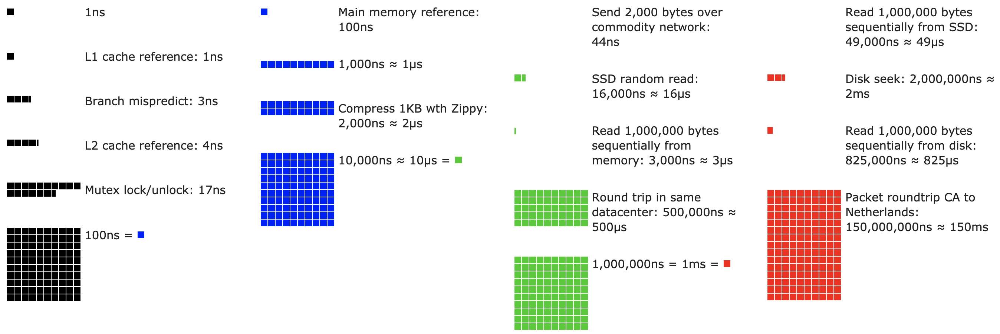
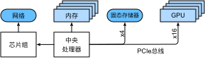
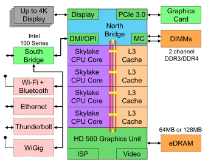
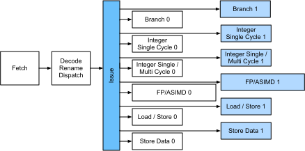
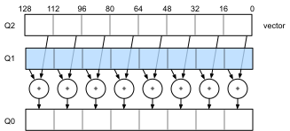
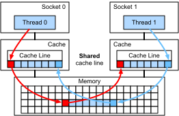
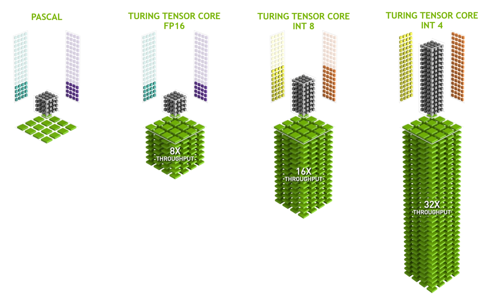

# Hardware
:label:`sec_hardware`

Building systems with great performance requires a good understanding of the algorithms and models to capture the statistical aspects of the problem. At the same time it is also indispensable to have at least a modicum of knowledge of the underlying hardware. The current section is no substitute for a proper course on hardware and system design. Instead, it might serve as a starting point for understanding why some algorithms are more efficient than others and how to achieve good throughput. A good design can easily make a difference of an order of magnitude and, in turn, this can make the difference between being able to train a network (e.g., in a week) and not at all (in 3 months, thus missing the deadline). 
We will start by looking at computers. Then we will zoom in to look more carefully at CPUs and GPUs. Lastly we zoom out to review how multiple computers are connected in a server center or in the cloud. 

:label:`fig_latencynumbers`

Impatient readers may be able to get by with :numref:`fig_latencynumbers`. It is taken from Colin Scott's [interactive post](https://people.eecs.berkeley.edu/~rcs/research/interactive_latency.html) that gives a good overview of the progress over the past decade. The original numbers are due to Jeff Dean's [Stanford talk from 2010](https://static.googleusercontent.com/media/research.google.com/en//people/jeff/Stanford-DL-Nov-2010.pdf).
The discussion below explains some of the rationale for these numbers and how they can guide us in designing algorithms. The discussion below is very high level and cursory. It is clearly *no substitute* for a proper course but rather just meant to provide enough information for a statistical modeler to make suitable design decisions. For an in-depth overview of computer architecture we refer the reader to :cite:`Hennessy.Patterson.2011` or a recent course on the subject, such as the one by [Arste Asanovic](http://inst.eecs.berkeley.edu/~cs152/sp19/).

## Computers

Most deep learning researchers and practitioners have access to a computer with a fair amount of memory, computation, some form of an accelerator such as a GPU, or multiples thereof. A computer consists of the following key components:

* A processor (also referred to as a CPU) that is able to execute the programs we give it (in addition to running an operating system and many other things), typically consisting of 8 or more cores.
* Memory (RAM) to store and retrieve the results from computation, such as weight vectors and activations, and training data.
* An Ethernet network connection (sometimes multiple) with speeds ranging from 1 GB/s to 100 GB/s. On high end servers more advanced interconnects can be found.
* A high speed expansion bus (PCIe) to connect the system to one or more GPUs. Servers have up to 8 accelerators, often connected in an advanced topology, while desktop systems have 1 or 2, depending on the budget of the user and the size of the power supply.
* Durable storage, such as a magnetic hard disk drive, a solid state drive, in many cases connected using the PCIe bus. It provides efficient transfer of training data to the system and storage of intermediate checkpoints as needed.

:label:`fig_mobo-symbol`

As :numref:`fig_mobo-symbol` indicates, most components (network, GPU, and storage) are connected to the CPU across the PCIe bus. It consists of multiple lanes that are directly attached to the CPU. For instance AMD's Threadripper 3 has 64 PCIe 4.0 lanes, each of which is capable 16 Gbit/s data transfer in both directions. The memory is directly attached to the CPU with a total bandwidth of up to 100 GB/s.

When we run code on a computer we need to shuffle data to the processors (CPUs or GPUs), perform computation, and then move the results off the processor back to RAM and durable storage. Hence, in order to get good performance we need to make sure that this works seamlessly without any one of the systems becoming a major bottleneck. For instance, if we cannot load images quickly enough the processor will not have any work to do. Likewise, if we cannot move matrices quickly enough to the CPU (or GPU), its processing elements will starve. Finally, if we want to synchronize multiple computers across the network, the latter should not slow down computation. One option is to interleave communication and computation. Let us have a look at the various components in more detail.

## Memory

At its most basic memory is used to store data that needs to be readily accessible. At present CPU RAM is typically of the [DDR4](https://en.wikipedia.org/wiki/DDR4_SDRAM) variety, offering 20--25 GB/s bandwidth per module. Each module has a 64-bit-wide bus. Typically pairs of memory modules are used to allow for multiple channels. CPUs have between 2 and 4 memory channels, i.e., they have between 4 0GB/s and 100 GB/s peak memory bandwidth. Often there are two banks per channel. For instance AMD's Zen 3 Threadripper has 8 slots.

While these numbers are impressive, indeed, they only tell part of the story. When we want to read a portion from memory we first need to tell the memory module where the information can be found. That is, we first need to send the *address* to RAM. Once this is accomplished we can choose to read just a single 64 bit record or a long sequence of records. The latter is called *burst read*. In a nutshell, sending an address to memory and setting up the transfer takes approximately 100 ns (details depend on the specific timing coefficients of the memory chips used), every subsequent transfer takes only 0.2 ns. In short, the first read is 500 times as expensive as subsequent ones! Note that we could perform up to 10,000,000 random reads per second. This suggests that we avoid random memory access as far as possible and use burst reads (and writes) instead.

Matters are a bit more complex when we take into account that we have multiple *banks*. Each bank can read memory largely independently. This means two things. 
On one hand, the effective number of random reads is up to 4 times higher, provided that they are spread evenly across memory. It also means that it is still a bad idea to perform random reads since burst reads are 4 times faster, too. On the other hand, due to memory alignment to 64 bit boundaries it is a good idea to align any data structures with the same boundaries. Compilers do this pretty much [automatically](https://en.wikipedia.org/wiki/Data_structure_alignment) when the appropriate flags are set. Curious readers are encouraged to review a lecture on DRAMs such as the one by [Zeshan Chishti](http://web.cecs.pdx.edu/~zeshan/ece585_lec5.pdf).

GPU memory is subject to even higher bandwidth requirements since they have many more processing elements than CPUs. By and large there are two options to address them. The first is to make the memory bus significantly wider. For instance, NVIDIA's RTX 2080 Ti has a 352-bit-wide bus. This allows for much more information to be transferred at the same time. Second, GPUs use specific high-performance memory. Consumer-grade devices, such as NVIDIA's RTX and Titan series typically use [GDDR6](https://en.wikipedia.org/wiki/GDDR6_SDRAM) chips with over 500 GB/s aggregate bandwidth. An alternative is to use HBM (high bandwidth memory) modules. They use a very different interface and connect directly with GPUs on a dedicated silicon wafer. This makes them very expensive and their use is typically limited to high-end server chips, such as the NVIDIA Volta V100 series of accelerators. Quite unsurprisingly, GPU memory is generally *much* smaller than CPU memory due to the higher cost of the former. For our purposes, by and large their performance characteristics are similar, just a lot faster. We can safely ignore the details for the purpose of this book. They only matter when tuning GPU kernels for high throughput.

## Storage

We saw that some of the key characteristics of RAM are *bandwidth* and *latency*. The same is true for storage devices, just that the differences can be even more extreme.

### Hard Disk Drives

*Hard disk drives* (HDDs) have been in use for over half a century. In a nutshell they contain a number of spinning platters with heads that can be positioned to read or write at any given track. High-end disks hold up to 16 TB on 9 platters. One of the key benefits of HDDs is that they are relatively inexpensive. One of their many downsides are their typically catastrophic failure modes and their relatively high read latency.

To understand the latter, consider the fact that HDDs spin at around 7,200 RPM (revolutions per minute). If they were much faster they would shatter due to the centrifugal force exerted on the platters. This has a major downside when it comes to accessing a specific sector on the disk: we need to wait until the platter has rotated in position (we can move the heads but not accelerate the actual disks). Hence it can take over 8 ms until the requested data are available. A common way this is expressed is to say that HDDs can operate at approximately 100 IOPs (input/output operations per second). This number has essentially remained unchanged for the past two decades. Worse still, it is equally difficult to increase bandwidth (it is in the order of 100--200 MB/s). After all, each head reads a track of bits, hence the bit rate only scales with the square root of the information density. As a result, HDDs are quickly becoming relegated to archival storage and low-grade storage for very large datasets.

### Solid State Drives

Solid state drives (SSDs) use flash memory to store information persistently. This allows for *much faster* access to stored records. Modern SSDs can operate at 100,000 to 500,000 IOPs, i.e., up to 3 orders of magnitude faster than HDDs. Furthermore, their bandwidth can reach 1--3GB/s, i.e., one order of magnitude faster than HDDs. These improvements sound almost too good to be true. Indeed, they come with the following caveats, due to the way SSDs are designed.

* SSDs store information in blocks (256 KB or larger). They can only be written as a whole, which takes significant time. Consequently bit-wise random writes on SSD have very poor performance. Likewise, writing data in general takes significant time since the block has to be read, erased and then rewritten with new information. By now SSD controllers and firmware have developed algorithms to mitigate this. Nonetheless, writes can be much slower, in particular for QLC (quad level cell) SSDs. The key for improved performance is to maintain a *queue* of operations, to prefer reads and to write in large blocks if possible.
* The memory cells in SSDs wear out relatively quickly (often already after a few thousand writes). Wear-level protection algorithms are able to spread the degradation over many cells. That said, it is not recommended to use SSDs for swapping files or for large aggregations of log-files.
* Lastly, the massive increase in bandwidth has forced computer designers to attach SSDs directly to the PCIe bus. The drives capable of handling this, referred to as NVMe (Non Volatile Memory enhanced), can use up to 4 PCIe lanes. This amounts to up to 8GB/s on PCIe 4.0.

### Cloud Storage

Cloud storage provides a configurable range of performance. That is, the assignment of storage to virtual machines is dynamic, both in terms of quantity and in terms of speed, as chosen by users. We recommend that users increase the provisioned number of IOPs whenever latency is too high, e.g., during training with many small records.

## CPUs

Central processing units (CPUs) are the centerpiece of any computer. They consist of a number of key components: *processor cores* that are able to execute machine code, a *bus* connecting them (the specific topology differs significantly between processor models, generations, and vendors), and *caches* to allow for higher bandwidth and lower latency memory access than what is possible by reads from main memory. Lastly, almost all modern CPUs contain *vector processing units* to aid with high performance linear algebra and convolutions, as they are common in media processing and machine learning.

:label:`fig_skylake`

:numref:`fig_skylake` depicts an Intel Skylake consumer-grade quad-core CPU. It has an integrated GPU, caches, and a ringbus connecting the four cores. Peripherals, such as Ethernet, WiFi, Bluetooth, SSD controller, and USB, are either part of the chipset or directly attached (PCIe) to the CPU.

### Microarchitecture

Each of the processor cores consists of a rather sophisticated set of components. While details differ between generations and vendors, the basic functionality is pretty much standard. The front-end loads instructions and tries to predict which path will be taken (e.g., for control flow). Instructions are then decoded from assembly code to microinstructions. Assembly code is often not the lowest level code that a processor executes. Instead, complex instructions may be decoded into a set of more lower level operations. These are then processed by the actual execution core. Often the latter is capable of performing many operations simultaneously. For instance, the ARM Cortex A77 core of :numref:`fig_cortexa77` is able to perform up to 8 operations simultaneously.

:label:`fig_cortexa77`

This means that efficient programs might be able to perform more than one instruction per clock cycle, provided that they can be carried out independently. Not all units are created equal. Some specialize in integer instructions whereas others are optimized for floating point performance. To increase throughput, the processor might also follow  multiple code paths simultaneously in a branching instruction and then discard the results of the branches not taken. This is why branch prediction units matter (on the front-end) such that only the most promising paths are pursued.

### Vectorization

Deep learning is extremely compute-hungry. Hence, to make CPUs suitable for machine learning, one needs to perform many operations in one clock cycle. This is achieved via vector units. They have different names: on ARM they are called NEON, on x86 they (a recent generation) are referred to as [AVX2](https://en.wikipedia.org/wiki/Advanced_Vector_Extensions) units. A common aspect is that they are able to perform SIMD (single instruction multiple data) operations. :numref:`fig_neon128` shows how 8 short integers can be added in one clock cycle on ARM.

:label:`fig_neon128`

Depending on architecture choices, such registers are up to 512 bits long, allowing for the combination of up to 64 pairs of numbers. For instance, we might be multiplying two numbers and adding them to a third, which is also known as a fused multiply-add. Intel's [OpenVino](https://01.org/openvinotoolkit) uses these to achieve respectable throughput for deep learning on server-grade CPUs. Note, though, that this number is entirely dwarfed by what GPUs are capable of achieving. For instance, NVIDIA's RTX 2080 Ti has 4,352 CUDA cores, each of which is capable of processing such an operation at any time.

### Cache

Consider the following situation: we have a modest CPU core with 4 cores as depicted in :numref:`fig_skylake` above, running at 2 GHz frequency.
Moreover, let us assume that we have an IPC (instructions per clock) count of 1 and that the units have AVX2 with 256-bit width enabled. Let us furthermore assume that at least one of the registers used for AVX2 operations needs to be retrieved from memory. This means that the CPU consumes $4 \times 256 \text{ bit} = 128 \text{ bytes}$ of data per clock cycle. Unless we are able to transfer $2 \times 10^9 \times 128 = 256 \times 10^9$ bytes to the processor per second the processing elements are going to starve. Unfortunately the memory interface of such a chip only supports 20--40 GB/s data transfer, i.e., one order of magnitude less. The fix is to avoid loading *new* data from memory as far as possible and rather to cache it locally on the CPU. This is where caches come in handy. Commonly the following names or concepts are used:

* **Registers** are strictly speaking not part of the cache. They help stage instructions. That said, CPU registers are memory locations that a CPU can access at clock speed without any delay penalty. CPUs have tens of registers. It is up to the compiler (or programmer) to use registers efficiently. For instance the C programming language has a `register` keyword.
* **L1 caches** are the first line of defense against high memory bandwidth requirements. L1 caches are tiny (typical sizes might be 32--64 KB) and often split into data and instructions caches. When data are found in the L1 cache, access is very fast. If they cannot be found there, the search progresses down the cache hierarchy.
* **L2 caches** are the next stop. Depending on architecture design and processor size they might be exclusive. They might be accessible only by a given core or shared among multiple cores. L2 caches are larger (typically 256--512 KB per core) and slower than L1. Furthermore, to access something in L2 we first need to check to realize that the data are not in L1, which adds a small amount of extra latency.
* **L3 caches** are shared among multiple cores and can be quite large. AMD's Epyc 3 server CPUs have a whopping 256 MB of cache spread across multiple chiplets. More typical numbers are in the 4--8 MB range.

Predicting which memory elements will be needed next is one of the key optimization parameters in chip design. For instance, it is advisable to traverse memory in a *forward* direction since most caching algorithms will try to *read ahead* rather than backwards. Likewise, keeping memory access patterns local is a good way of improving performance.

Adding caches is a double-edge sword. On one hand they ensure that the processor cores do not starve of data. At the same time they increase chip size, using up area that otherwise could have been spent on increasing processing power. Moreover, *cache misses* can be expensive. Consider the worst case scenario, *false sharing*, as depicted in :numref:`fig_falsesharing`. A memory location is cached on processor 0 when a thread on processor 1 requests the data. To obtain it, processor 0 needs to stop what it is doing, write the information back to main memory and then let processor 1 read it from memory. During this operation both processors wait. Quite potentially such code runs *more slowly* on multiple processors when compared with an efficient single-processor implementation. This is one more reason for why there is a practical limit to cache sizes (besides their physical size).

:label:`fig_falsesharing`

## GPUs and other Accelerators

It is not an exaggeration to claim that deep learning would not have been successful without GPUs. By the same token, it is quite reasonable to argue that GPU manufacturers' fortunes have increased significantly due to deep learning. This co-evolution of hardware and algorithms has led to a situation where for better or worse deep learning is the preferable statistical modeling paradigm. Hence it pays to understand the specific benefits that GPUs and related accelerators such as the TPU :cite:`Jouppi.Young.Patil.ea.2017`.

Of note is a distinction that is often made in practice: accelerators are optimized either for training or inference. For the latter we only need to compute the forward propagation in a network. No storage of intermediate data is needed for backpropagation. Moreover, we may not need very precise computation (FP16 or INT8 typically suffice). On the other hand, during training all intermediate results need storage to compute gradients. Moreover, accumulating gradients requires higher precision to avoid numerical underflow (or overflow). This means that FP16 (or mixed precision with FP32) is the minimum requirement. All of this necessitates faster and larger memory (HBM2 vs. GDDR6) and more processing power. For instance, NVIDIA's [Turing](https://devblogs.nvidia.com/nvidia-turing-architecture-in-depth/) T4 GPUs are optimized for inference whereas the V100 GPUs are preferable for training.

Recall vectorization as illustrated in :numref:`fig_neon128`. Adding vector units to a processor core allowed us to increase throughput significantly. For example, in the example in :numref:`fig_neon128` we were able to perform 16 operations simultaneously.
First,
what if we added operations that optimized not just operations between vectors but also between matrices? This strategy led to tensor cores (to be covered shortly). 
Second, what if we added many more cores? In a nutshell, these two strategies summarize the design decisions in GPUs. :numref:`fig_turing_processing_block` gives an overview of a basic processing block. It contains 16 integer and 16 floating point units. In addition to that, two tensor cores accelerate a narrow subset of additional operations relevant for deep learning. Each streaming multiprocessor consists of four such blocks.

:width:`150px`
:label:`fig_turing_processing_block`

Next, 12 streaming multiprocessors are grouped into graphics processing clusters which make up the high-end TU102 processors. Ample memory channels and an L2 cache complement the setup. :numref:`fig_turing` has the relevant details. One of the reasons for designing such a device is that individual blocks can be added or removed as needed to allow for more compact chips and to deal with yield issues (faulty modules might not be activated). Fortunately programming such devices is well hidden from the casual deep learning researcher beneath layers of CUDA and framework code. In particular, more than one of the programs might well be executed simultaneously on the GPU, provided that there are available resources. Nonetheless it pays to be aware of the limitations of the devices to avoid picking models that do not fit into device memory.

:width:`350px`
:label:`fig_turing`

A last aspect that is worth mentioning in more detail are *tensor cores*. They are an example of a recent trend of adding more optimized circuits that are specifically effective for deep learning. For instance, the TPU added a systolic array :cite:`Kung.1988` for fast matrix multiplication. There the design was to support a very small number (one for the first generation of TPUs) of large operations. Tensor cores are at the other end. They are optimized for small operations involving between $4 \times 4$ and $16 \times 16$ matrices, depending on their numerical precision. :numref:`fig_tensorcore` gives an overview of the optimizations.

:width:`400px`
:label:`fig_tensorcore`

Obviously when optimizing for computation we end up making certain compromises. One of them is that GPUs are not very good at handling interrupts and sparse data. While there are notable exceptions, such as [Gunrock](https://github.com/gunrock/gunrock) :cite:`Wang.Davidson.Pan.ea.2016`, the access pattern of sparse matrices and vectors do not go well with the high bandwidth burst read operations where GPUs excel. Matching both goals is an area of active research. See e.g., [DGL](http://dgl.ai), a library tuned for deep learning on graphs.

## Networks and Buses

Whenever a single device is insufficient for optimization we need to transfer data to and from it to synchronize processing. This is where networks and buses come in handy. We have a number of design parameters: bandwidth, cost, distance, and flexibility.
On one end we have WiFi that has a pretty good range, is very easy to use (no wires, after all), cheap but it offers comparatively mediocre bandwidth and latency. No machine learning researcher within their right mind would use it to build a cluster of servers. In what follows we focus on interconnects that are suitable for deep learning.

* **PCIe** is a dedicated bus for very high bandwidth point-to-point connections (up to 32 GB/s on PCIe 4.0 in a 16-lane slot) per lane. Latency is in the order of single-digit microseconds (5 μs). PCIe links are precious. Processors only have a limited number of them: AMD's EPYC 3 has 128 lanes, Intel's Xeon has up to 48 lanes per chip; on desktop-grade CPUs the numbers are 20 (Ryzen 9) and 16 (Core i9) respectively. Since GPUs have typically 16 lanes, this limits the number of GPUs that can connect to the CPU at full bandwidth. After all, they need to share the links with other high bandwidth peripherals such as storage and Ethernet. Just like with RAM access, large bulk transfers are preferable due to reduced packet overhead.
* **Ethernet** is the most commonly used way of connecting computers. While it is significantly slower than PCIe, it is very cheap and resilient to install and covers much longer distances. Typical bandwidth for low-grade servers is 1 GBit/s. Higher-end devices (e.g., [C5 instances](https://aws.amazon.com/ec2/instance-types/c5/) in the cloud) offer between 10 and 100 GBit/s bandwidth. As in all previous cases data transmission has significant overheads. Note that we almost never use raw Ethernet directly but rather a protocol that is executed on top of the physical interconnect (such as UDP or TCP/IP). This adds further overhead. Like PCIe, Ethernet is designed to connect two devices, e.g., a computer and a switch.
* **Switches** allow us to connect multiple devices in a manner where any pair of them can carry out a (typically full bandwidth) point-to-point connection simultaneously. For instance, Ethernet switches might connect 40 servers at high cross-sectional bandwidth. Note that switches are not unique to traditional computer networks. Even PCIe lanes can be [switched](https://www.broadcom.com/products/pcie-switches-bridges/pcie-switches). This occurs, e.g., to connect a large number of GPUs to a host processor, as is the case for the [P2 instances](https://aws.amazon.com/ec2/instance-types/p2/).
* **NVLink** is an alternative to PCIe when it comes to very high bandwidth interconnects. It offers up to 300 Gbit/s data transfer rate per link. Server GPUs (Volta V100) have six links whereas consumer-grade GPUs (RTX 2080 Ti) have only one link, operating at a reduced 100 Gbit/s rate. We recommend to use [NCCL](https://github.com/NVIDIA/nccl) to achieve high data transfer between GPUs.

## More Latency Numbers

The summary in :numref:`table_latency_numbers` and :numref:`table_latency_numbers_tesla` are from [Eliot Eshelman](https://gist.github.com/eshelman) who maintains an updated version of the numbers as a [GitHub gist](https://gist.github.com/eshelman/343a1c46cb3fba142c1afdcdeec17646).

:Common Latency Numbers.

| Action | Time | Notes |
| :----------------------------------------- | -----: | :---------------------------------------------- |
| L1 cache reference/hit                     | 1.5 ns | 4 cycles                                        |
| Floating-point add/mult/FMA                | 1.5 ns | 4 cycles                                        |
| L2 cache reference/hit                     |   5 ns | 12 ~ 17 cycles                                  |
| Branch mispredict                          |   6 ns | 15 ~ 20 cycles                                  |
| L3 cache hit (unshared cache)              |  16 ns | 42 cycles                                       |
| L3 cache hit (shared in another core)      |  25 ns | 65 cycles                                       |
| Mutex lock/unlock                          |  25 ns |                                                 |
| L3 cache hit (modified in another core)    |  29 ns | 75 cycles                                       |
| L3 cache hit (on a remote CPU socket)      |  40 ns | 100 ~ 300 cycles (40 ~ 116 ns)                  |
| QPI hop to a another CPU (per hop)         |  40 ns |                                                 |
| 64MB memory ref. (local CPU)          |  46 ns | TinyMemBench on Broadwell E5-2690v4             |
| 64MB memory ref. (remote CPU)         |  70 ns | TinyMemBench on Broadwell E5-2690v4             |
| 256MB memory ref. (local CPU)         |  75 ns | TinyMemBench on Broadwell E5-2690v4             |
| Intel Optane random write                  |  94 ns | UCSD Non-Volatile Systems Lab                   |
| 256MB memory ref. (remote CPU)        | 120 ns | TinyMemBench on Broadwell E5-2690v4             |
| Intel Optane random read                   | 305 ns | UCSD Non-Volatile Systems Lab                   |
| Send 4KB over 100 Gbps HPC fabric          |   1 μs | MVAPICH2 over Intel Omni-Path                   |
| Compress 1KB with Google Snappy            |   3 μs |                                                 |
| Send 4KB over 10 Gbps ethernet             |  10 μs |                                                 |
| Write 4KB randomly to NVMe SSD             |  30 μs | DC P3608 NVMe SSD (QOS 99% is 500μs)            |
| Transfer 1MB to/from NVLink GPU            |  30 μs | ~33GB/s on NVIDIA 40GB NVLink                 |
| Transfer 1MB to/from PCI-E GPU             |  80 μs | ~12GB/s on PCIe 3.0 x16 link                  |
| Read 4KB randomly from NVMe SSD            | 120 μs | DC P3608 NVMe SSD (QOS 99%)                     |
| Read 1MB sequentially from NVMe SSD        | 208 μs | ~4.8GB/s DC P3608 NVMe SSD                    |
| Write 4KB randomly to SATA SSD             | 500 μs | DC S3510 SATA SSD (QOS 99.9%)                   |
| Read 4KB randomly from SATA SSD            | 500 μs | DC S3510 SATA SSD (QOS 99.9%)                   |
| Round trip within same datacenter          | 500 μs | One-way ping is ~250μs                          |
| Read 1MB sequentially from SATA SSD        |   2 ms | ~550MB/s DC S3510 SATA SSD                    |
| Read 1MB sequentially from disk            |   5 ms | ~200MB/s server HDD                           |
| Random Disk Access (seek+rotation)         |  10 ms |                                                 |
| Send packet CA->Netherlands->CA            | 150 ms |                                                 |
:label:`table_latency_numbers`

:Latency Numbers for NVIDIA Tesla GPUs.

| Action | Time | Notes |
| :------------------------------ | -----: | :---------------------------------------- |
| GPU Shared Memory access        |  30 ns | 30~90 cycles (bank conflicts add latency) |
| GPU Global Memory access        | 200 ns | 200~800 cycles                            |
| Launch CUDA kernel on GPU       |  10 μs | Host CPU instructs GPU to start kernel    |
| Transfer 1MB to/from NVLink GPU |  30 μs | ~33GB/s on NVIDIA 40GB NVLink           |
| Transfer 1MB to/from PCI-E GPU  |  80 μs | ~12GB/s on PCI-Express x16 link         |
:label:`table_latency_numbers_tesla`

## Summary

* Devices have overheads for operations. Hence it is important to aim for a small number of large transfers rather than many small ones. This applies to RAM, SSDs, networks and GPUs.
* Vectorization is key for performance. Make sure you are aware of the specific abilities of your accelerator. E.g., some Intel Xeon CPUs are particularly good for INT8 operations, NVIDIA Volta GPUs excel at FP16 matrix-matrix operations and NVIDIA Turing shines at FP16, INT8, and INT4 operations.
* Numerical overflow due to small data types can be a problem during training (and to a lesser extent during inference).
* Aliasing can significantly degrade performance. For instance, memory alignment on 64 bit CPUs should be done with respect to 64 bit boundaries. On GPUs it is a good idea to keep convolution sizes aligned, e.g., to tensor cores.
* Match your algorithms to the hardware (e.g., memory footprint, and bandwidth). Great speedup (orders of magnitude) can be achieved when fitting the parameters into caches.
* We recommend that you sketch out the performance of a novel algorithm on paper before verifying the experimental results. Discrepancies of an order-of-magnitude or more are reasons for concern.
* Use profilers to debug performance bottlenecks.
* Training and inference hardware have different sweet spots in terms of price and performance.

## Exercises

1. Write C code to test whether there is any difference in speed between accessing memory aligned or misaligned relative to the external memory interface. Hint: be careful of caching effects.
1. Test the difference in speed between accessing memory in sequence or with a given stride.
1. How could you measure the cache sizes on a CPU?
1. How would you lay out data across multiple memory channels for maximum bandwidth? How would you lay it out if you had many small threads?
1. An enterprise-class HDD is spinning at 10,000 rpm. What is the absolutely minimum time an HDD needs to spend worst case before it can read data (you can assume that heads move almost instantaneously)? Why are 2.5" HDDs becoming popular for commercial servers (relative to 3.5" and 5.25" drives)?
1. Assume that an HDD manufacturer increases the storage density from 1 Tbit per square inch to 5 Tbit per square inch. How much information can you store on a ring on a 2.5" HDD? Is there a difference between the inner and outer tracks?
1. Going from 8 bit to 16 bit data types increases the amount of silicon approximately by four times. Why? Why might NVIDIA have added INT4 operations to their Turing GPUs?
1. How much faster is it to read forward through memory vs. reading backwards? Does this number differ between different computers and CPU vendors? Why? Write C code and experiment with it.
1. Can you measure the cache size of your disk? What is it for a typical HDD? Do SSDs need a cache?
1. Measure the packet overhead when sending messages across the Ethernet. Look up the difference between UDP and TCP/IP connections.
1. Direct memory access allows devices other than the CPU to write (and read) directly to (from) memory. Why is this a good idea?
1. Look at the performance numbers for the Turing T4 GPU. Why does the performance "only" double as you go from FP16 to INT8 and INT4?
1. What is the shortest time it should take for a packet on a round trip between San Francisco and Amsterdam? Hint: you can assume that the distance is 10,000 km.

[Discussions](https://discuss.d2l.ai/t/363)
