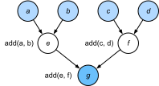

# 编译器和口译员
:label:`sec_hybridize`

到目前为止，这本书专注于命令式编程，它利用 `print`、`+` 和 `if` 等陈述来改变计划的状态。考虑以下简单的命令性程序的例子。

```{.python .input}
#@tab all
def add(a, b):
    return a + b

def fancy_func(a, b, c, d):
    e = add(a, b)
    f = add(c, d)
    g = add(e, f)
    return g

print(fancy_func(1, 2, 3, 4))
```

Python 是一种 * 解释性语言 *。当评估上述 `fancy_func` 函数时，它会按顺序执行组成函数主体的操作 *。也就是说，它将评估 `e = add(a, b)` 并将结果存储为变量 `e`，从而改变计划的状态。接下来的两个语句 `f = add(c, d)` 和 `g = add(e, f)` 将以类似的方式执行，执行添加操作并将结果存储为变量。:numref:`fig_compute_graph` 说明了数据流。 


:label:`fig_compute_graph`

尽管命令式编程很方便，但效率可能低下。一方面，即使在 `fancy_func` 中重复调用 `add` 函数，Python 也会分别执行三个函数调用。比如说，如果在 GPU 上（甚至在多个 GPU 上）执行这些操作，则 Python 解释器产生的开销可能会变得压倒性。此外，在执行 `fancy_func` 中的所有语句之前，它需要保存 `e` 和 `f` 的变量值。这是因为我们不知道在语句 `e = add(a, b)` 和 `f = add(c, d)` 执行之后，程序的其他部分是否会使用变量 `e` 和 `f`。 

## 符号编程

考虑另一种选择，* 符号编程 *，其中通常只有在完全定义过程后才执行计算。该策略被多个深度学习框架使用，包括 Theano 和 TensorFlow（后者获得了必要的扩展）。它通常涉及以下步骤： 

1. 定义要执行的操作。
1. 将操作编译成可执行程序。
1. 提供所需的输入并调用编译后的程序进行执行。

这允许进行大量的优化。首先，在许多情况下，我们可以跳过 Python 解释器，从而消除性能瓶颈，该瓶颈可能会在 CPU 上与单个 Python 线程配对的多个快速 GPU 上变得显著。其次，编译器可能会优化上述代码并将其重写为 `print((1 + 2) + (3 + 4))` 甚至 `print(10)`。这是可能的，因为编译器在将其转换为机器指令之前需要查看完整的代码。例如，只要不再需要变量，它就可以释放内存（或永远不分配）。或者它可以将代码完全转换为等效的片段。为了获得更好的想法，请考虑下面的命令式编程模拟（毕竟是 Python）。

```{.python .input}
#@tab all
def add_():
    return '''
def add(a, b):
    return a + b
'''

def fancy_func_():
    return '''
def fancy_func(a, b, c, d):
    e = add(a, b)
    f = add(c, d)
    g = add(e, f)
    return g
'''

def evoke_():
    return add_() + fancy_func_() + 'print(fancy_func(1, 2, 3, 4))'

prog = evoke_()
print(prog)
y = compile(prog, '', 'exec')
exec(y)
```

命令式（解释式）编程和符号编程之间的区别如下： 

* 命令式编程更容易。当 Python 中使用命令式编程时，大多数代码都很简单且易于编写。调试命令式编程代码也更容易。这是因为获取和打印所有相关的中间变量值或使用 Python 的内置调试工具更容易。
* 符号编程效率更高，更容易移植。符号编程使得在编译过程中优化代码变得更加容易，同时还能够将程序移植到独立于 Python 的格式。这允许程序在非 Python 环境中运行，从而避免任何与 Python 解释器相关的潜在性能问题。

## 混合编程

历史上，大多数深度学习框架都可以选择必要的方法或象征性方法。例如，Theano、TensorFlow（受前者的启发）、Keras 和 CNTK 象征性地制定模型。相反，Chainer 和 PyTorch 采取必要的方法。在后续的修订版中，TensorFlow 2.0 和 Keras 中添加了命令模式。

:begin_tab:`mxnet`
在设计 Gluon 时，开发人员考虑了是否有可能将两种编程模式的好处结合起来。这导致了混合模型，允许用户使用纯粹的命令式编程进行开发和调试，同时能够将大多数程序转换为符号程序，以便在需要产品级计算性能和部署时运行。 

实际上，这意味着我们使用 `HybridBlock` 或 `HybridSequential` 类来构建模型。默认情况下，其中任何一个都以同样的方式执行 `Block` 或 `Sequential` 类在命令式编程中执行。`HybridSequential` 类是 `HybridBlock` 的子类（就像 `Sequential` 子类 `Block`）。当调用 `hybridize` 函数时，Gluon 会将模型编译成符号编程中使用的形式。这允许人们在不牺牲模型实施方式的情况下优化计算密集型组件。我们将在下面介绍优势，重点介绍顺序模型和模块。
:end_tab:

:begin_tab:`pytorch`
如上所述，PyTorch 基于命令式编程并使用动态计算图。为了利用符号编程的可移植性和效率，开发人员考虑了是否有可能结合两种编程模型的优势。这导致了一个 torchscript，允许用户使用纯粹的命令式编程进行开发和调试，同时能够将大多数程序转换为符号程序，以便在需要产品级计算性能和部署时运行。
:end_tab:

:begin_tab:`tensorflow`
命令式编程模式现在是 Tensorflow 2 中的默认设置，对于新使用该语言的人来说，这是一个值得欢迎的变化。但是，TensorFlow 中仍然存在相同的符号编程技术和后续的计算图形，易于使用的 `tf.function` 装饰器可以访问。这为 TensorFlow 带来了命令式的编程模式，允许用户定义更直观的函数，然后使用 TensorFlow 团队称为 [autograph](https://www.tensorflow.org/api_docs/python/tf/autograph) 的功能将它们包装起来并自动将它们编译成计算图形。
:end_tab:

## 混合 `Sequential` 课程

了解混合运行方式的最简单方法是考虑具有多层的深度网络。通常情况下，Python 解释器需要为所有层执行代码才能生成指令，然后将其转发到 CPU 或 GPU。对于单个（快速）计算设备，这不会导致任何重大问题。另一方面，如果我们使用高级 8-GPU 服务器，如 AWS P3dn.24xLart 实例，Python 将难以让所有 GPU 保持繁忙。单线程 Python 解释器成为这里的瓶颈。让我们看看如何通过将 `Sequential` 替换为 `HybridSequential` 来解决代码的重要部分。我们首先定义一个简单的 MLP。

```{.python .input}
from d2l import mxnet as d2l
from mxnet import np, npx
from mxnet.gluon import nn
npx.set_np()

# Factory for networks
def get_net():
    net = nn.HybridSequential()  
    net.add(nn.Dense(256, activation='relu'),
            nn.Dense(128, activation='relu'),
            nn.Dense(2))
    net.initialize()
    return net

x = np.random.normal(size=(1, 512))
net = get_net()
net(x)
```

```{.python .input}
#@tab pytorch
from d2l import torch as d2l
import torch
from torch import nn

# Factory for networks
def get_net():
    net = nn.Sequential(nn.Linear(512, 256),
            nn.ReLU(),
            nn.Linear(256, 128),
            nn.ReLU(),
            nn.Linear(128, 2))
    return net

x = torch.randn(size=(1, 512))
net = get_net()
net(x)
```

```{.python .input}
#@tab tensorflow
from d2l import tensorflow as d2l
import tensorflow as tf
from tensorflow.keras.layers import Dense

# Factory for networks
def get_net():
    net = tf.keras.Sequential()
    net.add(Dense(256, input_shape = (512,), activation = "relu"))
    net.add(Dense(128, activation = "relu"))
    net.add(Dense(2, activation = "linear"))
    return net

x = tf.random.normal([1,512])
net = get_net()
net(x)
```

:begin_tab:`mxnet`
通过调用 `hybridize` 函数，我们能够在 MLP 中编译和优化计算。模型的计算结果保持不变。
:end_tab:

:begin_tab:`pytorch`
通过使用 `torch.jit.script` 函数转换模型，我们能够在 MLP 中编译和优化计算。模型的计算结果保持不变。
:end_tab:

:begin_tab:`tensorflow`
以前，tensorflow 中内置的所有函数都是作为计算图构建的，因此在默认情况下编译 JIT。但是，随着 tensorflow 2.X 的发布和急切的张量，这不再是默认行为。我们可以使用 tf.function 重新启用此功能。tf.function 更常用作函数装饰器，但是可以将其作为普通 python 函数直接调用，如下所示。模型的计算结果保持不变。
:end_tab:

```{.python .input}
net.hybridize()
net(x)
```

```{.python .input}
#@tab pytorch
net = torch.jit.script(net)
net(x)
```

```{.python .input}
#@tab tensorflow
net = tf.function(net)
net(x)
```

:begin_tab:`mxnet`
这似乎几乎太好了，无法实现：只需将一个块指定为 `HybridSequential`，编写与之前相同的代码，然后调用 `hybridize`。一旦发生这种情况，网络将被优化（我们将在下面对性能进行基准测试不幸的是，这并不适用于每个层都神奇。也就是说，如果图层继承自 `Block` 类而不是 `HybridBlock` 类，则不会对其进行优化。
:end_tab:

:begin_tab:`pytorch`
通过使用 `torch.jit.script` 转换模型，这似乎几乎太好了，无法实现：编写与之前相同的代码，然后简单地使用 `torch.jit.script` 转换模型。一旦发生这种情况，网络将被优化（我们将在下面对性能进行基准测试
:end_tab:

:begin_tab:`tensorflow`
使用 `tf.function` 转换模型为 TensorFlow 提供了令人难以置信的力量：编写与之前相同的代码，然后使用 `tf.function` 简单地转换模型。一旦发生这种情况，网络就会在 TensorFlow 的 MLIR 中间表示中构建为计算图，并在编译器级别进行了大量优化，以实现快速执行（我们将在下面对性能进行基准测试）。将 `jit_compile = True` 标志明确添加到 `tf.function()` 调用中可以启用 TensorFlow 中的 XLA（加速线性代数）功能。XLA 可以在某些情况下进一步优化 JIT 编译的代码。在没有这个明确定义的情况下，可以启用图形模式执行，但是 XLA 可以使某些大型线性代数操作（在深度学习应用程序中看到的那些操作）更快，尤其是在 GPU 环境中。
:end_tab:

### 混合加速

为了展示通过编译获得的性能提高，我们比较了在混合运动之前和之后评估 `net(x)` 所需的时间。让我们首先定义一个函数来测量这次。当我们着手衡量（和提高）绩效时，它将在整个章节中派上用场。

```{.python .input}
#@tab all
#@save
class Benchmark:
    def __init__(self, description='Done'):
        self.description = description

    def __enter__(self):
        self.timer = d2l.Timer()
        return self

    def __exit__(self, *args):
        print(f'{self.description}: {self.timer.stop():.4f} sec')
```

:begin_tab:`mxnet`
现在我们可以调用两次网络，一次不用混合动力。
:end_tab:

:begin_tab:`pytorch`
现在我们可以调用两次网络，一次是没有 torchscript。
:end_tab:

:begin_tab:`tensorflow`
现在我们可以三次调用网络，一次是急切执行，一次是用图形模式执行，然后再次使用 JIT 编译的 XLA。
:end_tab:

```{.python .input}
net = get_net()
with Benchmark('Without hybridization'):
    for i in range(1000): net(x)
    npx.waitall()

net.hybridize()
with Benchmark('With hybridization'):
    for i in range(1000): net(x)
    npx.waitall()
```

```{.python .input}
#@tab pytorch
net = get_net()
with Benchmark('Without torchscript'):
    for i in range(1000): net(x)

net = torch.jit.script(net)
with Benchmark('With torchscript'):
    for i in range(1000): net(x)
```

```{.python .input}
#@tab tensorflow
net = get_net()
with Benchmark('Eager Mode'):
    for i in range(1000): net(x)

net = tf.function(net)
with Benchmark('Graph Mode'):
    for i in range(1000): net(x)
```

:begin_tab:`mxnet`
如上面的结果所观察到的那样，`HybridSequential` 实例调用 `hybridize` 函数后，通过使用符号编程来提高计算性能。
:end_tab:

:begin_tab:`pytorch`
如上面的结果所观察到的那样，在使用 `torch.jit.script` 函数编写 `nn.Sequential` 实例脚本后，通过使用符号编程来提高计算性能。
:end_tab:

:begin_tab:`tensorflow`
如上面的结果所观察到的那样，在使用 `tf.function` 函数编写 tf.keras 顺序实例脚本之后，通过 tensorflow 中的图形模式执行使用符号编程，计算性能得到提高。
:end_tab:

### 序列化

:begin_tab:`mxnet`
编译模型的好处之一是我们可以序列化（保存）模型及其参数到磁盘。这使我们能够以独立于所选前端语言的方式存储模型。这使我们能够将训练有素的模型部署到其他设备，并轻松使用其他前端编程语言。同时，代码通常比命令式编程中可以实现的速度快。让我们看看 `export` 函数的实际运行。
:end_tab:

:begin_tab:`pytorch`
编译模型的好处之一是我们可以序列化（保存）模型及其参数到磁盘。这使我们能够以独立于所选前端语言的方式存储模型。这使我们能够将训练有素的模型部署到其他设备，并轻松使用其他前端编程语言。同时，代码通常比命令式编程中可以实现的速度快。让我们看看 `save` 函数的实际运行。
:end_tab:

:begin_tab:`tensorflow`
编译模型的好处之一是我们可以序列化（保存）模型及其参数到磁盘。这使我们能够以独立于所选前端语言的方式存储模型。这使我们能够将训练有素的模型部署到其他设备，轻松使用其他前端编程语言或在服务器上执行训练有素的模型。同时，代码通常比命令式编程中可以实现的速度快。允许我们在 tensorflow 中保存的低级 API 是 `tf.saved_model`。让我们看看 `saved_model` 实例在运行中。
:end_tab:

```{.python .input}
net.export('my_mlp')
!ls -lh my_mlp*
```

```{.python .input}
#@tab pytorch
net.save('my_mlp')
!ls -lh my_mlp*
```

```{.python .input}
#@tab tensorflow
net = get_net()
tf.saved_model.save(net, 'my_mlp')
!ls -lh my_mlp*
```

:begin_tab:`mxnet`
模型被分解为（大型二进制）参数文件和执行模型计算所需程序的 JSON 描述。这些文件可以由 Python 或 MxNet 支持的其他前端语言读取，例如 C++、R、Scala 和 Perl。让我们看看模型描述中的前几行。
:end_tab:

```{.python .input}
!head my_mlp-symbol.json
```

:begin_tab:`mxnet`
此前，我们证明，在调用 `hybridize` 函数之后，该模型能够实现卓越的计算性能和便携性。请注意，尽管这种混合可能会影响模型的灵活性，特别是在控制流方面。  

此外，与需要使用 `forward` 函数的 `Block` 实例相反，对于 `HybridBlock` 实例，我们需要使用 `hybrid_forward` 函数。
:end_tab:

```{.python .input}
class HybridNet(nn.HybridBlock):
    def __init__(self, **kwargs):
        super(HybridNet, self).__init__(**kwargs)
        self.hidden = nn.Dense(4)
        self.output = nn.Dense(2)

    def hybrid_forward(self, F, x):
        print('module F: ', F)
        print('value  x: ', x)
        x = F.npx.relu(self.hidden(x))
        print('result  : ', x)
        return self.output(x)
```

:begin_tab:`mxnet`
上面的代码实现了一个带有 4 个隐藏单元和 2 个输出的简单网络。`hybrid_forward` 函数需要一个额外的参数 `F`。这是必要的，因为根据代码是否被混合，它将使用略有不同的库（`ndarray` 或 `symbol`）进行处理。这两个类执行的功能非常相似，MxNet 会自动确定参数。为了理解发生了什么，我们将参数作为函数调用的一部分打印出来。
:end_tab:

```{.python .input}
net = HybridNet()
net.initialize()
x = np.random.normal(size=(1, 3))
net(x)
```

:begin_tab:`mxnet`
重复向前计算将导致相同的输出（我们省略了细节）。现在让我们看看如果我们调用 `hybridize` 函数会发生什么。
:end_tab:

```{.python .input}
net.hybridize()
net(x)
```

:begin_tab:`mxnet`
我们现在不使用 `ndarray`，而不是使用 `symbol` 模块进行 `F`。此外，尽管输入是 `ndarray` 类型，但作为编译过程的一部分，通过网络流动的数据现在已转换为 `symbol` 类型。重复函数调用会导致令人惊讶的结果：
:end_tab:

```{.python .input}
net(x)
```

:begin_tab:`mxnet`
这与我们之前看到的截然不同。省略 `hybrid_forward` 中定义的所有打印语句。事实上，在混合后，`net(x)` 的执行不再涉及 Python 解释器。这意味着，忽略任何虚假的 Python 代码（例如 print 语句），以利于更简化的执行和更好的性能。相反，MxNet 直接调用 C ++ 后端。另请注意，`symbol` 模块（例如 `asnumpy`）中不支持某些功能，而就地操作（如 `a += b` 和 `a[:] = a + b`）必须重写为 `a = a + b`。尽管如此，只要速度重要，汇编模型就值得付出努力。优势可以从小百分点到速度的两倍以上，具体取决于模型的复杂性、CPU 的速度以及 GPU 的速度和数量。
:end_tab:

## 摘要

* 命令式编程使设计新模型变得容易，因为可以使用控制流编写代码，并且能够使用大量 Python 软件生态系统。
* 符号编程要求我们先指定程序并在执行之前对其进行编译。好处是提高了性能。

:begin_tab:`mxnet`
* MxNet 能够根据需要结合这两种方法的优势。
* `HybridSequential` 和 `HybridBlock` 类构建的模型可以通过调用 `hybridize` 函数将命令性程序转换为符号程序。
:end_tab:

## 练习

:begin_tab:`mxnet`
1. 将 `x.asnumpy()` 添加到本节中 `HybridNet` 类的 `hybrid_forward` 函数的第一行。执行代码并观察遇到的错误。他们为什么会发生？
1. 如果我们添加控制流程，即 `hybrid_forward` 函数中的 Python 语句 `if` 和 `for` 会发生什么？
1. 查看前几章中你感兴趣的模型。你能通过重新实现它们来提高他们的计算性能吗？
:end_tab:

:begin_tab:`pytorch,tensorflow`
1. 查看前几章中你感兴趣的模型。你能通过重新实现它们来提高他们的计算性能吗？
:end_tab:

:begin_tab:`mxnet`
[Discussions](https://discuss.d2l.ai/t/360)
:end_tab:

:begin_tab:`pytorch`
[Discussions](https://discuss.d2l.ai/t/2490)
:end_tab:

:begin_tab:`tensorflow`
[Discussions](https://discuss.d2l.ai/t/2492)
:end_tab:
