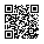

# 物体检测和边界框

前面小节里我们介绍了诸多用于图片分类的模型。在这个任务里，我们假设图片里只有一个主体物体，然后目标是识别这个物体的类别。但很多时候图片里有多个我们感兴趣的物体，我们不仅仅想知道它们是什么，而且想得到它们在图片中的具体位置。在计算机视觉里，我们将这类任务称为物体检测。

物体检测在多个领域被广泛使用。例如在无人驾驶里，我们需要通过识别拍摄到的视频图片里的车辆、行人、道路和障碍的位置来规划行进线路。机器人里也常使用它来检测感兴趣物体。安防领域则需要检测异常物体，例如歹徒或者炸弹。

在接下来的数小节里我们将介绍物体检测里的多个深度学习模型。在此之前，让我们先讨论物体位置这个概念。首先导入本节实验所需的包或模块。

```{.python .input  n=1}
import sys
sys.path.insert(0, '..')

%matplotlib inline
import gluonbook as gb
from mxnet import image
```

我们加载本小节将使用的示例图片。可以看到图片左边是一只小狗，右边是一只小猫。跟前面使用的图片的主要不同点在于这张图里有两个主要物体。

```{.python .input}
gb.set_figsize()
img = image.imread('../img/catdog.jpg').asnumpy()
gb.plt.imshow(img);  # 加分号只显示图。
```

## 边界框

在物体识别里，我们通常使用边界框（bounding box）来描述物体位置。它是一个矩形框，可以由左上角的x、y轴位置与右下角x、y轴位置确定。我们根据上图坐标信息来定义图中小狗和小猫的边界框。

```{.python .input  n=2}
# 注意坐标轴原点是图片的左上角。bbox 是 bounding box 的缩写。
dog_bbox = [60, 45, 378, 516]
cat_bbox = [400, 112, 655, 493]
```

我们可以在图中将边框画出来检查其准确性。画之前我们定义一个辅助函数`bbox_to_rect`。它将边界框表示成matplotlib的边框格式。我们将该函数定义在`gluonbook`包中供后面章节调用。

```{.python .input  n=3}
# 将边界框（左上 x、左上 y，右下 x，右下 y）格式转换成 matplotlib 格式：
# （（左上 x，左上 y），宽，高）。
def bbox_to_rect(bbox, color):
    return gb.plt.Rectangle(
        xy=(bbox[0], bbox[1]), width=bbox[2]-bbox[0], height=bbox[3]-bbox[1],
        fill=False, edgecolor=color, linewidth=2)
```

我们将边界框加载在图上，可以看到物体的主要轮廓基本在框内。

```{.python .input}
fig = gb.plt.imshow(img)
fig.axes.add_patch(bbox_to_rect(dog_bbox, 'blue'))
fig.axes.add_patch(bbox_to_rect(cat_bbox, 'red'));
```

## 小结

* 在物体识别里我们不仅需要找出图片里面所有感兴趣的物体，而且要知道它们的位置。位置一般由矩形边界框来表示。

## 练习

* 找一些图片，尝试标注下其中物体的边界框。比较下同图片分类标注所花时间的区别。

## 扫码直达[讨论区](https://discuss.gluon.ai/t/topic/7023)


