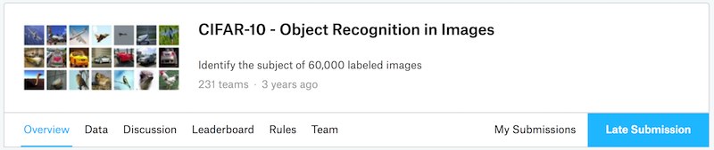
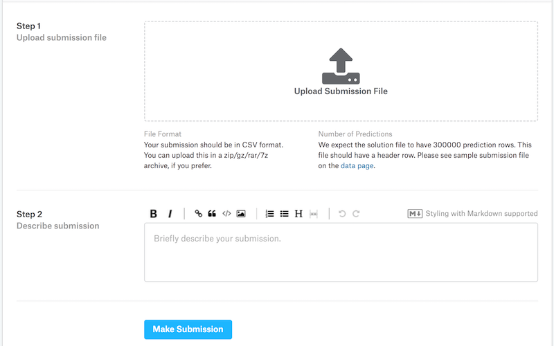

# 实战Kaggle比赛——使用Gluon对原始图像文件分类（CIFAR-10）

我们在[监督学习中的一章](../chapter_supervised-learning/kaggle-gluon-kfold.md)里，以[房价预测问题](https://www.kaggle.com/c/house-prices-advanced-regression-techniques)为例，介绍了如何使用``Gluon``来实战[Kaggle比赛](https://www.kaggle.com)。

我们在本章中选择了Kaggle中著名的[CIFAR-10原始图像分类问题](https://www.kaggle.com/c/cifar-10)。我们以该问题为例，为大家提供使用`Gluon`对原始图像文件进行分类的示例代码。

计算机视觉一直是深度学习的主战场，请

> Get your hands dirty。


## Kaggle中的CIFAR-10原始图像分类问题

[Kaggle](https://www.kaggle.com)是一个著名的供机器学习爱好者交流的平台。为了便于提交结果，请大家注册[Kaggle](https://www.kaggle.com)账号。然后请大家先点击[CIFAR-10原始图像分类问题](https://www.kaggle.com/c/cifar-10)了解有关本次比赛的信息。


## 整理原始数据集

比赛数据分为训练数据集和测试数据集。训练集包含5万张图片。测试集包含30万张图片：其中有1万张图片用来计分，但为了防止人工标注测试集，里面另加了29万张不计分的图片。

两个数据集都是png彩色图片，大小为$32\times 32 \times 3$。训练集一共有10类图片，分别为飞机、汽车、鸟、猫、鹿、狗、青蛙、马、船和卡车。

（那么问题来了，你觉得你用肉眼能把下面100个图片正确分类吗？）


### 下载数据集


登录Kaggle后，数据可以从[CIFAR-10原始图像分类问题](https://www.kaggle.com/c/cifar-10)中下载。

* [训练数据集train.7z下载地址](https://www.kaggle.com/c/cifar-10/download/train.7z)

* [测试数据集test.7z下载地址](https://www.kaggle.com/c/cifar-10/download/test.7z)

* [训练数据标签trainLabels.csv下载地址](https://www.kaggle.com/c/cifar-10/download/trainLabels.csv)


### 解压数据集

训练数据集train.7z和测试数据集test.7z都是压缩格式，下载后请解压缩。解压缩后原始数据集的路径可以如下：

* ../data/kaggle_cifar10/train/[1-50000].png
* ../data/kaggle_cifar10/test/[1-300000].png
* ../data/kaggle_cifar10/trainLabels.csv

为了使网页编译快一点，我们在git repo里仅仅存放100个训练样本（'train_tiny.zip'）和1个测试样本（'test_tiny.zip'）。执行以下代码会从git repo里解压生成小样本训练和测试数据，文件夹名称分别为'train_tiny'和'test_tiny'。训练数据标签的压缩文件将被解压成trainLabels.csv。

```{.python .input  n=1}
# 如果训练下载的Kaggle的完整数据集，把下面改False
demo = True
if demo:
    import zipfile
    for fin in ['train_tiny.zip', 'test_tiny.zip', 'trainLabels.csv.zip']:
        with zipfile.ZipFile('../data/kaggle_cifar10/' + fin, 'r') as zin:
            zin.extractall('../data/kaggle_cifar10/')
```

### 整理数据集

我们定义下面的`reorg_cifar10_data`函数来整理数据集。整理后，同一类图片将出现在在同一个文件夹下，便于`Gluon`稍后读取。

函数中的参数如data_dir、train_dir和test_dir对应上述数据存放路径及训练和测试的图片集文件夹名称。参数label_file为训练数据标签的文件名称。参数input_dir是整理后数据集文件夹名称。参数valid_ratio是验证集占原始训练集的比重。以valid_ratio=0.1为例，由于原始训练数据有5万张图片，调参时将有4万5千张图片用于训练（整理后存放在input_dir/train）而另外5千张图片为验证集（整理后存放在input_dir/valid）。

```{.python .input  n=2}
import os
import shutil

def reorg_cifar10_data(data_dir, label_file, train_dir, test_dir, input_dir, valid_ratio):
    # 读取训练数据标签。
    with open(os.path.join(data_dir, label_file), 'r') as f:
        # 跳过文件头行（栏名称）。
        lines = f.readlines()[1:]
        tokens = [l.rstrip().split(',') for l in lines]
        idx_label = dict(((int(idx), label) for idx, label in tokens))
    labels = set(idx_label.values())

    num_train = len(os.listdir(os.path.join(data_dir, train_dir)))
    num_train_tuning = int(num_train * (1 - valid_ratio))
    assert 0 < num_train_tuning < num_train
    num_train_tuning_per_label = num_train_tuning // len(labels)
    label_count = dict()

    def mkdir_if_not_exist(path):
        if not os.path.exists(os.path.join(*path)):
            os.makedirs(os.path.join(*path))

    # 整理训练和验证集。
    for train_file in os.listdir(os.path.join(data_dir, train_dir)):
        idx = int(train_file.split('.')[0])
        label = idx_label[idx]
        mkdir_if_not_exist([data_dir, input_dir, 'train_valid', label])
        shutil.copy(os.path.join(data_dir, train_dir, train_file),
                    os.path.join(data_dir, input_dir, 'train_valid', label))
        if label not in label_count or label_count[label] < num_train_tuning_per_label:
            mkdir_if_not_exist([data_dir, input_dir, 'train', label])
            shutil.copy(os.path.join(data_dir, train_dir, train_file),
                        os.path.join(data_dir, input_dir, 'train', label))
            label_count[label] = label_count.get(label, 0) + 1
        else:
            mkdir_if_not_exist([data_dir, input_dir, 'valid', label])
            shutil.copy(os.path.join(data_dir, train_dir, train_file),
                        os.path.join(data_dir, input_dir, 'valid', label))

    # 整理测试集。
    mkdir_if_not_exist([data_dir, input_dir, 'test', 'unknown'])
    for test_file in os.listdir(os.path.join(data_dir, test_dir)):
        shutil.copy(os.path.join(data_dir, test_dir, test_file),
                    os.path.join(data_dir, input_dir, 'test', 'unknown'))
```

再次强调，为了使网页编译快一点，我们在这里仅仅使用100个训练样本和1个测试样本。训练和测试数据的文件夹名称分别为'train_tiny'和'test_tiny'。相应地，我们仅将批量大小设为1。实际训练和测试时应使用Kaggle的完整数据集。由于数据集较大，批量大小batch_size大小可设为一个较大的整数，例如128。

我们将10%的训练样本作为调参时的验证集。

```{.python .input  n=3}
if demo:
    # 注意：此处使用小训练集为便于网页编译。Kaggle的完整数据集应包括5万训练样本。
    train_dir = 'train_tiny'
    # 注意：此处使用小测试集为便于网页编译。Kaggle的完整数据集应包括30万测试样本。
    test_dir = 'test_tiny'
    # 注意：此处相应使用小批量。对Kaggle的完整数据集可设较大的整数，例如128。
    batch_size = 1
else:
    train_dir = 'train'
    test_dir = 'test'
    batch_size = 128

data_dir = '../data/kaggle_cifar10'
label_file = 'trainLabels.csv'
input_dir = 'train_valid_test'
valid_ratio = 0.1
reorg_cifar10_data(data_dir, label_file, train_dir, test_dir, input_dir, valid_ratio)
```

## 使用Gluon读取整理后的数据集

为避免过拟合，我们在这里使用`transforms`来增广数据集。例如我们加入`transforms.RandomFlipLeftRight()`即可随机对每张图片做镜面反转。我们也通过`transforms.Normalize()`对彩色图像RGB三个通道分别做[标准化](../chapter_supervised-learning/kaggle-gluon-kfold.md)。以下我们列举了所有可能用到的操作，这些操作可以根据需求来决定是否调用，它们的参数也都是可调的。

```{.python .input  n=4}
from mxnet import autograd
from mxnet import gluon
from mxnet import init
from mxnet import nd
from mxnet.gluon.data import vision
from mxnet.gluon.data.vision import transforms
import numpy as np

transform_train = transforms.Compose([
    # transforms.CenterCrop(32)
    # transforms.RandomFlipTopBottom(),
    # transforms.RandomColorJitter(brightness=0.0, contrast=0.0, saturation=0.0, hue=0.0),
    # transforms.RandomLighting(0.0),
    # transforms.Cast('float32'),
    # transforms.Resize(32),

    # 随机按照scale和ratio裁剪，并放缩为32x32的正方形
    transforms.RandomResizedCrop(32, scale=(0.08, 1.0), ratio=(3.0/4.0, 4.0/3.0)),
    # 随机左右翻转图片
    transforms.RandomFlipLeftRight(),
    # 将图片像素值缩小到(0,1)内，并将数据格式从"高*宽*通道"改为"通道*高*宽"
    transforms.ToTensor(),
    # 对图片的每个通道做标准化
    transforms.Normalize([0.4914, 0.4822, 0.4465], [0.2023, 0.1994, 0.2010])
])

# 测试时，无需对图像做标准化以外的增强数据处理。
transform_test = transforms.Compose([
    transforms.ToTensor(),
    transforms.Normalize([0.4914, 0.4822, 0.4465], [0.2023, 0.1994, 0.2010])
])
```

接下来，我们可以使用`Gluon`中的`ImageFolderDataset`类来读取整理后的数据集。注意，我们要在`loader`中调用刚刚定义好的图片增广函数。通过`vision.ImageFolderDataset`读入的数据是一个`(image, label)`组合，`transform_first()`的作用便是对这个组合中的第一个成员（即读入的图像）做图片增广操作。

```{.python .input  n=5}
input_str = data_dir + '/' + input_dir + '/'

# 读取原始图像文件。flag=1说明输入图像有三个通道（彩色）。
train_ds = vision.ImageFolderDataset(input_str + 'train', flag=1)
valid_ds = vision.ImageFolderDataset(input_str + 'valid', flag=1)
train_valid_ds = vision.ImageFolderDataset(input_str + 'train_valid', flag=1)
test_ds = vision.ImageFolderDataset(input_str + 'test', flag=1)

loader = gluon.data.DataLoader
train_data = loader(train_ds.transform_first(transform_train),
                    batch_size, shuffle=True, last_batch='keep')
valid_data = loader(valid_ds.transform_first(transform_test),
                    batch_size, shuffle=True, last_batch='keep')
train_valid_data = loader(train_valid_ds.transform_first(transform_train),
                          batch_size, shuffle=True, last_batch='keep')
test_data = loader(test_ds.transform_first(transform_test),
                   batch_size, shuffle=False, last_batch='keep')

# 交叉熵损失函数。
softmax_cross_entropy = gluon.loss.SoftmaxCrossEntropyLoss()
```

## 设计模型

我们这里使用了[ResNet-18](resnet-gluon.md)模型。我们使用[hybridizing](../chapter_gluon-advances/hybridize.md)来提升执行效率。

请注意：模型可以重新设计，参数也可以重新调整。

```{.python .input  n=6}
from mxnet.gluon import nn
from mxnet import nd

class Residual(nn.HybridBlock):
    def __init__(self, channels, same_shape=True, **kwargs):
        super(Residual, self).__init__(**kwargs)
        self.same_shape = same_shape
        with self.name_scope():
            strides = 1 if same_shape else 2
            self.conv1 = nn.Conv2D(channels, kernel_size=3, padding=1,
                                  strides=strides)
            self.bn1 = nn.BatchNorm()
            self.conv2 = nn.Conv2D(channels, kernel_size=3, padding=1)
            self.bn2 = nn.BatchNorm()
            if not same_shape:
                self.conv3 = nn.Conv2D(channels, kernel_size=1,
                                      strides=strides)

    def hybrid_forward(self, F, x):
        out = F.relu(self.bn1(self.conv1(x)))
        out = self.bn2(self.conv2(out))
        if not self.same_shape:
            x = self.conv3(x)
        return F.relu(out + x)

    
class ResNet(nn.HybridBlock):
    def __init__(self, num_classes, verbose=False, **kwargs):
        super(ResNet, self).__init__(**kwargs)
        self.verbose = verbose
        with self.name_scope():
            net = self.net = nn.HybridSequential()
            # 模块1
            net.add(nn.Conv2D(channels=32, kernel_size=3, strides=1, padding=1))
            net.add(nn.BatchNorm())
            net.add(nn.Activation(activation='relu'))
            # 模块2
            for _ in range(3):
                net.add(Residual(channels=32))
            # 模块3
            net.add(Residual(channels=64, same_shape=False))
            for _ in range(2):
                net.add(Residual(channels=64))
            # 模块4
            net.add(Residual(channels=128, same_shape=False))
            for _ in range(2):
                net.add(Residual(channels=128))
            # 模块5
            net.add(nn.AvgPool2D(pool_size=8))
            net.add(nn.Flatten())
            net.add(nn.Dense(num_classes))

    def hybrid_forward(self, F, x):
        out = x
        for i, b in enumerate(self.net):
            out = b(out)
            if self.verbose:
                print('Block %d output: %s'%(i+1, out.shape))
        return out


def get_net(ctx):
    num_outputs = 10
    net = ResNet(num_outputs)
    net.initialize(ctx=ctx, init=init.Xavier())
    return net
```

## 训练模型并调参

在[过拟合](../chapter_supervised-learning/underfit-overfit.md)中我们讲过，过度依赖训练数据集的误差来推断测试数据集的误差容易导致过拟合。由于图像分类训练时间可能较长，为了方便，我们这里不再使用K折交叉验证，而是依赖验证集的结果来调参。

我们定义模型训练函数。这里我们记录每个epoch的训练时间。这有助于我们比较不同模型设计的时间成本。

```{.python .input  n=7}
import datetime
import sys
sys.path.append('..')
import utils

def train(net, train_data, valid_data, num_epochs, lr, wd, ctx, lr_period, lr_decay):
    trainer = gluon.Trainer(
        net.collect_params(), 'sgd', {'learning_rate': lr, 'momentum': 0.9, 'wd': wd})

    prev_time = datetime.datetime.now()
    for epoch in range(num_epochs):
        train_loss = 0.0
        train_acc = 0.0
        if epoch > 0 and epoch % lr_period == 0:
            trainer.set_learning_rate(trainer.learning_rate * lr_decay)
        for data, label in train_data:
            label = label.astype('float32').as_in_context(ctx)
            with autograd.record():
                output = net(data.as_in_context(ctx))
                loss = softmax_cross_entropy(output, label)
            loss.backward()
            trainer.step(batch_size)
            train_loss += nd.mean(loss).asscalar()
            train_acc += utils.accuracy(output, label)
        cur_time = datetime.datetime.now()
        h, remainder = divmod((cur_time - prev_time).seconds, 3600)
        m, s = divmod(remainder, 60)
        time_str = "Time %02d:%02d:%02d" % (h, m, s)
        if valid_data is not None:
            valid_acc = utils.evaluate_accuracy(valid_data, net, ctx)
            epoch_str = ("Epoch %d. Loss: %f, Train acc %f, Valid acc %f, "
                         % (epoch, train_loss / len(train_data),
                            train_acc / len(train_data), valid_acc))
        else:
            epoch_str = ("Epoch %d. Loss: %f, Train acc %f, "
                         % (epoch, train_loss / len(train_data),
                            train_acc / len(train_data)))
        prev_time = cur_time
        print(epoch_str + time_str + ', lr ' + str(trainer.learning_rate))
```

以下定义训练参数并训练模型。这些参数均可调。为了使网页编译快一点，我们这里将epoch数量有意设为1。事实上，epoch一般可以调大些，例如100。

我们将依据验证集的结果不断优化模型设计和调整参数。依据下面的参数设置，优化算法的学习率将在每80个epoch自乘0.1。

```{.python .input  n=8}
ctx = utils.try_gpu()
num_epochs = 1
learning_rate = 0.1
weight_decay = 5e-4
lr_period = 80
lr_decay = 0.1

net = get_net(ctx)
net.hybridize()
train(net, train_data, valid_data, num_epochs, learning_rate, 
      weight_decay, ctx, lr_period, lr_decay)
```

## 对测试集分类

当得到一组满意的模型设计和参数后，我们使用全部训练数据集（含验证集）重新训练模型，并对测试集分类。

```{.python .input  n=9}
import numpy as np
import pandas as pd

net = get_net(ctx)
net.hybridize()
train(net, train_valid_data, None, num_epochs, learning_rate, 
      weight_decay, ctx, lr_period, lr_decay)

preds = []
for data, label in test_data:
    output = net(data.as_in_context(ctx))
    preds.extend(output.argmax(axis=1).astype(int).asnumpy())

sorted_ids = list(range(1, len(test_ds) + 1))
sorted_ids.sort(key = lambda x:str(x))

df = pd.DataFrame({'id': sorted_ids, 'label': preds})
df['label'] = df['label'].apply(lambda x: train_valid_ds.synsets[x])
df.to_csv('submission.csv', index=False)
```

上述代码执行完会生成一个`submission.csv`的文件用于在Kaggle上提交。这是Kaggle要求的提交格式。这时我们可以在Kaggle上把对测试集分类的结果提交并查看分类准确率。你需要登录Kaggle网站，打开[CIFAR-10原始图像分类问题](https://www.kaggle.com/c/cifar-10)，并点击下方右侧`Late Submission`按钮。




请点击下方`Upload Submission File`选择需要提交的预测结果。然后点击下方的`Make Submission`按钮就可以查看结果啦！




## 作业（[汇报作业和查看其他小伙伴作业](https://discuss.gluon.ai/t/topic/1545/)）：

* 使用Kaggle完整CIFAR-10数据集，把batch_size和num_epochs分别改为128和100，可以在Kaggle上拿到什么样的准确率和名次？
* 如果不使用增强数据的方法能拿到什么样的准确率？
* 你还有什么其他办法可以继续改进模型和参数？小伙伴们都期待你的分享。

**吐槽和讨论欢迎点**[这里](https://discuss.gluon.ai/t/topic/1545/)
