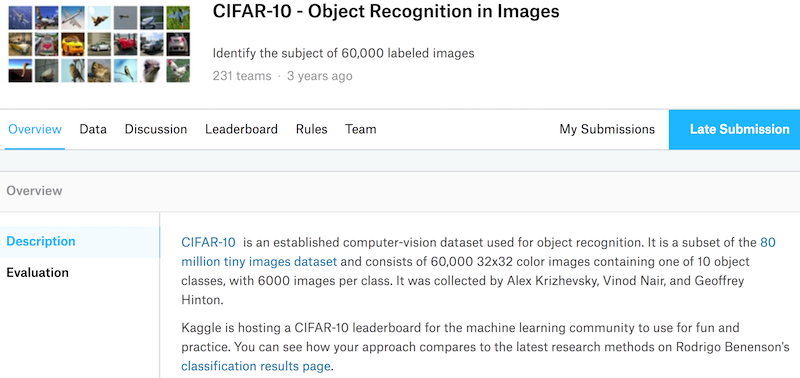

# 实战Kaggle比赛：图像分类（CIFAR-10）

到目前为止，我们一直在用Gluon的`data`包直接获取`NDArray`格式的图像数据集。然而，实际中的图像数据集往往是以图像文件的形式存在的。在本节中，我们将从原始的图像文件开始，一步步整理、读取并将其变换为`NDArray`格式。

我们曾在[“图像增广”](image-augmentation.md)一节中实验过CIFAR-10数据集。它是计算机视觉领域的一个重要数据集。现在我们将应用前面所学的知识，动手实战CIFAR-10图像分类问题的Kaggle比赛。该比赛的网页地址是 https://www.kaggle.com/c/cifar-10 。

图9.16展示了该比赛的网页信息。为了便于提交结果，请先在Kaggle网站上注册账号。



首先，导入比赛所需的包或模块。

```{.python .input  n=1}
import d2lzh as d2l
from mxnet import autograd, gluon, init
from mxnet.gluon import data as gdata, loss as gloss, nn
import os
import pandas as pd
import shutil
import time
```

## 获取和整理数据集

比赛数据分为训练集和测试集。训练集包含5万张图像。测试集包含30万张图像，其中有1万张图像用来计分，其他29万张不计分的图像是为了防止人工标注测试集并提交标注结果。两个数据集中的图像格式都是png，高和宽均为32像素，并含有RGB三个通道（彩色）。图像一共涵盖10个类别，分别为飞机、汽车、鸟、猫、鹿、狗、青蛙、马、船和卡车。图9.16的左上角展示了数据集中部分飞机、汽车和鸟的图像。

### 下载数据集

登录Kaggle后，可以点击图9.16所示的CIFAR-10图像分类比赛网页上的“Data”标签，并分别下载训练数据集train.7z、测试数据集test.7z和训练数据集标签trainLabels.csv。


### 解压数据集

下载完训练数据集train.7z和测试数据集test.7z后需要解压缩。解压缩后，将训练数据集、测试数据集以及训练数据集标签分别存放在以下3个路径：

* ../data/kaggle_cifar10/train/[1-50000].png；
* ../data/kaggle_cifar10/test/[1-300000].png；
* ../data/kaggle_cifar10/trainLabels.csv。

为方便快速上手，我们提供了上述数据集的小规模采样，其中train_tiny.zip包含100个训练样本，而test_tiny.zip仅包含1个测试样本。它们解压后的文件夹名称分别为train_tiny和test_tiny。此外，将训练数据集标签的压缩文件解压，并得到trainLabels.csv。如果使用上述Kaggle比赛的完整数据集，还需要把下面`demo`变量改为`False`。

```{.python .input  n=2}
# 如果使用下载的Kaggle比赛的完整数据集，把demo变量改为False
demo = True
if demo:
    import zipfile
    for f in ['train_tiny.zip', 'test_tiny.zip', 'trainLabels.csv.zip']:
        with zipfile.ZipFile('../data/kaggle_cifar10/' + f, 'r') as z:
            z.extractall('../data/kaggle_cifar10/')
```

### 整理数据集

我们需要整理数据集，以方便训练和测试模型。以下的`read_label_file`函数将用来读取训练数据集的标签文件。该函数中的参数`valid_ratio`是验证集样本数与原始训练集样本数之比。

```{.python .input  n=3}
def read_label_file(data_dir, label_file, train_dir, valid_ratio):
    with open(os.path.join(data_dir, label_file), 'r') as f:
        # 跳过文件头行（栏名称）
        lines = f.readlines()[1:]
        tokens = [l.rstrip().split(',') for l in lines]
        idx_label = dict(((int(idx), label) for idx, label in tokens))
    labels = set(idx_label.values())
    n_train_valid = len(os.listdir(os.path.join(data_dir, train_dir)))
    n_train = int(n_train_valid * (1 - valid_ratio))
    assert 0 < n_train < n_train_valid
    return n_train // len(labels), idx_label
```

下面定义一个辅助函数，从而仅在路径不存在的情况下创建路径。

```{.python .input  n=4}
def mkdir_if_not_exist(path):  # 本函数已保存在d2lzh包中方便以后使用
    if not os.path.exists(os.path.join(*path)):
        os.makedirs(os.path.join(*path))
```

我们接下来定义`reorg_train_valid`函数来从原始训练集中切分出验证集。以`valid_ratio=0.1`为例，由于原始训练集有50,000张图像，调参时将有45,000张图像用于训练并存放在路径`input_dir/train`下，而另外5,000张图像将作为验证集并存放在路径`input_dir/valid`下。经过整理后，同一类图像将被放在同一个文件夹下，便于稍后读取。

```{.python .input  n=5}
def reorg_train_valid(data_dir, train_dir, input_dir, n_train_per_label,
                      idx_label):
    label_count = {}
    for train_file in os.listdir(os.path.join(data_dir, train_dir)):
        idx = int(train_file.split('.')[0])
        label = idx_label[idx]
        mkdir_if_not_exist([data_dir, input_dir, 'train_valid', label])
        shutil.copy(os.path.join(data_dir, train_dir, train_file),
                    os.path.join(data_dir, input_dir, 'train_valid', label))
        if label not in label_count or label_count[label] < n_train_per_label:
            mkdir_if_not_exist([data_dir, input_dir, 'train', label])
            shutil.copy(os.path.join(data_dir, train_dir, train_file),
                        os.path.join(data_dir, input_dir, 'train', label))
            label_count[label] = label_count.get(label, 0) + 1
        else:
            mkdir_if_not_exist([data_dir, input_dir, 'valid', label])
            shutil.copy(os.path.join(data_dir, train_dir, train_file),
                        os.path.join(data_dir, input_dir, 'valid', label))
```

下面的`reorg_test`函数用来整理测试集，从而方便预测时的读取。

```{.python .input  n=6}
def reorg_test(data_dir, test_dir, input_dir):
    mkdir_if_not_exist([data_dir, input_dir, 'test', 'unknown'])
    for test_file in os.listdir(os.path.join(data_dir, test_dir)):
        shutil.copy(os.path.join(data_dir, test_dir, test_file),
                    os.path.join(data_dir, input_dir, 'test', 'unknown'))
```

最后，我们用一个函数分别调用前面定义的`read_label_file`函数、`reorg_train_valid`函数以及`reorg_test`函数。

```{.python .input  n=7}
def reorg_cifar10_data(data_dir, label_file, train_dir, test_dir, input_dir,
                       valid_ratio):
    n_train_per_label, idx_label = read_label_file(data_dir, label_file,
                                                   train_dir, valid_ratio)
    reorg_train_valid(data_dir, train_dir, input_dir, n_train_per_label,
                      idx_label)
    reorg_test(data_dir, test_dir, input_dir)
```

我们在这里只使用100个训练样本和1个测试样本。训练数据集和测试数据集的文件夹名称分别为train_tiny和test_tiny。相应地，我们仅将批量大小设为1。实际训练和测试时应使用Kaggle比赛的完整数据集，并将批量大小`batch_size`设为一个较大的整数，如128。我们将10%的训练样本作为调参使用的验证集。

```{.python .input  n=8}
if demo:
    # 注意，此处使用小训练集和小测试集并将批量大小相应设小。使用Kaggle比赛的完整数据集时可
    # 设批量大小为较大整数
    train_dir, test_dir, batch_size = 'train_tiny', 'test_tiny', 1
else:
    train_dir, test_dir, batch_size = 'train', 'test', 128
data_dir, label_file = '../data/kaggle_cifar10', 'trainLabels.csv'
input_dir, valid_ratio = 'train_valid_test', 0.1
reorg_cifar10_data(data_dir, label_file, train_dir, test_dir, input_dir,
                   valid_ratio)
```

## 图像增广

为应对过拟合，我们使用图像增广。例如，加入`transforms.RandomFlipLeftRight()`即可随机对图像做镜面翻转，也可以通过`transforms.Normalize()`对彩色图像RGB三个通道分别做标准化。下面列举了其中的部分操作，你可以根据需求来决定是否使用或修改这些操作。

```{.python .input  n=9}
transform_train = gdata.vision.transforms.Compose([
    # 将图像放大成高和宽各为40像素的正方形
    gdata.vision.transforms.Resize(40),
    # 随机对高和宽各为40像素的正方形图像裁剪出面积为原图像面积0.64~1倍的小正方形，再放缩为
    # 高和宽各为32像素的正方形
    gdata.vision.transforms.RandomResizedCrop(32, scale=(0.64, 1.0),
                                              ratio=(1.0, 1.0)),
    gdata.vision.transforms.RandomFlipLeftRight(),
    gdata.vision.transforms.ToTensor(),
    # 对图像的每个通道做标准化
    gdata.vision.transforms.Normalize([0.4914, 0.4822, 0.4465],
                                      [0.2023, 0.1994, 0.2010])])
```

测试时，为保证输出的确定性，我们仅对图像做标准化。

```{.python .input}
transform_test = gdata.vision.transforms.Compose([
    gdata.vision.transforms.ToTensor(),
    gdata.vision.transforms.Normalize([0.4914, 0.4822, 0.4465],
                                      [0.2023, 0.1994, 0.2010])])
```

## 读取数据集

接下来，可以通过创建`ImageFolderDataset`实例来读取整理后的含原始图像文件的数据集，其中每个数据样本包括图像和标签。

```{.python .input  n=10}
# 读取原始图像文件。flag=1说明输入图像有3个通道（彩色）
train_ds = gdata.vision.ImageFolderDataset(
    os.path.join(data_dir, input_dir, 'train'), flag=1)
valid_ds = gdata.vision.ImageFolderDataset(
    os.path.join(data_dir, input_dir, 'valid'), flag=1)
train_valid_ds = gdata.vision.ImageFolderDataset(
    os.path.join(data_dir, input_dir, 'train_valid'), flag=1)
test_ds = gdata.vision.ImageFolderDataset(
    os.path.join(data_dir, input_dir, 'test'), flag=1)
```

我们在`DataLoader`中指明定义好的图像增广操作。在训练时，我们仅用验证集评价模型，因此需要保证输出的确定性。在预测时，我们将在训练集和验证集的并集上训练模型，以充分利用所有标注的数据。

```{.python .input}
train_iter = gdata.DataLoader(train_ds.transform_first(transform_train),
                              batch_size, shuffle=True, last_batch='keep')
valid_iter = gdata.DataLoader(valid_ds.transform_first(transform_test),
                              batch_size, shuffle=True, last_batch='keep')
train_valid_iter = gdata.DataLoader(train_valid_ds.transform_first(
    transform_train), batch_size, shuffle=True, last_batch='keep')
test_iter = gdata.DataLoader(test_ds.transform_first(transform_test),
                             batch_size, shuffle=False, last_batch='keep')
```

## 定义模型

与[“残差网络（ResNet）”](../chapter_convolutional-neural-networks/resnet.md)一节中的实现稍有不同，这里基于`HybridBlock`类构建残差块。这是为了提升执行效率。

```{.python .input  n=11}
class Residual(nn.HybridBlock):
    def __init__(self, num_channels, use_1x1conv=False, strides=1, **kwargs):
        super(Residual, self).__init__(**kwargs)
        self.conv1 = nn.Conv2D(num_channels, kernel_size=3, padding=1,
                               strides=strides)
        self.conv2 = nn.Conv2D(num_channels, kernel_size=3, padding=1)
        if use_1x1conv:
            self.conv3 = nn.Conv2D(num_channels, kernel_size=1,
                                   strides=strides)
        else:
            self.conv3 = None
        self.bn1 = nn.BatchNorm()
        self.bn2 = nn.BatchNorm()

    def hybrid_forward(self, F, X):
        Y = F.relu(self.bn1(self.conv1(X)))
        Y = self.bn2(self.conv2(Y))
        if self.conv3:
            X = self.conv3(X)
        return F.relu(Y + X)
```

下面定义ResNet-18模型。

```{.python .input}
def resnet18(num_classes):
    net = nn.HybridSequential()
    net.add(nn.Conv2D(64, kernel_size=3, strides=1, padding=1),
            nn.BatchNorm(), nn.Activation('relu'))

    def resnet_block(num_channels, num_residuals, first_block=False):
        blk = nn.HybridSequential()
        for i in range(num_residuals):
            if i == 0 and not first_block:
                blk.add(Residual(num_channels, use_1x1conv=True, strides=2))
            else:
                blk.add(Residual(num_channels))
        return blk

    net.add(resnet_block(64, 2, first_block=True),
            resnet_block(128, 2),
            resnet_block(256, 2),
            resnet_block(512, 2))
    net.add(nn.GlobalAvgPool2D(), nn.Dense(num_classes))
    return net
```

CIFAR-10图像分类问题的类别个数为10。我们将在训练开始前对模型进行Xavier随机初始化。

```{.python .input}
def get_net(ctx):
    num_classes = 10
    net = resnet18(num_classes)
    net.initialize(ctx=ctx, init=init.Xavier())
    return net

loss = gloss.SoftmaxCrossEntropyLoss()
```

## 定义训练函数

我们将根据模型在验证集上的表现来选择模型并调节超参数。下面定义了模型的训练函数`train`。我们记录了每个迭代周期的训练时间，这有助于比较不同模型的时间开销。

```{.python .input  n=12}
def train(net, train_iter, valid_iter, num_epochs, lr, wd, ctx, lr_period,
          lr_decay):
    trainer = gluon.Trainer(net.collect_params(), 'sgd',
                            {'learning_rate': lr, 'momentum': 0.9, 'wd': wd})
    for epoch in range(num_epochs):
        train_l_sum, train_acc_sum, n, start = 0.0, 0.0, 0, time.time()
        if epoch > 0 and epoch % lr_period == 0:
            trainer.set_learning_rate(trainer.learning_rate * lr_decay)
        for X, y in train_iter:
            y = y.astype('float32').as_in_context(ctx)
            with autograd.record():
                y_hat = net(X.as_in_context(ctx))
                l = loss(y_hat, y).sum()
            l.backward()
            trainer.step(batch_size)
            train_l_sum += l.asscalar()
            train_acc_sum += (y_hat.argmax(axis=1) == y).sum().asscalar()
            n += y.size
        time_s = "time %.2f sec" % (time.time() - start)
        if valid_iter is not None:
            valid_acc = d2l.evaluate_accuracy(valid_iter, net, ctx)
            epoch_s = ("epoch %d, loss %f, train acc %f, valid acc %f, "
                       % (epoch + 1, train_l_sum / n, train_acc_sum / n,
                          valid_acc))
        else:
            epoch_s = ("epoch %d, loss %f, train acc %f, " %
                       (epoch + 1, train_l_sum / n, train_acc_sum / n))
        print(epoch_s + time_s + ', lr ' + str(trainer.learning_rate))
```

## 训练并验证模型

现在，我们可以训练并验证模型了。下面的超参数都是可以调节的，如增加迭代周期等。由于`lr_period`和`lr_decay`分别设为80和0.1，优化算法的学习率将在每80个迭代周期后自乘0.1。简单起见，这里仅训练1个迭代周期。

```{.python .input  n=13}
ctx, num_epochs, lr, wd = d2l.try_gpu(), 1, 0.1, 5e-4
lr_period, lr_decay, net = 80, 0.1, get_net(ctx)
net.hybridize()
train(net, train_iter, valid_iter, num_epochs, lr, wd, ctx, lr_period,
      lr_decay)
```

## 对测试集分类并在Kaggle提交结果

得到一组满意的模型设计和超参数后，我们使用所有训练数据集（含验证集）重新训练模型，并对测试集进行分类。

```{.python .input  n=14}
net, preds = get_net(ctx), []
net.hybridize()
train(net, train_valid_iter, None, num_epochs, lr, wd, ctx, lr_period,
      lr_decay)

for X, _ in test_iter:
    y_hat = net(X.as_in_context(ctx))
    preds.extend(y_hat.argmax(axis=1).astype(int).asnumpy())
sorted_ids = list(range(1, len(test_ds) + 1))
sorted_ids.sort(key=lambda x: str(x))
df = pd.DataFrame({'id': sorted_ids, 'label': preds})
df['label'] = df['label'].apply(lambda x: train_valid_ds.synsets[x])
df.to_csv('submission.csv', index=False)
```

执行完上述代码后，我们会得到一个submission.csv文件。这个文件符合Kaggle比赛要求的提交格式。提交结果的方法与[“实战Kaggle比赛：房价预测”](../chapter_deep-learning-basics/kaggle-house-price.md)一节中的类似。


## 小结

* 可以通过创建`ImageFolderDataset`实例来读取含原始图像文件的数据集。
* 可以应用卷积神经网络、图像增广和混合式编程来实战图像分类比赛。


## 练习

* 使用Kaggle比赛的完整CIFAR-10数据集。把批量大小`batch_size`和迭代周期数`num_epochs`分别改为128和300。可以在这个比赛中得到什么样的准确率和名次？
* 如果不使用图像增广的方法能得到什么样的准确率？
* 扫码直达讨论区，在社区交流方法和结果。你能发掘出其他更好的技巧吗？ 

## 扫码直达[讨论区](https://discuss.gluon.ai/t/topic/1545)


