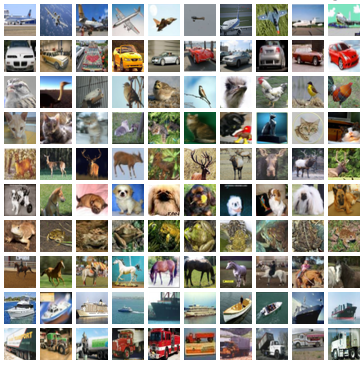

# 实战Kaggle比赛：图像分类（CIFAR-10）

CIFAR-10是计算机视觉领域的一个重要的数据集。本节中，我们将动手实战一个有关它的Kaggle比赛：CIFAR-10图像分类问题。该比赛的网页地址是

> https://www.kaggle.com/c/cifar-10


图9.15展示了该比赛的网页信息。为了便于提交结果，请先在Kaggle网站上注册账号。


首先，导入实验所需的包或模块。

```{.python .input}
import sys
sys.path.insert(0, '..')

import datetime
import gluonbook as gb
from mxnet import autograd, gluon, init
from mxnet.gluon import data as gdata, nn, loss as gloss
import os
import pandas as pd
import shutil
```

## 获取数据集

比赛数据分为训练集和测试集。训练集包含5万张图片。测试集包含30万张图片：其中有1万张图片用来计分，其他29万张不计分的图片是为了防止人工标注测试集。两个数据集中的图片格式都是png，高和宽均为32像素，并含有RGB三个通道（彩色）。图片一共涵盖10个类别，分别为飞机、汽车、鸟、猫、鹿、狗、青蛙、马、船和卡车，如图9.16所示。




### 下载数据集

登录Kaggle后，我们可以点击图9.15所示的CIFAR-10图像分类比赛网页上的“Data”标签，并分别下载训练数据集“train.7z”、测试数据集“test.7z”和训练数据集标签“trainLabels.csv”。


### 解压数据集

下载完训练数据集“train.7z”和测试数据集“test.7z”后请解压缩。解压缩后，将训练数据集、测试数据集和训练数据集标签分别存放在以下路径：

* ../data/kaggle_cifar10/train/[1-50000].png
* ../data/kaggle_cifar10/test/[1-300000].png
* ../data/kaggle_cifar10/trainLabels.csv

为方便快速上手，我们提供了上述数据集的小规模采样，例如仅含100个训练样本的“train_tiny.zip”和1个测试样本的“test_tiny.zip”。它们解压后的文件夹名称分别为“train_tiny”和“test_tiny”。此外，训练数据集标签的压缩文件解压后得到“trainLabels.csv”。如果你将使用上述Kaggle比赛的完整数据集，还需要把下面`demo`变量改为`False`。

```{.python .input}
# 如果使用下载的 Kaggle 比赛的完整数据集，把下面 demo 变量改为 False。
demo = True
if demo:
    import zipfile
    for f in ['train_tiny.zip', 'test_tiny.zip', 'trainLabels.csv.zip']:
        with zipfile.ZipFile('../data/kaggle_cifar10/' + f, 'r') as z:
            z.extractall('../data/kaggle_cifar10/')
```

### 整理数据集

我们接下来定义`reorg_cifar10_data`函数来整理数据集。整理后，同一类图片将被放在同一个文件夹下，便于我们稍后读取。该函数中的参数`valid_ratio`是验证集样本数与原始训练集样本数之比。以`valid_ratio=0.1`为例，由于原始训练数据集有50,000张图片，调参时将有45,000张图片用于训练并存放在路径“`input_dir/train`”，而另外5,000张图片为验证集并存放在路径“`input_dir/valid`”。

```{.python .input  n=2}
def reorg_cifar10_data(data_dir, label_file, train_dir, test_dir, input_dir,
                       valid_ratio):
    # 读取训练数据集标签。
    with open(os.path.join(data_dir, label_file), 'r') as f:
        # 跳过文件头行（栏名称）。
        lines = f.readlines()[1:]
        tokens = [l.rstrip().split(',') for l in lines]
        idx_label = dict(((int(idx), label) for idx, label in tokens))
    labels = set(idx_label.values())

    n_train_valid = len(os.listdir(os.path.join(data_dir, train_dir)))
    n_train = int(n_train_valid * (1 - valid_ratio))
    assert 0 < n_train < n_train_valid
    n_train_per_label = n_train // len(labels)
    label_count = {}

    def mkdir_if_not_exist(path):
        if not os.path.exists(os.path.join(*path)):
            os.makedirs(os.path.join(*path))

    # 整理训练和验证集。
    for train_file in os.listdir(os.path.join(data_dir, train_dir)):
        idx = int(train_file.split('.')[0])
        label = idx_label[idx]
        mkdir_if_not_exist([data_dir, input_dir, 'train_valid', label])
        shutil.copy(os.path.join(data_dir, train_dir, train_file),
                    os.path.join(data_dir, input_dir, 'train_valid', label))
        if label not in label_count or label_count[label] < n_train_per_label:
            mkdir_if_not_exist([data_dir, input_dir, 'train', label])
            shutil.copy(os.path.join(data_dir, train_dir, train_file),
                        os.path.join(data_dir, input_dir, 'train', label))
            label_count[label] = label_count.get(label, 0) + 1
        else:
            mkdir_if_not_exist([data_dir, input_dir, 'valid', label])
            shutil.copy(os.path.join(data_dir, train_dir, train_file),
                        os.path.join(data_dir, input_dir, 'valid', label))

    # 整理测试集。
    mkdir_if_not_exist([data_dir, input_dir, 'test', 'unknown'])
    for test_file in os.listdir(os.path.join(data_dir, test_dir)):
        shutil.copy(os.path.join(data_dir, test_dir, test_file),
                    os.path.join(data_dir, input_dir, 'test', 'unknown'))
```

我们在这里仅仅使用100个训练样本和1个测试样本。训练和测试数据集的文件夹名称分别为“train_tiny”和“test_tiny”。相应地，我们仅将批量大小设为1。实际训练和测试时应使用Kaggle比赛的完整数据集，并将批量大小`batch_size`设为一个较大的整数，例如128。我们将10%的训练样本作为调参时的验证集。

```{.python .input  n=3}
if demo:
    # 注意：此处使用小训练集。
    train_dir = 'train_tiny'
    # 注意：此处使用小测试集。
    test_dir = 'test_tiny'
    # 注意：此处将批量大小相应设小。使用 Kaggle 比赛的完整数据集时可设较大整数。
    batch_size = 1
else:
    train_dir = 'train'
    test_dir = 'test'
    batch_size = 128

data_dir = '../data/kaggle_cifar10'
label_file = 'trainLabels.csv'
input_dir = 'train_valid_test'
valid_ratio = 0.1
reorg_cifar10_data(data_dir, label_file, train_dir, test_dir, input_dir,
                   valid_ratio)
```

## 图片增广

为应对过拟合，我们在这里使用`transforms`来增广数据。例如，加入`transforms.RandomFlipLeftRight()`即可随机对图片做镜面反转。我们也通过`transforms.Normalize()`对彩色图像RGB三个通道分别做标准化。以下列举了部分操作。这些操作可以根据需求来决定是否使用或修改。

```{.python .input  n=4}
transform_train = gdata.vision.transforms.Compose([
    # 将图片放大成高和宽各为 40 像素的正方形。
    gdata.vision.transforms.Resize(40),
    # 随机对高和宽各为 40 像素的正方形图片裁剪出面积为原图片面积 0.64 到 1 倍之间的小正方
    # 形，再放缩为高和宽各为 32 像素的正方形。
    gdata.vision.transforms.RandomResizedCrop(32, scale=(0.64, 1.0),
                                              ratio=(1.0, 1.0)),
    # 随机左右翻转图片。
    gdata.vision.transforms.RandomFlipLeftRight(),
    # 将图片像素值按比例缩小到 0 和 1 之间，并将数据格式从“高 * 宽 * 通道”改为
    # “通道 * 高 * 宽”。
    gdata.vision.transforms.ToTensor(),
    # 对图片的每个通道做标准化。
    gdata.vision.transforms.Normalize([0.4914, 0.4822, 0.4465],
                                      [0.2023, 0.1994, 0.2010])
])

# 测试时，无需对图像做标准化以外的增强数据处理。
transform_test = gdata.vision.transforms.Compose([
    gdata.vision.transforms.ToTensor(),
    gdata.vision.transforms.Normalize([0.4914, 0.4822, 0.4465],
                                      [0.2023, 0.1994, 0.2010])
])
```

接下来，我们可以使用`ImageFolderDataset`类来读取整理后的数据集，其中每个数据样本包括图像和标签。需要注意的是，我们要在`DataLoader`中调用刚刚定义好的图片增广函数。其中`transform_first`函数指明对每个数据样本中的图像做数据增广。

```{.python .input  n=5}
# 读取原始图像文件。flag=1 说明输入图像有三个通道（彩色）。
train_ds = gdata.vision.ImageFolderDataset(
    os.path.join(data_dir, input_dir, 'train'), flag=1)
valid_ds = gdata.vision.ImageFolderDataset(
    os.path.join(data_dir, input_dir, 'valid'), flag=1)
train_valid_ds = gdata.vision.ImageFolderDataset(
    os.path.join(data_dir, input_dir, 'train_valid'), flag=1)
test_ds = gdata.vision.ImageFolderDataset(
    os.path.join(data_dir, input_dir, 'test'), flag=1)

train_data = gdata.DataLoader(train_ds.transform_first(transform_train),
                              batch_size, shuffle=True, last_batch='keep')
valid_data = gdata.DataLoader(valid_ds.transform_first(transform_test),
                              batch_size, shuffle=True, last_batch='keep')
train_valid_data = gdata.DataLoader(train_valid_ds.transform_first(
    transform_train), batch_size, shuffle=True, last_batch='keep')
test_data = gdata.DataLoader(test_ds.transform_first(transform_test),
                             batch_size, shuffle=False, last_batch='keep')
```

## 定义模型

我们在这里定义ResNet-18模型，并使用混合式编程来提升执行效率。

```{.python .input  n=6}
class Residual(nn.HybridBlock):
    def __init__(self, num_channels, use_1x1conv=False, strides=1, **kwargs):
        super(Residual, self).__init__(**kwargs)
        self.conv1 = nn.Conv2D(num_channels, kernel_size=3, padding=1,
                               strides=strides)
        self.conv2 = nn.Conv2D(num_channels, kernel_size=3, padding=1)
        if use_1x1conv:
            self.conv3 = nn.Conv2D(num_channels, kernel_size=1,
                                   strides=strides)
        else:
            self.conv3 = None
        self.bn1 = nn.BatchNorm()
        self.bn2 = nn.BatchNorm()

    def hybrid_forward(self, F, X):
        Y = F.relu(self.bn1(self.conv1(X)))
        Y = self.bn2(self.conv2(Y))
        if self.conv3:
            X = self.conv3(X)
        return F.relu(Y + X)
    
def resnet18(num_classes):
    net = nn.HybridSequential()
    net.add(nn.Conv2D(64, kernel_size=3, strides=1, padding=1),
            nn.BatchNorm(), nn.Activation('relu'))

    def resnet_block(num_channels, num_residuals, first_block=False):
        blk = nn.HybridSequential()
        for i in range(num_residuals):
            if i == 0 and not first_block:
                blk.add(Residual(num_channels, use_1x1conv=True, strides=2))
            else:
                blk.add(Residual(num_channels))
        return blk 

    net.add(resnet_block(64, 2, first_block=True),
            resnet_block(128, 2), 
            resnet_block(256, 2), 
            resnet_block(512, 2)) 
    net.add(nn.GlobalAvgPool2D(), nn.Dense(num_classes))
    return net 

def get_net(ctx):
    num_classes = 10
    net = resnet18(num_classes)
    net.initialize(ctx=ctx, init=init.Xavier())
    return net
```

## 定义训练函数

我们将根据模型在验证集上的表现来选择模型并调节超参数。下面定义了模型的训练函数`train`。我们记录了每个迭代周期的训练时间。这有助于比较不同模型的时间开销。

```{.python .input  n=7}
loss = gloss.SoftmaxCrossEntropyLoss()

def train(net, train_data, valid_data, num_epochs, lr, wd, ctx, lr_period,
          lr_decay):
    trainer = gluon.Trainer(net.collect_params(), 'sgd',
                            {'learning_rate': lr, 'momentum': 0.9, 'wd': wd})
    prev_time = datetime.datetime.now()
    for epoch in range(num_epochs):
        train_l = 0.0
        train_acc = 0.0
        if epoch > 0 and epoch % lr_period == 0:
            trainer.set_learning_rate(trainer.learning_rate * lr_decay)
        for X, y in train_data:
            y = y.astype('float32').as_in_context(ctx)
            with autograd.record():
                y_hat = net(X.as_in_context(ctx))
                l = loss(y_hat, y)
            l.backward()
            trainer.step(batch_size)
            train_l += l.mean().asscalar()
            train_acc += gb.accuracy(y_hat, y)
        cur_time = datetime.datetime.now()
        h, remainder = divmod((cur_time - prev_time).seconds, 3600)
        m, s = divmod(remainder, 60)
        time_s = "time %02d:%02d:%02d" % (h, m, s)
        if valid_data is not None:
            valid_acc = gb.evaluate_accuracy(valid_data, net, ctx)
            epoch_s = ("epoch %d, loss %f, train acc %f, valid acc %f, "
                       % (epoch, train_l / len(train_data),
                          train_acc / len(train_data), valid_acc))
        else:
            epoch_s = ("epoch %d, loss %f, train acc %f, " %
                       (epoch, train_l / len(train_data),
                        train_acc / len(train_data)))
        prev_time = cur_time
        print(epoch_s + time_s + ', lr ' + str(trainer.learning_rate))
```

## 训练并验证模型

现在，我们可以训练并验证模型了。以下的超参数都是可以调节的，例如增加迭代周期。

```{.python .input  n=8}
ctx = gb.try_gpu()
num_epochs = 1
# 学习率。
lr = 0.1
# 权重衰减参数。
wd = 5e-4
# 优化算法的学习率将在每 80 个迭代周期时自乘 0.1。
lr_period = 80
lr_decay = 0.1

net = get_net(ctx)
net.hybridize()
train(net, train_data, valid_data, num_epochs, lr, wd, ctx, lr_period,
      lr_decay)
```

## 对测试集分类并在Kaggle提交结果

当得到一组满意的模型设计和超参数后，我们使用所有训练数据集（含验证集）重新训练模型，并对测试集分类。

```{.python .input  n=9}
net = get_net(ctx)
net.hybridize()
train(net, train_valid_data, None, num_epochs, lr, wd, ctx, lr_period,
      lr_decay)

preds = []
for X, _ in test_data:
    y_hat = net(X.as_in_context(ctx))
    preds.extend(y_hat.argmax(axis=1).astype(int).asnumpy())
sorted_ids = list(range(1, len(test_ds) + 1))
sorted_ids.sort(key=lambda x:str(x))
df = pd.DataFrame({'id': sorted_ids, 'label': preds})
df['label'] = df['label'].apply(lambda x: train_valid_ds.synsets[x])
df.to_csv('submission.csv', index=False)
```

执行完上述代码后，会生成一个“submission.csv”文件。这个文件符合Kaggle比赛要求的提交格式。这时我们可以在Kaggle上把对测试集分类的结果提交并查看分类准确率。你需要登录Kaggle网站，访问CIFAR-10比赛网页，并点击右侧“Submit Predictions”或“Late Submission”按钮。然后，点击页面下方“Upload Submission File”选择需要提交的分类结果文件。最后，点击页面最下方的“Make Submission”按钮就可以查看结果了。


## 小结

* CIFAR-10是计算机视觉领域的一个重要的数据集。
* 我们可以应用卷积神经网络、图片增广和混合式编程来实战图像分类比赛。


## 练习

* 使用Kaggle比赛的完整CIFAR-10数据集。把批量大小`batch_size`和迭代周期数`num_epochs`分别改为128和100。看看你可以在这个比赛中拿到什么样的准确率和名次？
* 如果不使用增强数据的方法能拿到什么样的准确率？
* 扫码直达讨论区，在社区交流方法和结果。你能发掘出其他更好的技巧吗？

## 扫码直达[讨论区](https://discuss.gluon.ai/t/topic/1545/)


