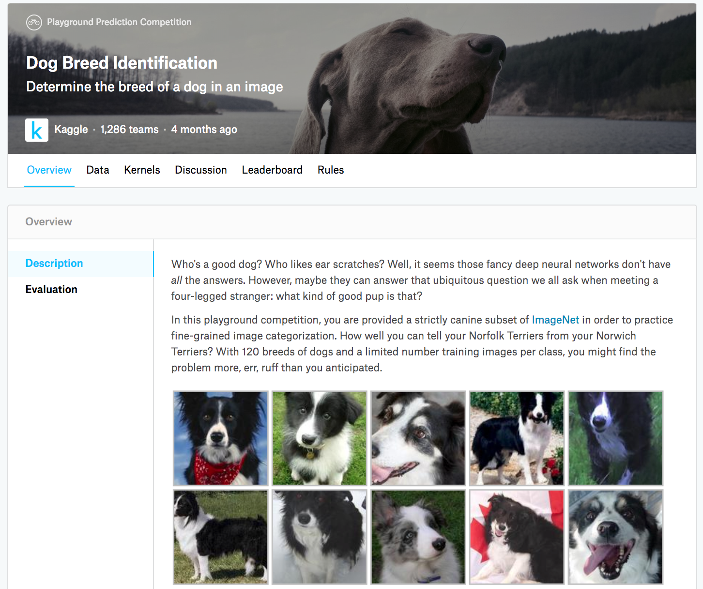

# 实战Kaggle比赛：狗的品种识别（ImageNet Dogs）


我们将在本节动手实战Kaggle比赛中的狗的品种识别问题。该比赛的网页地址是 https://www.kaggle.com/c/dog-breed-identification 。

在这个比赛中，将识别120类不同品种的狗。这个比赛的数据集实际上是著名的ImageNet的子集数据集。和上一节的CIFAR-10数据集中的图像不同，ImageNet数据集中的图像更高更宽，且尺寸不一。

图9.17展示了该比赛的网页信息。为了便于提交结果，请先在Kaggle网站上注册账号。



首先，导入比赛所需的包或模块。

```{.python .input}
import collections
import d2lzh as d2l
import math
from mxnet import autograd, gluon, init, nd
from mxnet.gluon import data as gdata, loss as gloss, model_zoo, nn
import os
import shutil
import time
import zipfile
```

## 获取和整理数据集


比赛数据分为训练集和测试集。训练集包含了10,222张图像，测试集包含了10,357张图像。两个数据集中的图像格式都是JPEG。这些图像都含有RGB三个通道（彩色），高和宽的大小不一。训练集中狗的类别共有120种，如拉布拉多、贵宾、腊肠、萨摩耶、哈士奇、吉娃娃和约克夏等。


### 下载数据集

登录Kaggle后，我们可以点击图9.17所示的狗的品种识别比赛网页上的“Data”标签，并分别下载训练数据集train.zip、测试数据集test.zip和训练数据集标签label.csv.zip。下载完成后，将它们分别存放在以下3个路径：

* ../data/kaggle_dog/train.zip；
* ../data/kaggle_dog/test.zip；
* ../data/kaggle_dog/labels.csv.zip。


为方便快速上手，我们提供了上述数据集的小规模采样train_valid_test_tiny.zip。如果要使用上述Kaggle比赛的完整数据集，还需要把下面`demo`变量改为`False`。

```{.python .input  n=1}
# 如果使用下载的Kaggle比赛的完整数据集，把demo变量改为False
demo = True
data_dir = '../data/kaggle_dog'
if demo:
    zipfiles = ['train_valid_test_tiny.zip']
else:
    zipfiles = ['train.zip', 'test.zip', 'labels.csv.zip']
for f in zipfiles:
    with zipfile.ZipFile(data_dir + '/' + f, 'r') as z:
        z.extractall(data_dir)
```

### 整理数据集

我们定义下面的`reorg_train_valid`函数来从Kaggle比赛的完整原始训练集中切分出验证集。该函数中的参数`valid_ratio`指验证集中每类狗的样本数与原始训练集中数量最少一类的狗的样本数（66）之比。经过整理后，同一类狗的图像将被放在同一个文件夹下，便于稍后读取。

```{.python .input}
def reorg_train_valid(data_dir, train_dir, input_dir, valid_ratio, idx_label):
    # 训练集中数量最少一类的狗的样本数
    min_n_train_per_label = (
        collections.Counter(idx_label.values()).most_common()[:-2:-1][0][1])
    # 验证集中每类狗的样本数
    n_valid_per_label = math.floor(min_n_train_per_label * valid_ratio)
    label_count = {}
    for train_file in os.listdir(os.path.join(data_dir, train_dir)):
        idx = train_file.split('.')[0]
        label = idx_label[idx]
        d2l.mkdir_if_not_exist([data_dir, input_dir, 'train_valid', label])
        shutil.copy(os.path.join(data_dir, train_dir, train_file),
                    os.path.join(data_dir, input_dir, 'train_valid', label))
        if label not in label_count or label_count[label] < n_valid_per_label:
            d2l.mkdir_if_not_exist([data_dir, input_dir, 'valid', label])
            shutil.copy(os.path.join(data_dir, train_dir, train_file),
                        os.path.join(data_dir, input_dir, 'valid', label))
            label_count[label] = label_count.get(label, 0) + 1
        else:
            d2l.mkdir_if_not_exist([data_dir, input_dir, 'train', label])
            shutil.copy(os.path.join(data_dir, train_dir, train_file),
                        os.path.join(data_dir, input_dir, 'train', label))
```

下面的`reorg_dog_data`函数用来读取训练数据标签、切分验证集并整理测试集。

```{.python .input  n=2}
def reorg_dog_data(data_dir, label_file, train_dir, test_dir, input_dir,
                   valid_ratio):
    # 读取训练数据标签
    with open(os.path.join(data_dir, label_file), 'r') as f:
        # 跳过文件头行（栏名称）
        lines = f.readlines()[1:]
        tokens = [l.rstrip().split(',') for l in lines]
        idx_label = dict(((idx, label) for idx, label in tokens))
    reorg_train_valid(data_dir, train_dir, input_dir, valid_ratio, idx_label)
    # 整理测试集
    d2l.mkdir_if_not_exist([data_dir, input_dir, 'test', 'unknown'])
    for test_file in os.listdir(os.path.join(data_dir, test_dir)):
        shutil.copy(os.path.join(data_dir, test_dir, test_file),
                    os.path.join(data_dir, input_dir, 'test', 'unknown'))
```

因为我们在这里使用了小数据集，所以将批量大小设为1。在实际训练和测试时，我们应使用Kaggle比赛的完整数据集并调用`reorg_dog_data`函数来整理数据集。相应地，我们也需要将批量大小`batch_size`设为一个较大的整数，如128。

```{.python .input  n=3}
if demo:
    # 注意，此处使用小数据集并将批量大小相应设小。使用Kaggle比赛的完整数据集时可设批量大小
    # 为较大整数
    input_dir, batch_size = 'train_valid_test_tiny', 1
else:
    label_file, train_dir, test_dir = 'labels.csv', 'train', 'test'
    input_dir, batch_size, valid_ratio = 'train_valid_test', 128, 0.1
    reorg_dog_data(data_dir, label_file, train_dir, test_dir, input_dir,
                   valid_ratio)
```

## 图像增广

本节比赛的图像尺寸比上一节中的更大。这里列举了更多可能有用的图像增广操作。

```{.python .input  n=4}
transform_train = gdata.vision.transforms.Compose([
    # 随机对图像裁剪出面积为原图像面积0.08~1倍、且高和宽之比在3/4~4/3的图像，再放缩为高和
    # 宽均为224像素的新图像
    gdata.vision.transforms.RandomResizedCrop(224, scale=(0.08, 1.0),
                                              ratio=(3.0/4.0, 4.0/3.0)),
    gdata.vision.transforms.RandomFlipLeftRight(),
    # 随机变化亮度、对比度和饱和度
    gdata.vision.transforms.RandomColorJitter(brightness=0.4, contrast=0.4,
                                              saturation=0.4),
    # 随机加噪声
    gdata.vision.transforms.RandomLighting(0.1),
    gdata.vision.transforms.ToTensor(),
    # 对图像的每个通道做标准化
    gdata.vision.transforms.Normalize([0.485, 0.456, 0.406],
                                      [0.229, 0.224, 0.225])])
```

测试时，我们只使用确定性的图像预处理操作。

```{.python .input}
transform_test = gdata.vision.transforms.Compose([
    gdata.vision.transforms.Resize(256),
    # 将图像中央的高和宽均为224的正方形区域裁剪出来
    gdata.vision.transforms.CenterCrop(224),
    gdata.vision.transforms.ToTensor(),
    gdata.vision.transforms.Normalize([0.485, 0.456, 0.406],
                                      [0.229, 0.224, 0.225])])
```

## 读取数据集

和上一节一样，我们创建`ImageFolderDataset`实例来读取整理后的含原始图像文件的数据集。

```{.python .input  n=5}
train_ds = gdata.vision.ImageFolderDataset(
    os.path.join(data_dir, input_dir, 'train'), flag=1)
valid_ds = gdata.vision.ImageFolderDataset(
    os.path.join(data_dir, input_dir, 'valid'), flag=1)
train_valid_ds = gdata.vision.ImageFolderDataset(
    os.path.join(data_dir, input_dir, 'train_valid'), flag=1)
test_ds = gdata.vision.ImageFolderDataset(
    os.path.join(data_dir, input_dir, 'test'), flag=1)
```

这里创建`DataLoader`实例的方法也与上一节中的相同。

```{.python .input}
train_iter = gdata.DataLoader(train_ds.transform_first(transform_train),
                              batch_size, shuffle=True, last_batch='keep')
valid_iter = gdata.DataLoader(valid_ds.transform_first(transform_test),
                              batch_size, shuffle=True, last_batch='keep')
train_valid_iter = gdata.DataLoader(train_valid_ds.transform_first(
    transform_train), batch_size, shuffle=True, last_batch='keep')
test_iter = gdata.DataLoader(test_ds.transform_first(transform_test),
                             batch_size, shuffle=False, last_batch='keep')
```

## 定义模型

这个比赛的数据属于ImageNet数据集的子集，因此我们可以使用[“微调”](fine-tuning.md)一节中介绍的思路，选用在ImageNet完整数据集上预训练的模型来抽取图像特征，以作为自定义小规模输出网络的输入。Gluon提供了丰富的预训练模型，这里以预训练的ResNet-34模型为例。由于比赛数据集属于预训练数据集的子集，因此我们直接复用预训练模型在输出层的输入，即抽取的特征。然后，我们可以将原输出层替换成自定义的可训练的小规模输出网络，如两个串联的全连接层。与[“微调”](fine-tuning.md)一节中的实验不同，这里不再训练用于抽取特征的预训练模型：这样既节省了训练时间，又省去了存储其模型参数的梯度的空间。

需要注意的是，我们在图像增广中使用了ImageNet数据集上RGB三个通道的均值和标准差做标准化，这和预训练模型所做的标准化是一致的。

```{.python .input  n=6}
def get_net(ctx):
    finetune_net = model_zoo.vision.resnet34_v2(pretrained=True)
    # 定义新的输出网络
    finetune_net.output_new = nn.HybridSequential(prefix='')
    finetune_net.output_new.add(nn.Dense(256, activation='relu'))
    # 120是输出的类别个数
    finetune_net.output_new.add(nn.Dense(120))
    # 初始化输出网络
    finetune_net.output_new.initialize(init.Xavier(), ctx=ctx)
    # 把模型参数分配到内存或显存上
    finetune_net.collect_params().reset_ctx(ctx)
    return finetune_net
```

在计算损失时，我们先通过成员变量`features`来获取预训练模型输出层的输入，即抽取的特征。然后，将该特征作为自定义的小规模输出网络的输入，并计算输出。

```{.python .input}
loss = gloss.SoftmaxCrossEntropyLoss()

def evaluate_loss(data_iter, net, ctx):
    l_sum, n = 0.0, 0
    for X, y in data_iter:
        y = y.as_in_context(ctx)
        output_features = net.features(X.as_in_context(ctx))
        outputs = net.output_new(output_features)
        l_sum += loss(outputs, y).sum().asscalar()
        n += y.size
    return l_sum / n
```

## 定义训练函数

我们将依赖模型在验证集上的表现来选择模型并调节超参数。模型的训练函数`train`只训练自定义的小规模输出网络。

```{.python .input  n=7}
def train(net, train_iter, valid_iter, num_epochs, lr, wd, ctx, lr_period,
          lr_decay):
    # 只训练自定义的小规模输出网络
    trainer = gluon.Trainer(net.output_new.collect_params(), 'sgd',
                            {'learning_rate': lr, 'momentum': 0.9, 'wd': wd})
    for epoch in range(num_epochs):
        train_l_sum, n, start = 0.0, 0, time.time()
        if epoch > 0 and epoch % lr_period == 0:
            trainer.set_learning_rate(trainer.learning_rate * lr_decay)
        for X, y in train_iter:
            y = y.as_in_context(ctx)
            output_features = net.features(X.as_in_context(ctx))
            with autograd.record():
                outputs = net.output_new(output_features)
                l = loss(outputs, y).sum()
            l.backward()
            trainer.step(batch_size)
            train_l_sum += l.asscalar()
            n += y.size
        time_s = "time %.2f sec" % (time.time() - start)
        if valid_iter is not None:
            valid_loss = evaluate_loss(valid_iter, net, ctx)
            epoch_s = ("epoch %d, train loss %f, valid loss %f, "
                       % (epoch + 1, train_l_sum / n, valid_loss))
        else:
            epoch_s = ("epoch %d, train loss %f, "
                       % (epoch + 1, train_l_sum / n))
        print(epoch_s + time_s + ', lr ' + str(trainer.learning_rate))
```

## 训练并验证模型

现在，我们可以训练并验证模型了。以下超参数都是可以调节的，如增加迭代周期等。由于`lr_period`和`lr_decay`分别设为10和0.1，优化算法的学习率将在每10个迭代周期后自乘0.1。

```{.python .input  n=9}
ctx, num_epochs, lr, wd = d2l.try_gpu(), 1, 0.01, 1e-4
lr_period, lr_decay, net = 10, 0.1, get_net(ctx)
net.hybridize()
train(net, train_iter, valid_iter, num_epochs, lr, wd, ctx, lr_period,
      lr_decay)
```

## 对测试集分类并在Kaggle提交结果

得到一组满意的模型设计和超参数后，我们使用全部训练数据集（含验证集）重新训练模型，并对测试集分类。注意，我们要用刚训练好的输出网络做预测。

```{.python .input  n=8}
net = get_net(ctx)
net.hybridize()
train(net, train_valid_iter, None, num_epochs, lr, wd, ctx, lr_period,
      lr_decay)

preds = []
for data, label in test_iter:
    output_features = net.features(data.as_in_context(ctx))
    output = nd.softmax(net.output_new(output_features))
    preds.extend(output.asnumpy())
ids = sorted(os.listdir(os.path.join(data_dir, input_dir, 'test/unknown')))
with open('submission.csv', 'w') as f:
    f.write('id,' + ','.join(train_valid_ds.synsets) + '\n')
    for i, output in zip(ids, preds):
        f.write(i.split('.')[0] + ',' + ','.join(
            [str(num) for num in output]) + '\n')
```

执行完上述代码后，会生成一个submission.csv文件。这个文件符合Kaggle比赛要求的提交格式。提交结果的方法与[“实战Kaggle比赛：房价预测”](../chapter_deep-learning-basics/kaggle-house-price.md)一节中的类似。


## 小结

* 我们可以使用在ImageNet数据集上预训练的模型抽取特征，并仅训练自定义的小规模输出网络，从而以较小的计算和存储开销对ImageNet的子集数据集做分类。


## 练习

* 使用Kaggle完整数据集，把批量大小`batch_size`和迭代周期数`num_epochs`分别调大些，可以在Kaggle上拿到什么样的结果？
* 使用更深的预训练模型，你能获得更好的结果吗？
* 扫码直达讨论区，在社区交流方法和结果。你能发掘出其他更好的技巧吗？ 


## 扫码直达[讨论区](https://discuss.gluon.ai/t/topic/2399)


