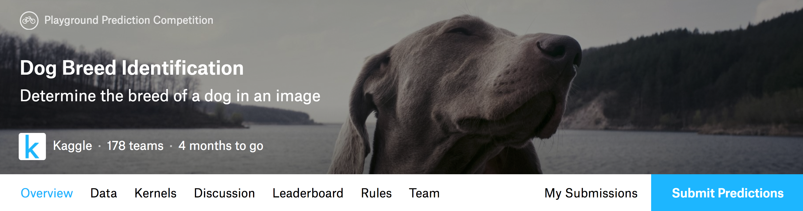
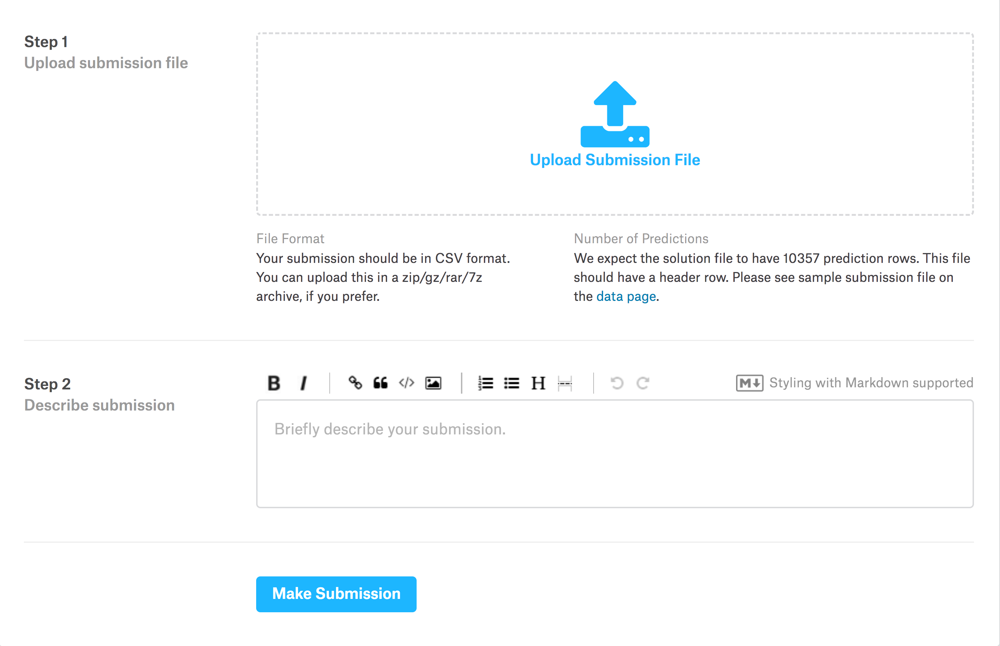

# 实战Kaggle比赛——使用Gluon识别120种狗 (ImageNet Dogs)


我们在本章中选择了Kaggle中的[120种狗类识别问题](https://www.kaggle.com/c/dog-breed-identification)。这是著名的ImageNet的子集数据集。与之前的[CIFAR-10原始图像分类问题](kaggle-gluon-cifar10.md)不同，本问题中的图片文件大小更接近真实照片大小，且大小不一。本问题的输出也变的更加通用：我们将输出每张图片对应120种狗的分别概率。


## Kaggle中的CIFAR-10原始图像分类问题

[Kaggle](https://www.kaggle.com)是一个著名的供机器学习爱好者交流的平台。为了便于提交结果，请大家注册[Kaggle](https://www.kaggle.com)账号。然后请大家先点击[120种狗类识别问题](https://www.kaggle.com/c/dog-breed-identification)了解有关本次比赛的信息。


## 整理原始数据集

比赛数据分为训练数据集和测试数据集。训练集包含10,222张图片。测试集包含10,357张图片。

两个数据集都是jpg彩色图片，大小接近真实照片大小，且大小不一。训练集一共有120类狗的图片。


### 下载数据集


登录Kaggle后，数据可以从[120种狗类识别问题](https://www.kaggle.com/c/dog-breed-identification/data)中下载。

* [训练数据集train.zip下载地址](https://www.kaggle.com/c/dog-breed-identification/download/train.zip)

* [测试数据集test.zip下载地址](https://www.kaggle.com/c/dog-breed-identification/download/test.zip)

* [训练数据标签label.csv.zip下载地址](https://www.kaggle.com/c/dog-breed-identification/download/labels.csv.zip)


### 解压数据集

训练数据集train.zip和测试数据集test.zip都是压缩格式，下载后它们的路径可以如下：

* ../data/kaggle_dog/train.zip
* ../data/kaggle_dog/test.zip
* ../data/kaggle_dog/labels.csv.zip

为了使网页编译快一点，我们在git repo里仅仅存放小数据样本（'train_valid_test_tiny.zip'）。执行以下代码会从git repo里解压生成小数据样本。

```{.python .input  n=1}
# 如果训练下载的Kaggle的完整数据集，把demo改为False。
demo = True
data_dir = '../data/kaggle_dog'

if demo:
    zipfiles= ['train_valid_test_tiny.zip']
else:
    zipfiles= ['train.zip', 'test.zip', 'labels.csv.zip']

import zipfile
for fin in zipfiles:
    with zipfile.ZipFile(data_dir + '/' + fin, 'r') as zin:
        zin.extractall(data_dir)
```

### 整理数据集

对于Kaggle的完整数据集，我们需要定义下面的reorg_dog_data函数来整理一下。整理后，同一类狗的图片将出现在在同一个文件夹下，便于`Gluon`稍后读取。

函数中的参数如data_dir、train_dir和test_dir对应上述数据存放路径及原始训练和测试的图片集文件夹名称。参数label_file为训练数据标签的文件名称。参数input_dir是整理后数据集文件夹名称。参数valid_ratio是验证集中每类狗的数量占原始训练集中数量最少一类的狗的数量（66）的比重。

```{.python .input  n=2}
import math
import os
import shutil
from collections import Counter

def reorg_dog_data(data_dir, label_file, train_dir, test_dir, input_dir, 
                   valid_ratio):
    # 读取训练数据标签。
    with open(os.path.join(data_dir, label_file), 'r') as f:
        # 跳过文件头行（栏名称）。
        lines = f.readlines()[1:]
        tokens = [l.rstrip().split(',') for l in lines]
        idx_label = dict(((idx, label) for idx, label in tokens))
    labels = set(idx_label.values())

    num_train = len(os.listdir(os.path.join(data_dir, train_dir)))
    # 训练集中数量最少一类的狗的数量。
    min_num_train_per_label = (
        Counter(idx_label.values()).most_common()[:-2:-1][0][1])
    # 验证集中每类狗的数量。
    num_valid_per_label = math.floor(min_num_train_per_label * valid_ratio)
    label_count = dict()

    def mkdir_if_not_exist(path):
        if not os.path.exists(os.path.join(*path)):
            os.makedirs(os.path.join(*path))

    # 整理训练和验证集。
    for train_file in os.listdir(os.path.join(data_dir, train_dir)):
        idx = train_file.split('.')[0]
        label = idx_label[idx]
        mkdir_if_not_exist([data_dir, input_dir, 'train_valid', label])
        shutil.copy(os.path.join(data_dir, train_dir, train_file),
                    os.path.join(data_dir, input_dir, 'train_valid', label))
        if label not in label_count or label_count[label] < num_valid_per_label:
            mkdir_if_not_exist([data_dir, input_dir, 'valid', label])
            shutil.copy(os.path.join(data_dir, train_dir, train_file),
                        os.path.join(data_dir, input_dir, 'valid', label))
            label_count[label] = label_count.get(label, 0) + 1
        else:
            mkdir_if_not_exist([data_dir, input_dir, 'train', label])
            shutil.copy(os.path.join(data_dir, train_dir, train_file),
                        os.path.join(data_dir, input_dir, 'train', label))

    # 整理测试集。
    mkdir_if_not_exist([data_dir, input_dir, 'test', 'unknown'])
    for test_file in os.listdir(os.path.join(data_dir, test_dir)):
        shutil.copy(os.path.join(data_dir, test_dir, test_file),
                    os.path.join(data_dir, input_dir, 'test', 'unknown'))
```

再次强调，为了使网页编译快一点，我们在这里仅仅使用小数据样本。相应地，我们仅将批量大小设为2。实际训练和测试时应使用Kaggle的完整数据集并调用reorg_dog_data函数整理便于`Gluon`读取的格式。由于数据集较大，批量大小batch_size大小可设为一个较大的整数，例如128。

```{.python .input  n=3}
if demo:
    # 注意：此处使用小数据集为便于网页编译。
    input_dir = 'train_valid_test_tiny'
    # 注意：此处相应使用小批量。对Kaggle的完整数据集可设较大的整数，例如128。
    batch_size = 2
else:
    label_file = 'labels.csv'
    train_dir = 'train'
    test_dir = 'test'
    input_dir = 'train_valid_test'
    batch_size = 128
    valid_ratio = 0.1 
    reorg_dog_data(data_dir, label_file, train_dir, test_dir, input_dir, 
                   valid_ratio)
```

## 使用Gluon读取整理后的数据集

为避免过拟合，我们在这里使用`image.CreateAugmenter`来增广数据集。例如我们设`rand_mirror=True`即可随机对每张图片做镜面反转。以下我们列举了该函数里的所有参数，这些参数都是可以调的。

```{.python .input  n=4}
from mxnet import autograd
from mxnet import gluon
from mxnet import image
from mxnet import init
from mxnet import nd
from mxnet.gluon.data import vision
import numpy as np

def transform_train(data, label):
    im = image.imresize(data.astype('float32') / 255, 96, 96)
    auglist = image.CreateAugmenter(data_shape=(3, 96, 96), resize=0, 
                        rand_crop=False, rand_resize=False, rand_mirror=True,
                        mean=None, std=None, 
                        brightness=0, contrast=0, 
                        saturation=0, hue=0, 
                        pca_noise=0, rand_gray=0, inter_method=2)
    for aug in auglist:
        im = aug(im)
    # 将数据格式从"高*宽*通道"改为"通道*高*宽"。
    im = nd.transpose(im, (2,0,1))
    return (im, nd.array([label]).asscalar().astype('float32'))

def transform_test(data, label):
    im = image.imresize(data.astype('float32') / 255, 96, 96)
    im = nd.transpose(im, (2,0,1))
    return (im, nd.array([label]).asscalar().astype('float32'))
```

接下来，我们可以使用`Gluon`中的`ImageFolderDataset`类来读取整理后的数据集。

```{.python .input  n=5}
input_str = data_dir + '/' + input_dir + '/'

# 读取原始图像文件。flag=1说明输入图像有三个通道（彩色）。
train_ds = vision.ImageFolderDataset(input_str + 'train', flag=1, 
                                     transform=transform_train)
valid_ds = vision.ImageFolderDataset(input_str + 'valid', flag=1, 
                                     transform=transform_test)
train_valid_ds = vision.ImageFolderDataset(input_str + 'train_valid', 
                                           flag=1, transform=transform_train)
test_ds = vision.ImageFolderDataset(input_str + 'test', flag=1, 
                                     transform=transform_test)

loader = gluon.data.DataLoader
train_data = loader(train_ds, batch_size, shuffle=True, last_batch='keep')
valid_data = loader(valid_ds, batch_size, shuffle=True, last_batch='keep')
train_valid_data = loader(train_valid_ds, batch_size, shuffle=True, 
                          last_batch='keep')
test_data = loader(test_ds, batch_size, shuffle=False, last_batch='keep')

# 交叉熵损失函数。
softmax_cross_entropy = gluon.loss.SoftmaxCrossEntropyLoss()
```

## 设计模型

我们这里使用了[ResNet-18](resnet-gluon.md)模型。我们使用[hybridizing](../chapter_gluon-advances/hybridize.md)来提升执行效率。

请注意：模型可以重新设计，参数也可以重新调整。

```{.python .input  n=6}
from mxnet.gluon import nn
from mxnet import nd

class Residual(nn.HybridBlock):
    def __init__(self, channels, same_shape=True, **kwargs):
        super(Residual, self).__init__(**kwargs)
        self.same_shape = same_shape
        with self.name_scope():
            strides = 1 if same_shape else 2
            self.conv1 = nn.Conv2D(channels, kernel_size=3, padding=1,
                                  strides=strides)
            self.bn1 = nn.BatchNorm()
            self.conv2 = nn.Conv2D(channels, kernel_size=3, padding=1)
            self.bn2 = nn.BatchNorm()
            if not same_shape:
                self.conv3 = nn.Conv2D(channels, kernel_size=1,
                                      strides=strides)

    def hybrid_forward(self, F, x):
        out = F.relu(self.bn1(self.conv1(x)))
        out = self.bn2(self.conv2(out))
        if not self.same_shape:
            x = self.conv3(x)
        return F.relu(out + x)

    
class ResNet(nn.HybridBlock):
    def __init__(self, num_classes, verbose=False, **kwargs):
        super(ResNet, self).__init__(**kwargs)
        self.verbose = verbose
        with self.name_scope():
            net = self.net = nn.HybridSequential()
            # 模块1
            net.add(nn.Conv2D(channels=32, kernel_size=3, strides=1, 
                              padding=1))
            net.add(nn.BatchNorm())
            net.add(nn.Activation(activation='relu'))
            # 模块2
            for _ in range(3):
                net.add(Residual(channels=32))
            # 模块3
            net.add(Residual(channels=64, same_shape=False))
            for _ in range(2):
                net.add(Residual(channels=64))
            # 模块4
            net.add(Residual(channels=128, same_shape=False))
            for _ in range(2):
                net.add(Residual(channels=128))
            # 模块5
            net.add(nn.GlobalAvgPool2D())
            net.add(nn.Flatten())
            net.add(nn.Dense(num_classes))

    def hybrid_forward(self, F, x):
        out = x
        for i, b in enumerate(self.net):
            out = b(out)
            if self.verbose:
                print('Block %d output: %s'%(i+1, out.shape))
        return out


def get_net(ctx):
    num_outputs = 120
    net = ResNet(num_outputs)
    net.initialize(ctx=ctx, init=init.Xavier())
    return net
```

## 训练模型并调参

在[过拟合](../chapter_supervised-learning/underfit-overfit.md)中我们讲过，过度依赖训练数据集的误差来推断测试数据集的误差容易导致过拟合。由于图像分类训练时间可能较长，为了方便，我们这里不再使用K折交叉验证，而是依赖验证集的结果来调参。

我们定义损失函数以便于计算验证集上的损失函数值。我们也定义了模型训练函数，其中的优化算法和参数都是可以调的。

```{.python .input  n=7}
import datetime
import sys
sys.path.append('..')
import utils

def get_loss(data, net, ctx):
    loss = 0.0
    for feas, label in data:
        label = label.as_in_context(ctx)
        output = net(feas.as_in_context(ctx))
        cross_entropy = softmax_cross_entropy(output, label)
        loss += nd.mean(cross_entropy).asscalar()
    return loss / len(data)

def train(net, train_data, valid_data, num_epochs, lr, wd, ctx, lr_period, 
          lr_decay):
    trainer = gluon.Trainer(
        net.collect_params(), 'sgd', {'learning_rate': lr, 'momentum': 0.9, 
                                      'wd': wd})
    prev_time = datetime.datetime.now()
    for epoch in range(num_epochs):
        train_loss = 0.0
        if epoch > 0 and epoch % lr_period == 0:
            trainer.set_learning_rate(trainer.learning_rate * lr_decay)
        for data, label in train_data:
            label = label.as_in_context(ctx)
            with autograd.record():
                output = net(data.as_in_context(ctx))
                loss = softmax_cross_entropy(output, label)
            loss.backward()
            trainer.step(batch_size)
            train_loss += nd.mean(loss).asscalar()
        cur_time = datetime.datetime.now()
        h, remainder = divmod((cur_time - prev_time).seconds, 3600)
        m, s = divmod(remainder, 60)
        time_str = "Time %02d:%02d:%02d" % (h, m, s)
        if valid_data is not None:  
            valid_loss = get_loss(valid_data, net, ctx)
            epoch_str = ("Epoch %d. Train loss: %f, Valid loss %f, "
                         % (epoch, train_loss / len(train_data), valid_loss))
        else:
            epoch_str = ("Epoch %d. Train loss: %f, "
                         % (epoch, train_loss / len(train_data)))
        prev_time = cur_time
        print(epoch_str + time_str + ', lr ' + str(trainer.learning_rate))
```

以下定义训练参数并训练模型。这些参数均可调。为了使网页编译快一点，我们这里将epoch数量有意设为1。事实上，epoch一般可以调大些。

我们将依据验证集的结果不断优化模型设计和调整参数。依据下面的参数设置，优化算法的学习率将在每80个epoch自乘0.1。

```{.python .input  n=9}
ctx = utils.try_gpu()
num_epochs = 1
learning_rate = 0.01
weight_decay = 5e-4
lr_period = 80
lr_decay = 0.1

net = get_net(ctx)
net.hybridize()
train(net, train_data, valid_data, num_epochs, learning_rate, 
      weight_decay, ctx, lr_period, lr_decay)
```

## 对测试集分类

当得到一组满意的模型设计和参数后，我们使用全部训练数据集（含验证集）重新训练模型，并对测试集分类。

```{.python .input  n=8}
import numpy as np

net = get_net(ctx)
net.hybridize()
train(net, train_valid_data, None, num_epochs, learning_rate, weight_decay, 
      ctx, lr_period, lr_decay)

outputs = []
for data, label in test_data:
    output = nd.softmax(net(data.as_in_context(ctx)))
    outputs.extend(output.asnumpy())
ids = sorted(os.listdir(os.path.join(data_dir, input_dir, 'test/unknown')))
with open('submission.csv', 'w') as f:
    f.write('id,' + ','.join(train_valid_ds.synsets) + '\n')
    for i, output in zip(ids, outputs):
        f.write(i.split('.')[0] + ',' + ','.join(
            [str(num) for num in output]) + '\n')
```

上述代码执行完会生成一个`submission.csv`的文件用于在Kaggle上提交。这是Kaggle要求的提交格式。这时我们可以在Kaggle上把对测试集分类的结果提交并查看分类准确率。你需要登录Kaggle网站，打开[120种狗类识别问题](https://www.kaggle.com/c/dog-breed-identification)，并点击下方右侧`Submit Predictions`按钮。




请点击下方`Upload Submission File`选择需要提交的预测结果。然后点击下方的`Make Submission`按钮就可以查看结果啦！



温馨提醒，目前**Kaggle仅限每个账号一天以内5次提交结果的机会**。所以提交结果前务必三思。


## 作业（[汇报作业和查看其他小伙伴作业](https://discuss.gluon.ai/t/topic/2399)）：

* 使用Kaggle完整数据集，把batch_size和num_epochs分别调大些，可以在Kaggle上拿到什么样的准确率和名次？
* 你还有什么其他办法可以继续改进模型和参数？小伙伴们都期待你的分享。

**吐槽和讨论欢迎点**[这里](https://discuss.gluon.ai/t/topic/2399)
