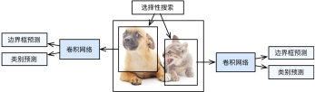
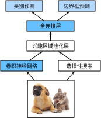
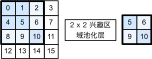
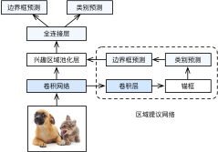
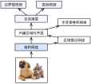

# Region-based CNNs (R-CNNs)


Besides single shot multibox detection
described in :numref:`sec_ssd`,
region-based CNNs or regions with CNN features (R-CNNs)
are also among many pioneering
approaches of 
applying
deep learning to object detection
:cite:`Girshick.Donahue.Darrell.ea.2014`.
In this section, we will introduce
the R-CNN and its series of improvements: the fast R-CNN
:cite:`Girshick.2015`, the faster R-CNN :cite:`Ren.He.Girshick.ea.2015`, and the mask R-CNN
:cite:`He.Gkioxari.Dollar.ea.2017`.
Due to limited space, we will only
focus on the design of these models.


## R-CNNs


The *R-CNN* first extracts
many (e.g., 2000) *region proposals*
from the input image
(e.g., anchor boxes can also be considered
as region proposals),
labeling their classes and bounding boxes (e.g., offsets).
:cite:`Girshick.Donahue.Darrell.ea.2014`
Then a CNN is used to 
perform forward propagation on each region proposal
to extract its features.
Next, features of each region proposal
are used for
predicting the class and bounding box
of this region proposal.



:label:`fig_r-cnn`

:numref:`fig_r-cnn` shows the R-CNN model. More concretely, the R-CNN consists of the following four steps:

1. Perform *selective search* to extract multiple high-quality region proposals on the input image :cite:`Uijlings.Van-De-Sande.Gevers.ea.2013`. These proposed regions are usually selected at multiple scales with different shapes and sizes. Each region proposal will be labeled with a class and a ground-truth bounding box.
1. Choose a pretrained CNN and truncate it before the output layer. Resize each region proposal to the input size required by the network, and output the extracted features for the region proposal through forward propagation. 
1. Take the extracted features and labeled class of each region proposal as an example. Train multiple support vector machines to classify objects, where each support vector machine individually determines whether the example contains a specific class.
1. Take the extracted features and labeled bounding box of each region proposal as an example. Train a linear regression model to predict the ground-truth bounding box.


Although the R-CNN model uses pretrained CNNs to effectively extract image features, 
it is slow.
Imagine that we select
thousands of region proposals from a single input image:
this requires thousands of
CNN forward propagations to perform object detection.
This massive
computing load makes it infeasible to
widely use R-CNNs in real-world applications.

## Fast R-CNN

The main performance bottleneck of 
an R-CNN lies in
the independent CNN forward propagation
for each region proposal, 
without sharing computation.
Since these regions usually have
overlaps,
independent feature extractions lead to
much repeated computation.
One of the major improvements of 
the *fast R-CNN* from the
R-CNN is that 
the CNN forward propagation
is only performed on 
the entire image :cite:`Girshick.2015`. 


:label:`fig_fast_r-cnn`

:numref:`fig_fast_r-cnn` describes the fast R-CNN model. Its major computations are as follows:


1. Compared with the R-CNN, in the fast R-CNN the input of the CNN for feature extraction is the entire image, rather than individual region proposals. Moreover, this CNN is trainable. Given an input image, let the shape of the CNN output be $1 \times c \times h_1  \times w_1$.
1. Suppose that selective search generates $n$ region proposals. These region proposals (of different shapes) mark regions of interest (of different shapes) on the CNN output. Then these regions of interest further extract features of the same shape (say height $h_2$ and width $w_2$ are specified) in order to be easily concatenated. To achieve this, the fast R-CNN introduces the *region of interest (RoI) pooling* layer: the CNN output and region proposals are input into this layer, outputting concatenated features of shape $n \times c \times h_2 \times w_2$ that are further extracted for all the region proposals.
1. Using a fully-connected layer, transform the concatenated features into an output of shape $n \times d$, where $d$ depends on the model design.
1. Predict the class and bounding box for each of the $n$ region proposals. More concretely, in class and bounding box prediction, transform the fully-connected layer output into an output of shape $n \times q$ ($q$ is the number of classes) and an output of shape $n \times 4$, respectively. The class prediction uses softmax regression.


The region of interest pooling layer proposed in the fast R-CNN is different from the pooling layer introduced in :numref:`sec_pooling`. 
In the pooling layer,
we indirectly control the output shape
by specifying sizes of
the pooling window, padding, and stride.
In contrast,
we can directly specify the output shape
in the region of interest pooling layer.

For example, let us specify
the output height and width 
for each region as $h_2$ and $w_2$, respectively.
For any region of interest window
of shape $h \times w$,
this window is divided into a $h_2 \times w_2$ grid
of subwindows,
where the shape of each subwindow is approximately 
$(h/h_2) \times (w/w_2)$.
In practice,
the height and width of any subwindow shall be rounded up, and the largest element shall be used as the output of the subwindow.
Therefore, the region of interest pooling layer can extract features of the same shape 
even when regions of interest have different shapes.


As an illustrative example,
in :numref:`fig_roi`,
the upper-left $3\times 3$ region of interest 
is selected on a $4 \times 4$ input.
For this region of interest,
we use a $2\times 2$ region of interest pooling layer to obtain
a $2\times 2$ output.
Note that 
each of the four divided subwindows
contains elements
0, 1, 4, and 5 (5 is the maximum);
2 and 6 (6 is the maximum);
8 and 9 (9 is the maximum);
and 10.


:label:`fig_roi`

Below we demonstrate the computation of the region of interest pooling layer. Suppose that the height and width of the CNN-extracted features `X` are both 4, and there is only a single channel.

```{.python .input}
from mxnet import np, npx

npx.set_np()

X = np.arange(16).reshape(1, 1, 4, 4)
X
```

```{.python .input}
#@tab pytorch
import torch
import torchvision

X = torch.arange(16.).reshape(1, 1, 4, 4)
X
```

Let us further suppose
that  the height and width of the input image are both 40 pixels and that selective search generates two region proposals on this image.
Each region proposal
is expressed as five elements:
its object class followed by the $(x, y)$-coordinates of its upper-left and lower-right corners.

```{.python .input}
rois = np.array([[0, 0, 0, 20, 20], [0, 0, 10, 30, 30]])
```

```{.python .input}
#@tab pytorch
rois = torch.Tensor([[0, 0, 0, 20, 20], [0, 0, 10, 30, 30]])
```

Because the height and width of `X` are $1/10$ of the height and width of the input image,
the coordinates of the two region proposals
are multiplied by 0.1 according to the specified `spatial_scale` argument.
Then the two regions of interest are marked on `X` as `X[:, :, 0:3, 0:3]` and `X[:, :, 1:4, 0:4]`, respectively. 
Finally in the $2\times 2$ region of interest pooling,
each region of interest is divided
into a grid of sub-windows to
further extract features of the same shape $2\times 2$.

```{.python .input}
npx.roi_pooling(X, rois, pooled_size=(2, 2), spatial_scale=0.1)
```

```{.python .input}
#@tab pytorch
torchvision.ops.roi_pool(X, rois, output_size=(2, 2), spatial_scale=0.1)
```

## Faster R-CNN

To be more accurate in object detection,
the fast R-CNN model
usually has to generate 
a lot of region proposals in selective search.
To reduce region proposals
without loss of accuracy,
the *faster R-CNN*
proposes to replace selective search with a *region proposal network* :cite:`Ren.He.Girshick.ea.2015`.



:label:`fig_faster_r-cnn`


:numref:`fig_faster_r-cnn` shows the faster R-CNN model. Compared with the fast R-CNN,
the faster R-CNN only changes
the region proposal method
from selective search to a region proposal network.
The rest of the model remain
unchanged.
The region proposal network 
works in the following steps:

1. Use a $3\times 3$ convolutional layer with padding of 1 to transform the CNN output to a new output with $c$ channels. In this way, each unit along the spatial dimensions of the CNN-extracted feature maps gets a new feature vector of length $c$.
1. Centered on each pixel of the feature maps, generate multiple anchor boxes of different scales and aspect ratios and label them.
1. Using the length-$c$ feature vector at the center of each anchor box, predict the binary class (background or objects) and bounding box for this anchor box.
1. Consider those predicted bounding boxes whose  predicted classes are objects. Remove overlapped results using non-maximum suppression. The remaining  predicted bounding boxes for objects are the region proposals required by the region of interest pooling layer.


It is worth noting that, 
as part of the faster R-CNN model,
the region
proposal network is jointly trained
with the rest of the model. 
In other words, the objective function of 
the faster R-CNN includes
not only the class and bounding box prediction
in object detection,
but also the binary class and bounding box prediction
of anchor boxes in the region proposal network.
As a result of the end-to-end training,
the region proposal network learns
how to generate high-quality region proposals,
so as to stay accurate in object detection
with a reduced number of region proposals
that are learned from data.


## Mask R-CNN

In the training dataset,
if pixel-level positions of object 
are also labeled on images, 
the *mask R-CNN* can effectively leverage
such detailed labels 
to further improve the accuracy of object detection :cite:`He.Gkioxari.Dollar.ea.2017`.



:label:`fig_mask_r-cnn`

As shown in :numref:`fig_mask_r-cnn`, 
the mask R-CNN
is modified based on the faster R-CNN. 
Specifically,
the mask R-CNN replaces the
region of interest pooling layer with the
*region of interest (RoI) alignment* layer. 
This region of interest alignment layer
uses bilinear interpolation
to preserve the spatial information on the feature maps, which is more suitable for pixel-level prediction.
The output of this layer
contains feature maps of the same shape
for all the regions of interest. 
They are used
to predict 
not only the class and bounding box for each region of interest,
but also the pixel-level position of the object through an additional fully convolutional network.
More details on using a fully convolutional network to predict pixel-level semantics of an image 
will be provided
in subsequent sections of this chapter.


## Summary


* The R-CNN extracts many region proposals from the input image, uses a CNN to perform forward propagation on each region proposal to extract its features, then uses these features to predict the class and bounding box of this region proposal.
* One of the major improvements of  the fast R-CNN from the R-CNN is that the CNN forward propagation is only performed on  the entire image. It also introduces the region of interest pooling layer, so that features of the same shape can be further extracted for regions of interest that have different shapes.
* The faster R-CNN replaces the selective search used in the fast R-CNN with a jointly trained region proposal network, so that the former can stay accurate in object detection with a reduced number of region proposals.
* Based on the faster R-CNN, the mask R-CNN additionally introduces a fully convolutional network, so as to leverage pixel-level labels to further improve the accuracy of object detection.


## Exercises

1. Can we frame object detection as a single regression problem, such as predicting bounding boxes and class probabilities? You may refer to the design of the YOLO model :cite:`Redmon.Divvala.Girshick.ea.2016`.
1. Compare single shot multibox detection with the methods introduced in this section. What are their major differences? You may refer to Figure 2 of :cite:`Zhao.Zheng.Xu.ea.2019`.

:begin_tab:`mxnet`
[Discussions](https://discuss.d2l.ai/t/374)
:end_tab:

:begin_tab:`pytorch`
[Discussions](https://discuss.d2l.ai/t/1409)
:end_tab:
