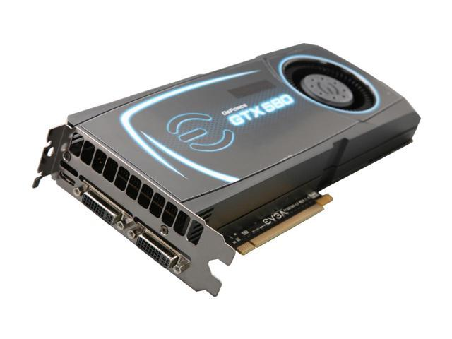

# 深度卷积神经网络：AlexNet

在前面的章节中，我们学会了如何使用卷积神经网络进行图像分类。其中我们使用了两个卷积层与池化层交替，加入一个全连接隐层，和一个归一化指数Softmax输出层。这个结构与LeNet，一个以卷积神经网络先驱[Yann LeCun](http://yann.lecun.com/)命名的早期神经网络很相似。LeCun也是将[卷积神经网络付诸应用的第一人](http://www.mitpressjournals.org/doi/abs/10.1162/neco.1989.1.4.541)，通过反向传播来进行训练，这是一个当时相当新颖的想法。当时一小批对仿生的学习模型热衷的研究者通过人工模拟神经元来作为学习模型。然而即便时至今日，依然没有多少研究者相信真正的大脑是通过梯度下降来学习的，研究社区也探索了许多其他的学习理论。LeCun在当时展现了，在识别手写数字的任务上通过梯度下降训练卷积神经网络可以达到最先进的结果。这个奠基性的工作第一次将卷积神经网络推上舞台，为世人所知。

然而，这之后几年里，神经网络被许多其他方法超越。神经网络训练慢，并且就深度神经网络从一个随机生成的权重起点开始训练是否可行，学界没有广泛达成一致。此外，十多年前还没有黄教主的核武器GPU通用计算，所以训练一个多通道，多层，大量参数的在十几年前难以实现。所以虽然LeNet可以在MNIST上得到好的成绩，在更大的真实世界的数据集上，神经网络还是在这个冬天里渐渐失宠。

取而代之，研究者们通过勤劳，智慧和黑魔法生成了许多手工特征。通常的模式是
1. 找个数据集
2. 用一堆已有的特征提取函数生成特征
3. 把这些特征表示放进一个简单的线性模型（当时认为的机器学习部分仅限这一步）

计算机视觉领域一直维持这个状况直到2012年，深度学习即将颠覆应用机器学习。一个小伙伴（Zack）2013年研究生入学，他的一个朋友这样总结了当时的状况:
如果你跟机器学习研究者们交谈，他们会认为机器学习既重要又优美。优雅的定理证明了许多分类器的性质。机器学习领域生机勃勃，严谨，而且极其有用。
然而如果你跟一个计算机视觉研究者交谈，则是另外一幅景象。这人会告诉你图像识别里"不可告人"的现实是，计算机视觉里的机器学习流水线中真正重要的是数据和特征。稍微干净点的数据集，或者略微好些的手调特征对最终准确度意味着天壤之别。反而分类器的选择对表现的区别影响不大。说到底，把特征扔进逻辑回归，支持向量机，或者其他任何分类器，表现都差不多。


## 学习特征表示

简单来说，给定一个数据集，当时流水线里最重要的是特征表示这步。并且直到2012年，特征表示这步都是基于硬拼出来的直觉，机械化手工地生成的。事实上，做出一组特征，改进结果，并把方法写出来是计算机视觉论文里的一个重要流派。

另一些研究者则持异议。他们认为特征本身也应该由学习得来。他们还相信，为了表征足够复杂的输入，特征本身应该阶级式地组合起来。持这一想法的研究者们，包括Yann
LeCun，Geoff Hinton，Yoshua Bengio，Andrew Ng，Shun-ichi Amari，Juergen
Schmidhuber，相信通过把许多神经网络层组合起来训练，他们可能可以让网络学得阶级式的数据表征。在图片中，底层可以表示边，色彩和纹理。


高层可能可以基于这些表示，来表征更大的结构，如眼睛，鼻子，草叶和其他特征。更高层可能可以表征整个物体，如人，飞机，狗，飞盘。最终，在分类器层前的隐含层可能会表征经过汇总的内容，其中不同的类别将会是线性可分的。然而许多年来，研究者们由于种种原因并不能实现这一愿景。

## 缺失要素 1: 数据

尽管这群执着的研究者不断钻研，试图学习深度的视觉数据表征，很长的一段时间里这些野心都未能实现，这其中有诸多因素。第一，包含许多表征的深度模型需要大量的有标注的数据才能表现得比其他经典方法更好，虽然这些当时还不为人知。限于当时计算机有限的存储和相对囊中羞涩的90年代研究预算，大部分研究基于小数据集。比如，大部分可信的研究论文是基于UCI提供的若干个数据集，其中许多只有几百至几千张图片。

这一状况在2009年李飞飞贡献了ImageNet数据库后得以焕然。它包含了1000类，每类有1000张不同的图片，这一规模是当时其他数据集不可相提并论的。


(image credit: Ferhat Kurt)

这个数据集同时推动了计算机视觉和机器学习研究进入新的阶段，使得之前的最佳方法不再有优势。

## 缺失要素 2: 硬件

深度学习对计算资源要求很高。这也是为什么上世纪90年代左右基于凸优化的算法更被青睐的原因。毕竟凸优化方法里能很快收敛，并可以找到全局最小值和高效的算法。

GPU的到来改变了格局。很久以来，GPU都是为了图像处理和计算机游戏而生的，尤其是为了大吞吐量的4x4矩阵和向量乘法，用于基本的图形转换。值得庆幸的是，这其中的数学与深度网络中的卷积层非常类似。与此同时，NVIDIA和ATI开始对GPU为通用计算做优化，并命名为GPGPU（即通用计算GPU）。

为了更好的理解，我们来看看现代的CPU。每个处理器核都十分强大，运作在高时钟频率，有先进复杂的结构和缓存。处理器可以很好地运行各种类型的代码，并由分支预测等机制使其能高效地运作在通用的常规程序上。然而，这个通用性同时也是一个弱点，因为通用的核心制造代价很高。它们会占用很多芯片面积，需要复杂的支持结构（内存接口，核间的缓存逻辑，高速互通连接等），并且跟不同任务的特制芯片相比它们在每个任务上表现并不完美。现代笔记本电脑可以有四核，而高端服务器也很少超过64核，就是因为这些核心并不划算。

相比较，GPU通常有一百到一千个小处理单元组成（具体数值在NVIDIA，ATI/AMD，ARM和其他芯片厂商的产品间有所不同），这些单元通常被划分为稍大些的组（NVIDIA把这称作warps)。虽然它们每个处理单元相对较弱，运行在低于1GHz的时钟频率，庞大的数量使得GPU的运算速度比CPU快不止一个数量级。比如，NVIDIA最新一代的Volta运算速度在特别的指令上可以达到每个芯片120 TFlops，（更通用的指令上达到24 TFlops），而至今CPU的浮点数运算速度也未超过1 TFlop。这其中的原因很简单: 首先，能量消耗与时钟频率成二次关系，所以同样供一个运行速度是4x的CPU核心所需的能量可以用来运行16个GPU核心以其1/4的速度运行，并达到16 x 1/4 = 4x的性能。此外，GPU核心结构简单得多（事实上有很长一段时间他们甚至都还不能运行通用的代码），这使得他们能量效率很高。最后，很多深度学习中的操作需要很高的内存带宽，而GPU以其十倍于很多CPU的内存带宽而占尽优势。

回到2012年，Alex Krizhevsky和Ilya
Sutskever实现的可以运行在GPU上的深度卷积网络成为重大突破。他们意识到卷积网络的运算瓶颈（卷积和矩阵乘法）其实都可以在硬件上并行。使用两个NVIDIA GTX580和3GB内存，他们实现了快速的卷积。他们足够好的代码[cuda-convnet](https://code.google.com/archive/p/cuda-convnet/)使其成为那几年里的业界标准，驱动着深度学习繁荣的头几年。



## AlexNet

2012年的时候，Khrizhevsky，Sutskever和Hinton凭借他们的cuda-convnet实现的8层卷积神经网络以很大的优势赢得了ImageNet 2012图像识别挑战。他们在[这篇论文](https://papers.nips.cc/paper/4824-imagenet-classification-with-deep-convolutional-neural-networks.pdf)中的模型与1995年的LeNet结构*非常*相似。

这个模型有一些显著的特征。第一，与相对较小的LeNet相比，AlexNet包含8层变换，其中有五层卷积和两层全连接隐含层，以及一个输出层。

第一层中的卷积核大小是$11\times11$，接着第二层中的是$5\times5$，之后都是$3\times3$。此外，第一，第二和第五个卷积层之后都跟了有重叠的大小为$3\times3$，步距为$2\times2$的池化操作。

紧接着卷积层，原版的AlexNet有每层大小为4096个节点的全连接层们。这两个巨大的全连接层带来将近1GB的模型大小。由于早期GPU显存的限制，最早的AlexNet包括了双数据流的设计，以让网络中一半的节点能存入一个GPU。这两个数据流，也就是说两个GPU只在一部分层进行通信，这样达到限制GPU同步时的额外开销的效果。有幸的是，GPU在过去几年得到了长足的发展，除了一些特殊的结构外，我们也就不再需要这样的特别设计了。

下面的Gluon代码定义了（稍微简化过的）Alexnet：

```{.python .input}
from mxnet.gluon import nn

net = nn.Sequential()
with net.name_scope():
    net.add(
        # 第一阶段
        nn.Conv2D(channels=96, kernel_size=11,
                  strides=4, activation='relu'),
        nn.MaxPool2D(pool_size=3, strides=2),
        # 第二阶段
        nn.Conv2D(channels=256, kernel_size=5,
                  padding=2, activation='relu'),
        nn.MaxPool2D(pool_size=3, strides=2),
        # 第三阶段
        nn.Conv2D(channels=384, kernel_size=3,
                  padding=1, activation='relu'),
        nn.Conv2D(channels=384, kernel_size=3,
                  padding=1, activation='relu'),
        nn.Conv2D(channels=256, kernel_size=3,
                  padding=1, activation='relu'),
        nn.MaxPool2D(pool_size=3, strides=2),
        # 第四阶段
        nn.Flatten(),
        nn.Dense(4096, activation="relu"),
        nn.Dropout(.5),
        # 第五阶段
        nn.Dense(4096, activation="relu"),
        nn.Dropout(.5),
        # 第六阶段
        nn.Dense(10)
    )
```

## 读取数据

Alexnet使用Imagenet数据，其中输入图片大小一般是$224 \times 224$。因为Imagenet数据训练时间过长，我们还是用前面的FashionMNIST来演示。读取数据的时候我们额外做了一步将数据扩大到原版Alexnet使用的$224 \times 224$。

```{.python .input}
import sys
sys.path.append('..')
import utils

train_data, test_data = utils.load_data_fashion_mnist(
    batch_size=64, resize=224)
```

## 训练

这时候我们可以开始训练。相对于前面的LeNet，我们做了如下三个改动：

1. 我们使用`Xavier`来初始化参数
2. 使用了更小的学习率
3. 默认只迭代一轮（这样网页编译快一点）

```{.python .input}
from mxnet import init
from mxnet import gluon

ctx = utils.try_gpu()
net.initialize(ctx=ctx, init=init.Xavier())

loss = gluon.loss.SoftmaxCrossEntropyLoss()
trainer = gluon.Trainer(net.collect_params(),
                        'sgd', {'learning_rate': 0.01})
utils.train(train_data, test_data, net, loss,
            trainer, ctx, num_epochs=1)
```

## 小结

从LeNet到Alexnet，虽然实现起来也就多了几行而已。但这个观念上的转变和真正跑出好实验结果，学术界整整花了20年。

## 练习

- 多迭代几轮看看？跟LeNet比有什么区别？为什么？（提示：看看[欠拟合和过拟合](./chapter02_supervised-learning/underfit-overfit.md)的那几张图）
- 找出`Xavier`具体是怎么初始化的，跟默认的比有什么区别
- 尝试将训练的参数改回到LeNet看看会发生什么？想想看为什么？
- 试试从0开始实现看看？

## 扫码直达[讨论区](https://discuss.gluon.ai/t/topic/1258)


