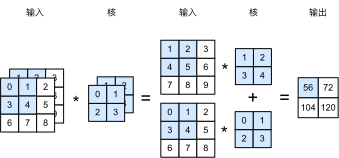
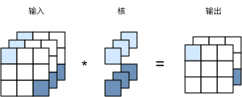

# 多输入和输出通道

前面小节里我们用到的输入和输出都是二维数组，但实际数据的维度经常更高。例如彩色图片在高宽两个维度外还有RGB这三个通道。假设它的高和宽分别是$h$和$w$（像素），那么内存中它可以被表示成一个$3\times h\times w$的多维数组。我们将大小为3的这一维称之为通道（channel）。这一节我们将介绍卷积层是如何处理多输入通道，以及计算多通道输出的。

## 多输入通道

假设输入通道数是$c_i$，且卷积核窗口为$k_h\times k_w$。当$c_i=1$时，我们知道卷积核就是一个$k_h\times k_w$数组。当其大于1时，我们将会为每个输入通道分配一个单独的$k_h\times k_w$核数组。我们将这些数组合并起来，将得到一个$c_i\times k_h\times k_w$形状的卷积核。然后在每个通道里对相应的输入矩阵和核矩阵做相关计算，然后再将通道之间的结果相加得到最终结果。图5.4展示了输入通道是2的一个例子。



接下来我们实现处理多输入通道的相关运算符。首先我们将前面小节实现的`corr2d`复制过来。

```{.python .input  n=2}
from mxnet import nd

def corr2d(X, K):
    n, m = K.shape
    Y = nd.zeros((X.shape[0] - n + 1, X.shape[1] - m + 1))
    for i in range(Y.shape[0]):
        for j in range(Y.shape[1]):
            Y[i, j] = (X[i : i + n, j : j + m] * K).sum()
    return Y
```

为了实现多输入通道的版本，我们只需要对每个通道做相关计算，然后通过`nd.add_n`来进行累加。

```{.python .input  n=14}
def corr2d_multi_in(X, K):
    # 我们首先沿着 X 和 K 的第 0 维（通道维）遍历。然后使用 * 将结果列表 (list) 变成
    # add_n 的位置参数（positional argument）来进行相加。
    return nd.add_n(*[corr2d(x, k) for x, k in zip(X, K)])
```

我们构造图5.4中的输入数据来验证实现的正确性。

```{.python .input  n=33}
X = nd.array([[[0, 1, 2], [3, 4, 5], [6, 7, 8]],
              [[1, 2, 3], [4, 5, 6], [7, 8, 9]]])
K = nd.array([[[0, 1], [2, 3]], [[1, 2], [3, 4]]])

corr2d_multi_in(X, K)
```

## 多输出通道

在多输入通道下，由于我们对各个通道结果做了累加，因此不论输入通道数是多少，输出通道总是为1。如果想得到$c_o>1$通道的输出，我们为每个输出通道创建单独的$c_i\times k_h\times k_w$形状的核数组。将它们合并起来，那么卷积核的形状是$c_o\times c_i\times k_h\times k_w$。在计算的时候，每个输出通道的数据由整个输入数据和对应的核矩阵计算得来。其实现见下面代码。

```{.python .input  n=30}
def corr2d_multi_in_out(X, K):
    # 对 K 的第 0 维遍历，每次同输入 X 做相关计算。所有结果使用 nd.stack 合并在一起。
    return nd.stack(*[corr2d_multi_in(X, k) for k in K])
```

我们将三维核矩阵`K`同`K+1`和`K+2`拼在一起来构造一个输出通道为3的四维卷积核。

```{.python .input  n=34}
K = nd.stack(K, K + 1, K + 2)
K.shape
```

然后计算它的输出。可以发现计算结果有三个通道，其中第一个通道跟上例中输出一致。

```{.python .input  n=35}
corr2d_multi_in_out(X, K)
```

## $1\times 1$卷积层

最后我们讨论卷积窗口为$1\times 1$（$k_h=k_w=1$）的多通道卷积层。因为使用了最小窗口，它失去了卷积层可以识别高宽维上相邻元素构成的模式的功能，它的主要计算则是在通道维上。图5.5展示了输入通道为3和输出通道为2的情况。输出中的每个元素来自输入中对应位置的元素在不同通道之间的按权重累加。



假设我们将通道维当做是特征维，而高宽中的元素则当成数据点。那么$1\times 1$卷积层则等价于一个全连接层。下面代码里我们将输入和卷积核变形成二维数组，然后使用矩阵乘法来计算输出，之后再变形回我们需要的样子。

```{.python .input}
def corr2d_multi_in_out_1x1(X, K):
    c_i, h, w = X.shape
    c_o = K.shape[0]
    X = X.reshape((c_i, h * w))
    K = K.reshape((c_o, c_i))
    Y = nd.dot(K, X)
    return Y.reshape((c_o, h, w))
```

生成一组随机数来验证实现的正确性。

```{.python .input}
X = nd.random.uniform(shape=(3, 3, 3))
K = nd.random.uniform(shape=(2, 3, 1, 1))

Y1 = corr2d_multi_in_out_1x1(X, K)
Y2 = corr2d_multi_in_out(X, K)

(Y1-Y2).norm().asscalar() < 1e-6
```

在之后的模型里我们将会看到$1\times 1$卷积层是如何当做保持高宽维形状的全连接层使用，其作用是通过调整网络层之间的通道数来控制模型复杂度。

## 小结

- 使用多通道可以极大拓展卷积层的模型参数。
- $1\times 1$卷积层通常用来调节网络层之间的通道数。

## 练习

- 假设输入大小为$c_i\times h\times w$，且使用$c_o\times c_i\times k_h\times k_w$卷积核，填充为$(p_h, p_w)$以及步幅为$(s_h, s_w)$，那么这个卷积层的前向计算需要多少次乘法，多少次加法？
- 翻倍输入通道$c_i$和输出通道$c_o$会增加多少倍计算？翻倍填充呢？
- 如果使用$k_h=k_w=1$，能降低多少倍计算？
- 例子中`Y1`和`Y2`结果完全一致吗？原因是什么？
- 对于非$1\times 1$卷积层，如何也将其表示成一个矩阵乘法。


## 扫码直达[讨论区](https://discuss.gluon.ai/t/topic/6405)


