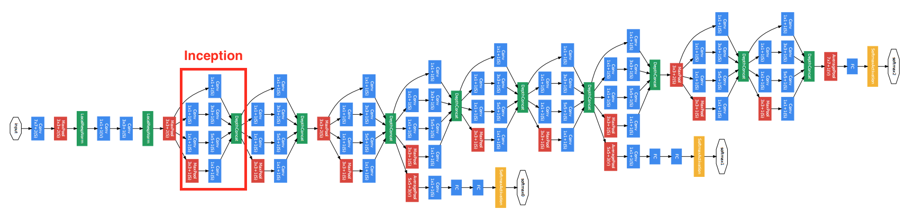

# 更深的卷积神经网络：GoogLeNet

在2014年的Imagenet竞赛里，Google的研究人员利用一个新的网络结构取得很大的优先。这个叫做GoogLeNet的网络虽然在名字上是向LeNet致敬，但网络结构里很难看到LeNet的影子。它颠覆的大家对卷积神经网络串联一系列层的固定做法。下图是其[论文](https://arxiv.org/abs/1409.4842)对GoogLeNet的可视化



## 定义Inception

可以看到其中有多个四个并行卷积层的块。这个块一般叫做Inception，其基于[Network in network](./nin-gluon.md)的思想做了很大的改进。我们先看下如何定义一个下图所示的Inception块。


```{.python .input}
from mxnet.gluon import nn
from mxnet import nd

class Inception(nn.Block):
    def __init__(self, n1_1, n2_1, n2_3, n3_1, n3_5, n4_1, **kwargs):
        super(Inception, self).__init__(**kwargs)
        # path 1
        self.p1_conv_1 = nn.Conv2D(n1_1, kernel_size=1,
                                   activation='relu')
        # path 2
        self.p2_conv_1 = nn.Conv2D(n2_1, kernel_size=1,
                                   activation='relu')
        self.p2_conv_3 = nn.Conv2D(n2_3, kernel_size=3, padding=1,
                                   activation='relu')
        # path 3
        self.p3_conv_1 = nn.Conv2D(n3_1, kernel_size=1,
                                   activation='relu')
        self.p3_conv_5 = nn.Conv2D(n3_5, kernel_size=5, padding=2,
                                   activation='relu')
        # path 4
        self.p4_pool_3 = nn.MaxPool2D(pool_size=3, padding=1,
                                      strides=1)
        self.p4_conv_1 = nn.Conv2D(n4_1, kernel_size=1,
                                   activation='relu')

    def forward(self, x):
        p1 = self.p1_conv_1(x)
        p2 = self.p2_conv_3(self.p2_conv_1(x))
        p3 = self.p3_conv_5(self.p3_conv_1(x))
        p4 = self.p4_conv_1(self.p4_pool_3(x))
        return nd.concat(p1, p2, p3, p4, dim=1)
```

可以看到Inception里有四个并行的线路。

1. 单个$1\times 1$卷积。
2. $1\times 1$卷积接上$3\times 3$卷积。通常前者的通道数少于输入通道，这样减少后者的计算量。后者加上了`padding=1`使得输出的长宽的输入一致
3. 同2，但换成了$5 \times 5$卷积
4. 和1类似，但卷积前用了最大池化层

最后将这四个并行线路的结果在通道这个维度上合并在一起。

测试一下：

```{.python .input}
incp = Inception(64, 96, 128, 16, 32, 32)
incp.initialize()

x = nd.random.uniform(shape=(32,3,64,64))
incp(x).shape
```

## 定义GoogLeNet

GoogLeNet将数个Inception串联在一起。注意到原论文里使用了多个输出，为了简化我们这里就使用一个输出。为了可以更方便的查看数据在内部的形状变化，我们对每个块使用一个`nn.Sequential`，然后再把所有这些块连起来。

```{.python .input}
class GoogLeNet(nn.Block):
    def __init__(self, num_classes, verbose=False, **kwargs):
        super(GoogLeNet, self).__init__(**kwargs)
        self.verbose = verbose
        # add name_scope on the outer most Sequential
        with self.name_scope():
            # block 1
            b1 = nn.Sequential()
            b1.add(
                nn.Conv2D(64, kernel_size=7, strides=2,
                          padding=3, activation='relu'),
                nn.MaxPool2D(pool_size=3, strides=2)
            )
            # block 2
            b2 = nn.Sequential()
            b2.add(
                nn.Conv2D(64, kernel_size=1),
                nn.Conv2D(192, kernel_size=3, padding=1),
                nn.MaxPool2D(pool_size=3, strides=2)
            )

            # block 3
            b3 = nn.Sequential()
            b3.add(
                Inception(64, 96, 128, 16,32, 32),
                Inception(128, 128, 192, 32, 96, 64),
                nn.MaxPool2D(pool_size=3, strides=2)
            )

            # block 4
            b4 = nn.Sequential()
            b4.add(
                Inception(192, 96, 208, 16, 48, 64),
                Inception(160, 112, 224, 24, 64, 64),
                Inception(128, 128, 256, 24, 64, 64),
                Inception(112, 144, 288, 32, 64, 64),
                Inception(256, 160, 320, 32, 128, 128),
                nn.MaxPool2D(pool_size=3, strides=2)
            )

            # block 5
            b5 = nn.Sequential()
            b5.add(
                Inception(256, 160, 320, 32, 128, 128),
                Inception(384, 192, 384, 48, 128, 128),
                nn.AvgPool2D(pool_size=2)
            )
            # block 6
            b6 = nn.Sequential()
            b6.add(
                nn.Flatten(),
                nn.Dense(num_classes)
            )
            # chain blocks together
            self.net = nn.Sequential()
            self.net.add(b1, b2, b3, b4, b5, b6)

    def forward(self, x):
        out = x
        for i, b in enumerate(self.net):
            out = b(out)
            if self.verbose:
                print('Block %d output: %s'%(i+1, out.shape))
        return out
```

我们看一下每个块对输出的改变。

```{.python .input}
net = GoogLeNet(10, verbose=True)
net.initialize()

x = nd.random.uniform(shape=(4, 3, 96, 96))
y = net(x)
```

## 获取数据并训练

跟VGG一样我们使用了较小的输入$96\times 96$来加速计算。

```{.python .input}
import sys
sys.path.append('..')
import utils
from mxnet import gluon
from mxnet import init

train_data, test_data = utils.load_data_fashion_mnist(
    batch_size=64, resize=96)

ctx = utils.try_gpu()
net = GoogLeNet(10)
net.initialize(ctx=ctx, init=init.Xavier())

loss = gluon.loss.SoftmaxCrossEntropyLoss()
trainer = gluon.Trainer(net.collect_params(),
                        'sgd', {'learning_rate': 0.01})
utils.train(train_data, test_data, net, loss,
            trainer, ctx, num_epochs=1)
```

## 结论

GoogLeNet加入了更加结构化的Inception块来使得我们可以使用更大的通道，更多的层，同时控制计算量和模型大小在合理范围内。

## 练习

GoogLeNet有数个后续版本，尝试实现他们并运行看看有什么不一样

- v1: 本节介绍的是最早版本：[Going Deeper with Convolutions](http://arxiv.org/abs/1409.4842)
- v2: 加入和Batch Normalization：[Accelerating Deep Network Training by Reducing Internal Covariate Shift](http://arxiv.org/abs/1502.03167)
- v3: 对Inception做了调整：[Rethinking the Inception Architecture for Computer Vision](http://arxiv.org/abs/1512.00567)
- v4: 基于ResNet加入了Residual Connections：[Inception-ResNet and the Impact of Residual Connections on Learning](http://arxiv.org/abs/1602.07261)


**吐槽和讨论欢迎点**[这里](https://discuss.gluon.ai/t/topic/1662)
