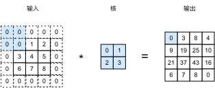
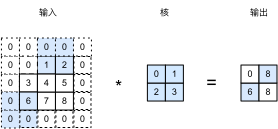

# 填充和步幅

在上一节的例子里，我们使用高宽为3的输入和高宽为2的卷积核得到高宽为2的输出。一般来说，假设输入形状是$n_h\times n_w$，卷积核形状是$k_h\times k_w$，那么输出形状将会是

$$(n_h-k_h+1) \times (n_w-k_w+1).$$

所以卷积层的输出形状由输入形状和卷积核形状决定。这一节我们将介绍卷积层的两个超参数，填充和步幅，它们可以在给定形状的输入和卷积核下来改变输出形状。

## 填充

填充是指在输入高和宽的两端填充元素。图5.2里我们在宽和高的两侧分别添加了值为0的元素，使得输入高宽从2变成了5，从而导致输出高宽由2增加到4。



一般来说，如果在高两侧一共填充$p_h$行，在宽两侧一共填充$p_w$列，那么输出形状将会是

$$(n_h-k_h+p_h+1)\times(n_w-k_w+p_w+1),$$

也就是说输出的高宽分别会增加$p_h$和$p_w$。

通常我们会设置$p_h=k_h-1$和$p_w=k_w-1$使得输入和输出有相同的高宽，这样方便在构造网络时容易推测每个层的输出形状。假设这里$k_h$是奇数，我们会在高的两侧分别填充$p_h/2$行。如果其是偶数，一种可能是上面填充$\lceil p_h/2\rceil$行，而下面填充$\lfloor p_h/2\rfloor$行。在宽上行为类似。

卷积神经网络经常使用奇数高宽的卷积核，例如1、3、5、和7，所以填充在两端上是对称的。这样还有一点方便的是我们知道输出$Y[i,j]$是由输入以$X[i,j]$为中心的窗口同卷积核进行相关计算得来。

下面例子里我们创建一个核高宽为3的二维卷积层，然后在输入高和宽的两侧分别填充1。输入一个高宽为8的输入，我们会发现输出的高宽也是8。

```{.python .input  n=1}
from mxnet import nd
from mxnet.gluon import nn

# 定义一个便利函数来计算卷积层。它初始化卷积层权重，并对输入和输出做相应的升维和降维。
def comp_conv2d(conv2d, X):
    conv2d.initialize()
    X = X.reshape((1, 1,) + X.shape)
    Y = conv2d(X)
    return Y.reshape(Y.shape[2:])

X = nd.random.uniform(shape=(8, 8))

# 注意这里是两侧分别填充 1，所以 p_w = p_h = 2。
conv2d = nn.Conv2D(1, kernel_size=3, padding=1)
comp_conv2d(conv2d, X).shape
```

当然我们可以使用非方形卷积核，使用对应的填充同样可得相同高宽的输出。

```{.python .input  n=2}
# 使用高为 5，宽为 3 的卷积核。
conv2d = nn.Conv2D(1, kernel_size=(5, 3), padding=(2, 1))
comp_conv2d(conv2d, X).shape
```

## 步幅

在上一节里我们介绍了输出元素是如何计算而来。我们使用一个和卷积核有相同高宽的窗口，从输入的左上角开始，每次往左滑动一列或者往下滑动一行逐一计算输出。我们将每次滑动的行数和列数称之为步幅。

目前我们看到的例子里，在高和宽两个方向上步幅均为1。自然我们可以使用更大步幅。图5.3展示了在高上使用步幅3，在宽上使用步幅2的情况。可以看到，计算第一列第二个元素时，窗口向下滑动了三行。而在计算输出的第一行第二个元素时窗口向右滑动了两列，再向右滑动两列时只剩一列输入元素从而填不满窗口，我们将其结果舍弃。



一般来说，如果在高上使用步幅$s_h$，在宽上使用步幅$s_w$，那么输出大小将是

$$\lfloor(n_h-k_h+p_h+s_h)/s_h\rfloor \times \lfloor(n_w-k_w+p_w+s_w)/s_w\rfloor.$$

如果我们设置$p_h=k_h-1$和$p_w=k_w-1$，那么输出大小简化为$\lfloor(n_h+s_h-1)/s_h\rfloor \times \lfloor(n_w+s_w-1)/s_w\rfloor$。更进一步，如果输出高宽能分别被高宽上的步幅整除，那么输出将是$n_h/s_h \times n_w/s_w$。也就是说我们成倍的减小了输入的高宽。

下面我们看一个符合简化形状公式的例子，其将高宽减半。

```{.python .input}
conv2d = nn.Conv2D(1, kernel_size=3, padding=1, strides=2)
comp_conv2d(conv2d, X).shape
```

接下来是一个稍微复杂点的例子。

```{.python .input  n=3}
conv2d = nn.Conv2D(1, kernel_size=(3, 5), padding=(0, 1), strides=(3, 4))
comp_conv2d(conv2d, X).shape
```

## 小结

* 通过填充可以增加输出的高宽，常用来使得输出与输出同高宽。通过步幅可以成倍的减少输出的高宽。

## 练习

- 对最后一个例子通过形状计算公式来计算其输出形状。
- 试一试其他的填充和步幅组合。

## 扫码直达[讨论区](https://discuss.gluon.ai/t/topic/6404)


