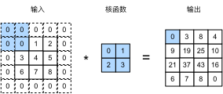
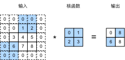

# Padding and Stride
:label:`sec_padding`


In the previous example of :numref:`fig_correlation`,
our input had both a height and width of 3
and our convolution kernel had both a height and width of 2,
yielding an output representation with dimension $2\times2$.
As we generalized in :numref:`sec_conv_layer`,
assuming that
the input shape is $n_h\times n_w$
and the convolution kernel shape is $k_h\times k_w$,
then the output shape will be
$(n_h-k_h+1) \times (n_w-k_w+1)$.
Therefore, the output shape of the convolutional layer
is determined by the shape of the input
and the shape of the convolution kernel.

In several cases, we incorporate techniques,
including padding and strided convolutions,
that affect the size of the output.
As motivation, note that since kernels generally
have width and height greater than $1$,
after applying many successive convolutions,
we tend to wind up with outputs that are
considerably smaller than our input.
If we start with a $240 \times 240$ pixel image,
$10$ layers of $5 \times 5$ convolutions
reduce the image to $200 \times 200$ pixels,
slicing off $30 \%$ of the image and with it
obliterating any interesting information
on the boundaries of the original image.
*Padding* is the most popular tool for handling this issue.

In other cases, we may want to reduce the dimensionality drastically,
e.g., if we find the original input resolution to be unwieldy.
*Strided convolutions* are a popular technique that can help in these instances.

## Padding

As described above, one tricky issue when applying convolutional layers
is that we tend to lose pixels on the perimeter of our image.
Since we typically use small kernels,
for any given convolution,
we might only lose a few pixels,
but this can add up as we apply
many successive convolutional layers.
One straightforward solution to this problem
is to add extra pixels of filler around the boundary of our input image,
thus increasing the effective size of the image.
Typically, we set the values of the extra pixels to zero.
In :numref:`img_conv_pad`, we pad a $3 \times 3$ input,
increasing its size to $5 \times 5$.
The corresponding output then increases to a $4 \times 4$ matrix.
The shaded portions are the first output element as well as the input and kernel tensor elements used for the output computation: $0\times0+0\times1+0\times2+0\times3=0$.


:label:`img_conv_pad`

In general, if we add a total of $p_h$ rows of padding
(roughly half on top and half on bottom)
and a total of $p_w$ columns of padding
(roughly half on the left and half on the right),
the output shape will be

$$(n_h-k_h+p_h+1)\times(n_w-k_w+p_w+1).$$

This means that the height and width of the output
will increase by $p_h$ and $p_w$, respectively.

In many cases, we will want to set $p_h=k_h-1$ and $p_w=k_w-1$
to give the input and output the same height and width.
This will make it easier to predict the output shape of each layer
when constructing the network.
Assuming that $k_h$ is odd here,
we will pad $p_h/2$ rows on both sides of the height.
If $k_h$ is even, one possibility is to
pad $\lceil p_h/2\rceil$ rows on the top of the input
and $\lfloor p_h/2\rfloor$ rows on the bottom.
We will pad both sides of the width in the same way.

CNNs commonly use convolution kernels
with odd height and width values, such as 1, 3, 5, or 7.
Choosing odd kernel sizes has the benefit
that we can preserve the spatial dimensionality
while padding with the same number of rows on top and bottom,
and the same number of columns on left and right.

Moreover, this practice of using odd kernels
and padding to precisely preserve dimensionality
offers a clerical benefit.
For any two-dimensional tensor `X`,
when the kernel's size is odd
and the number of padding rows and columns
on all sides are the same,
producing an output with the same height and width as the input,
we know that the output `Y[i, j]` is calculated
by cross-correlation of the input and convolution kernel
with the window centered on `X[i, j]`.

In the following example, we create a two-dimensional convolutional layer
with a height and width of 3
and apply 1 pixel of padding on all sides.
Given an input with a height and width of 8,
we find that the height and width of the output is also 8.

```{.python .input}
from mxnet import np, npx
from mxnet.gluon import nn
npx.set_np()

# For convenience, we define a function to calculate the convolutional layer.
# This function initializes the convolutional layer weights and performs
# corresponding dimensionality elevations and reductions on the input and
# output
def comp_conv2d(conv2d, X):
    conv2d.initialize()
    # Here (1, 1) indicates that the batch size and the number of channels
    # are both 1
    X = X.reshape((1, 1) + X.shape)
    Y = conv2d(X)
    # Exclude the first two dimensions that do not interest us: examples and
    # channels
    return Y.reshape(Y.shape[2:])

# Note that here 1 row or column is padded on either side, so a total of 2
# rows or columns are added
conv2d = nn.Conv2D(1, kernel_size=3, padding=1)
X = np.random.uniform(size=(8, 8))
comp_conv2d(conv2d, X).shape
```

```{.python .input}
#@tab pytorch
import torch
from torch import nn

# We define a convenience function to calculate the convolutional layer. This
# function initializes the convolutional layer weights and performs
# corresponding dimensionality elevations and reductions on the input and
# output
def comp_conv2d(conv2d, X):
    # Here (1, 1) indicates that the batch size and the number of channels
    # are both 1
    X = X.reshape((1, 1) + X.shape)
    Y = conv2d(X)
    # Exclude the first two dimensions that do not interest us: examples and
    # channels
    return Y.reshape(Y.shape[2:])
# Note that here 1 row or column is padded on either side, so a total of 2
# rows or columns are added
conv2d = nn.Conv2d(1, 1, kernel_size=3, padding=1)
X = torch.rand(size=(8, 8))
comp_conv2d(conv2d, X).shape
```

```{.python .input}
#@tab tensorflow
import tensorflow as tf

# We define a convenience function to calculate the convolutional layer. This
# function initializes the convolutional layer weights and performs
# corresponding dimensionality elevations and reductions on the input and
# output
def comp_conv2d(conv2d, X):
    # Here (1, 1) indicates that the batch size and the number of channels
    # are both 1
    X = tf.reshape(X, (1, ) + X.shape + (1, ))
    Y = conv2d(X)
    # Exclude the first two dimensions that do not interest us: examples and
    # channels
    return tf.reshape(Y, Y.shape[1:3])
# Note that here 1 row or column is padded on either side, so a total of 2
# rows or columns are added
conv2d = tf.keras.layers.Conv2D(1, kernel_size=3, padding='same')
X = tf.random.uniform(shape=(8, 8))
comp_conv2d(conv2d, X).shape
```

When the height and width of the convolution kernel are different,
we can make the output and input have the same height and width
by setting different padding numbers for height and width.

```{.python .input}
# Here, we use a convolution kernel with a height of 5 and a width of 3. The
# padding numbers on either side of the height and width are 2 and 1,
# respectively
conv2d = nn.Conv2D(1, kernel_size=(5, 3), padding=(2, 1))
comp_conv2d(conv2d, X).shape
```

```{.python .input}
#@tab pytorch
# Here, we use a convolution kernel with a height of 5 and a width of 3. The
# padding numbers on either side of the height and width are 2 and 1,
# respectively
conv2d = nn.Conv2d(1, 1, kernel_size=(5, 3), padding=(2, 1))
comp_conv2d(conv2d, X).shape
```

```{.python .input}
#@tab tensorflow
# Here, we use a convolution kernel with a height of 5 and a width of 3. The
# padding numbers on either side of the height and width are 2 and 1,
# respectively
conv2d = tf.keras.layers.Conv2D(1, kernel_size=(5, 3), padding='valid')
comp_conv2d(conv2d, X).shape
```

## Stride

When computing the cross-correlation,
we start with the convolution window
at the top-left corner of the input tensor,
and then slide it over all locations both down and to the right.
In previous examples, we default to sliding one element at a time.
However, sometimes, either for computational efficiency
or because we wish to downsample,
we move our window more than one element at a time,
skipping the intermediate locations.

We refer to the number of rows and columns traversed per slide as the *stride*.
So far, we have used strides of 1, both for height and width.
Sometimes, we may want to use a larger stride.
:numref:`img_conv_stride` shows a two-dimensional cross-correlation operation
with a stride of 3 vertically and 2 horizontally.
The shaded portions are the output elements as well as the input and kernel tensor elements used for the output computation: $0\times0+0\times1+1\times2+2\times3=8$, $0\times0+6\times1+0\times2+0\times3=6$.
We can see that when the second element of the first column is outputted,
the convolution window slides down three rows.
The convolution window slides two columns to the right
when the second element of the first row is outputted.
When the convolution window continues to slide two columns to the right on the input,
there is no output because the input element cannot fill the window
(unless we add another column of padding).


:label:`img_conv_stride`

In general, when the stride for the height is $s_h$
and the stride for the width is $s_w$, the output shape is

$$\lfloor(n_h-k_h+p_h+s_h)/s_h\rfloor \times \lfloor(n_w-k_w+p_w+s_w)/s_w\rfloor.$$

If we set $p_h=k_h-1$ and $p_w=k_w-1$,
then the output shape will be simplified to
$\lfloor(n_h+s_h-1)/s_h\rfloor \times \lfloor(n_w+s_w-1)/s_w\rfloor$.
Going a step further, if the input height and width
are divisible by the strides on the height and width,
then the output shape will be $(n_h/s_h) \times (n_w/s_w)$.

Below, we set the strides on both the height and width to 2,
thus halving the input height and width.

```{.python .input}
conv2d = nn.Conv2D(1, kernel_size=3, padding=1, strides=2)
comp_conv2d(conv2d, X).shape
```

```{.python .input}
#@tab pytorch
conv2d = nn.Conv2d(1, 1, kernel_size=3, padding=1, stride=2)
comp_conv2d(conv2d, X).shape
```

```{.python .input}
#@tab tensorflow
conv2d = tf.keras.layers.Conv2D(1, kernel_size=3, padding='same', strides=2)
comp_conv2d(conv2d, X).shape
```

Next, we will look at a slightly more complicated example.

```{.python .input}
conv2d = nn.Conv2D(1, kernel_size=(3, 5), padding=(0, 1), strides=(3, 4))
comp_conv2d(conv2d, X).shape
```

```{.python .input}
#@tab pytorch
conv2d = nn.Conv2d(1, 1, kernel_size=(3, 5), padding=(0, 1), stride=(3, 4))
comp_conv2d(conv2d, X).shape
```

```{.python .input}
#@tab tensorflow
conv2d = tf.keras.layers.Conv2D(1, kernel_size=(3,5), padding='valid',
                                strides=(3, 4))
comp_conv2d(conv2d, X).shape
```

For the sake of brevity, when the padding number
on both sides of the input height and width are $p_h$ and $p_w$ respectively, we call the padding $(p_h, p_w)$.
Specifically, when $p_h = p_w = p$, the padding is $p$.
When the strides on the height and width are $s_h$ and $s_w$, respectively,
we call the stride $(s_h, s_w)$.
Specifically, when $s_h = s_w = s$, the stride is $s$.
By default, the padding is 0 and the stride is 1.
In practice, we rarely use inhomogeneous strides or padding,
i.e., we usually have $p_h = p_w$ and $s_h = s_w$.

## Summary

* Padding can increase the height and width of the output. This is often used to give the output the same height and width as the input.
* The stride can reduce the resolution of the output, for example reducing the height and width of the output to only $1/n$ of the height and width of the input ($n$ is an integer greater than $1$).
* Padding and stride can be used to adjust the dimensionality of the data effectively.

## Exercises

1. For the last example in this section, use mathematics to calculate the output shape to see if it is consistent with the experimental result.
1. Try other padding and stride combinations on the experiments in this section.
1. For audio signals, what does a stride of 2 correspond to?
1. What are the computational benefits of a stride larger than 1?

:begin_tab:`mxnet`
[Discussions](https://discuss.d2l.ai/t/67)
:end_tab:

:begin_tab:`pytorch`
[Discussions](https://discuss.d2l.ai/t/68)
:end_tab:

:begin_tab:`tensorflow`
[Discussions](https://discuss.d2l.ai/t/272)
:end_tab:
