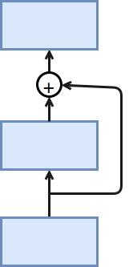

# ResNet：深度残差网络

当大家还在惊叹GoogLeNet用结构化的连接纳入了大量卷积层的时候，微软亚洲研究院的研究员已经在设计更深但结构更简单的网络[ResNet](https://arxiv.org/abs/1512.03385)。他们凭借这个网络在2015年的Imagenet竞赛中大获全胜。

ResNet有效的解决了深度卷积神经网络难训练的问题。这是因为在误差反传的过程中，梯度通常变得越来越小，从而权重的更新量也变小。这个导致远离损失函数的层训练缓慢，随着层数的增加这个现象更加明显。之前有两种常用方案来尝试解决这个问题：

1. 按层训练。先训练靠近数据的层，然后慢慢的增加后面的层。但效果不是特别好，而且比较麻烦。
2. 使用更宽的层（增加输出通道）而不是更深来增加模型复杂度。但更宽的模型经常不如更深的效果好。

ResNet通过增加跨层的连接来解决梯度逐层回传时变小的问题。虽然这个想法之前就提出过了，但ResNet真正的把效果做好了。

下图演示了一个跨层的连接。




最底下那层的输入不仅仅是输出给了中间层，而且其与中间层结果相加进入最上层。这样在梯度反传时，最上层梯度可以直接跳过中间层传到最下层，从而避免最下层梯度过小情况。

为什么叫做残差网络呢？我们可以将上面示意图里的结构拆成两个网络的和，一个一层，一个两层，最下面层是共享的。


在训练过程中，左边的网络因为更简单所以更容易训练。这个小网络没有拟合到的部分，或者说残差，则被右边的网络抓取住。所以直观上来说，即使加深网络，跨层连接仍然可以使得底层网络可以充分的训练，从而不会让训练更难。

## Residual块

ResNet沿用了VGG的那种全用$3\times 3$卷积，但在卷积和池化层之间加入了批量归一层来加速训练。每次跨层连接跨过两层卷积。这里我们定义一个这样的残差块。注意到如果输入的通道数和输出不一样时（`same_shape=False`），我们使用一个额外的$1\times 1$卷积来做通道变化，同时使用`strides=2`来把长宽减半。

```{.python .input}
from mxnet.gluon import nn
from mxnet import nd

class Residual(nn.Block):
    def __init__(self, channels, same_shape=True, **kwargs):
        super(Residual, self).__init__(**kwargs)
        self.same_shape = same_shape
        strides = 1 if same_shape else 2
        self.conv1 = nn.Conv2D(channels, kernel_size=3, padding=1,
                              strides=strides)
        self.bn1 = nn.BatchNorm()
        self.conv2 = nn.Conv2D(channels, kernel_size=3, padding=1)
        self.bn2 = nn.BatchNorm()
        if not same_shape:
            self.conv3 = nn.Conv2D(channels, kernel_size=1,
                                  strides=strides)

    def forward(self, x):
        out = nd.relu(self.bn1(self.conv1(x)))
        out = self.bn2(self.conv2(out))
        if not self.same_shape:
            x = self.conv3(x)
        return nd.relu(out + x)
```

输入输出通道相同：

```{.python .input}
blk = Residual(3)
blk.initialize()

x = nd.random.uniform(shape=(4, 3, 6, 6))
blk(x).shape
```

输入输出通道不同：

```{.python .input}
blk2 = Residual(8, same_shape=False)
blk2.initialize()
blk2(x).shape
```

## 构建ResNet

类似GoogLeNet主体是由Inception块串联而成，ResNet的主体部分串联多个Residual块。下面我们定义18层的ResNet。同样为了阅读更加容易，我们这里使用了多个`nn.Sequential`。另外注意到一点是，这里我们没用池化层来减小数据长宽，而是通过有通道变化的Residual块里面的使用`strides=2`的卷积层。

```{.python .input}
class ResNet(nn.Block):
    def __init__(self, num_classes, verbose=False, **kwargs):
        super(ResNet, self).__init__(**kwargs)
        self.verbose = verbose
        # add name_scope on the outermost Sequential
        with self.name_scope():
            # block 1
            b1 = nn.Conv2D(64, kernel_size=7, strides=2)
            # block 2
            b2 = nn.Sequential()
            b2.add(
                nn.MaxPool2D(pool_size=3, strides=2),
                Residual(64),
                Residual(64)
            )
            # block 3
            b3 = nn.Sequential()
            b3.add(
                Residual(128, same_shape=False),
                Residual(128)
            )
            # block 4
            b4 = nn.Sequential()
            b4.add(
                Residual(256, same_shape=False),
                Residual(256)
            )
            # block 5
            b5 = nn.Sequential()
            b5.add(
                Residual(512, same_shape=False),
                Residual(512)
            )
            # block 6
            b6 = nn.Sequential()
            b6.add(
                nn.AvgPool2D(pool_size=3),
                nn.Dense(num_classes)
            )
            # chain all blocks together
            self.net = nn.Sequential()
            self.net.add(b1, b2, b3, b4, b5, b6)

    def forward(self, x):
        out = x
        for i, b in enumerate(self.net):
            out = b(out)
            if self.verbose:
                print('Block %d output: %s'%(i+1, out.shape))
        return out
```

这里演示数据在块之间的形状变化：

```{.python .input}
net = ResNet(10, verbose=True)
net.initialize()

x = nd.random.uniform(shape=(4, 3, 96, 96))
y = net(x)
```

## 获取数据并训练

跟前面类似，但因为有批量归一化，所以使用了较大的学习率。

```{.python .input}
import sys
sys.path.append('..')
import utils
from mxnet import gluon
from mxnet import init

train_data, test_data = utils.load_data_fashion_mnist(
    batch_size=64, resize=96)

ctx = utils.try_gpu()
net = ResNet(10)
net.initialize(ctx=ctx, init=init.Xavier())

loss = gluon.loss.SoftmaxCrossEntropyLoss()
trainer = gluon.Trainer(net.collect_params(),
                        'sgd', {'learning_rate': 0.05})
utils.train(train_data, test_data, net, loss,
            trainer, ctx, num_epochs=1)
```

## 结论

ResNet使用跨层通道使得训练非常深的卷积神经网络成为可能。同样它使用很简单的卷积层配置，使得其拓展更加简单。

## 练习

- 这里我们实现了ResNet 18，原论文中还讨论了更深的配置。尝试实现它们。（提示：参考论文中的表1）
- 原论文中还介绍了一个“bottleneck”架构，尝试实现它
- ResNet作者在[接下来的一篇论文](https://arxiv.org/abs/1603.05027)讨论了将Residual块里面的`Conv->BN->Relu`结构改成了`BN->Relu->Conv`（参考论文图1），尝试实现它


**吐槽和讨论欢迎点**[这里](https://discuss.gluon.ai/t/topic/1663)
