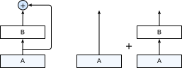

# 残差网络（ResNet）

上一小节介绍的批量归一化层对网络中间层的输出做归一化，使得训练时数值更加稳定和收敛更容易。但对于深层网络来说，还有一个问题困扰着训练：在进行梯度反传计算时，我们从误差函数（顶部）开始，朝着输入数据方向（底部）逐层计算梯度。当我们将层串联在一起时，根据链式法则每层的梯度会被乘在一起，这样便导致梯度数值以指数衰减。最后，在靠近底部的层只得到很小的梯度，对应的权重更新量也变小，使得他们的收敛缓慢。

ResNet成功地通过增加跨层的数据线路来允许梯度快速地到达底部层，从而避免这一情况 [1]。这一节我们将介绍ResNet的工作原理。


## 残差块

ResNet的基础块叫做残差块 (Residual Block) 。如图5.9所示，它将层A的输出在输入给层B的同时跨过B，并和B的输出相加作为下面层的输入。它可以看成是两个网络相加，一个网络只有层A，一个则有层A和B。这里层A在两个网络之间共享参数。在求梯度的时候，来自层B上层的梯度既可以通过层B也可以直接到达层A，从而让层A更容易获取足够大的梯度来进行模型更新。




ResNet沿用了VGG全$3\times 3$卷积层设计。残差块里首先是两个有同样输出通道的$3\times 3$卷积层，每个卷积层后跟一个批量归一化层和ReLU激活层。然后我们将输入跳过这两个卷积层后直接加在最后的ReLU激活层前。这样的设计要求两个卷积层的输出与输入形状一样，从而可以相加。如果想改变输出的通道数，我们需要引入一个额外的$1\times 1$卷积层来将输入变换成需要的形状后再相加。

残差块的实现如下。它可以设定输出通道数，是否使用额外的卷积层来修改输入通道数，以及卷积层的步幅大小。我们将`Residual`类定义在`gluonbook`包中供后面章节调用。

```{.python .input  n=1}
import sys
sys.path.insert(0, '..')

import gluonbook as gb
from mxnet import nd, gluon, init
from mxnet.gluon import loss as gloss, nn

class Residual(nn.Block):
    def __init__(self, num_channels, use_1x1conv=False, strides=1, **kwargs):
        super(Residual, self).__init__(**kwargs)
        self.conv1 = nn.Conv2D(num_channels, kernel_size=3, padding=1,
                               strides=strides)
        self.conv2 = nn.Conv2D(num_channels, kernel_size=3, padding=1)
        if use_1x1conv:
            self.conv3 = nn.Conv2D(num_channels, kernel_size=1,
                                   strides=strides)
        else:
            self.conv3 = None
        self.bn1 = nn.BatchNorm()
        self.bn2 = nn.BatchNorm()

    def forward(self, X):
        Y = nd.relu(self.bn1(self.conv1(X)))
        Y = self.bn2(self.conv2(Y))
        if self.conv3:
            X = self.conv3(X)
        return nd.relu(Y + X)
```

查看输入输出形状一致的情况：

```{.python .input  n=2}
blk = Residual(3)
blk.initialize()
X = nd.random.uniform(shape=(4, 3, 6, 6))
blk(X).shape
```

改变输出形状的同时减半输出高宽：

```{.python .input  n=3}
blk = Residual(6, use_1x1conv=True, strides=2)
blk.initialize()
blk(X).shape
```

## ResNet模型

ResNet前面两层跟前面介绍的GoogLeNet一样，在输出通道为64、步幅为2的$7\times 7$卷积层后接步幅为2的$3\times 3$的最大池化层。不同一点在于ResNet的每个卷积层后面增加的批量归一化层。

```{.python .input}
net = nn.Sequential()
net.add(nn.Conv2D(64, kernel_size=7, strides=2, padding=3),
        nn.BatchNorm(), nn.Activation('relu'),
        nn.MaxPool2D(pool_size=3, strides=2, padding=1))
```

GoogLeNet在后面接了四个由Inception块组成的模块。ResNet则是使用四个由残差块组成的模块，每个模块使用若干个同样输出通道的残差块。第一个模块的通道数同输入一致，同时因为之前已经使用了步幅为2的最大池化层，所以也不减小高宽。之后的每个模块在第一个残差块里将上一个模块的通道数翻倍，并减半高宽。

下面我们实现这个模块，注意我们对第一个模块块做了特别处理。

```{.python .input  n=4}
def resnet_block(num_channels, num_residuals, first_block=False):
    blk = nn.Sequential()
    for i in range(num_residuals):
        if i == 0 and not first_block:
            blk.add(Residual(num_channels, use_1x1conv=True, strides=2))
        else:
            blk.add(Residual(num_channels))
    return blk
```

接着我们为ResNet加入所有残差块。这里每个模块使用两个残差块。

```{.python .input  n=5}
net.add(resnet_block(64, 2, first_block=True),
        resnet_block(128, 2),
        resnet_block(256, 2),
        resnet_block(512, 2))
```

最后与GoogLeNet一样我们加入全局平均池化层后接上全连接层输出。

```{.python .input}
net.add(nn.GlobalAvgPool2D(), nn.Dense(10))
```

这里每个模块里有4个卷积层（不计算$1\times 1$卷积层），加上最开始的卷积层和最后的全连接层，一共有18层。这个模型也通常被称之为ResNet-18。通过配置不同的通道数和模块里的残差块数我们可以得到不同的ResNet模型。

注意，每个残差块里我们都将输入直接加在输出上，少数几个通过简单的$1\times 1$卷积层后相加。这样一来，即使层数很多，损失函数的梯度也能很快的传递到靠近输入的层那里。这使得即使是很深的ResNet（例如ResNet-152），在收敛速度上也同浅的ResNet（例如这里实现的ResNet-18）类似。同时虽然它的主体架构上跟GoogLeNet类似，但ResNet结构更加简单，修改也更加方便。这些因素都导致了ResNet迅速被广泛使用。

最后我们考察输入在ResNet不同模块之间的变化。

```{.python .input  n=6}
X = nd.random.uniform(shape=(1, 1, 224, 224))
net.initialize()
for layer in net:
    X = layer(X)
    print(layer.name, 'output shape:\t', X.shape)
```

## 获取数据并训练

使用跟GoogLeNet一样的超参数，但减半了学习率。

```{.python .input}
lr = 0.05
num_epochs = 5
batch_size = 256
ctx = gb.try_gpu()
net.initialize(force_reinit=True, ctx=ctx, init=init.Xavier())
trainer = gluon.Trainer(net.collect_params(), 'sgd', {'learning_rate': lr})
loss = gloss.SoftmaxCrossEntropyLoss()
train_iter, test_iter = gb.load_data_fashion_mnist(batch_size=batch_size,
                                                   resize=96)
gb.train_ch5(net, train_iter, test_iter, loss, batch_size, trainer, ctx,
             num_epochs)
```

## 小结

* 残差块通过将输入加在卷积层作用过的输出上来引入跨层通道。这使得即使非常深的网络也能很容易训练。

## 练习

- 参考ResNet论文的表1来实现不同版本的ResNet [1]。
- 对于比较深的网络， ResNet论文中介绍了一个“bottleneck”架构来降低模型复杂度。尝试实现它 [1]。
- 在ResNet的后续版本里，作者将残差块里的“卷积、批量归一化和激活”结构改成了“批量归一化、激活和卷积”，实现这个改进（[2]，图1）。

## 扫码直达[讨论区](https://discuss.gluon.ai/t/topic/1663)


## 参考文献

[1] He, K., Zhang, X., Ren, S., & Sun, J. (2016). Deep residual learning for image recognition. In Proceedings of the IEEE conference on computer vision and pattern recognition (pp. 770-778).

[2] He, K., Zhang, X., Ren, S., & Sun, J. (2016, October). Identity mappings in deep residual networks. In European Conference on Computer Vision (pp. 630-645). Springer, Cham.
