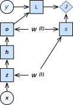

# 正向传播和反向传播

我们一直使用优化算法来训练深度学习模型，例如小批量随机梯度下降。实际上，优化算法通常都会依赖模型参数梯度的计算来迭代模型参数。然而，在深度学习模型中，由于网络结构的复杂性，模型参数梯度的计算往往并不直观。虽然我们可以通过MXNet轻松获取模型参数的梯度，但了解它们的计算将有助于我们进一步理解深度学习模型训练的本质。在本节中，我们将介绍神经网络中梯度计算的方法。

## 概念

神经网络中的梯度计算主要靠正向传播（forward propagation）和反向传播（back-propagation）。

正向传播指的是对神经网络沿着从输入层到输出层的顺序，依次计算并存储模型中间变量的过程。反向传播指的是计算神经网络参数梯度的方法。总的来说，反向传播中会依据微积分中的链式法则，沿着从输出层到输入层的顺序，依次计算并存储损失函数有关神经网络各层的中间变量以及参数的梯度。反向传播时，计算有关各层变量和参数的梯度可能会依赖于各层变量和参数的当前值。而这些变量的当前值来自正向传播的计算结果。

## 案例分析——正则化的多层感知机

为了解释正向传播和反向传播，我们以一个简单的$L_2$范数正则化的多层感知机为例。

### 定义模型

我们以类别数为$q$的分类问题为例。给定一个特征为$\boldsymbol{x} \in \mathbb{R}^d$和标签为离散值$y$的训练数据样本。不考虑偏差项，我们可以得到中间变量

$$\boldsymbol{z} = \boldsymbol{W}^{(1)} \boldsymbol{x},$$

其中$\boldsymbol{W}^{(1)} \in \mathbb{R}^{h \times d}$是模型参数。将中间变量$\boldsymbol{z} \in \mathbb{R}^h$应用按元素操作的激活函数$\phi$后，我们将得到向量长度为$h$的隐藏层变量

$$\boldsymbol{h} = \phi (\boldsymbol{z}).$$

隐藏层$\boldsymbol{h} \in \mathbb{R}^h$也是一个中间变量。通过模型参数$\boldsymbol{W}^{(2)} \in \mathbb{R}^{q \times h}$可以得到向量长度为$q$的输出层变量

$$\boldsymbol{o} = \boldsymbol{W}^{(2)} \boldsymbol{h}.$$

假设损失函数为$\ell$，我们可以计算出单个数据样本的损失项

$$L = \ell(\boldsymbol{o}, y).$$

根据$L_2$范数正则化的定义，给定超参数$\lambda$，正则化项即

$$s = \frac{\lambda}{2} (\|\boldsymbol{W}^{(1)}\|_F^2 + \|\boldsymbol{W}^{(2)}\|_F^2),$$

其中每个矩阵Frobenius范数的平方项即该矩阵元素的平方和。最终，模型在给定的数据样本上带正则化的损失为

$$J = L + s.$$

我们将$J$称为有关给定数据样本的目标函数，并在以下的讨论中简称目标函数。

### 模型计算图

为了可视化模型变量和参数之间在计算中的依赖关系，我们可以绘制模型计算图，如图3.6所示。例如，正则化项$s$的计算依赖模型参数$\boldsymbol{W}^{(1)}$和$\boldsymbol{W}^{(2)}$。

### 正向传播

在反向传播计算梯度之前，我们先做一次正向传播。也就是说，按照图3.6中箭头顺序，并根据模型参数的当前值，依次计算并存储模型中各个中间变量的值。例如，在计算损失项$L$之前，我们需要依次计算并存储$\boldsymbol{z}, \boldsymbol{h}, \boldsymbol{o}$的值。

### 反向传播

刚刚提到，图3.6中模型的参数是$\boldsymbol{W}^{(1)}$和$\boldsymbol{W}^{(2)}$。根据["线性回归"](linear-regression.md)一节中定义的小批量随机梯度下降，对于小批量中每个样本，我们都需要对目标函数$J$有关$\boldsymbol{W}^{(1)}$和$\boldsymbol{W}^{(2)}$的梯度求平均来迭代$\boldsymbol{W}^{(1)}$和$\boldsymbol{W}^{(2)}$。也就是说，每一次迭代都需要计算模型参数梯度$\partial J/\partial \boldsymbol{W}^{(1)}$和$\partial J/\partial \boldsymbol{W}^{(2)}$。根据图3.6中的依赖关系，我们可以按照其中箭头所指的反方向依次计算并存储梯度。

为了表述方便，对输入输出$\mathsf{X}, \mathsf{Y}, \mathsf{Z}$为任意形状张量的函数$\mathsf{Y}=f(\mathsf{X})$和$\mathsf{Z}=g(\mathsf{Y})$，我们使用

$$\frac{\partial \mathsf{Z}}{\partial \mathsf{X}} = \text{prod}\left(\frac{\partial \mathsf{Z}}{\partial \mathsf{Y}}, \frac{\partial \mathsf{Y}}{\partial \mathsf{X}}\right)$$

来表达链式法则。

首先，我们计算目标函数有关损失项和有关正则项的梯度

$$\frac{\partial J}{\partial L} = 1,$$ 
$$\frac{\partial J}{\partial s} = 1.$$

其次，我们依据链式法则计算目标函数有关输出层变量的梯度$\partial J/\partial \boldsymbol{o} \in \mathbb{R}^q$：

$$
\frac{\partial J}{\partial \boldsymbol{o}} 
= \text{prod}\left(\frac{\partial J}{\partial L}, \frac{\partial L}{\partial \boldsymbol{o}}\right)
= \frac{\partial L}{\partial \boldsymbol{o}}.
$$

接下来，我们可以很直观地计算出正则项有关两个参数的梯度：

$$\frac{\partial s}{\partial \boldsymbol{W}^{(1)}} = \lambda \boldsymbol{W}^{(1)},$$ $$\frac{\partial s}{\partial \boldsymbol{W}^{(2)}} = \lambda \boldsymbol{W}^{(2)}.$$

现在，我们可以计算最靠近输出层的模型参数的梯度$\partial J/\partial \boldsymbol{W}^{(2)} \in \mathbb{R}^{q \times h}$。在图3.6中，
$J$分别通过$\boldsymbol{o}$和$s$依赖$\boldsymbol{W}^{(2)}$。依据链式法则，我们得到

$$
\frac{\partial J}{\partial \boldsymbol{W}^{(2)}} 
= \text{prod}\left(\frac{\partial J}{\partial \boldsymbol{o}}, \frac{\partial \boldsymbol{o}}{\partial \boldsymbol{W}^{(2)}}\right) + \text{prod}\left(\frac{\partial J}{\partial s}, \frac{\partial s}{\partial \boldsymbol{W}^{(2)}}\right)
= \frac{\partial J}{\partial \boldsymbol{o}} \boldsymbol{h}^\top + \lambda \boldsymbol{W}^{(2)}.
$$

沿着输出层向隐藏层继续反向传播，隐藏层变量的梯度$\partial J/\partial \boldsymbol{h} \in \mathbb{R}^h$可以这样计算：

$$
\frac{\partial J}{\partial \boldsymbol{h}} 
= \text{prod}\left(\frac{\partial J}{\partial \boldsymbol{o}}, \frac{\partial \boldsymbol{o}}{\partial \boldsymbol{h}}\right)
= {\boldsymbol{W}^{(2)}}^\top \frac{\partial J}{\partial \boldsymbol{o}}.
$$

其中，激活函数$\phi$是按元素操作的。中间变量$\boldsymbol{z}$的梯度$\partial J/\partial \boldsymbol{z} \in \mathbb{R}^h$的计算需要使用按元素乘法符$\odot$：

$$
\frac{\partial J}{\partial \boldsymbol{z}} 
= \text{prod}\left(\frac{\partial J}{\partial \boldsymbol{h}}, \frac{\partial \boldsymbol{h}}{\partial \boldsymbol{z}}\right)
= \frac{\partial J}{\partial \boldsymbol{h}} \odot \phi'\left(\boldsymbol{z}\right).
$$

最终，我们可以得到最靠近输入层的模型参数的梯度$\partial J/\partial \boldsymbol{W}^{(1)} \in \mathbb{R}^{h \times d}$。在图3.6中，$J$分别通过$\boldsymbol{z}$和$s$依赖$\boldsymbol{W}^{(1)}$。依据链式法则，我们得到

$$
\frac{\partial J}{\partial \boldsymbol{W}^{(1)}} 
= \text{prod}\left(\frac{\partial J}{\partial \boldsymbol{z}}, \frac{\partial \boldsymbol{z}}{\partial \boldsymbol{W}^{(1)}}\right) + \text{prod}\left(\frac{\partial J}{\partial s}, \frac{\partial s}{\partial \boldsymbol{W}^{(1)}}\right)
= \frac{\partial J}{\partial \boldsymbol{z}} \boldsymbol{x}^\top + \lambda \boldsymbol{W}^{(1)}.
$$

需要强调的是，每次迭代中，上述各个依次计算出的梯度会被依次存储或更新。这可以用来避免重复计算某些梯度需要的值。例如，由于输出层变量梯度$\partial J/\partial \boldsymbol{o}$被计算存储，反向传播稍后的参数梯度$\partial J/\partial \boldsymbol{W}^{(2)}$和隐藏层变量梯度$\partial J/\partial \boldsymbol{h}$的计算可以直接读取输出层变量梯度的值，而无需重复计算。

### 正向传播和反向传播相互依赖

事实上，正向传播和反向传播相互依赖。为什么这么说呢？

一方面，正向传播的计算可能依赖于模型参数的当前值。而这些模型参数是在反向传播的梯度计算后通过优化算法迭代的。例如，图3.6中，计算正则化项$s$依赖模型参数$\boldsymbol{W}^{(1)}$和$\boldsymbol{W}^{(2)}$的当前值。而这些当前值是优化算法最近一次根据反向传播算出梯度后迭代得到的。

另一方面，反向传播的梯度计算可能依赖于各变量的当前值。而这些变量的当前值是通过正向传播计算的。举例来说，参数梯度$\partial J/\partial \boldsymbol{W}^{(2)}$的计算需要依赖隐藏层变量的当前值$\boldsymbol{h}$。这个当前值是通过从输入层到输出层的正向传播计算并存储得到的。

因此，在模型参数初始化完成后，我们可以交替地进行正向传播和反向传播，并根据反向传播计算的梯度迭代模型参数。

## 小结

* 反向传播沿着从输出层到输入层的顺序，依次计算并存储神经网络中间变量和参数的梯度。
* 正向传播沿着从输入层到输出层的顺序，依次计算并存储神经网络的中间变量。
* 正向传播和反向传播相互依赖。

## 练习

* 学习了本节内容后，你是否能解释[“多层感知机”](mlp.md)一节中提到的层数较多时梯度可能会衰减或爆炸的原因？

## 扫码直达[讨论区](https://discuss.gluon.ai/t/topic/3710)

