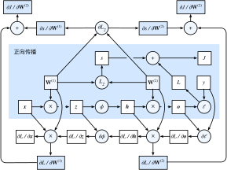

# 正向传播、反向传播和计算图

前面几节里我们使用了基于梯度下降的优化算法来训练模型。在实现中我们只提供了模型的正向传播（forward propagation）的计算，即对输入计算模型输出。然后通过autograd模块来调用系统自动生成的`backward`函数计算导数。自动求导极大的简化了深度学习模型训练算法的实现。但求导，又称反向传播（back-propagation），是深度学习的一个重要概念。这一节我们将使用数学和计算图两个方式来描述正向传播和反向传播。具体的，我们将一个简单的带$L_2$范数正则化的单隐藏层感知机为例解释正向传播和反向传播。

## 正向传播

正向传播是指对神经网络沿着从输入层到输出层的顺序，依次计算并存储模型中间变量。假设输入是一个特征为$\boldsymbol{x} \in \mathbb{R}^d$的样本。为了简单起见忽略掉隐藏层的偏差项，我们计算中间变量

$$\boldsymbol{z} = \boldsymbol{W}^{(1)} \boldsymbol{x},$$

其中$\boldsymbol{W}^{(1)} \in \mathbb{R}^{h \times d}$是该隐藏层的模型参数。将中间变量$\boldsymbol{z} \in \mathbb{R}^h$应用按元素操作的激活函数$\phi$后，我们将得到向量长度为$h$的隐藏层变量

$$\boldsymbol{h} = \phi (\boldsymbol{z}).$$

隐藏变量$\boldsymbol{h} \in \mathbb{R}^h$也是一个中间变量。通过输出层模型参数$\boldsymbol{W}^{(2)} \in \mathbb{R}^{q \times h}$可以得到向量长度为$q$的输出层变量

$$\boldsymbol{o} = \boldsymbol{W}^{(2)} \boldsymbol{h}.$$

假设损失函数为$\ell$，且样本标签为$y$，我们可以计算出单个数据样本的损失项

$$L = \ell(\boldsymbol{o}, y).$$

根据$L_2$范数正则化的定义，给定超参数$\lambda$，正则化项即

$$s = \frac{\lambda}{2} \left(\|\boldsymbol{W}^{(1)}\|_F^2 + \|\boldsymbol{W}^{(2)}\|_F^2\right),$$

其中矩阵的Frobenius范数等价于将它拉升成向量后计算$L_2$范数。最终，模型在给定的数据样本上带正则化的损失为

$$J = L + s.$$

我们将$J$称为有关给定数据样本的目标函数，并在以下的讨论中简称目标函数。

## 正向传播的计算图

我们通常绘制计算图来可视化运算符和变量在计算中的依赖关系。图3.6描述上面模型正向传播的计算图。它的左边下角是输入，右上角是输出。可以看到箭头方向主要是向右（向左箭头可以通过适当移动变量和运算符位置来修改），所以称为正向传播。

## 反向传播

反向传播依据微积分中的链式法则，沿着从输出层到输入层的顺序，依次计算并存储目标函数有关神经网络各层的中间变量以及参数的梯度。对输入输出$\mathsf{X}, \mathsf{Y}, \mathsf{Z}$为任意形状张量的函数$\mathsf{Y}=f(\mathsf{X})$和$\mathsf{Z}=g(\mathsf{Y})$，通过链式法则，我们有

$$\frac{\partial \mathsf{Z}}{\partial \mathsf{X}} = \text{prod}\left(\frac{\partial \mathsf{Z}}{\partial \mathsf{Y}}, \frac{\partial \mathsf{Y}}{\partial \mathsf{X}}\right),$$

这里$\text{prod}$根据输入的形状选择相应的乘法运算符。

因为样例模型的参数是$\boldsymbol{W}^{(1)}$和$\boldsymbol{W}^{(2)}$，所以反向传播的目标是计算$\partial J/\partial \boldsymbol{W}^{(1)}$和$\partial J/\partial \boldsymbol{W}^{(2)}$。接下来使用链式法则来反溯前向传播来依次计算每个中间变量的导数。首先，我们计算目标函数$J=L+s$有关损失项$L$和有关正则项$s$的梯度

$$\frac{\partial J}{\partial L} = 1, \quad \frac{\partial J}{\partial s} = 1.$$

其次，我们依据链式法则计算目标函数有关输出层变量的梯度$\partial J/\partial \boldsymbol{o} \in \mathbb{R}^q$：

$$
\frac{\partial J}{\partial \boldsymbol{o}}
= \text{prod}\left(\frac{\partial J}{\partial L}, \frac{\partial L}{\partial \boldsymbol{o}}\right)
= \frac{\partial L}{\partial \boldsymbol{o}}.
$$

接下来，我们可以很直观地计算出正则项有关两个参数的梯度：

$$\frac{\partial s}{\partial \boldsymbol{W}^{(1)}} = \lambda \boldsymbol{W}^{(1)},\quad\frac{\partial s}{\partial \boldsymbol{W}^{(2)}} = \lambda \boldsymbol{W}^{(2)}.$$

现在，我们可以计算最靠近输出层的模型参数的梯度$\partial J/\partial \boldsymbol{W}^{(2)} \in \mathbb{R}^{q \times h}$。依据链式法则，我们得到

$$
\frac{\partial J}{\partial \boldsymbol{W}^{(2)}}
= \text{prod}\left(\frac{\partial J}{\partial \boldsymbol{o}}, \frac{\partial \boldsymbol{o}}{\partial \boldsymbol{W}^{(2)}}\right) + \text{prod}\left(\frac{\partial J}{\partial s}, \frac{\partial s}{\partial \boldsymbol{W}^{(2)}}\right)
= \frac{\partial J}{\partial \boldsymbol{o}} \boldsymbol{h}^\top + \lambda \boldsymbol{W}^{(2)}.
$$

沿着输出层向隐藏层继续反向传播，隐藏层变量的梯度$\partial J/\partial \boldsymbol{h} \in \mathbb{R}^h$可以这样计算：

$$
\frac{\partial J}{\partial \boldsymbol{h}}
= \text{prod}\left(\frac{\partial J}{\partial \boldsymbol{o}}, \frac{\partial \boldsymbol{o}}{\partial \boldsymbol{h}}\right)
= {\boldsymbol{W}^{(2)}}^\top \frac{\partial J}{\partial \boldsymbol{o}}.
$$

其中，激活函数$\phi$是按元素操作的。中间变量$\boldsymbol{z}$的梯度$\partial J/\partial \boldsymbol{z} \in \mathbb{R}^h$的计算需要使用按元素乘法符$\odot$：

$$
\frac{\partial J}{\partial \boldsymbol{z}}
= \text{prod}\left(\frac{\partial J}{\partial \boldsymbol{h}}, \frac{\partial \boldsymbol{h}}{\partial \boldsymbol{z}}\right)
= \frac{\partial J}{\partial \boldsymbol{h}} \odot \phi'\left(\boldsymbol{z}\right).
$$

最终，我们可以得到最靠近输入层的模型参数的梯度$\partial J/\partial \boldsymbol{W}^{(1)} \in \mathbb{R}^{h \times d}$。依据链式法则，我们得到

$$
\frac{\partial J}{\partial \boldsymbol{W}^{(1)}}
= \text{prod}\left(\frac{\partial J}{\partial \boldsymbol{z}}, \frac{\partial \boldsymbol{z}}{\partial \boldsymbol{W}^{(1)}}\right) + \text{prod}\left(\frac{\partial J}{\partial s}, \frac{\partial s}{\partial \boldsymbol{W}^{(1)}}\right)
= \frac{\partial J}{\partial \boldsymbol{z}} \boldsymbol{x}^\top + \lambda \boldsymbol{W}^{(1)}.
$$

## 反向传播的计算图

图3.7完整描述了正向传播和反向传播的的计算图。可以看到在反向传播中我们使用了正向传播中计算得到的中间变量来避免重复计算。这个重用导致正向传播结束后不能立即释放中间变量内存，这是为什么训练要比预测占用更多内存的一个主要原因。其次，这些中间变量的个数跟网络层数线性相关，每个变量的大小跟批量大小和输入大小也是线性相关，它们是导致深度神经网络使用较大批量大小训练时超内存的主要原因。

## 小结

* 反向传播沿着从输出层到输入层的顺序，依次计算并存储神经网络中间变量和参数的梯度。
* 正向传播沿着从输入层到输出层的顺序，依次计算并存储神经网络的中间变量。
* 正向传播和反向传播相互依赖。

## 练习

* 对于具体的激活函数ReLU或sigmoid，如何计算它们的导数。
* 试着加上偏差项后再求导。

## 扫码直达[讨论区](https://discuss.gluon.ai/t/topic/3710)

