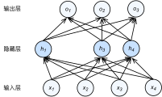

# 丢弃法

除了前一节介绍的权重衰减以外，深度学习模型常常使用丢弃法（dropout）[1] 来应对过拟合问题。丢弃法有一些不同的变体。本节中提到的丢弃法特指倒置丢弃法（inverted dropout）。

## 方法

回忆一下，[“多层感知机”](mlp.md)一节的图3.3描述了一个单隐藏层的多层感知机。其中输入个数为4，隐藏单元个数为5，且隐藏单元$h_i$（$i=1, \ldots, 5$）的计算表达式为

$$h_i = \phi\left(x_1 w_{1i} + x_2 w_{2i} + x_3 w_{3i} + x_4 w_{4i} + b_i\right),$$

这里$\phi$是激活函数，$x_1, \ldots, x_4$是输入，隐藏单元$i$的权重参数为$w_{1i}, \ldots, w_{4i}$，偏差参数为$b_i$。当对该隐藏层使用丢弃法时，该层的隐藏单元将有一定概率被丢弃掉。设丢弃概率为$p$，
那么有$p$的概率$h_i$会被清零，有$1-p$的概率$h_i$会除以$1-p$做拉伸。丢弃概率是丢弃法的超参数。具体来说，设随机变量$\xi_i$为0和1的概率分别为$p$和$1-p$。使用丢弃法时我们计算新的隐藏单元$h_i'$

$$h_i' = \frac{\xi_i}{1-p} h_i.$$

由于$E(\xi_i) = 1-p$，因此

$$E(h_i') = \frac{E(\xi_i)}{1-p}h_i = h_i.$$

即丢弃法不改变其输入的期望值。让我们对图3.3中的隐藏层使用丢弃法，一种可能的结果如图3.5所示，其中$h_2$和$h_5$被清零。这时输出值的计算不再依赖$h_2$和$h_5$，在反向传播时，与这两个隐藏单元相关的权重的梯度均为0。由于在训练中隐藏层神经元的丢弃是随机的，即$h_1, \ldots, h_5$都有可能被清零，输出层的计算无法过度依赖$h_1, \ldots, h_5$中的任一个，从而在训练模型时起到正则化的作用，并可以用来应对过拟合。在测试模型时，我们为了拿到更加确定性的结果，一般不使用丢弃法。



## 从零开始实现

根据丢弃法的定义，我们可以很容易地实现它。下面的`dropout`函数将以`drop_prob`的概率丢弃`NDArray`输入`X`中的元素。

```{.python .input}
import d2lzh as d2l
from mxnet import autograd, gluon, init, nd
from mxnet.gluon import loss as gloss, nn

def dropout(X, drop_prob):
    assert 0 <= drop_prob <= 1
    keep_prob = 1 - drop_prob
    # 这种情况下把全部元素都丢弃
    if keep_prob == 0:
        return X.zeros_like()
    mask = nd.random.uniform(0, 1, X.shape) < keep_prob
    return mask * X / keep_prob
```

我们运行几个例子来测试一下`dropout`函数。其中丢弃概率分别为0、0.5和1。

```{.python .input}
X = nd.arange(16).reshape((2, 8))
dropout(X, 0)
```

```{.python .input}
dropout(X, 0.5)
```

```{.python .input}
dropout(X, 1)
```

### 定义模型参数

实验中，我们依然使用[“softmax回归的从零开始实现”](softmax-regression-scratch.md)一节中介绍的Fashion-MNIST数据集。我们将定义一个包含两个隐藏层的多层感知机，其中两个隐藏层的输出个数都是256。

```{.python .input}
num_inputs, num_outputs, num_hiddens1, num_hiddens2 = 784, 10, 256, 256

W1 = nd.random.normal(scale=0.01, shape=(num_inputs, num_hiddens1))
b1 = nd.zeros(num_hiddens1)
W2 = nd.random.normal(scale=0.01, shape=(num_hiddens1, num_hiddens2))
b2 = nd.zeros(num_hiddens2)
W3 = nd.random.normal(scale=0.01, shape=(num_hiddens2, num_outputs))
b3 = nd.zeros(num_outputs)

params = [W1, b1, W2, b2, W3, b3]
for param in params:
    param.attach_grad()
```

### 定义模型

下面定义的模型将全连接层和激活函数ReLU串起来，并对每个激活函数的输出使用丢弃法。我们可以分别设置各个层的丢弃概率。通常的建议是把靠近输入层的丢弃概率设得小一点。在这个实验中，我们把第一个隐藏层的丢弃概率设为0.2，把第二个隐藏层的丢弃概率设为0.5。我们可以通过[“自动求梯度”](../chapter_prerequisite/autograd.md)一节中介绍的`is_training`函数来判断运行模式为训练还是测试，并只需在训练模式下使用丢弃法。

```{.python .input}
drop_prob1, drop_prob2 = 0.2, 0.5

def net(X):
    X = X.reshape((-1, num_inputs))
    H1 = (nd.dot(X, W1) + b1).relu()
    if autograd.is_training():  # 只在训练模型时使用丢弃法
        H1 = dropout(H1, drop_prob1)  # 在第一层全连接后添加丢弃层
    H2 = (nd.dot(H1, W2) + b2).relu()
    if autograd.is_training():
        H2 = dropout(H2, drop_prob2)  # 在第二层全连接后添加丢弃层
    return nd.dot(H2, W3) + b3
```

### 训练和测试模型

这部分与之前多层感知机的训练和测试类似。

```{.python .input}
num_epochs, lr, batch_size = 5, 0.5, 256
loss = gloss.SoftmaxCrossEntropyLoss()
train_iter, test_iter = d2l.load_data_fashion_mnist(batch_size)
d2l.train_ch3(net, train_iter, test_iter, loss, num_epochs, batch_size,
              params, lr)
```

## 简洁实现

在Gluon中，我们只需要在全连接层后添加`Dropout`层并指定丢弃概率。在训练模型时，`Dropout`层将以指定的丢弃概率随机丢弃上一层的输出元素；在测试模型时，`Dropout`层并不发挥作用。

```{.python .input}
net = nn.Sequential()
net.add(nn.Dense(256, activation="relu"),
        nn.Dropout(drop_prob1),  # 在第一个全连接层后添加丢弃层
        nn.Dense(256, activation="relu"),
        nn.Dropout(drop_prob2),  # 在第二个全连接层后添加丢弃层
        nn.Dense(10))
net.initialize(init.Normal(sigma=0.01))
```

下面训练并测试模型。

```{.python .input}
trainer = gluon.Trainer(net.collect_params(), 'sgd', {'learning_rate': lr})
d2l.train_ch3(net, train_iter, test_iter, loss, num_epochs, batch_size, None,
              None, trainer)
```

## 小结

* 我们可以通过使用丢弃法应对过拟合。
* 丢弃法只在训练模型时使用。

## 练习

* 如果把本节中的两个丢弃概率超参数对调，会有什么结果？
* 增大迭代周期数，比较使用丢弃法与不使用丢弃法的结果。
* 如果将模型改得更加复杂，如增加隐藏层单元，使用丢弃法应对过拟合的效果是否更加明显？
* 以本节中的模型为例，比较使用丢弃法与权重衰减的效果。如果同时使用丢弃法和权重衰减，效果会如何？


## 参考文献

[1] Srivastava, N., Hinton, G., Krizhevsky, A., Sutskever, I., & Salakhutdinov, R. (2014). Dropout: a simple way to prevent neural networks from overfitting. JMLR

## 扫码直达[讨论区](https://discuss.gluon.ai/t/topic/1278)


