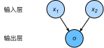

# 线性回归

在本章的前几节，我们先介绍单层神经网络：线性回归和Softmax回归。其中，线性回归适用于回归问题：模型的最终输出是一个连续值。回归问题在实际中很常见，例如预测房屋价格、气温、销售额等连续值的问题。与回归问题不同，分类问题中模型的最终输出是一个离散值。我们所说的图像分类、垃圾邮件识别、疾病检测等输出为离散值的问题都属于分类问题的范畴。而Softmax回归正适用于此类问题。

由于线性回归和Softmax回归都是单层神经网络，它们涉及到的概念和技术同样适用于大多数的深度学习模型。本节中，我们以线性回归为例，介绍大多数深度学习模型的基本要素和表示方法。


## 线性回归的基本要素

为了简单起见，我们先从具体的房屋价格预测的案例来解释线性回归的基本要素。

### 模型

给定一个有关房屋的数据集，其中每栋房屋的相关数据包括面积（平方米）、房龄（年）和价格（元）。假设我们想使用任意一栋房屋的面积（设$x_1$）和房龄（设$x_2$）来估算它的真实价格（设$y$）。那么$x_1$和$x_2$即每栋房屋的特征（feature），$y$为标签（label）或真实值（ground truth）。在线性回归模型中，房屋估计价格（设$\hat{y}$）的表达式为

$$\hat{y} = x_1 w_1 + x_2 w_2 + b,$$

其中$w_1, w_2$是权重（weight），通常用向量$\boldsymbol{w} = [w_1, w_2]^\top$来表示；$b$是偏差（bias）。这里的权重和偏差是线性回归模型的参数（parameter）。接下来，让我们了解一下如何通过训练模型来学习模型参数。


### 训练数据

假设我们使用上文所提到的房屋数据集训练模型，该数据集即训练数据集（training data set）。在训练数据集中，一栋房屋的特征和标签就是一个数据样本。设训练数据集样本数为$n$，索引为$i$的样本的特征为$x_1^{(i)}, x_2^{(i)}$，标签为$y^{(i)}$。对于索引为$i$的房屋，线性回归模型的价格估算表达式为

$$\hat{y}^{(i)} = x_1^{(i)} w_1 + x_2^{(i)} w_2 + b.$$


### 损失函数

在模型训练中，我们希望模型的估计值和真实值在训练数据集上尽可能接近。用平方损失（square loss）来定义数据样本$i$上的损失（loss）为

$$\ell^{(i)}(w_1, w_2, b) = \frac{(\hat{y}^{(i)} - y^{(i)})^2}{2},$$

当该损失越小时，模型在数据样本$i$上的估计值和真实值越接近。已知训练数据集样本数为$n$。线性回归的目标是找到一组模型参数$w_1, w_2, b$来最小化损失函数

$$\ell(w_1, w_2, b) =\frac{1}{n} \sum_{i=1}^n \ell^{(i)}(w_1, w_2, b) =\frac{1}{n} \sum_{i=1}^n \frac{(x_1^{(i)} w_1 + x_2^{(i)} w_2 + b - y^{(i)})^2}{2}.$$

在上式中，损失函数$\ell(w_1, w_2, b)$可看作是训练数据集中各个样本上损失的平均。


### 优化算法


在线性回归这个简单例子里，令损失函数对模型参数求导后的结果为零可以解出最小化损失函数的模型参数。这类解叫做解析解（analytical solution）。然而，大多数深度学习模型并没有解析解，只能通过优化算法有限次迭代模型参数来尽可能降低损失函数的值。这类解叫做数值解（numerical solution）。在求数值解的优化算法中，小批量随机梯度下降（mini-batch stochastic gradient descent）被广泛使用。它的算法很简单：每一次迭代前，我们可以随机均匀采样一个由训练数据样本所组成的小批量（mini-batch）$\mathcal{B}$；然后求小批量中数据样本的平均损失有关模型参数的导数（梯度）；再用此结果与预先设定的一个正数的乘积作为模型参数在本次迭代的减小量。在训练本节讨论的线性回归模型的过程中，模型的每个参数将迭代如下：

$$
\begin{aligned}
w_1 &\leftarrow w_1 -   \frac{\eta}{|\mathcal{B}|} \sum_{i \in \mathcal{B}} \frac{ \partial \ell^{(i)}(w_1, w_2, b)  }{\partial w_1} = w_1 -   \frac{\eta}{|\mathcal{B}|} \sum_{i \in \mathcal{B}}x_1^{(i)} (x_1^{(i)} w_1 + x_2^{(i)} w_2 + b - y^{(i)}),\\
w_2 &\leftarrow w_2 -   \frac{\eta}{|\mathcal{B}|} \sum_{i \in \mathcal{B}} \frac{ \partial \ell^{(i)}(w_1, w_2, b)  }{\partial w_2} = w_2 -   \frac{\eta}{|\mathcal{B}|} \sum_{i \in \mathcal{B}}x_2^{(i)} (x_1^{(i)} w_1 + x_2^{(i)} w_2 + b - y^{(i)}),\\
b &\leftarrow b -   \frac{\eta}{|\mathcal{B}|} \sum_{i \in \mathcal{B}} \frac{ \partial \ell^{(i)}(w_1, w_2, b)  }{\partial b} = b -   \frac{\eta}{|\mathcal{B}|} \sum_{i \in \mathcal{B}}(x_1^{(i)} w_1 + x_2^{(i)} w_2 + b - y^{(i)}).
\end{aligned}
$$

在上式中，$|\mathcal{B}|$代表每个小批量中的样本个数（批量大小，batch size），$\eta$称作学习率（learning rate）并取正数。需要强调的是，这里的批量大小和学习率的值是人为设定的，并不是通过模型训练学出的，因此叫做超参数（hyperparameter）。我们通常所说的“调参”指的正是调节超参数，例如通过反复试错来找到合适的超参数。少数情况下，超参数也可以通过模型训练学出。本书对此类情况不做讨论。

我们将在之后的“优化算法”一章中详细解释小批量随机梯度下降和其他优化算法。

### 训练和预测

当训练模型时，我们使用优化算法迭代模型参数若干次。完成以后，将模型参数$w_1, w_2, b$在训练结束时的值分别记作$\hat{w}_1, \hat{w}_2, \hat{b}$。这时，我们就可以使用学出的线性回归模型$x_1 \hat{w}_1 + x_2 \hat{w}_2 + \hat{b}$来估算训练数据集以外任意一栋面积（平方米）为$x_1$、房龄（年）为$x_2$的房屋的价格了。这里的估算也叫做模型预测、模型测试或模型推断。


## 线性回归的表示方法

我们继续以上文中的房屋数据集和线性回归模型为例，介绍线性回归的表示方法。

### 神经网络图

在深度学习中，我们可以使用神经网络图直观地表现模型结构。为了更清晰地展示线性回归作为神经网络的结构，图3.1使用神经网络图表示本节中介绍的线性回归模型。神经网络图隐去了模型参数权重和偏差。



在图3.1所表示的神经网络中，输入分别为$x_1$和$x_2$，因此输入层的输入个数为2。输入个数也叫特征数或特征向量维度。图3.1中网络的输出为$o$，输出层的输出个数为1。需要注意的是，我们直接将图3.1中神经网络的输出$o$作为线性回归的输出，即$\hat{y} = o$。由于输入层并不涉及计算，按照惯例，图3.1所示的神经网络的层数为1。所以，线性回归是一个单层神经网络。输出层中负责计算$o$的单元又叫神经元。在线性回归中，$o$的计算依赖于$x_1$和$x_2$。也就是说，输出层中的神经元和输入层中各个输入完全连接。因此，这里的输出层又叫全连接层或稠密层（fully-connected layer或dense layer）。


### 矢量计算表达式

当训练或推断模型时，我们常常会同时处理多个数据样本并用到矢量计算。在介绍线性回归的矢量计算表达式之前，让我们先考虑对两个向量相加的两种方法。

下面先定义两个1000维的向量。

```{.python .input  n=1}
from mxnet import nd
from time import time

a = nd.ones(shape=1000)
b = nd.ones(shape=1000)
```

向量相加的一种方法是，将这两个向量按元素逐一做标量加法：

```{.python .input  n=2}
start = time()
c = nd.zeros(shape=1000)
for i in range(1000):
    c[i] = a[i] + b[i]
time() - start
```

向量相加的另一种方法是，将这两个向量直接做矢量加法：

```{.python .input  n=3}
start = time()
d = a + b
time() - start
```

结果很明显，后者比前者更省时。因此，在深度学习中我们应该尽可能采用矢量计算，以提升计算效率。

让我们再次回到本节的房价估算问题。如果我们对训练数据集中3个房屋样本（索引分别为1、2和3）逐一估算价格，将得到

$$
\begin{aligned}
\hat{y}^{(1)} &= x_1^{(1)} w_1 + x_2^{(1)} w_2 + b,\\
\hat{y}^{(2)} &= x_1^{(2)} w_1 + x_2^{(2)} w_2 + b,\\
\hat{y}^{(3)} &= x_1^{(3)} w_1 + x_2^{(3)} w_2 + b.
\end{aligned}
$$

现在，我们将上面三个等式转化成矢量计算。设

$$
\boldsymbol{\hat{y}} = 
\begin{bmatrix}
    \hat{y}^{(1)} \\
    \hat{y}^{(2)} \\
    \hat{y}^{(3)}
\end{bmatrix},\quad
\boldsymbol{X} = 
\begin{bmatrix}
    x_1^{(1)} & x_2^{(1)} \\
    x_1^{(2)} & x_2^{(2)} \\
    x_1^{(3)} & x_2^{(3)}
\end{bmatrix},\quad
\boldsymbol{w} = 
\begin{bmatrix}
    w_1 \\
    w_2
\end{bmatrix},
$$

对3个房屋样本估算价格的矢量计算表达式为$\boldsymbol{\hat{y}} = \boldsymbol{X} \boldsymbol{w} + b,$ 其中的加法运算使用了广播机制（参见[“数据操作”](../chapter_prerequisite/ndarray.md)一节）。例如

```{.python .input  n=4}
a = nd.ones(shape=3)
b = 10
a + b
```

广义上，当数据样本数为$n$，特征数为$d$，线性回归的矢量计算表达式为

$$\boldsymbol{\hat{y}} = \boldsymbol{X} \boldsymbol{w} + b,$$

其中模型输出$\boldsymbol{\hat{y}} \in \mathbb{R}^{n \times 1}$， 批量数据样本特征$\boldsymbol{X} \in \mathbb{R}^{n \times d}$，权重$\boldsymbol{w} \in \mathbb{R}^{d \times 1}$， 偏差$b \in \mathbb{R}$。相应地，批量数据样本标签$\boldsymbol{y} \in \mathbb{R}^{n \times 1}$。在矢量计算中，我们将两个向量$\boldsymbol{\hat{y}}$和$\boldsymbol{y}$作为损失函数的输入。我们将在下一节介绍线性回归矢量计算的实现。

同理，我们也可以在模型训练中对优化算法做矢量计算。设模型参数$\boldsymbol{\theta} = [w_1, w_2, b]^\top$，本节中小批量随机梯度下降的迭代步骤将相应地改写为

$$\boldsymbol{\theta} \leftarrow \boldsymbol{\theta} -   \frac{\eta}{|\mathcal{B}|} \sum_{i \in \mathcal{B}}   \nabla_{\boldsymbol{\theta}} \ell^{(i)}(\boldsymbol{\theta}),$$

其中梯度是损失有关三个标量模型参数的偏导数组成的向量：
$$
\nabla_{\boldsymbol{\theta}} \ell^{(i)}(\boldsymbol{\theta})=
\begin{bmatrix}
    \frac{ \partial \ell^{(i)}(w_1, w_2, b)  }{\partial w_1} \\
    \frac{ \partial \ell^{(i)}(w_1, w_2, b)  }{\partial w_2} \\
    \frac{ \partial \ell^{(i)}(w_1, w_2, b)  }{\partial b}
\end{bmatrix}
=
\begin{bmatrix}
    x_1^{(i)} (x_1^{(i)} w_1 + x_2^{(i)} w_2 + b - y^{(i)}) \\
    x_2^{(i)} (x_1^{(i)} w_1 + x_2^{(i)} w_2 + b - y^{(i)}) \\
    x_1^{(i)} w_1 + x_2^{(i)} w_2 + b - y^{(i)}
\end{bmatrix}.
$$


## 小结

* 和大多数深度学习模型一样，对于线性回归这样一个单层神经网络，它的基本要素包括模型、训练数据、损失函数和优化算法。
* 我们既可以用神经网络图表示线性回归，又可以用矢量计算表示该模型。
* 在深度学习中我们应该尽可能采用矢量计算，以提升计算效率。


## 练习

* 使用其他包（例如NumPy）或其他编程语言（例如MATLAB），比较相加两个向量的两种方法的运行时间。


## 扫码直达[讨论区](https://discuss.gluon.ai/t/topic/6321)


