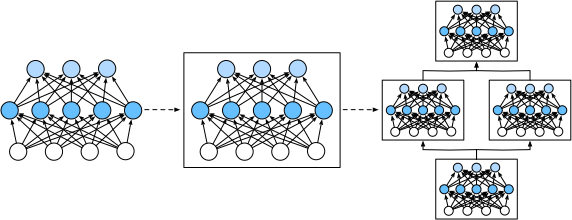

# Layers and Blocks
:label:`sec_model_construction`

When we first introduced neural networks,
we focused on linear models with a single output.
Here, the entire model consists of just a single neuron.
Note that a single neuron
(i) takes some set of inputs;
(ii) generates a corresponding scalar output;
and (iii) has a set of associated parameters that can be updated
to optimize some objective function of interest.
Then, once we started thinking about networks with multiple outputs,
we leveraged vectorized arithmetic
to characterize an entire layer of neurons.
Just like individual neurons,
layers (i) take a set of inputs,
(ii) generate corresponding outputs,
and (iii) are described by a set of tunable parameters.
When we worked through softmax regression,
a single layer was itself the model.
However, even when we subsequently
introduced MLPs,
we could still think of the model as
retaining this same basic structure.

Interestingly, for MLPs,
both the entire model and its constituent layers
share this structure.
The entire model takes in raw inputs (the features),
generates outputs (the predictions),
and possesses parameters
(the combined parameters from all constituent layers).
Likewise, each individual layer ingests inputs
(supplied by the previous layer)
generates outputs (the inputs to the subsequent layer),
and possesses a set of tunable parameters that are updated
according to the signal that flows backwards
from the subsequent layer.


While you might think that neurons, layers, and models
give us enough abstractions to go about our business,
it turns out that we often find it convenient
to speak about components that are
larger than an individual layer
but smaller than the entire model.
For example, the ResNet-152 architecture,
which is wildly popular in computer vision,
possesses hundreds of layers.
These layers consist of repeating patterns of *groups of layers*. Implementing such a network one layer at a time can grow tedious.
This concern is not just hypothetical---such
design patterns are common in practice.
The ResNet architecture mentioned above
won the 2015 ImageNet and COCO computer vision competitions
for both recognition and detection :cite:`He.Zhang.Ren.ea.2016`
and remains a go-to architecture for many vision tasks.
Similar architectures in which layers are arranged
in various repeating patterns
are now ubiquitous in other domains,
including natural language processing and speech.

To implement these complex networks,
we introduce the concept of a neural network *block*.
A block could describe a single layer,
a component consisting of multiple layers,
or the entire model itself!
One benefit of working with the block abstraction
is that they can be combined into larger artifacts,
often recursively. This is illustrated in :numref:`fig_blocks`. By defining code to generate blocks
of arbitrary complexity on demand,
we can write surprisingly compact code
and still implement complex neural networks.


:label:`fig_blocks`


From a programing standpoint, a block is represented by a *class*.
Any subclass of it must define a forward propagation function
that transforms its input into output
and must store any necessary parameters.
Note that some blocks do not require any parameters at all.
Finally a block must possess a backpropagation function,
for purposes of calculating gradients.
Fortunately, due to some behind-the-scenes magic
supplied by the auto differentiation
(introduced in :numref:`sec_autograd`)
when defining our own block,
we only need to worry about parameters
and the forward propagation function.

To begin, we revisit the code
that we used to implement MLPs
(:numref:`sec_mlp_concise`).
The following code generates a network
with one fully-connected hidden layer
with 256 units and ReLU activation,
followed by a fully-connected output layer
with 10 units (no activation function).

```{.python .input}
from mxnet import np, npx
from mxnet.gluon import nn
npx.set_np()

net = nn.Sequential()
net.add(nn.Dense(256, activation='relu'))
net.add(nn.Dense(10))
net.initialize()

X = np.random.uniform(size=(2, 20))
net(X)
```

```{.python .input}
#@tab pytorch
import torch
from torch import nn
from torch.nn import functional as F

net = nn.Sequential(nn.Linear(20, 256), nn.ReLU(), nn.Linear(256, 10))

X = torch.rand(2, 20)
net(X)
```

```{.python .input}
#@tab tensorflow
import tensorflow as tf

net = tf.keras.models.Sequential([
    tf.keras.layers.Dense(256, activation=tf.nn.relu),
    tf.keras.layers.Dense(10),
])

X = tf.random.uniform((2, 20))
net(X)
```

:begin_tab:`mxnet`
In this example, we constructed
our model by instantiating an `nn.Sequential`,
assigning the returned object to the `net` variable.
Next, we repeatedly call its `add` function,
appending layers in the order
that they should be executed.
In short, `nn.Sequential` defines a special kind of `Block`,
the class that presents a block in Gluon.
It maintains an ordered list of constituent `Block`s.
The `add` function simply facilitates
the addition of each successive `Block` to the list.
Note that each layer is an instance of the `Dense` class
which is itself a subclass of `Block`.
The forward propagation (`forward`) function is also remarkably simple:
it chains each `Block` in the list together,
passing the output of each as the input to the next.
Note that until now, we have been invoking our models
via the construction `net(X)` to obtain their outputs.
This is actually just shorthand for `net.forward(X)`,
a slick Python trick achieved via
the `Block` class's `__call__` function.
:end_tab:

:begin_tab:`pytorch`
In this example, we constructed
our model by instantiating an `nn.Sequential`, with layers in the order
that they should be executed passed as arguments.
In short, `nn.Sequential` defines a special kind of `Module`,
the class that presents a block in PyTorch.
that maintains an ordered list of constituent `Module`s.
Note that each of the two fully-connected layers is an instance of the `Linear` class
which is itself a subclass of `Module`.
The forward propagation (`forward`) function is also remarkably simple:
it chains each block in the list together,
passing the output of each as the input to the next.
Note that until now, we have been invoking our models
via the construction `net(X)` to obtain their outputs.
This is actually just shorthand for `net.forward(X)`,
a slick Python trick achieved via
the Block class's `__call__` function.
:end_tab:

:begin_tab:`tensorflow`
In this example, we constructed
our model by instantiating an `keras.models.Sequential`, with layers in the order
that they should be executed passed as arguments.
In short, `Sequential` defines a special kind of `keras.Model`,
the class that presents a block in Keras.
It maintains an ordered list of constituent `Model`s.
Note that each of the two fully-connected layers is an instance of the `Dense` class
which is itself a subclass of `Model`.
The forward propagation (`call`) function is also remarkably simple:
it chains each block in the list together,
passing the output of each as the input to the next.
Note that until now, we have been invoking our models
via the construction `net(X)` to obtain their outputs.
This is actually just shorthand for `net.call(X)`,
a slick Python trick achieved via
the Block class's `__call__` function.
:end_tab:

## A Custom Block

Perhaps the easiest way to develop intuition
about how a block works
is to implement one ourselves.
Before we implement our own custom block,
we briefly summarize the basic functionality
that each block must provide:

1. Ingest input data as arguments to its forward propagation function.
1. Generate an output by having the forward propagation function return a value. Note that the output may have a different shape from the input. For example, the first fully-connected layer in our model above ingests an      input of arbitrary dimension but returns an output of dimension 256.
1. Calculate the gradient of its output with respect to its input, which can be accessed via its backpropagation function. Typically this happens automatically.
1. Store and provide access to those parameters necessary
   to execute the forward propagation computation.
1. Initialize model parameters as needed.

In the following snippet,
we code up a block from scratch
corresponding to an MLP
with one hidden layer with 256 hidden units,
and a 10-dimensional output layer.
Note that the `MLP` class below inherits the class that represents a block.
We will heavily rely on the parent class's functions,
supplying only our own constructor (the `__init__` function in Python) and the forward propagation function.

```{.python .input}
class MLP(nn.Block):
    # Declare a layer with model parameters. Here, we declare two
    # fully-connected layers
    def __init__(self, **kwargs):
        # Call the constructor of the `MLP` parent class `Block` to perform
        # the necessary initialization. In this way, other function arguments
        # can also be specified during class instantiation, such as the model
        # parameters, `params` (to be described later)
        super().__init__(**kwargs)
        self.hidden = nn.Dense(256, activation='relu')  # Hidden layer
        self.out = nn.Dense(10)  # Output layer

    # Define the forward propagation of the model, that is, how to return the
    # required model output based on the input `X`
    def forward(self, X):
        return self.out(self.hidden(X))
```

```{.python .input}
#@tab pytorch
class MLP(nn.Module):
    # Declare a layer with model parameters. Here, we declare two fully
    # connected layers
    def __init__(self):
        # Call the constructor of the `MLP` parent class `Block` to perform
        # the necessary initialization. In this way, other function arguments
        # can also be specified during class instantiation, such as the model
        # parameters, `params` (to be described later)
        super().__init__()
        self.hidden = nn.Linear(20, 256)  # Hidden layer
        self.out = nn.Linear(256, 10)  # Output layer

    # Define the forward propagation of the model, that is, how to return the
    # required model output based on the input `X`
    def forward(self, X):
        # Note here we use the funtional version of ReLU defined in the
        # nn.functional module.
        return self.out(F.relu(self.hidden(X)))
```

```{.python .input}
#@tab tensorflow
class MLP(tf.keras.Model):
    # Declare a layer with model parameters. Here, we declare two fully
    # connected layers
    def __init__(self):
        # Call the constructor of the `MLP` parent class `Block` to perform
        # the necessary initialization. In this way, other function arguments
        # can also be specified during class instantiation, such as the model
        # parameters, `params` (to be described later)
        super().__init__()
        # Hidden layer
        self.hidden = tf.keras.layers.Dense(units=256, activation=tf.nn.relu)
        self.out = tf.keras.layers.Dense(units=10)  # Output layer

    # Define the forward propagation of the model, that is, how to return the
    # required model output based on the input `X`
    def call(self, X):
        return self.out(self.hidden((X)))
```

Let us first focus on the forward propagation function.
Note that it takes `X` as the input,
calculates the hidden representation
with the activation function applied,
and outputs its logits.
In this `MLP` implementation,
both layers are instance variables.
To see why this is reasonable, imagine
instantiating two MLPs, `net1` and `net2`,
and training them on different data.
Naturally, we would expect them
to represent two different learned models.

We instantiate the MLP's layers
in the constructor
and subsequently invoke these layers
on each call to the forward propagation function.
Note a few key details.
First, our customized `__init__` function
invokes the parent class's `__init__` function
via `super().__init__()`
sparing us the pain of restating
boilerplate code applicable to most blocks.
We then instantiate our two fully-connected layers,
assigning them to `self.hidden` and `self.out`.
Note that unless we implement a new operator,
we need not worry about the backpropagation function
or parameter initialization.
The system will generate these functions automatically.
Let us try this out.

```{.python .input}
net = MLP()
net.initialize()
net(X)
```

```{.python .input}
#@tab pytorch
net = MLP()
net(X)
```

```{.python .input}
#@tab tensorflow
net = MLP()
net(X)
```

A key virtue of the block abstraction is its versatility.
We can subclass a block to create layers
(such as the fully-connected layer class),
entire models (such as the `MLP` class above),
or various components of intermediate complexity.
We exploit this versatility
throughout the following chapters,
such as when addressing
convolutional neural networks.


## The Sequential Block

We can now take a closer look
at how the `Sequential` class works.
Recall that `Sequential` was designed
to daisy-chain other blocks together.
To build our own simplified `MySequential`,
we just need to define two key function:
1. A function to append blocks one by one to a list.
2. A forward propagation function to pass an input through the chain of blocks, in the same order as they were appended.

The following `MySequential` class delivers the same
functionality of the default `Sequential` class.

```{.python .input}
class MySequential(nn.Block):
    def add(self, block):
        # Here, `block` is an instance of a `Block` subclass, and we assume 
        # that it has a unique name. We save it in the member variable
        # `_children` of the `Block` class, and its type is OrderedDict. When
        # the `MySequential` instance calls the `initialize` function, the
        # system automatically initializes all members of `_children`
        self._children[block.name] = block

    def forward(self, X):
        # OrderedDict guarantees that members will be traversed in the order
        # they were added
        for block in self._children.values():
            X = block(X)
        return X
```

```{.python .input}
#@tab pytorch
class MySequential(nn.Module):
    def __init__(self, *args):
        super().__init__()
        for block in args:
            # Here, `block` is an instance of a `Module` subclass. We save it
            # in the member variable `_modules` of the `Module` class, and its
            # type is OrderedDict
            self._modules[block] = block

    def forward(self, X):
        # OrderedDict guarantees that members will be traversed in the order
        # they were added
        for block in self._modules.values():
            X = block(X)
        return X
```

```{.python .input}
#@tab tensorflow
class MySequential(tf.keras.Model):
    def __init__(self, *args):
        super().__init__()
        self.modules = []
        for block in args:
            # Here, `block` is an instance of a `tf.keras.layers.Layer`
            # subclass
            self.modules.append(block)

    def call(self, X):
        for module in self.modules:
            X = module(X)
        return X
```

:begin_tab:`mxnet`
The `add` function adds a single block
to the ordered dictionary `_children`.
You might wonder why every Gluon `Block`
possesses a `_children` attribute
and why we used it rather than just
define a Python list ourselves.
In short the chief advantage of `_children`
is that during our block's parameter initialization,
Gluon knows to look inside the `_children`
dictionary to find sub-blocks whose
parameters also need to be initialized.
:end_tab:

:begin_tab:`pytorch`
In the `__init__` method, we add every block
to the ordered dictionary `_modules` one by one.
You might wonder why every `Module`
possesses a `_modules` attribute
and why we used it rather than just
define a Python list ourselves.
In short the chief advantage of `_modules`
is that during our block's parameter initialization,
the system knows to look inside the `_modules`
dictionary to find sub-blocks whose
parameters also need to be initialized.
:end_tab:

When our `MySequential`'s forward propagation function is invoked,
each added block is executed
in the order in which they were added.
We can now reimplement an MLP
using our `MySequential` class.

```{.python .input}
net = MySequential()
net.add(nn.Dense(256, activation='relu'))
net.add(nn.Dense(10))
net.initialize()
net(X)
```

```{.python .input}
#@tab pytorch
net = MySequential(nn.Linear(20, 256), nn.ReLU(), nn.Linear(256, 10))
net(X)
```

```{.python .input}
#@tab tensorflow
net = MySequential(
    tf.keras.layers.Dense(units=256, activation=tf.nn.relu),
    tf.keras.layers.Dense(10))
net(X)
```

Note that this use of `MySequential`
is identical to the code we previously wrote
for the `Sequential` class
(as described in :numref:`sec_mlp_concise`).


## Executing Code in the Forward Propagation Function

The `Sequential` class makes model construction easy,
allowing us to assemble new architectures
without having to define our own class.
However, not all architectures are simple daisy chains.
When greater flexibility is required,
we will want to define our own blocks.
For example, we might want to execute
Python's control flow within the forward propagation function.
Moreover, we might want to perform
arbitrary mathematical operations,
not simply relying on predefined neural network layers.

You might have noticed that until now,
all of the operations in our networks
have acted upon our network's activations
and its parameters.
Sometimes, however, we might want to
incorporate terms
that are neither the result of previous layers
nor updatable parameters.
We call these *constant parameters*.
Say for example that we want a layer
that calculates the function
$f(\mathbf{x},\mathbf{w}) = c \cdot \mathbf{w}^\top \mathbf{x}$,
where $\mathbf{x}$ is the input, $\mathbf{w}$ is our parameter,
and $c$ is some specified constant
that is not updated during optimization.
So we implement a `FixedHiddenMLP` class as follows.

```{.python .input}
class FixedHiddenMLP(nn.Block):
    def __init__(self, **kwargs):
        super().__init__(**kwargs)
        # Random weight parameters created with the `get_constant` function
        # are not updated during training (i.e., constant parameters)
        self.rand_weight = self.params.get_constant(
            'rand_weight', np.random.uniform(size=(20, 20)))
        self.dense = nn.Dense(20, activation='relu')

    def forward(self, X):
        X = self.dense(X)
        # Use the created constant parameters, as well as the `relu` and `dot`
        # functions
        X = npx.relu(np.dot(X, self.rand_weight.data()) + 1)
        # Reuse the fully-connected layer. This is equivalent to sharing
        # parameters with two fully-connected layers
        X = self.dense(X)
        # Control flow
        while np.abs(X).sum() > 1:
            X /= 2
        return X.sum()
```

```{.python .input}
#@tab pytorch
class FixedHiddenMLP(nn.Module):
    def __init__(self):
        super().__init__()
        # Random weight parameters that will not compute gradients and
        # therefore keep constant during training
        self.rand_weight = torch.rand((20, 20), requires_grad=False)
        self.linear = nn.Linear(20, 20)

    def forward(self, X):
        X = self.linear(X)
        # Use the created constant parameters, as well as the `relu` and `mm`
        # functions
        X = F.relu(torch.mm(X, self.rand_weight) + 1)
        # Reuse the fully-connected layer. This is equivalent to sharing
        # parameters with two fully-connected layers
        X = self.linear(X)
        # Control flow
        while X.abs().sum() > 1:
            X /= 2
        return X.sum()
```

```{.python .input}
#@tab tensorflow
class FixedHiddenMLP(tf.keras.Model):
    def __init__(self):
        super().__init__()
        self.flatten = tf.keras.layers.Flatten()
        # Random weight parameters created with `tf.constant` are not updated
        # during training (i.e., constant parameters)
        self.rand_weight = tf.constant(tf.random.uniform((20, 20)))
        self.dense = tf.keras.layers.Dense(20, activation=tf.nn.relu)

    def call(self, inputs):
        X = self.flatten(inputs)
        # Use the created constant parameters, as well as the `relu` and
        # `matmul` functions
        X = tf.nn.relu(tf.matmul(X, self.rand_weight) + 1)
        # Reuse the fully-connected layer. This is equivalent to sharing
        # parameters with two fully-connected layers
        X = self.dense(X)
        # Control flow
        while tf.reduce_sum(tf.math.abs(X)) > 1:
            X /= 2
        return tf.reduce_sum(X)
```

In this `FixedHiddenMLP` model,
we implement a hidden layer whose weights
(`self.rand_weight`) are initialized randomly
at instantiation and are thereafter constant.
This weight is not a model parameter
and thus it is never updated by backpropagation.
The network then passes the output of this "fixed" layer
through a fully-connected layer.

Note that before returning the output,
our model did something unusual.
We ran a while-loop, testing
on the condition its $L_1$ norm is larger than $1$,
and dividing our output vector by $2$
until it satisfied the condition.
Finally, we returned the sum of the entries in `X`.
To our knowledge, no standard neural network
performs this operation.
Note that this particular operation may not be useful
in any real-world task.
Our point is only to show you how to integrate
arbitrary code into the flow of your
neural network computations.

```{.python .input}
net = FixedHiddenMLP()
net.initialize()
net(X)
```

```{.python .input}
#@tab pytorch, tensorflow
net = FixedHiddenMLP()
net(X)
```

We can mix and match various
ways of assembling blocks together.
In the following example, we nest blocks
in some creative ways.

```{.python .input}
class NestMLP(nn.Block):
    def __init__(self, **kwargs):
        super().__init__(**kwargs)
        self.net = nn.Sequential()
        self.net.add(nn.Dense(64, activation='relu'),
                     nn.Dense(32, activation='relu'))
        self.dense = nn.Dense(16, activation='relu')

    def forward(self, X):
        return self.dense(self.net(X))

chimera = nn.Sequential()
chimera.add(NestMLP(), nn.Dense(20), FixedHiddenMLP())
chimera.initialize()
chimera(X)
```

```{.python .input}
#@tab pytorch
class NestMLP(nn.Module):
    def __init__(self):
        super().__init__()
        self.net = nn.Sequential(nn.Linear(20, 64), nn.ReLU(),
                                 nn.Linear(64, 32), nn.ReLU())
        self.linear = nn.Linear(32, 16)

    def forward(self, X):
        return self.linear(self.net(X))

chimera = nn.Sequential(NestMLP(), nn.Linear(16, 20), FixedHiddenMLP())
chimera(X)
```

```{.python .input}
#@tab tensorflow
class NestMLP(tf.keras.Model):
    def __init__(self):
        super().__init__()
        self.net = tf.keras.Sequential()
        self.net.add(tf.keras.layers.Dense(64, activation=tf.nn.relu))
        self.net.add(tf.keras.layers.Dense(32, activation=tf.nn.relu))
        self.dense = tf.keras.layers.Dense(16, activation=tf.nn.relu)

    def call(self, inputs):
        return self.dense(self.net(inputs))

chimera = tf.keras.Sequential()
chimera.add(NestMLP())
chimera.add(tf.keras.layers.Dense(20))
chimera.add(FixedHiddenMLP())
chimera(X)
```

## Compilation

:begin_tab:`mxnet, tensorflow`
The avid reader might start to worry
about the efficiency of some of these operations.
After all, we have lots of dictionary lookups,
code execution, and lots of other Pythonic things
taking place in what is supposed to be
a high-performance deep learning library.
The problems of Python's [global interpreter lock](https://wiki.python.org/moin/GlobalInterpreterLock) are well known. In the context of deep learning,
we worry that our extremely fast GPU(s)
might have to wait until a puny CPU
runs Python code before it gets another job to run.
The best way to speed up Python is by avoiding it altogether.
:end_tab:

:begin_tab:`mxnet`
One way that Gluon does this is by allowing for
*hybridization*, which will be described later.
Here, the Python interpreter executes a block
the first time it is invoked.
The Gluon runtime records what is happening
and the next time around it short-circuits calls to Python.
This can accelerate things considerably in some cases
but care needs to be taken when control flow (as above)
leads down different branches on different passes through the net.
We recommend that the interested reader checks out
the hybridization section (:numref:`sec_hybridize`)
to learn about compilation after finishing the current chapter.
:end_tab:

## Summary

* Layers are blocks.
* Many layers can comprise a block.
* Many blocks can comprise a block.
* A block can contain code.
* Blocks take care of lots of housekeeping, including parameter initialization and backpropagation.
* Sequential concatenations of layers and blocks are handled by the `Sequential` block.


## Exercises

1. What kinds of problems will occur if you change `MySequential` to store blocks in a Python list?
1. Implement a block that takes two blocks as an argument, say `net1` and `net2` and returns the concatenated output of both networks in the forward propagation. This is also called a parallel block.
1. Assume that you want to concatenate multiple instances of the same network. Implement a factory function that generates multiple instances of the same block and build a larger network from it.

:begin_tab:`mxnet`
[Discussions](https://discuss.d2l.ai/t/54)
:end_tab:

:begin_tab:`pytorch`
[Discussions](https://discuss.d2l.ai/t/55)
:end_tab:

:begin_tab:`tensorflow`
[Discussions](https://discuss.d2l.ai/t/264)
:end_tab:
