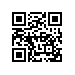

# 读取和存储

到目前为止，我们介绍了如何处理数据以及如何构建、训练和测试深度学习模型。然而在实际中，我们有时需要把训练好的模型部署到很多不同的设备。在这种情况下，我们可以把内存中训练好的模型参数存储在硬盘上供后续读取使用。


## 读写`NDArray`

我们可以直接使用`save`函数和`load`函数分别存储和读取`NDArray`。下面的例子创建了`NDArray`变量`x`，并将其存在文件名同为`x`的文件里。

```{.python .input}
from mxnet import nd
from mxnet.gluon import nn

x = nd.ones(3)
nd.save('x', x)
```

然后我们将数据从存储的文件读回内存。

```{.python .input}
x2 = nd.load('x')
x2
```

我们还可以存储一列`NDArray`并读回内存。

```{.python .input  n=2}
y = nd.zeros(4)
nd.save('xy', [x, y])
x2, y2 = nd.load('xy')
(x2, y2)
```

我们甚至可以存储并读取一个从字符串映射到`NDArray`的字典。

```{.python .input  n=4}
mydict = {'x': x, 'y': y}
nd.save('mydict', mydict)
mydict2 = nd.load('mydict')
mydict2
```

## 读写Gluon模型的参数

除`NDArray`以外，我们还可以读写Gluon模型的参数。Gluon的`Block`类提供了`save_parameters`函数和`load_parameters`函数来读写模型参数。为了演示方便，我们先创建一个多层感知机，并将其初始化。回忆[“模型参数的延后初始化”](deferred-init.md)一节，由于延后初始化，我们需要先运行一次前向计算才能实际初始化模型参数。

```{.python .input  n=6}
class MLP(nn.Block):
    def __init__(self, **kwargs):
        super(MLP, self).__init__(**kwargs)
        self.hidden = nn.Dense(256, activation='relu')
        self.output = nn.Dense(10)

    def forward(self, x):
        return self.output(self.hidden(x))

net = MLP()
net.initialize()
X = nd.random.uniform(shape=(2, 20))
Y = net(X)
```

下面把该模型的参数存成文件，文件名为mlp.params。

```{.python .input}
filename = 'mlp.params'
net.save_parameters(filename)
```

接下来，我们再实例化一次定义好的多层感知机。与随机初始化模型参数不同，我们在这里直接读取保存在文件里的参数。

```{.python .input  n=8}
net2 = MLP()
net2.load_parameters(filename)
```

因为这两个实例都有同样的模型参数，那么对同一个输入`X`的计算结果将会是一样的。我们来验证一下。

```{.python .input}
Y2 = net2(X)
Y2 == Y
```

## 小结

* 通过`save`函数和`load`函数可以很方便地读写`NDArray`。
* 通过`load_parameters`函数和`save_parameters`函数可以很方便地读写Gluon模型的参数。

## 练习

* 即使无须把训练好的模型部署到不同的设备，存储模型参数在实际中还有哪些好处？


## 扫码直达[讨论区](https://discuss.gluon.ai/t/topic/1255)


