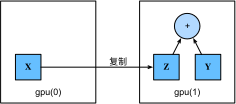

# GPU
:label:`sec_use_gpu`

在 :numref:`tab_intro_decade` 中，我们讨论了过去二十年来计算的快速增长。简而言之，自 2000 年以来，GPU 的性能每十年增加 1000 倍。这提供了巨大的机会，但也表明需要提供这种性能。

在本节中，我们开始讨论如何利用这种计算性能进行研究。首先通过使用单个 GPU，稍后，如何使用多个 GPU 和多个服务器（具有多个 GPU）。

具体来说，我们将讨论如何使用单个 NVIDIA GPU 进行计算。首先，确保至少安装了一个 NVIDIA GPU。然后，下载 [NVIDIA driver and CUDA](https://developer.nvidia.com/cuda-downloads) 并按照提示设置适当的路径。完成这些准备工作后，可以使用 `nvidia-smi` 命令查看显卡信息。

```{.python .input}
#@tab all
!nvidia-smi
```

:begin_tab:`mxnet`
您可能已经注意到，MxNet 张量看起来几乎与 NuMPy `ndarray` 相同。但是，有一些关键的区别。将 MxNet 与 NumPy 区分开来的一个关键功能是它支持各种硬件设备。

在 MxNet 中，每个数组都有一个上下文。到目前为止，默认情况下，所有变量和相关计算都已分配给 CPU。通常，其他上下文可能是各种 GPU。当我们跨多台服务器部署作业时，事情会变得更加清新。通过智能地将数组分配给上下文，我们可以最大限度地减少设备之间传输数据所花费的时间。例如，在使用 GPU 的服务器上训练神经网络时，我们通常希望模型的参数位于 GPU 上。

接下来，我们需要确认是否安装了 GPU 版本的 MxNet。如果已经安装了 MxNet 的 CPU 版本，我们需要先卸载它。例如，使用 `pip uninstall mxnet` 命令，然后根据您的 CUDA 版本安装相应的 MxNet 版本。假设您安装了 CUDA 10.0，您可以通过 `pip install mxnet-cu100` 安装支持 CUDA 10.0 的 MxNet 版本。
:end_tab:

:begin_tab:`pytorch`
在 PyTorch 中，每个数组都有一个设备，我们经常将其称为上下文。到目前为止，默认情况下，所有变量和相关计算都已分配给 CPU。通常，其他上下文可能是各种 GPU。当我们跨多台服务器部署作业时，事情会变得更加清新。通过智能地将数组分配给上下文，我们可以最大限度地减少设备之间传输数据所花费的时间。例如，在使用 GPU 的服务器上训练神经网络时，我们通常希望模型的参数位于 GPU 上。

接下来，我们需要确认是否已安装 PyTorch 的 GPU 版本。如果已经安装了 PyTorch 的 CPU 版本，我们需要先卸载它。例如，使用 `pip uninstall torch` 命令，然后根据您的 CUDA 版本安装相应的 PyTorch 版本。假设您安装了 CUDA 10.0，您可以通过 `pip install torch-cu100` 安装支持 CUDA 10.0 的 PyTorch 版本。
:end_tab:

要运行本节中的程序，您至少需要两个 GPU。请注意，这对于大多数台式计算机来说可能是奢侈的，但它很容易在云中使用，例如，通过使用 AWS EC2 多 GPU 实例。几乎所有其他部分都 * 不 * 需要多个 GPU。相反，这只是为了说明数据如何在不同设备之间流动。

## 计算设备

我们可以指定用于存储和计算的设备，例如 CPU 和 GPU。默认情况下，张量在主内存中创建，然后使用 CPU 来计算它。

:begin_tab:`mxnet`
在 MxNet 中，处理器和 GPU 可以用 `cpu()` 和 `gpu()` 表示。应该指出的是，`cpu()`（或括号中的任何整数）是指所有物理 CPU 和内存。这意味着 MxNet 的计算将尝试使用所有 CPU 内核。但是，`gpu()` 只代表一个卡和相应的内存。如果有多个 GPU，我们使用 `gpu(i)` 来表示 $i^\mathrm{th}$ GPU（$i$ 从 0 开始）。此外，这两种情况也是相同的。
:end_tab:

:begin_tab:`pytorch`
在皮托尔赫中，处理器和 GPU 可以用 `torch.device('cpu')` 和 `torch.cuda.device('cuda')` 来指示。应该指出的是，`cpu` 设备意味着所有物理 CPU 和内存。这意味着 PyTorch 的计算将尝试使用所有 CPU 核心。但是，`gpu` 设备只代表一个卡和相应的内存。如果有多个 GPU，我们使用 `torch.cuda.device(f'cuda{i}')` 来表示 $i^\mathrm{th}$ GPU（$i$ 从 0 开始）。此外，这两种情况也是相同的。
:end_tab:

```{.python .input}
from mxnet import np, npx
from mxnet.gluon import nn
npx.set_np()

npx.cpu(), npx.gpu(), npx.gpu(1)
```

```{.python .input}
#@tab pytorch
import torch
from torch import nn

torch.device('cpu'), torch.cuda.device('cuda'), torch.cuda.device('cuda:1')
```

```{.python .input}
#@tab tensorflow
import tensorflow as tf

tf.device('/CPU:0'), tf.device('/GPU:0'), tf.device('/GPU:1')
```

我们可以查询可用 GPU 的数量。

```{.python .input}
npx.num_gpus()
```

```{.python .input}
#@tab pytorch
torch.cuda.device_count()
```

```{.python .input}
#@tab tensorflow
len(tf.config.experimental.list_physical_devices('GPU'))
```

现在我们定义了两个方便的函数，即使请求的 GPU 不存在，我们也可以运行代码。

```{.python .input}
def try_gpu(i=0):  #@save
    """Return gpu(i) if exists, otherwise return cpu()."""
    return npx.gpu(i) if npx.num_gpus() >= i + 1 else npx.cpu()

def try_all_gpus():  #@save
    """Return all available GPUs, or [cpu()] if no GPU exists."""
    devices = [npx.gpu(i) for i in range(npx.num_gpus())]
    return devices if devices else [npx.cpu()]

try_gpu(), try_gpu(10), try_all_gpus()
```

```{.python .input}
#@tab pytorch
def try_gpu(i=0):  #@save
    """Return gpu(i) if exists, otherwise return cpu()."""
    if torch.cuda.device_count() >= i + 1:
        return torch.device(f'cuda:{i}')
    return torch.device('cpu')

def try_all_gpus():  #@save
    """Return all available GPUs, or [cpu(),] if no GPU exists."""
    devices = [torch.device(f'cuda:{i}')
             for i in range(torch.cuda.device_count())]
    return devices if devices else [torch.device('cpu')]

try_gpu(), try_gpu(10), try_all_gpus()
```

```{.python .input}
#@tab tensorflow
def try_gpu(i=0):  #@save
    """Return gpu(i) if exists, otherwise return cpu()."""
    if len(tf.config.experimental.list_physical_devices('GPU')) >= i + 1:
        return tf.device(f'/GPU:{i}')
    return tf.device('/CPU:0')

def try_all_gpus():  #@save
    """Return all available GPUs, or [cpu(),] if no GPU exists."""
    num_gpus = len(tf.config.experimental.list_physical_devices('GPU'))
    devices = [tf.device(f'/GPU:{i}') for i in range(num_gpus)]
    return devices if devices else [tf.device('/CPU:0')]

try_gpu(), try_gpu(10), try_all_gpus()
```

## 张量和 GPU

默认情况下，在 CPU 上创建张量。我们可以查询张量所在的设备。

```{.python .input}
x = np.array([1, 2, 3])
x.ctx
```

```{.python .input}
#@tab pytorch
x = torch.tensor([1, 2, 3])
x.device
```

```{.python .input}
#@tab tensorflow
x = tf.constant([1, 2, 3])
x.device
```

重要的是要注意的是，每当我们想要在多个条件下操作时，它们都需要在同一个设备上。例如，如果我们总和两个张量，我们需要确保两个参数都存在于同一个设备上，否则框架将不知道在哪里存储结果，甚至如何决定在哪里执行计算。

### GPU 上的存储

有几种方法可以在 GPU 上存储张量。例如，我们可以在创建张量时指定存储设备。接下来，我们在第一个 `gpu` 上创建张量变量 `X`。在 GPU 上创建的张量仅占用此 GPU 的内存。我们可以使用 `nvidia-smi` 命令来查看 GPU 内存使用情况。一般来说，我们需要确保我们不会创建超过 GPU 内存限制的数据。

```{.python .input}
X = np.ones((2, 3), ctx=try_gpu())
X
```

```{.python .input}
#@tab pytorch
X = torch.ones(2, 3, device=try_gpu())
X
```

```{.python .input}
#@tab tensorflow
with try_gpu():
    X = tf.ones((2, 3))
X
```

假设您至少有两个 GPU，下面的代码将在第二个 GPU 上创建一个随机张量。

```{.python .input}
Y = np.random.uniform(size=(2, 3), ctx=try_gpu(1))
Y
```

```{.python .input}
#@tab pytorch
Y = torch.randn(2, 3, device=try_gpu(1))
Y
```

```{.python .input}
#@tab tensorflow
with try_gpu(1):
    Y = tf.random.uniform((2, 3))
Y
```

### 复制

如果我们想要计算 `X + Y`，我们需要决定在哪里执行此操作。例如，如 :numref:`fig_copyto` 所示，我们可以将 `X` 传输到第二个 GPU 并在那里执行操作。
** 不要简单地添加
因为这将导致异常。运行时引擎不知道该怎么做：它无法在同一设备上找到数据，并且失败。由于 `Y` 存在于第二个 GPU 上，我们需要将 `X` 移动到那里，然后才能添加两个。


:label:`fig_copyto`

```{.python .input}
Z = X.copyto(try_gpu(1))
print(X)
print(Z)
```

```{.python .input}
#@tab pytorch
Z = X.cuda(1)
print(X)
print(Z)
```

```{.python .input}
#@tab tensorflow
with try_gpu(1):
    Z = X
print(X)
print(Z)
```

现在，数据位于同一个 GPU 上（`Z` 和 `Y` 都是），我们可以将它们加起来。

```{.python .input}
#@tab all
Y + Z
```

:begin_tab:`mxnet`
想象一下，你的变量 `Z` 已经存在于你的第二个 GPU 上。如果我们仍然致电 `Z.copyto(gpu(1))`，会发生什么？它将创建一个副本并分配新的内存，即使该变量已经存在于所需的设备上。有时候，根据我们的代码运行的环境，两个变量可能已经存在于同一台设备上。所以我们只想在变量当前存在于不同的设备中时复制一个副本。在这些情况下，我们可以调用 `as_in_ctx`。如果变量已经存在于指定的设备中，那么这是一个无操作。除非您特别想要制作副本，否则 `as_in_ctx` 是您选择的方法。
:end_tab:

:begin_tab:`pytorch`
想象一下，你的变量 `Z` 已经存在于你的第二个 GPU 上。如果我们仍然致电 `Z.cuda(1)`，会发生什么？它将返回 `Z`，而不是复制并分配新的内存。
:end_tab:

:begin_tab:`tensorflow`
想象一下，你的变量 `Z` 已经存在于你的第二个 GPU 上。如果我们仍然在同一设备范围内调用 `Z2 = Z`，会发生什么情况？它将返回 `Z`，而不是复制并分配新的内存。
:end_tab:

```{.python .input}
Z.as_in_ctx(try_gpu(1)) is Z
```

```{.python .input}
#@tab pytorch
Z.cuda(1) is Z
```

```{.python .input}
#@tab tensorflow
with try_gpu(1):
    Z2 = Z
Z2 is Z
```

### 附注

人们使用 GPU 进行机器学习，因为他们希望它们能够快速。但是在设备之间传输变量很慢。所以我们希望你 100% 确定你想在我们让你这样做之前做一些缓慢的事情。如果深度学习框架只是自动执行复制而不崩溃，那么你可能不会意识到你编写了一些缓慢的代码。

此外，在设备（CPU、GPU 和其他计算机）之间传输数据比计算慢得多。这也使并行化变得更加困难，因为我们必须等待数据发送（或者更确切地说接收），然后才能继续执行更多操作。这就是为什么复制操作应该非常小心。作为一个经验法则，许多小型操作比一个大型操作差得多。此外，一次几个操作比代码中的许多单个操作要好得多，除非你知道你在做什么。这是因为如果一台设备必须等待另一台设备才能执行其他操作，则此类操作可能会阻塞。这有点像在队列中订购咖啡，而不是通过电话预订，并发现它是否准备好了。

最后，当我们打印张量或将张量转换为 NumPy 格式时，如果数据不在主内存中，框架将首先将其复制到主内存中，从而导致额外的传输开销。更糟糕的是，现在它受到可怕的全局解释器锁的影响，这使得一切都等待 Python 完成。

## 神经网络和 GPU

同样，神经网络模型可以指定设备。下面的代码将模型参数放在 GPU 上。

```{.python .input}
net = nn.Sequential()
net.add(nn.Dense(1))
net.initialize(ctx=try_gpu())
```

```{.python .input}
#@tab pytorch
net = nn.Sequential(nn.Linear(3, 1))
net = net.to(device=try_gpu())
```

```{.python .input}
#@tab tensorflow
strategy = tf.distribute.MirroredStrategy()
with strategy.scope():
    net = tf.keras.models.Sequential([
        tf.keras.layers.Dense(1)])
```

我们将在下面的章节中看到更多关于如何在 GPU 上运行模型的示例，这仅仅是因为它们将变得更加耗费计算。

当输入是 GPU 上的张量时，模型将计算同一 GPU 上的结果。

```{.python .input}
#@tab all
net(X)
```

让我们确认模型参数存储在同一 GPU 上。

```{.python .input}
net[0].weight.data().ctx
```

```{.python .input}
#@tab pytorch
net[0].weight.data.device
```

```{.python .input}
#@tab tensorflow
net.layers[0].weights[0].device, net.layers[0].weights[1].device
```

简而言之，只要所有数据和参数都在同一台设备上，我们就可以高效地学习模型。在下面的章节中，我们将看到几个这样的例子。

## 摘要

* 我们可以指定用于存储和计算的设备，例如 CPU 或 GPU。默认情况下，数据在主内存中创建，然后使用 CPU 进行计算。
* 深度学习框架要求所有输入数据进行计算，无论是 CPU 还是相同的 GPU。
* 无需小心地移动数据，可能会损失显著的性能。一个典型的错误如下：计算 GPU 上每个微批处理的损失并在命令行上报告给用户（或将其记录到 NumPy `ndarray` 中）将触发全局解释器锁，从而停止所有 GPU。在 GPU 内部分配内存进行日志记录，并且只移动较大的日志要好得多。

## 练习

1. 尝试一个较大的计算任务，如大型矩阵的乘法，并查看 CPU 和 GPU 之间的速度差异。有少量计算的任务怎么办？
1. 我们应该如何在 GPU 上读取和写入模型参数？
1. 测量计算 $100 \times 100$ 矩阵的 1000 个矩阵矩阵乘法所需的时间，并记录输出矩阵的一个结果的 Frobenius 范数，而不是在 GPU 上保持日志并仅传输最终结果。
1. 测量在两个 GPU 上同时执行两个矩阵矩阵乘法所需的时间，而不是在一个 GPU 上按顺序执行两个矩阵矩阵乘法所需的时间。提示：你应该看到几乎线性缩放。

:begin_tab:`mxnet`
[Discussions](https://discuss.d2l.ai/t/62)
:end_tab:

:begin_tab:`pytorch`
[Discussions](https://discuss.d2l.ai/t/63)
:end_tab:

:begin_tab:`tensorflow`
[Discussions](https://discuss.d2l.ai/t/270)
:end_tab:
