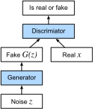

# 生成对抗网络
:label:`sec_basic_gan`

在本书的大部分内容中，我们都讨论了如何进行预测。在某种形式上，我们使用了深度神经网络学习的从数据样例到标签的映射。这种学习称为判别学习（discriminative learning），例如，我们希望能够区分照片中的猫和狗。分类器和回归器都是判别学习学习的例子。通过反向传播训练的神经网络颠覆了我们认为关于大型复杂数据集的判别式学习的所有知识。在短短5至6年间，高分辨率图像的分类精度已从无用提高到了人类水平（有些令人警示）。我们将为您提供其他所有关于深度神经网络效果惊人的其他判别任务的帮助。

但是，机器学习不仅仅是解决判别性任务。例如，给定一个大型数据集，而没有任何标签，我们可能想要学习一个可以准确捕获此数据特征的模型。给定这样一个模型，我们可以对类似于训练数据分布的综合数据样本进行采样。例如，给定大量的面孔照片，我们可能希望能够生成新的有真实感的图像，看起来它似乎有可能来自同一数据集。这种学习称为生成建模。

直到最近，我们还没有能够合成新颖的逼真的图像的方法。但是，深度神经网络在判别式学习中的成功开辟了新的可能性。在过去三年中，一大趋势是应用判别性深网来克服我们通常不认为是监督学习问题的问题中的挑战。循环神经网络语言模型是使用判别网络（经过训练可预测下一个字符）的一个示例，该判别网络一旦受过训练就可以充当生成模型。

2014年，一篇突破性的论文介绍了生成对抗网络（Generative adversarial network，简称 GANs）:cite:`Goodfellow.Pouget-Abadie.Mirza.ea.2014`，这是一种利用判别模型的力量来获得良好的生成模型的聪明新方法。GAN 的核心思想是，如果我们不能分辨真实数据之外的虚假数据，那么数据生成器就很优秀。在统计中，这称为两次抽样检验（two-sample test）-用来回答以下问题的检验：数据集 $X=\{x_1,\ldots, x_n\}$ 和 $X'=\{x'_1,\ldots, x'_n\}$ 是从同一分布中提取的。大多数统计文件与 GAN 之间的主要区别在于，后者以建设性的方式使用了这一思想。换句话说，他们不只是训练模型说“嘿，这两个数据集看起来不像它们来自同一分布”，而是使用了[两次抽样检验](https://en.wikipedia.org/wiki/Two-sample_hypothesis_testing) 为生成的模型提供训练信号。这使我们能够改进数据生成器，直到它生成类似于真实数据的内容为止。至少，它需要愚弄分类器。即使我们的分类器是最先进的深度神经网络。


:label:`fig_gan`

GAN 体系结构在 :numref:`fig_gan` 中进行了说明。
如您所见，GAN 架构中有两个部分-首先，我们需要一个设备（例如，深层网络，但实际上可能是任何东西，例如游戏渲染引擎），它可能能够生成看起来很漂亮的数据。就像真实的东西一样。如果要处理图像，则需要生成图像。如果要处理语音，则需要生成音频序列，依此类推。我们称其为生成网络（generator network）。第二部分是鉴别器网络（ discriminator network）。它试图将伪造数据与真实数据区分开。这两个网络相互竞争。生成器网络尝试欺骗鉴别器网络。在这一点上，鉴别器网络适应了新的伪造数据。该信息继而用于改善生成网络，等等。

鉴别器是一个二进制分类器，用于区分输入的 $x$ 是真实的（来自真实数据）还是伪造的（来自生成器）。通常，鉴别器为输入 $\mathbf x$ 输出标量预测 $o\in\mathbb R$，例如使用具有隐藏大小 $1$ 的密集层，然后应用 S 形函数以获得预测概率 $D(\mathbf x) = 1/(1+e^{-o})$。假设真实数据的标签 $y$ 为 $1$，伪数据为 $0$。我们训练鉴别器以最小化交叉熵损失*即*

$$ \max_G \{ - (1-y) \log(1-D(G(\mathbf z))) \} = \max_G \{ - \log(1-D(G(\mathbf z))) \}.$$

如果生成器做得很好，则 $D(\mathbf x')\approx 1$，因此上述损失接近 $0$，这导致梯度太小而无法使鉴别器取得良好的进展。因此，通常我们将最小化如下损失：

$$ \min_G \{ - y \log(D(G(\mathbf z))) \} = \min_G \{ - \log(D(G(\mathbf z))) \}, $$

这只是将 $\mathbf x'=G(\mathbf z)$ 喂给鉴别器，但给出标签 $y = 1$。

总而言之，$D$ 和 $G$ 正在玩具有目标功能的“minimax”游戏：

$$min_D max_G \{ -E_{x \sim \text{Data}} log D(\mathbf x) - E_{z \sim \text{Noise}} log(1 - D(G(\mathbf z))) \}.$$

许多 GAN 应用程序都在图像的上下文中。作为演示目的，我们将首先满足于简单的分布。我们将说明如果使用 GAN 为高斯建立世界上效率最低的参数估计器，将会发生什么情况。让我们开始吧。

```{.python .input}
%matplotlib inline
from d2l import mxnet as d2l
from mxnet import autograd, gluon, init, np, npx
from mxnet.gluon import nn
npx.set_np()
```

```{.python .input}
#@tab pytorch
%matplotlib inline
from d2l import torch as d2l
import torch
from torch import nn
```

## 生成一些“真实”数据

由于这将是世界上最糟糕的示例，因此我们仅生成从高斯获得的数据。

```{.python .input}
#@tab all
X = d2l.normal(0.0, 1, (1000, 2))
A = d2l.tensor([[1, 2], [-0.1, 0.5]])
b = d2l.tensor([1, 2])
data = d2l.matmul(X, A) + b
```

让我们看看我们得到了什么。这应该是一个以均值 $b$ 和协方差矩阵 $A^T A$ 以某种相当随意的方式进行的高斯位移。

```{.python .input}
#@tab all
d2l.set_figsize()
d2l.plt.scatter(d2l.numpy(data[:100, 0]), d2l.numpy(data[:100, 1]));
print(f'The covariance matrix is\n{d2l.matmul(A.T, A)}')
```

```{.python .input}
#@tab all
batch_size = 8
data_iter = d2l.load_array((data,), batch_size)
```

## 生成器

我们的判别网络将是最简单的网络-单层线性模型。这是因为我们将使用高斯数据生成器来驱动线性网络。因此，它实际上只需要学习参数就可以完美地伪造事物。

```{.python .input}
net_G = nn.Sequential()
net_G.add(nn.Dense(2))
```

```{.python .input}
#@tab pytorch
net_G = nn.Sequential(nn.Linear(2, 2))
```

## 判别器

对于判别器，我们将更具区分性：我们将使用具有 $3$ 层的 MLP，使事情变得更加有趣。

```{.python .input}
net_D = nn.Sequential()
net_D.add(nn.Dense(5, activation='tanh'),
          nn.Dense(3, activation='tanh'),
          nn.Dense(1))
```

```{.python .input}
#@tab pytorch
net_D = nn.Sequential(
    nn.Linear(2, 5), nn.Tanh(),
    nn.Linear(5, 3), nn.Tanh(),
    nn.Linear(3, 1))
```

## 训练

首先，我们定义一个函数来更新判别器。

```{.python .input}
#@save
def update_D(X, Z, net_D, net_G, loss, trainer_D):
    """Update discriminator."""
    batch_size = X.shape[0]
    ones = np.ones((batch_size,), ctx=X.ctx)
    zeros = np.zeros((batch_size,), ctx=X.ctx)
    with autograd.record():
        real_Y = net_D(X)
        fake_X = net_G(Z)
        # Do not need to compute gradient for `net_G`, detach it from
        # computing gradients.
        fake_Y = net_D(fake_X.detach())
        loss_D = (loss(real_Y, ones) + loss(fake_Y, zeros)) / 2
    loss_D.backward()
    trainer_D.step(batch_size)
    return float(loss_D.sum())
```

```{.python .input}
#@tab pytorch
#@save
def update_D(X, Z, net_D, net_G, loss, trainer_D):
    """Update discriminator."""
    batch_size = X.shape[0]
    ones = torch.ones((batch_size,), device=X.device)
    zeros = torch.zeros((batch_size,), device=X.device)
    trainer_D.zero_grad()
    real_Y = net_D(X)
    fake_X = net_G(Z)
    # Do not need to compute gradient for `net_G`, detach it from
    # computing gradients.
    fake_Y = net_D(fake_X.detach())
    loss_D = (loss(real_Y, ones.reshape(real_Y.shape)) + 
              loss(fake_Y, zeros.reshape(fake_Y.shape))) / 2
    loss_D.backward()
    trainer_D.step()
    return loss_D
```

生成器的更新类似。在这里，我们重复使用交叉熵损失，但将伪数据的标签从 $0$ 更改为 $1$。


```{.python .input}
#@save
def update_G(Z, net_D, net_G, loss, trainer_G):
    """Update generator."""
    batch_size = Z.shape[0]
    ones = np.ones((batch_size,), ctx=Z.ctx)
    with autograd.record():
        # We could reuse `fake_X` from `update_D` to save computation
        fake_X = net_G(Z)
        # Recomputing `fake_Y` is needed since `net_D` is changed
        fake_Y = net_D(fake_X)
        loss_G = loss(fake_Y, ones)
    loss_G.backward()
    trainer_G.step(batch_size)
    return float(loss_G.sum())
```

```{.python .input}
#@tab pytorch
#@save
def update_G(Z, net_D, net_G, loss, trainer_G):
    """Update generator."""
    batch_size = Z.shape[0]
    ones = torch.ones((batch_size,), device=Z.device)
    trainer_G.zero_grad()
    # We could reuse `fake_X` from `update_D` to save computation
    fake_X = net_G(Z)
    # Recomputing `fake_Y` is needed since `net_D` is changed
    fake_Y = net_D(fake_X)
    loss_G = loss(fake_Y, ones.reshape(fake_Y.shape))
    loss_G.backward()
    trainer_G.step()
    return loss_G
```

判别器和生成器都执行具有交叉熵损失的二元逻辑回归。我们使用 Adam 来简化训练过程。在每次迭代中，我们首先更新鉴别器，然后更新生成器。我们将损失和生成的示例可视化。


```{.python .input}
def train(net_D, net_G, data_iter, num_epochs, lr_D, lr_G, latent_dim, data):
    loss = gluon.loss.SigmoidBCELoss()
    net_D.initialize(init=init.Normal(0.02), force_reinit=True)
    net_G.initialize(init=init.Normal(0.02), force_reinit=True)
    trainer_D = gluon.Trainer(net_D.collect_params(),
                              'adam', {'learning_rate': lr_D})
    trainer_G = gluon.Trainer(net_G.collect_params(),
                              'adam', {'learning_rate': lr_G})
    animator = d2l.Animator(xlabel='epoch', ylabel='loss',
                            xlim=[1, num_epochs], nrows=2, figsize=(5, 5),
                            legend=['discriminator', 'generator'])
    animator.fig.subplots_adjust(hspace=0.3)
    for epoch in range(num_epochs):
        # Train one epoch
        timer = d2l.Timer()
        metric = d2l.Accumulator(3)  # loss_D, loss_G, num_examples
        for X in data_iter:
            batch_size = X.shape[0]
            Z = np.random.normal(0, 1, size=(batch_size, latent_dim))
            metric.add(update_D(X, Z, net_D, net_G, loss, trainer_D),
                       update_G(Z, net_D, net_G, loss, trainer_G),
                       batch_size)
        # Visualize generated examples
        Z = np.random.normal(0, 1, size=(100, latent_dim))
        fake_X = net_G(Z).asnumpy()
        animator.axes[1].cla()
        animator.axes[1].scatter(data[:, 0], data[:, 1])
        animator.axes[1].scatter(fake_X[:, 0], fake_X[:, 1])
        animator.axes[1].legend(['real', 'generated'])
        # Show the losses
        loss_D, loss_G = metric[0]/metric[2], metric[1]/metric[2]
        animator.add(epoch + 1, (loss_D, loss_G))
    print(f'loss_D {loss_D:.3f}, loss_G {loss_G:.3f}, '
          f'{metric[2] / timer.stop():.1f} examples/sec')
```

```{.python .input}
#@tab pytorch
def train(net_D, net_G, data_iter, num_epochs, lr_D, lr_G, latent_dim, data):
    loss = nn.BCEWithLogitsLoss(reduction='sum')
    for w in net_D.parameters():
        nn.init.normal_(w, 0, 0.02)
    for w in net_G.parameters():
        nn.init.normal_(w, 0, 0.02)
    trainer_D = torch.optim.Adam(net_D.parameters(), lr=lr_D)
    trainer_G = torch.optim.Adam(net_G.parameters(), lr=lr_G)
    animator = d2l.Animator(xlabel='epoch', ylabel='loss',
                            xlim=[1, num_epochs], nrows=2, figsize=(5, 5),
                            legend=['discriminator', 'generator'])
    animator.fig.subplots_adjust(hspace=0.3)
    for epoch in range(num_epochs):
        # Train one epoch
        timer = d2l.Timer()
        metric = d2l.Accumulator(3)  # loss_D, loss_G, num_examples
        for (X,) in data_iter:
            batch_size = X.shape[0]
            Z = torch.normal(0, 1, size=(batch_size, latent_dim))
            metric.add(update_D(X, Z, net_D, net_G, loss, trainer_D),
                       update_G(Z, net_D, net_G, loss, trainer_G),
                       batch_size)
        # Visualize generated examples
        Z = torch.normal(0, 1, size=(100, latent_dim))
        fake_X = net_G(Z).detach().numpy()
        animator.axes[1].cla()
        animator.axes[1].scatter(data[:, 0], data[:, 1])
        animator.axes[1].scatter(fake_X[:, 0], fake_X[:, 1])
        animator.axes[1].legend(['real', 'generated'])
        # Show the losses
        loss_D, loss_G = metric[0]/metric[2], metric[1]/metric[2]
        animator.add(epoch + 1, (loss_D, loss_G))
    print(f'loss_D {loss_D:.3f}, loss_G {loss_G:.3f}, '
          f'{metric[2] / timer.stop():.1f} examples/sec')
```

现在，我们指定超参数以适合高斯分布。

```{.python .input}
#@tab all
lr_D, lr_G, latent_dim, num_epochs = 0.05, 0.005, 2, 20
train(net_D, net_G, data_iter, num_epochs, lr_D, lr_G,
      latent_dim, d2l.numpy(data[:100]))
```

## 小结

- 生成对抗网络（GAN）由两个深层网络（生成器和鉴别器）组成。
- 生成器通过最大化交叉熵损失即 $\max \log(D(\mathbf{x'}))$，生成尽可能接近真实图像的图像，以欺骗鉴别器。
- 鉴别器试图通过最小化交叉熵损失即，$\min - y \log D(\mathbf{x}) - (1-y)\log(1-D(\mathbf{x}))$。

## 练习

* 生成器获胜时是否存在均衡，即判别器最终无法区分有限样本上的两个分布？

:begin_tab:`mxnet`
[Discussions](https://discuss.d2l.ai/t/408)
:end_tab:

:begin_tab:`pytorch`
[Discussions](https://discuss.d2l.ai/t/1082)
:end_tab:
