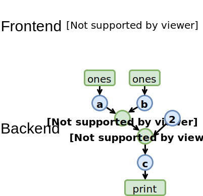

# 自动并行计算

在[惰性计算](./lazy-evaluation.md)里我们提到后端系统会自动构建计算图。通过计算图系统可以知道所有计算的依赖关系，有了它系统可以选择将没有依赖关系任务同时执行来获得性能的提升。

仍然考虑下面这个例子，这里`a = ...`和`b = ...`之间没有数据依赖关系，从而系统可以选择并行执行他们。



通常一个运算符，例如`+`或者`dot`，会用掉一个计算设备上所有计算资源。`dot`同样用到所有CPU的核（即使是有多个CPU）和单GPU上所有线程。因此在单设备上并行运行多个运算符可能效果并不明显。自动并行主要的用途是多设备的计算并行，和计算与通讯的并行。

【注意】本章需要至少一个GPU才能运行。

## 多设备的并行计算

我们首先定义一个函数，它做10次矩阵乘法。

```{.python .input}
from mxnet import nd

def run(x):
    """push 10 matrix-matrix multiplications"""
    return [nd.dot(x,x) for i in range(10)]
```

我们分别计算在CPU和GPU上运行时间

```{.python .input}
from mxnet import gpu
from time import time

x_cpu = nd.random.uniform(shape=(2000,2000))
x_gpu = nd.random.uniform(shape=(6000,6000), ctx=gpu(0))
nd.waitall()

# warm up
run(x_cpu)
run(x_gpu)
nd.waitall()

start = time()
run(x_cpu)
nd.waitall()
print('Run on CPU: %f sec'%(time()-start))

start = time()
run(x_gpu)
nd.waitall()
print('Run on GPU: %f sec'%(time()-start))

```

我们去掉两次`run`之间的`waitall`，希望系统能自动并行这两个任务：

```{.python .input}
start = time()
run(x_cpu)
run(x_gpu)
nd.waitall()
print('Run on both CPU and GPU: %f sec'%(time()-start))
```

可以看到两个一起执行时，总时间不是分开执行的总和。这个表示后端系统能有效并行执行它们。

## 计算和通讯的并行

在多设备计算中，我们经常需要在设备之间复制数据。例如下面我们在GPU上计算，然后将结果复制回CPU。

```{.python .input}
from mxnet import cpu

def copy_to_cpu(x):
    """copy data to a device"""
    return [y.copyto(cpu()) for y in x]

start = time()
y = run(x_gpu)
nd.waitall()
print('Run on GPU: %f sec'%(time()-start))

start = time()
copy_to_cpu(y)
nd.waitall()
print('Copy to CPU: %f sec'%(time() - start))
```

同样我们去掉运行和复制之间的`waitall`:

```{.python .input}
start = time()
y = run(x_gpu)
copy_to_cpu(y)
nd.waitall()
t = time() - start
print('Run on GPU then Copy to CPU: %f sec'%(time() - start))
```

可以看到总时间小于前面两者之和。这个任务稍微不同于上面，因为运行和复制之间有依赖关系。就是`y[i]`必须先计算好才能复制到CPU。但在计算`y[i]`的时候系统可以复制`y[i-1]`，从而获得总运行时间的减少。

## 小结

* MXNet能够自动并行执行没有数据依赖关系的任务从而提升系统性能。

## 练习

* `run`里面计算了10次运算，他们也没有依赖关系。看看系统有没有自动并行执行他们
* 试试有更加复杂数据依赖的任务，看看系统能不能得到正确的结果，而且性能有提升吗？

## 扫码直达[讨论区](https://discuss.gluon.ai/t/topic/1883)


