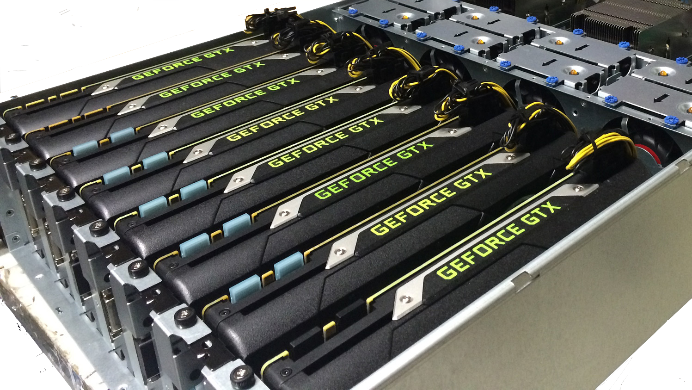

# 多GPU训练模型——从零开始

本教程我们将展示如何使用多个GPU来加速训练。正如你期望的那样，这个教程需要至少两块GPU来运行。事实上，一台机器上安装多块GPU非常常见，因为通常主板上会有多个PCIe插槽。下图是一台服务器上安装了8块Titan X。



如果正确安装了NVIDIA驱动，我们可以通过`nvidia-smi`来查看当前系统有多少个GPU。

```{.python .input  n=1}
!nvidia-smi
```

在[自动并行](./auto-parallelism.md)里我们提到虽然大部分的运算可以要么全部使用所有的CPU计算资源，或者单GPU的资源。但对于多GPU的情况，我们仍然需要来实现对应的算法。这些算法中最常用的叫做数据并行。

## 数据并行

数据并行目前是深度学习里面使用最广泛的用来将任务划分到多设备的办法。它是这样工作的，假设这里有*k*个GPU，每个GPU将维护一个模型参数的复制。然后每次我们将一个批量里面的样本划分成*k*块并分每个GPU一块。每个GPU使用分到的数据计算梯度。然后我们将所有GPU上梯度相加得到这个批量上的完整梯度。之后每个GPU使用这个完整梯度对自己维护的模型做更新。


## 定义模型

我们使用[卷积神经网络 --- 从0开始](../chapter_convolutional-neural-networks/cnn-scratch.md)里介绍的LeNet来作为本章的样例任务。

```{.python .input  n=2}
from mxnet import nd
from mxnet import gluon

# initialize parameters
scale = .01
W1 = nd.random.normal(shape=(20,1,3,3))*scale
b1 = nd.zeros(shape=20)
W2 = nd.random.normal(shape=(50,20,5,5))*scale
b2 = nd.zeros(shape=50)
W3 = nd.random.normal(shape=(800,128))*scale
b3 = nd.zeros(shape=128)
W4 = nd.random.normal(shape=(128,10))*scale
b4 = nd.zeros(shape=10)
params = [W1, b1, W2, b2, W3, b3, W4, b4]

# network and loss
def lenet(X, params):
    # first conv
    h1_conv = nd.Convolution(data=X, weight=params[0], bias=params[1],
                             kernel=(3,3), num_filter=20)
    h1_activation = nd.relu(h1_conv)
    h1 = nd.Pooling(data=h1_activation, pool_type="avg",
                    kernel=(2,2), stride=(2,2))
    # second conv
    h2_conv = nd.Convolution(data=h1, weight=params[2], bias=params[3],
                             kernel=(5,5), num_filter=50)
    h2_activation = nd.relu(h2_conv)
    h2 = nd.Pooling(data=h2_activation, pool_type="avg",
                    kernel=(2,2), stride=(2,2))
    h2 = nd.flatten(h2)
    # first dense
    h3_linear = nd.dot(h2, params[4]) + params[5]
    h3 = nd.relu(h3_linear)
    # second dense
    yhat = nd.dot(h3, params[6]) + params[7]
    return yhat

loss = gluon.loss.SoftmaxCrossEntropyLoss()
```

然后我们先实现几个在GPU同步数据的辅助函数。

## 在多GPU之间同步数据

下面函数将模型参数复制到某个特定设备并初始化梯度。

```{.python .input  n=3}
from mxnet import gpu

def get_params(params, ctx):
    new_params = [p.copyto(ctx) for p in params]
    for p in new_params:
        p.attach_grad()
    return new_params

# copy param to GPU(0)
new_params = get_params(params, gpu(0))
print('b1 weight = ', new_params[1])
print('b1 grad = ', new_params[1].grad)
```

给定分布在多个GPU之间数据，我们定义一个函数它将这些数据加起来，然后再广播到所有GPU上。

```{.python .input  n=4}
def allreduce(data):
    # sum on data[0].context, and then broadcast
    for i in range(1, len(data)):
        data[0][:] += data[i].copyto(data[0].context)
    for i in range(1, len(data)):
        data[0].copyto(data[i])

data = [nd.ones((1,2), ctx=gpu(i))*(i+1) for i in range(2)]
print('Before:', data)
allreduce(data)
print('After:', data)
```

最后给定一个批量，我们划分它并复制到各个GPU上。

```{.python .input  n=5}
def split_and_load(data, ctx):
    n, k = data.shape[0], len(ctx)
    m = n // k
    assert m * k == n, '# examples is not divided by # devices'
    return [data[i*m:(i+1)*m].as_in_context(ctx[i]) for i in range(k)]

batch = nd.arange(16).reshape((4,4))
ctx = [gpu(0), gpu(1)]
splitted = split_and_load(batch, ctx)

print('Intput: ', batch)
print('Load into', ctx)
print('Output:', splitted)
```

## 训练一个批量

现在我们可以实现如何使用数据并行在多个GPU上训练一个批量了。

```{.python .input  n=6}
from mxnet import autograd
import sys
sys.path.append('..')
import utils

def train_batch(data, label, params, ctx, lr):
    # split the data batch and load them on GPUs
    data_list = split_and_load(data, ctx)
    label_list = split_and_load(label, ctx)
    # run forward on each GPU
    with autograd.record():
        losses = [loss(lenet(X, W), Y)
                  for X, Y, W in zip(data_list, label_list, params)]
    # run backward on each gpu
    for l in losses:
        l.backward()
    # aggregate gradient over GPUs
    for i in range(len(params[0])):
        allreduce([params[c][i].grad for c in range(len(ctx))])
    # update parameters with SGD on each GPU
    for p in params:
        utils.SGD(p, lr/data.shape[0])
```

## 开始训练

现在我们可以定义完整的训练函数。这个跟前面教程里没有什么区别。

```{.python .input  n=7}
from time import time

def train(num_gpus, batch_size, lr):
    train_data, test_data = utils.load_data_fashion_mnist(batch_size)

    ctx = [gpu(i) for i in range(num_gpus)]
    print('Running on', ctx)

    # copy parameters to all GPUs
    dev_params = [get_params(params, c) for c in ctx]

    for epoch in range(5):
        # train
        start = time()
        for data, label in train_data:
            train_batch(data, label, dev_params, ctx, lr)
        nd.waitall()
        print('Epoch %d, training time = %.1f sec'%(
            epoch, time()-start))

        # validating on GPU 0
        net = lambda data: lenet(data, dev_params[0])
        test_acc = utils.evaluate_accuracy(test_data, net, ctx[0])
        print('         validation accuracy = %.4f'%(test_acc))
```

首先我们使用一个GPU来训练。

```{.python .input  n=8}
train(1, 256, 0.3)
```

使用多个GPU但不改变其他参数会得到跟单GPU一致的结果（但数据是随机顺序，所以会有细微区别）

```{.python .input}
train(2, 256, 0.3)
```

但在多GPU时，通常我们需要增加批量大小使得每个GPU能得到足够多的任务来保证性能。但一个大的批量大小可能使得收敛变慢。这时候的一个常用做法是将学习率增大些。

```{.python .input  n=9}
train(2, 512, 0.6)
```

可以看到使用两个GPU能有效的减少训练时间。

## 小结

* 数据并行可以有效的在多GPU上提升训练性能。

## 练习

* 试试不同的批量大小和学习率
* 将预测也改成多GPU版本
* 注意到我们使用GPU 0来做梯度求和，会有带来什么问题吗？

## 扫码直达[讨论区](https://discuss.gluon.ai/t/topic/1884)


