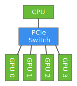

# 从0开始使用多GPU来训练


This tutorial shows how we can increase performance by distributing training across multiple GPUs.
So, as you might expect, running this tutorial requires at least 2 GPUs.
And these days multi-GPU machines are actually quite common.
The following figure depicts 4 GPUs on a single machine and connected to the CPU through a PCIe switch.



If an NVIDIA driver is installed on our machine,
then we can check how many GPUs are available by running the command `nvidia-smi`.

```{.python .input  n=1}
!nvidia-smi
```

We want to use all of the GPUs on together for the purpose of significantly speeding up training (in terms of wall clock).
Remember that CPUs and GPUs each can have multiple cores.
CPUs on a laptop might have 2 or 4 cores, and on a server might have up to 16 or 32 cores.
GPUs tend to have many more cores - an NVIDIA K80 GPU has 4992 - but run at slower clock speeds.
Exploiting the parallelism across the GPU cores is how GPUs get their speed advantage in the first place.

As compared to the single CPU or single GPU setting where all the cores are typically used by default,
parallelism across devices is a little more complicated.
That's because most layers of a neural network can only run on a single device.
So, in order to parallelize across devices, we need to do a little extra.
Therefore, we need to do some additional work to partition a workload across multiple GPUs.
This can be done in a few ways.

## Data Parallelism

For deep learning, data parallelism is by far the most widely used approach for partitioning workloads.
It works like this: Assume that we have *k* GPUs. We split the examples in a data batch into *k* parts,
and send each part to a different GPUs which then computes the gradient that part of the batch.
Finally, we collect the gradients from each of the GPUs and sum them together before updating the weights.

The following pseudo-code shows how to train one data batch on *k* GPUs.


## Define model and updater

We will use the convolutional neural networks and plain SGD introduced in [cnn-scratch](../chapter_convolutional-neural-networks/cnn-scratch.md) as an example workload.

```{.python .input  n=2}
from mxnet import nd
from mxnet import gluon

# initialize parameters
scale = .01
W1 = nd.random.normal(shape=(20,1,3,3))*scale
b1 = nd.zeros(shape=20)
W2 = nd.random.normal(shape=(50,20,5,5))*scale
b2 = nd.zeros(shape=50)
W3 = nd.random.normal(shape=(800,128))*scale
b3 = nd.zeros(shape=128)
W4 = nd.random.normal(shape=(128,10))*scale
b4 = nd.zeros(shape=10)
params = [W1, b1, W2, b2, W3, b3, W4, b4]

# network and loss
def lenet(X, params):
    # first conv
    h1_conv = nd.Convolution(data=X, weight=params[0], bias=params[1],
                             kernel=(3,3), num_filter=20)
    h1_activation = nd.relu(h1_conv)
    h1 = nd.Pooling(data=h1_activation, pool_type="avg",
                    kernel=(2,2), stride=(2,2))
    # second conv
    h2_conv = nd.Convolution(data=h1, weight=params[2], bias=params[3],
                             kernel=(5,5), num_filter=50)
    h2_activation = nd.relu(h2_conv)
    h2 = nd.Pooling(data=h2_activation, pool_type="avg",
                    kernel=(2,2), stride=(2,2))
    h2 = nd.flatten(h2)
    # first dense
    h3_linear = nd.dot(h2, params[4]) + params[5]
    h3 = nd.relu(h3_linear)
    # second dense
    yhat = nd.dot(h3, params[6]) + params[7]
    return yhat

loss = gluon.loss.SoftmaxCrossEntropyLoss()
```

## 在多GPU之间同步数据

The following function copies the parameters into a particular GPU and initializes the gradients.

```{.python .input  n=3}
from mxnet import gpu

def get_params(params, ctx):
    new_params = [p.copyto(ctx) for p in params]
    for p in new_params:
        p.attach_grad()
    return new_params

# copy param to GPU(0)
new_params = get_params(params, gpu(0))
print('b1 weight = ', new_params[1])
print('b1 grad = ', new_params[1].grad)
```

Given a list of data that spans multiple GPUs, we then define a function to sum the data
and broadcast the results to each GPU.

```{.python .input  n=4}
def allreduce(data):
    # sum on data[0].context, and then broadcast
    for i in range(1, len(data)):
        data[0][:] += data[i].copyto(data[0].context)
    for i in range(1, len(data)):
        data[0].copyto(data[i])

data = [nd.ones((1,2), ctx=gpu(i))*(i+1) for i in range(2)]
print('Before:', data)
allreduce(data)
print('After:', data)
```

Given a data batch, we define a function that splits this batch and copies each part into the corresponding GPU.

```{.python .input  n=5}
def split_and_load(data, ctx):
    n, k = data.shape[0], len(ctx)
    m = n // k
    assert m * k == n, '# examples is not divided by # devices'
    return [data[i*m:(i+1)*m].as_in_context(ctx[i]) for i in range(k)]

batch = nd.arange(16).reshape((4,4))
ctx = [gpu(0), gpu(1)]
splitted = split_and_load(batch, ctx)

print('Intput: ', batch)
print('Load into', ctx)
print('Output:', splitted)
```

## 训练一个批量

Now we are ready to implement how to train one data batch with data parallelism.

```{.python .input  n=6}
from mxnet import autograd
import sys
sys.path.append('..')
import utils

def train_batch(data, label, params, ctx, lr):
    # split the data batch and load them on GPUs
    data_list = split_and_load(data, ctx)
    label_list = split_and_load(label, ctx)
    # run forward on each GPU
    with autograd.record():
        losses = [loss(lenet(X, W), Y)
                  for X, Y, W in zip(data_list, label_list, params)]
    # run backward on each gpu
    for l in losses:
        l.backward()
    # aggregate gradient over GPUs
    for i in range(len(params[0])):
        allreduce([params[c][i].grad for c in range(len(ctx))])
    # update parameters with SGD on each GPU
    for p in params:
        utils.SGD(p, lr/data.shape[0])
```

## Put all things together

Define the program that trains and validates the model on MNIST.

```{.python .input  n=7}
from time import time

def train(num_gpus, batch_size, lr):
    train_data, test_data = utils.load_data_fashion_mnist(batch_size)

    ctx = [gpu(i) for i in range(num_gpus)]
    print('Running on', ctx)

    # copy parameters to all GPUs
    dev_params = [get_params(params, c) for c in ctx]

    for epoch in range(5):
        # train
        start = time()
        for data, label in train_data:
            train_batch(data, label, dev_params, ctx, lr)
        nd.waitall()
        print('Epoch %d, training time = %.1f sec'%(
            epoch, time()-start))

        # validating on GPU 0
        net = lambda data: lenet(data, dev_params[0])
        test_acc = utils.evaluate_accuracy(test_data, net, ctx[0])
        print('         validation accuracy = %.4f'%(test_acc))
```

First run on a single GPU with batch size 64.

```{.python .input  n=8}
train(1, 256, 0.3)
```

Running on multiple GPUs, we often want to increase the batch size so that each GPU still gets a large enough batch size for good computation performance. A larger batch size sometimes slows down the convergence, we often want to increases the learning rate as well.

```{.python .input  n=9}
train(2, 512, 0.6)
```

## Conclusion

We have shown how to implement data parallelism on a deep neural network from scratch. Thanks to the auto-parallelism, we only need to write serial codes while the engine is able to parallelize them on multiple GPUs.

## Next
[Training with multiple GPUs with ``gluon``](../chapter07_distributed-learning/multiple-gpus-gluon.ipynb)

For whinges or inquiries, [open an issue on  GitHub.](https://github.com/zackchase/mxnet-the-straight-dope)
