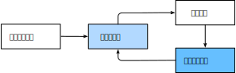
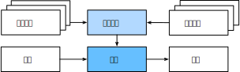
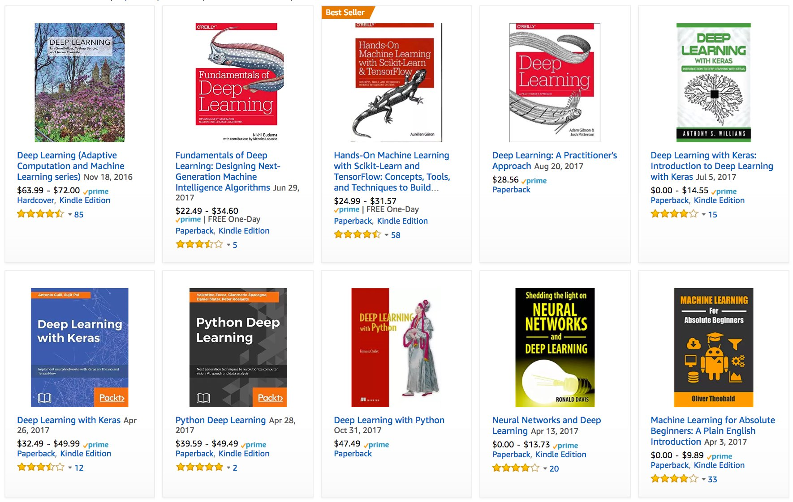
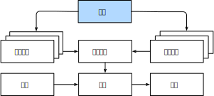
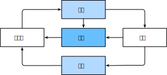

# 前言
:label:`chap_introduction`

时至今日，我们常用的计算机程序几乎都是软件开发人员从零编写的。
比如，现在我们要编写一个程序来管理网上商城。
经过思考，我们可能提出如下一个解决方案：
首先，用户通过Web浏览器（或移动应用程序）与应用程序进行交互。
紧接着，应用程序与数据库引擎进行交互，以保存交易历史记录并跟踪每个用户的动态。
其中，这个程序的核心——“业务逻辑”，详细说明了程序在各种情况下进行的操作。

为了完善业务逻辑，我们必须细致地考虑应用程序所有可能遇到的边界情况，并为这些边界情况设计合适的规则。
当买家单击将商品添加到购物车时，我们会向购物车数据库表中添加一个条目，将该用户ID与商品ID关联起来。
虽然一次编写出完美应用程序的可能性微乎其微，但在大多数情况下，我们可以从基本原理出发编写这样的程序，并不断测试直到满足用户的需求。
我们能够根据第一原则设计自动化系统，驱动正常运行的产品和系统，是一个人类认知上的非凡壮举。

幸运的是，对于日益壮大机器学习科学家群体来说，实现很多任务的自动化并不再屈从于人类的聪明才智。
想象一下，你正和你最聪明一群朋友围绕着白板，试图解决以下问题之一：

* 编写一个程序，给出地理信息、卫星图像和一些历史天气信息，来预测明天的天气。
* 编写一个程序，给出自然文本表示的问题，并正确回答该问题。
* 编写一个程序，给出一张图像，识别出图像所包含的人，并在每个人周围绘制轮廓。
* 编写一个程序，向用户推荐他们可能喜欢但在自然浏览过程中不太可能遇到的产品。

在这些情况下，即使是顶级程序员也无法从零开始，交上完美的解决方案。
原因可能各不相同：有时，我们的任务可能遵循一种随着时间推移而变化的模式，我们需要程序来自动调整。
有时，任务内的关系（比如像素和抽象类别之间的关系）可能太复杂，需要数千或数百万次的计算。
即使我们的眼睛能毫不费力地完成任务，这些计算也超出了我们的意识理解。
*机器学习*（machine learning，ML）是强大的可以从经验中学习的技术。
通常采用观测数据或与环境交互的形式，机器学习算法会积累更多的经验，其性能也会逐步提高。
相反，对比刚刚所说的电子商务平台，一直执行相同的业务逻辑，无论积累多少经验，都不会自动提高（直到开发人员认识到并更新软件）。
在这本书中，我们将带你开启机器学习之旅，并特别关注*深度学习*（deep learning）的基础知识。
这是一套强大的技术，它可以推动计算机视觉、自然语言处理、医疗保健和基因组学等不同领域的创新。

## 日常生活中的机器学习

假设你正和本书的作者们一起，驱车去咖啡店。
亚历山大拿起一部iPhone，对它说道“Hey Siri”--手机的语音识别系统主动唤醒了。
接着，李沐对Siri说道“去星巴克咖啡店”--语音识别系统自动触发语音转文字功能，并启动地图应用程序来满足我们的请求。
地图应用程序在启动后确定了若干条路线：每条路线都显示了预计的通行时间......
由此可见，机器学习渗透在生活中的方方面面，在短短几秒钟的时间里，我们与智能手机的日常互动就可以涉及几种机器学习模型。

现在，请你从基本原则出发，编写一个程序来响应一个“唤醒词“（比如“Alexa”、“小爱同学”和“Hey Siri”）。
试着用一台计算机和一个代码编辑器自己编写代码，如 :numref:`fig_wake_word` 中所示。
问题看似很难解决：麦克风每秒钟将收集大约44000个样本，每个样本都是声波振幅的测量值。
如何编写程序，令其输入原始音频片段，输出$\{\text{是}, \text{否}\}$（表示该片段是否包含唤醒词）的可靠预测呢？
如果你毫无头绪，别担心，我们也不知道如何从头开始编写这个程序。这就是我们需要机器学习的原因。


:label:`fig_wake_word`

显然，即使我们不知道如何编程从输入到输出的映射，人类大脑认知仍然能够执行这个任务。
换句话说，即使你不知道如何编写程序来识别单词“Alexa”，你的大脑却能够轻易识别它。
有了这一能力，我们就可以收集一个包含音频样本的巨大的*数据集*（dataset），并对包含和不包含唤醒词的样本进行标记。
通过机器学习算法，我们不需要设计一个“明确地”识别唤醒词的系统。
相反，我们定义一个灵活的程序算法，其输出由许多*参数*（parameter）决定。
然后我们使用数据集来确定当下的“最佳参数集”，这些参数通过某种性能度量来获取完成任务的最佳性能。

那么到底什么是参数呢？
你可以把参数看作是旋钮，我们可以转动旋钮来调整程序的行为。
任一调整参数的程序后，我们称为*模型*（model）。
通过操作参数而生成的所有不同程序（输入-输出映射）的集合称为“模型族”。
使用数据集来选择参数的元程序被称为*学习算法*（learning algorithm）。

在我们开始用机器学习算法解决问题之前，我们必须精确地定义问题，确定输入和输出的性质，并选择合适的模型族。
在本例中，我们的模型接收一段音频作为*输入*（input），然后模型生成$\{\text{是}, \text{否}\}$中的*输出*（output）。
如果一切顺利，经过一番训练，模型对于“片段是否包含唤醒词“的预测通常是正确的。

现在我们的模型每次听到“Alexa”这个词时都会发出“是”的声音。
由于这里的唤醒词是任意选择的自然语言，因此我们可能需要一个足够丰富的模型族，使模型多元化。
比如，模型族的另一个模型只在听到“Hey Siri”这个词时发出“是”。
理想情况下，同一个模型族应该适合于“Alexa”识别和“Hey Siri”识别，因为它们似乎是相似的任务。
相反，如果我们想处理完全不同的输入或输出，比如从图像映射到字幕，或从英语映射到中文，我们可能需要一个完全不同的模型族。

正如你可能猜到的，如果我们只是随机设置模型参数，所以这个模型不太可能识别出“Alexa”、“Hey Siri”或任何其他单词。
在机器学习中，*学习*（learning）是一个模型的训练过程。
通过这个过程，我们可以发现正确的参数集，从而从使模型强制执行所需的行为。
换句话说，我们用数据*训练*（train）我们的模型。
如  :numref:`fig_ml_loop`所示，训练过程通常包含如下步骤：

1. 从一个随机初始化参数的模型开始，这个模型基本毫不”智能“。
1. 获取一些数据样本（例如，音频片段以及对应的$\{\text{是}, \text{否}\}$标签）。
1. 调整参数，使模型在这些样本中表现得更好。
1. 重复第2步和第3步，直到模型在任务中的表现令你满意。


:label:`fig_ml_loop`

总而言之，我们没有编写唤醒词识别器，而是编写了一个“学习”程序。
如果我们用一个巨大的带标签的数据集，它很可能可以“学习”识别唤醒词。
你可以将这种”通过用数据集来确定程序行为”的方法看作是“用数据编程”（programming with data）。
比如，我们可以通过向机器学习系统提供许多猫和狗的图片来设计一个“猫图检测器”。
通过这种方式，检测器最终可以学会：如果输入是猫的图片就输出一个非常大的正数，如果输入是狗的图片就会得出一个非常大的负数。
如果检测器不确定，它会输出接近于零的数......
这个例子仅仅是机器学习常见应用的冰山一角。
而深度学习是机器学习的一个主要分支，我们稍后将对其进行更详细的解析。

## 关键组件

首先，我们想让大家更清楚地了解一些核心组件。
无论我们遇到什么类型的机器学习问题，这些组件都将伴随我们左右：

1. 我们可以学习的*数据*（data）。
1. 如何转换数据的*模型*（model）。
1. 一个*目标函数*（objective function），用来量化模型的有效性。
1. 调整模型参数以优化目标函数的算法。

### 数据

毋庸置疑，如果没有数据，那么数据科学毫无用武之地。
每个数据集由一个个*样本*（example）组成，大多时候，它们遵循独立同分布(independently and identically distributed, i.i.d.)。
样本有时也叫做*数据点*（data point）或者*数据实例*（data instance），通常每个样本由一组称为*特征*（features，或*协变量*（covariates））的属性组成。
机器学习模型会根据这些属性进行预测。
在上面的监督学习问题中，要预测的是一个特殊的属性，它被称为*标签*（label，或*目标*（target））。

假设我们处理的是图像数据，每一张单独的照片即为一个样本，它的特征由每个像素数值的有序列表表示。
比如，$200\times 200$彩色照片由$200\times200\times3=120000$个数值组成，其中的“3”对应于每个空间位置的红、绿、蓝通道的强度。
再比如，对于一组医疗数据，给定一组标准的特征(如年龄、生命体征和诊断)，我们可能用此数据尝试预测患者是否会存活。

当每个样本的特征类别数量都是相同的，所以其特征向量是固定长度的，这个长度被称为数据的*维数*（dimensionality）。
固定长度的特征向量是一个方便的属性，它有助于我们量化学习大量样本。

然而，并不是所有的数据都可以用”固定长度“的向量表示。
以图像数据为例，如果它们全部来自标准显微镜设备，那么“固定长度”是可取的；
但是如果我们的图像数据来自互联网，我们不能天真的假想它们都有相同的分辨率或形状。
这时，我们可以考虑将图像裁剪成标准尺寸，但这种办法很局限，数据有丢失信息的风险。
此外，文本数据更不符合”固定长度“的要求。
考虑一下亚马逊等电子商务网站上的客户评论：有些文本数据是简短的（比如“好极了”）；有些则长篇大论。
与传统机器学习方法相比，深度学习的一个主要优势是可以处理不同长度的数据。

一般来说，我们拥有的数据越多，我们的工作就越容易。
当我们有了更多的数据，我们通常可以训练出更强大的模型，从而减少对预先设想假设的依赖。
数据集的由小变大为现代深度学习的成功奠定基础。
在没有大数据集的情况下，许多令人兴奋的深度学习模型黯然失色。
就算一些深度学习模型在小数据集上能够工作，但其效能并不比传统方法高。

请注意，仅仅拥有海量的数据是不够的，我们还需要正确的数据。
如果数据中充满了错误，或者如果数据的特征不能预测任务目标，那么模型很可能无效。
有一句古语很好地反映了这个现象：“输入的是垃圾,输出的也是垃圾。”（“Garbage in, garbage out."）
此外，糟糕的预测性能甚至会加倍放大事态的严重性。
在一些敏感应用中，如预测性监管、简历筛选和用于贷款的风险模型，我们必须特别警惕垃圾数据的后果。
一种常见的问题来自不均衡的数据集，比如在一个有关医疗的训练数据集中，某些人群没有样本表示。
想象一下，假设你要训练一个皮肤癌识别模型，但它（在训练数据集）从未见过的黑色皮肤的人群，就会顿时束手无策。

再比如，如果用“过去的招聘决策数据”来训练一个筛选简历的模型，那么机器学习模型可能会无意中捕捉到历史残留的不公正，并将其自动化。
然而，这一切都可能在不知情的情况下发生。
因此，当数据不具有充分代表性，甚至包含了一些社会偏见时，模型就很有可能失败。


### 模型

大多数机器学习会涉及到数据的转换。
比如，我们建立一个“摄取照片并预测笑脸”的系统。再比如，我们摄取一组传感器读数，并预测读数的正常与异常程度。
虽然简单的模型能够解决如上简单的问题，但本书中关注的问题超出了经典方法的极限。
深度学习与经典方法的区别主要在于：前者关注的功能强大的模型，这些模型由神经网络错综复杂的交织在一起，包含层层数据转换，因此被称为*深度学习*（deep learning）。
在讨论深度模型的过程中，我们也将提及一些传统方法。


### 目标函数

前面，我们将机器学习介绍为“从经验中学习“。
这里所说的“学习”，是指自主提高模型完成某些任务的效能。
但是，什么才算真正的提高呢？
在机器学习中，我们需要定义模型的优劣程度的度量，这个度量在大多数情况是“可优化”的，我们称之为*目标函数*（objective function）。
我们通常定义一个目标函数，并希望优化它到最低点。因为越低越好，所以这些函数有时被称为*损失函数*（loss function, 或cost function）。
但这只是一个惯例，你也可以取一个新的函数，优化到它的最高点。这两个函数本质上是相同的，只是翻转一下符号。

当任务为试图预测数值时，最常见的损失函数是*平方误差*（squared error），即预测值与实际值之差的平方。
当试图解决分类问题时，最常见的目标函数是最小化错误率，即预测与实际情况不符的样本比例。
有些目标函数（如平方误差）很容易被优化，有些目标（如错误率）由于不可微性或其他复杂性难以直接优化。
在这些情况下，通常会优化*替代目标*。

通常，损失函数是根据模型参数定义的，并取决于数据集。
在一个数据集上，我们通过最小化总损失来学习模型参数的最佳值。
该数据集由一些为训练而收集的样本组成，称为*训练数据集*（training dataset，或称为*训练集*（training set））。
然而，在训练数据上表现良好的模型，并不一定在“新数据集“上有同样的效能，这里的“新数据集“通常称为*测试数据集*（test dataset，或称为*测试集*（test set））。

综上所述，我们通常将可用数据集分成两部分：训练数据集用于拟合模型参数，测试数据集用于评估拟合的模型。
然后我们观察模型在这两部分数据集的效能。
你可以把”一个模型在训练数据集上的效能“想象成”一个学生在模拟考试中的分数“。
这个分数用来为一些真正的期末考试做参考，即使成绩令人鼓舞，也不能保证期末考试成功。
换言之，测试性能可能会显著偏离训练性能。
当一个模型在训练集上表现良好，但不能推广到测试集时，我们说这个模型是“过拟合”（overfitting）的。
就像在现实生活中，尽管模拟考试考得很好，真正的考试不一定百发百中。


### 优化算法

一旦我们获得了一些数据源及其表示、一个模型和一个合适的损失函数，我们接下来就需要一种算法，它能够搜索出最佳参数，以最小化损失函数。
深度学习中，大多流行的优化算法通常基于一种基本方法--*梯度下降*（gradient descent）。
简而言之，在每个步骤中，梯度下降法都会检查每个参数，看看如果你仅对该参数进行少量变动，训练集损失会朝哪个方向移动。
然后，它在可以减少损失的方向上优化参数。


## 各种机器学习问题

在机器学习的广泛应用中，唤醒词问题只是冰山一角。
在前面的例子中，只是机器学习可以解决的众多问题中的一个。
下面，我们将列出一些常见机器学习问题和应用，为之后本书的讨论做铺垫。
我们将不断引用前面提到的概念，如数据、模型和训练技术。

### 监督学习

*监督学习*（supervised learning）擅长在“给定输入特征”的情况下预测标签。
每个“特征-标签”对都称为一个*样本*（example）。
有时，即使标签是未知的，样本也可以指代输入特征。
我们的目标是生成一个模型，能够将任何输入特征映射到标签，即预测。

举一个具体的例子。
假设我们需要预测患者是否会心脏病发作，那么观察结果“心脏病发作”或“心脏病没有发作”将是我们的标签。
输入特征可能是生命体征，如心率、舒张压和收缩压。

监督学习之所以发挥作用，是因为在训练参数时，我们为模型提供了一个数据集，其中每个样本都有真实的标签。
用概率论术语来说，我们希望预测“估计给定输入特征的标签”的条件概率。
虽然监督学习只是几大类机器学习问题之一，但是在工业中，大部分机器学习的成功应用都是监督学习。
这是因为在一定程度上，许多重要的任务可以清晰地描述为：在给定一组特定的可用数据的情况下，估计未知事物的概率。比如：

* 根据计算机断层扫描（CT）图像预测是否为癌症。
* 给出一个英语句子，预测正确的法语翻译。
* 根据本月的财务报告数据预测下个月股票的价格。

非正式地说，监督学习的学习过程如下所示。
首先，从已知大量数据样本中随机选取一个子集，为每个样本获取基本的真实标签。
有时，这些样本已有标签（例如，患者是否在下一年内康复？）；
有时，我们可能需要人工标记数据（例如，将图像分类）。
这些输入和相应的标签一起构成了训练数据集。
随后，我们选择有监督的学习算法，它将训练数据集作为输入，并输出一个“完成学习模型”。
最后，我们将之前没见过的样本特征放到这个“完成学习模型”中，使用模型的输出作为相应标签的预测。
整个监督学习过程在 :numref:`fig_supervised_learning` 中绘制。


:label:`fig_supervised_learning`

综上所述，即使使用简单的描述“给定输入特征的预测标签”，监督学习也可以采取多种形式的模型，并且需要大量不同的建模决策，这取决于输入和输出的类型、大小和数量。
例如，在处理“任意长度的序列”或者“固定长度的向量表示”时，我们可以使用不同的模型。
我们将在本书中深入探讨这些问题。

#### 回归

*回归*（regression）是最简单的监督学习任务之一。
比方说，假设我们有一组房屋销售数据表格，其中每行对应于每个房子，每列对应于一些相关的属性，例如房屋的面积、卧室的数量、浴室的数量以及到镇中心的步行分钟数等等。
对机器学习来说，每个样本即为一个特定的房屋，相应的特征向量将是表中的一行。
如果你住在纽约或旧金山，而且你不是亚马逊、谷歌、微软或Facebook的首席执行官，那么你家中的（平方英尺、卧室数量、浴室数量、步行距离）特征向量可能类似于：$[600, 1, 1, 60]$。
然而，如果你住在匹兹堡，这个特征向量可能看起来更像$[3000, 4, 3, 10]$......
为什么这个任务可以归类于回归问题呢？本质上是输出决定的。
假设你在市场上寻找新房子，你可能需要估计一栋房子的公平市场价值。
销售价格，即标签，是一个数值。
当标签取任意数值时，我们称之为*回归*问题。
我们的目标是生成一个模型，它的预测非常接近实际标签值。

生活中的许多问题都可归类于回归问题。
比如，预测用户对一部电影的评分可以被认为是一个回归问题。
这里一个小插曲，如果你在2009年设计了一个很棒的算法来预测电影评分，你可能会赢得[100万美元的奈飞奖](https://en.wikipedia.org/wiki/Netflix_Prize)。
再比如，预测病人在医院的住院时间也是一个回归问题。
总而言之，判断回归问题的一个很好的经验法则是，任何有关“多少”的问题很可能就是回归问题。比如：

* 这个手术需要多少小时？
* 在未来六小时，这个镇会有多少降雨量？

你可能发现，即使你以前从未使用过机器学习，可能在不经意间，你已经解决了一些回归问题。
例如，你让人修理了排水管，你的承包商花了3个小时清除污水管道中的污物，然后他寄给你一张350美元的账单。
而你的朋友雇了同一个承包商两个小时，他收到了250美元的账单。
如果有人请你估算的清理污物的费用，你可以假设承包商有一些基本费用，然后按小时收费。
如果这些假设成立，那么给出这两个数据样本，你就已经可以确定承包商的定价结构：每小时100美元，外加50美元上门服务费。
你看，在不经意间，你就已经理解并应用了线性回归的本质。

以上假设有时并不可取。
例如，如果一些差异是由于两个特征之外的几个因素造成的。
在这些情况下，我们将尝试学习最小化”预测值和实际标签值的差异“的模型。
在本书大部分章节中，我们将关注最小化平方误差损失函数。
正如我们稍后将看到的，这种损失对应于我们的数据被高斯噪声破坏的假设。

#### 分类

虽然回归模型可以很好地解决"有多少？“的问题，但是很多问题并非如此。
例如，一家银行希望在其移动应用程序中添加支票扫描功能。
具体地说，这款应用程序需要能够自动理解照片图像中看到的文本，并将手写字符映射到已知字符之一。
这种“哪一个？”的问题叫做*分类*（classification）问题。
在*分类*问题中，我们希望模型能够预测样本属于哪个*类别*（category，正式称为*类*（class））。
例如，对于手写数字，我们可能有10类，分别数字0到9。
最简单的分类问题是只有两类，我们称之为“二元分类”。
例如，数据集可能由动物图像组成，标签可能是$\mathrm{\{猫, 狗\}}两类$。
在回归中，我们训练一个回归函数来输出一个数值；
而在分类中，我们训练一个分类器，它的输出即为预测的类别。

然而模型怎么判断得出这种“是”或“不是”的硬分类预测呢？
我们可以试着用概率语言来理解模型。
给定一个样本特征，我们的模型为每个可能的类分配一个概率。
比如，之前的猫狗分类例子中，分类器可能会输出图像是猫的概率为0.9。
0.9这个数字表达什么意思呢？
我们可以这样解释：分类器90%确定图像描绘的是一只猫。
预测类别的概率的大小传达了一种模型的不确定性，我们将在后面章节中讨论其他运用不确定性概念的算法。

当我们有两个以上的类别时，我们把这个问题称为*多类分类*（multiclass classification）问题。
常见的例子包括手写字符识别 $\mathrm{\{0, 1, 2, ... 9, a, b, c, ...\}}$。
与解决回归问题不同，分类问题的常见损失函数被称为*交叉熵*（cross-entropy），我们将在后面的章节中详细阐述。

请注意，最常见的类别不一定是你将用于决策的类别。
举个例子，假设你在后院发现了一个美丽的蘑菇，如 :numref:`fig_death_cap` 所示。


:width:`200px`
:label:`fig_death_cap`

现在，请你训练一个毒蘑菇检测分类器，根据照片预测蘑菇是否有毒。
假设这个分类器输出 :numref:`fig_death_cap` 包含死帽蕈的概率是0.2。
换句话说，分类器80%确定我们的蘑菇不是死帽蕈。
尽管如此，我们也不会吃它，因为我们不值得冒20%的死亡风险。
换句话说，不确定风险的影响远远大于收益。
因此，我们需要将“预期风险”作为损失函数。
也就是说，我们需要将结果的概率乘以与之相关的收益（或伤害）。
在这种情况下，食用蘑菇造成的损失为 $0.2 \times \infty + 0.8 \times 0 = \infty$，而丢弃蘑菇的损失为$0.2 \times 0 + 0.8 \times 1 = 0.8$。
我们的谨慎是有道理的：正如任何真菌学家都会告诉我们的那样， :numref:`fig_death_cap` 中的蘑菇实际上是一个死帽蕈。

分类可能变得比二元分类、多类分类复杂得多。
例如，有一些分类任务的变体可以用于寻找层次结构，层次结构假定在许多类之间存在某种关系。
因此，并不是所有的错误都是均等的。
我们宁愿错误地分入一个相关的类别，也不愿错误地分入一个遥远的类别，这通常被称为*层次分类*(hierarchical classification)。
早期的一个例子是[卡尔·林耐](https://en.wikipedia.org/wiki/Carl_Linnaeus)人，他们把动物组织分类成等级制。

在动物分类的应用中，把一只狮子狗（一种狗的品种）误认为雪纳瑞（另一种狗的品种）可能不会太糟糕。
但如果我们的模型将狮子狗与恐龙混淆，就滑稽至极了。
层次结构相关性可能取决于你计划如何使用模型。
例如，响尾蛇和乌梢蛇血缘上可能很接近，但如果把响尾蛇误认为是乌梢蛇可能会是致命的。
因为响尾蛇是有毒的，而乌梢蛇是无毒的。

#### 标记问题

有些分类问题很适合于二元分类或多类分类。
例如，我们可以训练一个普通的二元分类器来区分猫和狗。
运用最前沿的计算机视觉的算法，我们可以轻松地训练这个模型。
尽管如此，无论我们的模型有多精确，当分类器遇到新的动物时可能会束手无策。
比如这张“不来梅的城市音乐家”的图像 :numref:`fig_stackedanimals` （这是一个流行的德国童话故事），图中有一只猫，一只公鸡，一只狗，一头驴，背景是一些树。
取决于我们最终想用我们的模型做什么，将其视为二元分类问题可能没有多大意义。
取而代之，我们可能想让模型描绘输入图像的内容，一只猫、一只狗、一头驴，还有一只公鸡。


:width:`300px`
:label:`fig_stackedanimals`

学习预测不相互排斥的类别的问题称为*多标签分类*（multilabel classification）。
举个例子，人们在技术博客上贴的标签，比如“机器学习”、“技术”、“小工具”、“编程语言”、“Linux”、“云计算”、“AWS”。
一篇典型的文章可能会用5-10个标签，因为这些概念是相互关联的。
关于“云计算”的帖子可能会提到“AWS”，而关于“机器学习”的帖子也可能涉及“编程语言”。

此外，在处理生物医学文献时，我们也会遇到这类问题。
正确地标记文献很重要，有利于研究人员对文献进行详尽的审查。
在国家医学图书馆，一些专业的注释员会检查每一篇在PubMed中被索引的文章，以便将其与Mesh中的相关术语相关联（Mesh是一个大约有28000个标签的集合）。
这是一个十分耗时的过程，注释器通常在归档和标记之间有一年的延迟。
这里，机器学习算法可以提供临时标签，直到每一篇文章都有严格的人工审核。
事实上，近几年来，BioASQ组织已经[举办比赛](http://bioasq.org/)来完成这项工作。


#### 搜索

有时，我们不仅仅希望输出为一个类别或一个实值。
在信息检索领域，我们希望对一组项目进行排序。
以网络搜索为例，我们的目标不是简单的“查询（query）-网页（page）”分类，而是在海量搜索结果中找到用户最需要的那部分。
搜索结果的排序也十分重要，我们的学习算法需要输出有序的元素子集。
换句话说，如果要求我们输出字母表中的前5个字母，返回“A、B、C、D、E”和“C、A、B、E、D”是不同的。
即使结果集是相同的，集内的顺序有时却很重要。

该问题的一种可能的解决方案：首先为集合中的每个元素分配相应的相关性分数，然后检索评级最高的元素。[PageRank](https://en.wikipedia.org/wiki/PageRank)，谷歌搜索引擎背后最初的秘密武器就是这种评分系统的早期例子，但它的奇特之处在于它不依赖于实际的查询。
在这里，他们依靠一个简单的相关性过滤来识别一组相关条目，然后根据PageRank对包含查询条件的结果进行排序。
如今，搜索引擎使用机器学习和用户行为模型来获取网页相关性得分，很多学术会议也致力于这一主题。


#### 推荐系统
:label:`subsec_recommender_systems`

另一类与搜索和排名相关的问题是*推荐系统*（recommender system），它的目标是向给特定用户进行“个性化”推荐。
例如，对于电影推荐，科幻迷和喜剧爱好者的推荐结果页面可能会有很大不同。
类似的应用也会出现在零售产品、音乐和新闻推荐等等。

在某些应用中，客户会提供明确反馈，表达他们对特定产品的喜爱程度。
例如，亚马逊上的产品评级和评论。
在其他一些情况下，客户会提供隐性反馈。
例如，某用户跳过播放列表中的某些歌曲，这可能说明歌曲对此用户不大合适。
总的来说，推荐系统会为“给定用户和物品”的匹配性打分，这个“分数”可能是估计的评级或购买的概率。
由此，对于任何给定的用户，推荐系统都可以检索得分最高的对象集，然后将其推荐给用户。以上只是简单的算法，而工艺生产的推荐系统要先进得多，它会将详细的用户活动和项目特征考虑在内。
推荐系统算法经过调整，可以捕捉一个人的偏好。
比如， :numref:`fig_deeplearning_amazon` 是亚马逊基于个性化算法推荐的深度学习书籍，成功的捕捉了作者的喜好。


:label:`fig_deeplearning_amazon`

尽管推荐系统具有巨大的应用价值，但单纯用它作为预测模型仍存在一些缺陷。
首先，我们的数据只包含“审查后的反馈”：用户更倾向于给他们感觉强烈的事物打分。
例如，在五分制电影评分中，会有许多五星级和一星级评分，但三星级却明显很少。
此外，推荐系统有可能形成反馈循环：推荐系统首先会优先推送一个购买量较大（可能被认为更好）的商品，然而目前用户的购买习惯往往是遵循推荐算法，但学习算法并不总是考虑到这一细节，进而更频繁地被推荐。
综上所述，关于如何处理审查、激励和反馈循环的许多问题，都是重要的开放性研究问题。

#### 序列学习

以上大多问题都具有固定大小的输入和产生固定大小的输出。
例如，在预测房价的问题中，我们考虑从一组固定的特征：平方英尺、卧室数量、浴室数量、步行到市中心的时间；
图像分类问题中，输入为固定尺寸的图像，输出则为固定数量（有关每一个类别）的预测概率；
在这些情况下，模型只会将输入作为生成输出的“原料”，而不会“记住”输入的具体内容。

如果输入的样本之间没有任何关系，以上模型可能完美无缺。
但是如果输入是连续的，我们的模型可能就需要拥有“记忆”功能了。
比如，我们该如何处理视频片段呢？
在这种情况下，每个代码段可能由不同数量的帧组成。
通过前一帧的图像，我们可能对后一帧中发生的事情的更有把握。
语言也是如此，机器翻译的输入和输出都为文字序列。

再比如，在医学上序列输入和输出就更为重要。
设想一下，假设我们用一个模型来监控重症监护病人，如果他们在未来24小时内死亡的风险超过某个阈值，这个模型就会发出警报。
我们绝不希望抛弃过去每小时有关病人病史的所有信息，而仅根据最近的测量结果做出预测。

这些问题是序列学习的实例，是机器学习最令人兴奋的应用之一。
序列学习需要摄取输入序列或预测输出序列，或两者兼而有之。
具体来说，输入和输出都是可变长度的序列，例如机器翻译和从语音中转录文本。
虽然不可能考虑所有类型的序列转换，但以下特殊情况值得一提。

**标记和解析**。这涉及到用属性注释文本序列。
换句话说，输入和输出的数量基本上是相同的。
例如，我们可能想知道动词和主语在哪里，或者，我们可能想知道哪些单词是命名实体。
通常，目标是基于结构和语法假设对文本进行分解和注释，以获得一些注释。
这听起来比实际情况要复杂得多。
下面是一个非常简单的示例，它使用标记来注释一个句子，该标记指示哪些单词引用命名实体(标记为“Ent”，是*实体*（entity）的简写)。

```text
Tom has dinner in Washington with Sally
Ent  -    -    -     Ent      -    Ent
```


**自动语音识别**。在语音识别中，输入序列是说话人的录音（如 :numref:`fig_speech` 所示），输出序列是说话人所说内容的文本记录。
它的挑战在于，与文本相比，音频帧多得多（声音通常以8kHz或16kHz采样）。
也就是说，音频和文本之间没有1:1的对应关系，因为数千个样本可能对应于一个单独的单词。
这也是“序列到序列”的学习问题，其中输出比输入短得多。


:width:`700px`
:label:`fig_speech`

**文本到语音**。这与自动语音识别相反。
换句话说，输入是文本，输出是音频文件。
在这种情况下，输出比输入长得多。
虽然人类很容易识判断发音别扭的音频文件，但这对计算机来说并不是那么简单。

**机器翻译**。
在语音识别中，输入和输出的出现顺序基本相同。
而在机器翻译中，颠倒输入和输出的顺序非常重要。
换句话说，虽然我们仍将一个序列转换成另一个序列，但是输入和输出的数量以及相应序列的顺序大都不会相同。
比如下面这个例子，“错误的对齐”反应了德国人喜欢把动词放在句尾的特殊倾向。

```text
德语:           Haben Sie sich schon dieses grossartige Lehrwerk angeschaut?
英语:          Did you already check out this excellent tutorial?
错误的对齐:  Did you yourself already this excellent tutorial looked-at?
```


其他学习任务也有序列学习的应用。
例如，确定“用户阅读网页的顺序”是二维布局分析问题。
再比如，对话问题对序列的学习更为复杂：确定下一轮对话，需要考虑对话历史状态以及现实世界的知识......
如上这些都是热门的序列学习研究领域。


### 无监督学习

到目前为止，所有的例子都与监督学习有关，即我们向模型提供巨大数据集：每个样本包含特征和相应标签值。
打趣一下，“监督学习”模型像一个打工仔，有一份极其专业的工作和一位极其平庸的老板。
老板站在身后，准确地告诉模型在每种情况下应该做什么，直到模型学会从情况到行动的映射。
取悦这位老板很容易，只需尽快识别出模式并模仿他们的行为即可。

相反，如果你的工作没有十分具体的目标，你就需要“自发”地去学习了。
（如果你打算成为一名数据科学家，你最好培养这个习惯。）
比如，你的老板可能会给你一大堆数据，然后让你用它做一些数据科学研究，却没有对结果要求。
我们称这类数据中不含有“目标”的机器学习问题为*无监督学习*（unsupervised learning），
我们将在后面的章节中讨论无监督学习技术。
那么无监督学习可以回答什么样的问题呢？我们来看看下面的例子：

* *聚类*（clustering）问题：没有标签的情况下，我们是否能给数据分类呢？比如，给定一组照片，我们能把它们分成风景照片、狗、婴儿、猫和山峰的照片吗？同样，给定一组用户的网页浏览记录，我们能否将具有相似行为的用户聚类吗？
* *主成分分析*（principal component analysis）问题：我们能否找到少量的参数来准确地捕捉数据的线性相关属性？比如，一个球的运动轨迹可以用球的速度、直径和质量来描述。再比如，裁缝们已经开发出了一小部分参数，这些参数相当准确地描述了人体的形状，以适应衣服的需要。另一个例子：在欧几里得空间中是否存在一种（任意结构的）对象的表示，使其符号属性能够很好地匹配?这可以用来描述实体及其关系，例如"罗马" $-$ "意大利" $+$ "法国" $=$ "巴黎"。
* *因果关系*（causality）和*概率图模型*（probabilistic graphical models）问题：我们能否描述观察到的许多数据的根本原因？例如，如果我们有关于房价、污染、犯罪、地理位置、教育和工资的人口统计数据，我们能否简单地根据经验数据发现它们之间的关系？
* *生成对抗性网络*（generative adversarial networks）：为我们提供一种合成数据的方法，甚至像图像和音频这样复杂的结构化数据。潜在的统计机制是检查真实和虚假数据是否相同的测试，它是无监督学习的另一个重要而令人兴奋的领域。


### 与环境互动

你可能一直心存疑虑：机器学习的输入（数据）来自哪里？机器学习的输出又将去往何方？
到目前为止，不管是监督学习还是无监督学习，我们都会预先获取大量数据，然后启动模型，不再与环境交互。
这里所有学习都是在算法与环境断开后进行的，被称为*离线学习*（offline learning）。
对于监督学习，从环境中收集数据的过程类似于 :numref:`fig_data_collection`。


:label:`fig_data_collection`

这种简单的离线学习有它的魅力。
好的一面是，我们可以孤立地进行模式识别，而不必分心于其他问题。
但缺点是，解决的问题相当有限。
如果你更有雄心壮志，那么你可能会期望人工智能不仅能够做出预测，而且能够与真实环境互动。
与预测不同，“与真实环境互动”实际上会影响环境。
这里的人工智能是“智能代理”，而不仅是“预测模型”。
因此，我们必须考虑到它的行为可能会影响未来的观察结果。

考虑“与真实环境互动”将打开一整套新的建模问题。以下只是几个例子：

* 环境还记得我们以前做过什么吗？
* 环境是否有助于我们建模？例如，用户将文本读入语音识别器。
* 环境是否想要打败模型？例如，一个对抗性的设置，如垃圾邮件过滤或玩游戏？
* 环境是否重要？
* 环境是否变化？例如，未来的数据是否总是与过去相似，还是随着时间的推移会发生变化？是自然变化还是响应我们的自动化工具而发生变化？

最后一个问题提出了当训练和测试数据不同时*数据分布偏移*（distribution shift）的问题。
接下来，我们将简要描述强化学习问题，这是一类明确考虑与环境交互的问题。


### 强化学习

如果你对使用机器学习开发与环境交互并采取行动感兴趣，那么你最终可能会专注于*强化学习*（reinforcement learning）。
这可能包括应用到机器人、对话系统，甚至开发视频游戏的人工智能（AI）。
*深度强化学习*（deep reinforcement learning）将深度学习应用于强化学习的问题，是非常热门的研究领域。
突破性的深度*Q网络*（Q-network）在雅达利游戏中仅使用视觉输入就击败了人类，
以及 AlphaGo 程序在棋盘游戏围棋中击败了世界冠军，是两个突出强化学习的例子。

在强化学习问题中，agent 在一系列的时间步骤上与环境交互。
在每个特定时间点，agent 从环境接收一些*观察*（observation），并且必须选择一个*动作*（action），然后通过某种机制（有时称为执行器）将其传输回环境，最后 agent 从环境中获得 *奖励*（reward）。
此后新一轮循环开始，agent 接收后续观察，并选择后续操作，依此类推。
强化学习的过程在 :numref:`fig_rl-environment` 中进行了说明。
请注意，强化学习的目标是产生一个好的*策略*（policy）。
强化学习 agent 的选择的”动作“受策略控制，即一个从环境观察映射到行动的功能。


:label:`fig_rl-environment`

强化学习框架的通用性十分强大。
例如，我们可以将任何监督学习问题转化为强化学习问题。
假设我们有一个分类问题，我们可以创建一个强化学习agent，每个分类对应一个“动作”。
然后，我们可以创建一个环境，该环境给予agent的奖励。
这个奖励与原始监督学习问题的损失函数是一致的。

当然，强化学习还可以解决许多监督学习无法解决的问题。
例如，在监督学习中，我们总是希望输入与正确的标签相关联。
但在强化学习中，我们并不假设环境告诉agent每个观测的最优动作。
一般来说，agent只是得到一些奖励。
此外，环境甚至可能不会告诉我们是哪些行为导致了奖励。

以强化学习在国际象棋的应用为例。
唯一真正的奖励信号出现在游戏结束时：当agent获胜时，agent可以得到奖励1；当agent失败时，agent将得到奖励-1。
因此，强化学习者必须处理*学分分配*（credit assignment）问题：决定哪些行为是值得奖励的，哪些行为是需要惩罚的。
就像一个员工升职一样，这次升职很可能反映了前一年的大量的行动。
要想在未来获得更多的晋升，就需要弄清楚这一过程中哪些行为导致了晋升。

强化学习可能还必须处理部分可观测性问题。
也就是说，当前的观察结果可能无法阐述有关当前状态的所有信息。
比方说，一个清洁机器人发现自己被困在一个许多相同的壁橱的房子里。
推断机器人的精确位置（从而推断其状态），需要在进入壁橱之前考虑它之前的观察结果。

最后，在任何时间点上，强化学习agent可能知道一个好的策略，但可能有许多更好的策略从未尝试过的。
强化学习agent必须不断地做出选择：是应该利用当前最好的策略，还是探索新的策略空间（放弃一些短期回报来换取知识）。

一般的强化学习问题是一个非常普遍的问题。
agent的动作会影响后续的观察，而奖励只与所选的动作相对应。
环境可以是完整观察到的，也可以是部分观察到的,解释所有这些复杂性可能会对研究人员要求太高。
此外，并不是每个实际问题都表现出所有这些复杂性。
因此，学者们研究了一些特殊情况下的强化学习问题。

当环境可被完全观察到时，我们将强化学习问题称为*马尔可夫决策过程*（markov decision process）。
当状态不依赖于之前的操作时，我们称该问题为*上下文赌博机*（contextual bandit problem）。
当没有状态，只有一组最初未知回报的可用动作时，这个问题就是经典的*多臂赌博机*（multi-armed bandit problem）。


## 起源

为解决各式机器学习问题，深度学习提供了强大的工具。
虽然许多深度学习方法都是最近的才有重大突破，但使用数据和神经网络编程的核心思想已经研究了几个世纪。
事实上，人类长期以来就有分析数据和预测未来结果的愿望，而自然科学的大部分都植根于此。
例如，伯努利分布是以[雅各布•贝努利（1655--1705）](https://en.wikipedia.org/wiki/Jacob\uBernoulli)命名的。
而高斯分布是由[卡尔•弗里德里希•高斯（1777—1855）](https://en.wikipedia.org/wiki/Carl_Friedrich_Gauss)发现的，
他发明了最小均方算法，至今仍用于解决从保险计算到医疗诊断的许多问题。
这些工具算法在自然科学中产生了一种实验方法——例如，电阻中电流和电压的欧姆定律可以用线性模型完美地描述。

即使在中世纪，数学家对*估计*（estimation）也有敏锐的直觉。
例如，[雅各布·克贝尔 (1460--1533)](https://www.maa.org/press/periodicals/convergence/mathematical-treasures-jacob-kobels-geometry)的几何学书籍举例说明，通过平均16名成年男性的脚的长度，可以得出一英尺的长度。


:width:`500px`
:label:`fig_koebel`

:numref:`fig_koebel` 说明了这个估计器是如何工作的。
16名成年男子被要求脚连脚排成一行。
然后将它们的总长度除以16，得到现在等于1英尺的估计值。
这个算法后来被改进以处理畸形的脚——将拥有最短和最长脚的两个人送走，对其余的人取平均值。
这是最早的修剪均值估计的例子之一。

随着数据的收集和可获得性，统计数据真正实现了腾飞。
[罗纳德·费舍尔（1890-1962）](https://en.wikipedia.org/wiki/Ronald_-Fisher)对统计理论和在遗传学中的应用做出了重大贡献。
他的许多算法（如线性判别分析）和公式（如费舍尔信息矩阵）至今仍被频繁使用。
甚至，费舍尔在1936年发布的虹膜数据集，有时仍然被用来解读机器学习算法。
他也是优生学的倡导者，这提醒我们：使用数据科学虽然在道德上存在疑问，但是与数据科学在工业和自然科学中的生产性使用一样，有着悠久的历史。

机器学习的第二个影响来自[克劳德·香农(1916--2001)](https://en.wikipedia.org/wiki/Claude_Shannon)的信息论和[艾伦·图灵（1912-1954）](https://en.wikipedia.org/wiki/Alan_Turing)的计算理论。
图灵在他著名的论文《计算机器与智能》 :cite:`Turing.1950` 中提出了“机器能思考吗？”的问题。
在他所描述的图灵测试中，如果人类评估者很难根据文本互动区分机器和人类的回答，那么机器就可以被认为是“智能的”。

另一个影响可以在神经科学和心理学中找到。
其中，最古老的算法之一是[唐纳德·赫布 (1904--1985)](https://en.wikipedia.org/wiki/Donald_O._Hebb)开创性的著作《行为的组织》 :cite:`Hebb.Hebb.1949` 。
他提出神经元通过积极强化学习，是Rosenblatt感知器学习算法的原型，被称为“赫布学习”。
这个算法也为当今深度学习的许多随机梯度下降算法奠定了基础：强化期望行为和减少不良行为，以获得神经网络中参数的良好设置。

*神经网络*（neural networks）得名的原因是生物灵感。
一个多世纪以来（追溯到1873年亚历山大·贝恩和1890年詹姆斯·谢林顿的模型），研究人员一直试图组装类似于相互作用的神经元网络的计算电路。
随着时间的推移，对生物学的解释变得不再肤浅，但这个名字仍然存在。
其核心是当今大多数网络中都可以找到的几个关键原则：

* 线性和非线性处理单元的交替，通常称为*层*（layers）。
* 使用链式规则（也称为*反向传播*（backpropagation））一次性调整网络中的全部参数。

在最初的快速发展之后，神经网络的研究从1995年左右一直开始停滞不前，直到到2005年才稍有起色。
这主要是因为两个原因。
首先，训练网络（在计算上）非常昂贵。在
上个世纪末，随机存取存储器（RAM）非常强大，而计算能力却很弱。
其次，数据集相对较小。
事实上，费舍尔1932年的虹膜数据集是测试算法有效性的流行工具，
而MNIST数据集的60000个手写数字的数据集被认为是巨大的。
考虑到数据和计算的稀缺性，*核方法*（kernel method）、*决策树*（decision tree）和*图模型*（graph models）等强大的统计工具（在经验上）证明是更为优越的。
与神经网络不同的是，这些算法不需要数周的训练，而且有很强的理论依据，可以提供可预测的结果。


## 深度学习之路

大约2010年开始，那些在计算上看起来不可行的神经网络算法变得热门起来，实际上是以下两点导致的。
其一，随着互联网的公司的出现，为数亿在线用户提供服务，大规模数据集变得触手可及。
另外，廉价又高质量的传感器、廉价的数据存储（克里德定律）以及廉价计算（摩尔定律）的普及，特别是GPU的普及，使大规模算力唾手可得。

这一点在 :numref:`tab_intro_decade` 中得到了说明。

:数据集vs计算机内存和计算能力

|年代|数据规模|内存|每秒浮点运算|
|:--|:-|:-|:-|
|1970|100 （虹膜）|1 KB|100 KF (Intel 8080)|
|1980|1 K （波士顿房价）|100 KB|1 MF (Intel 80186)|
|1990|10 K （光学字符识别）|10 MB|10 MF (Intel 80486)|
|2000|10 M （网页）|100 MB|1 GF (Intel Core)|
|2010|10 G （广告）|1 GB|1 TF (Nvidia C2050)|
|2020|1 T （社交网络）|100 GB|1 PF (Nvidia DGX-2)|
:label:`tab_intro_decade`

很明显，随机存取存储器没有跟上数据增长的步伐。
与此同时，算力的增长速度已经超过了现有数据的增长速度。
这意味着统计模型需要提高内存效率（这通常是通过添加非线性来实现的），同时由于计算预算的增加，能够花费更多时间来优化这些参数。
因此，机器学习和统计的关注点从（广义的）线性模型和核方法转移到了深度神经网络。
这也是为什么许多深度学习的中流砥柱，如多层感知机 :cite:`McCulloch.Pitts.1943` 、卷积神经网络 :cite:`LeCun.Bottou.Bengio.ea.1998` 、长短期记忆网络 :cite:`Graves.Schmidhuber.2005` 和Q学习 :cite:`Watkins.Dayan.1992` ，在相当长一段时间处于相对休眠状态之后，在过去十年中被“重新发现”的原因之一。

最近十年，在统计模型、应用和算法方面的进展就像寒武纪大爆发。
事实上，最先进的技术不仅仅是应用于几十年前的算法的可用资源的结果。
下面列举了帮助研究人员在过去十年中取得巨大进步的想法（虽然只是触及了的皮毛）。


* 新的容量控制方法，如*dropout* :cite:`Srivastava.Hinton.Krizhevsky.ea.2014`，有助于减轻过拟合的危险。这是通过在整个神经网络中应用噪声注入 :cite:`Bishop.1995` 来实现的，出于训练目的，用随机变量来代替权重。
* 注意力机制解决了困扰统计学一个多世纪的问题：如何在不增加可学习参数的情况下增加系统的记忆和复杂性。研究人员通过使用只能被视为可学习的指针结构 :cite:`Bahdanau.Cho.Bengio.2014` 找到了一个优雅的解决方案。不需要记住整个文本序列(例如用于固定维度表示中的机器翻译)，所有需要存储的都是指向翻译过程的中间状态的指针。这大大提高了长序列的准确性，因为模型在开始生成新序列之前不再需要记住整个序列。
* 多阶段设计。例如，存储器网络 :cite:`Sukhbaatar.Weston.Fergus.ea.2015` 和神经编程器-解释器 :cite:`Reed.De-Freitas.2015`。它们允许统计建模者描述用于推理的迭代方法。这些工具允许重复修改深度神经网络的内部状态，从而执行推理链中的后续步骤，类似于处理器如何修改用于计算的存储器。
* 另一个关键的发展是生成对抗网络 :cite:`Goodfellow.Pouget-Abadie.Mirza.ea.2014` 的发明。传统模型中，密度估计和生成模型的统计方法侧重于找到合适的概率分布和（通常是近似的）抽样算法。因此，这些算法在很大程度上受到统计模型固有灵活性的限制。生成式对抗性网络的关键创新是用具有可微参数的任意算法代替采样器。然后对这些数据进行调整，使得鉴别器（实际上是对两个样本的测试）不能区分假数据和真实数据。通过使用任意算法生成数据的能力，它为各种技术打开了密度估计的大门。驰骋的斑马 :cite:`Zhu.Park.Isola.ea.2017` 和假名人脸  :cite:`Karras.Aila.Laine.ea.2017` 的例子都证明了这一进展。即使是业余的涂鸦者也可以根据描述场景布局的草图生成照片级真实图像（ :cite:`Park.Liu.Wang.ea.2019` ）。
* 在许多情况下，单个GPU不足以处理可用于训练的大量数据。在过去的十年中，构建并行和分布式训练算法的能力有了显著提高。设计可伸缩算法的关键挑战之一是深度学习优化的主力——随机梯度下降，它依赖于相对较小的小批量数据来处理。同时，小批量限制了GPU的效率。因此，在1024个GPU上进行训练，例如每批32个图像的小批量大小相当于总计约32000个图像的小批量。最近的工作，首先是由 :cite:`Li.2017` 完成的，随后是 :cite:`You.Gitman.Ginsburg.2017` 和 :cite:`Jia.Song.He.ea.2018` ，将观察大小提高到64000个，将ResNet-50模型在Imagenet数据集上的训练时间减少到不到7分钟。作为比较——最初的训练时间是按天为单位的。
* 并行计算的能力也对强化学习的进步做出了相当关键的贡献。这导致了计算机在围棋、雅达里游戏、星际争霸和物理模拟（例如，使用MuJoCo）中实现超人性能的重大进步。有关如何在AlphaGo中实现这一点的说明，请参见如 :cite:`Silver.Huang.Maddison.ea.2016` 。简而言之，如果有大量的（状态、动作、奖励）三元组可用，即只要有可能尝试很多东西来了解它们之间的关系，强化学习就会发挥最好的作用。仿真提供了这样一条途径。
* 深度学习框架在传播思想方面发挥了至关重要的作用。允许轻松建模的第一代框架包括[Caffe](https://github.com/BVLC/caffe)、[Torch](https://github.com/torch)和[Theano](https://github.com/Theano/Theano)。许多开创性的论文都是用这些工具写的。到目前为止，它们已经被[TensorFlow](https://github.com/tensorflow/tensorflow)（通常通过其高级API [Keras](https://github.com/keras-team/keras)使用）、[CNTK](https://github.com/Microsoft/CNTK)、[Caffe 2](https://github.com/caffe2/caffe2)和[Apache MXNet](https://github.com/apache/incubator-mxnet)所取代。第三代工具，即用于深度学习的命令式工具，可以说是由[Chainer](https://github.com/chainer/chainer)率先推出的，它使用类似于Python NumPy的语法来描述模型。这个想法被[PyTorch](https://github.com/pytorch/pytorch)、MXNet的[Gluon API](https://github.com/apache/incubator-mxnet)和[Jax](https://github.com/google/jax)都采纳了。

“系统研究人员构建更好的工具“和”统计建模人员构建更好的神经网络“之间的分工大大简化了事情。
例如，在2014年，对于卡内基梅隆大学机器学习博士生来说，训练线性回归模型曾经是一个不容易的作业问题。
而现在，这项任务只需不到10行代码就能完成，这让每个程序员轻易掌握了它。


## 成功案例

人工智能已经有很长的历史了，它能带来用其他方法很难实现的结果。例如，使用光学字符识别的邮件分拣系统从20世纪90年代开始部署，毕竟，这是著名的手写数字MNIST数据集的来源。这同样适用于阅读银行存款支票和对申请者的信用进行评分。系统会自动检查金融交易是否存在欺诈。这构成了许多电子商务支付系统的支柱，如PayPal、Stripe、支付宝、微信、苹果、Visa和万事达卡。国际象棋的计算机程序已经竞争了几十年。机器学习在互联网上提供搜索、推荐、个性化和排名。换句话说，机器学习是无处不在的，尽管它经常隐藏在视线之外。

直到最近，人工智能才成为人们关注的焦点，主要是因为解决了以前被认为难以解决的问题，这些问题与消费者直接相关。许多这样的进步都归功于深度学习。

* 智能助理，如苹果的Siri、亚马逊的Alexa和谷歌助手，都能够相当准确地回答口头问题。这包括一些琐碎的工作，比如打开电灯开关（对残疾人来说是个福音）到预约理发师和提供电话支持对话。这可能是人工智能正在影响我们生活的最明显的迹象。
* 数字助理的一个关键因素是准确识别语音的能力。逐渐地，这样的系统的精确度已经增加到在某些应用中达到人类平等的程度 :cite:`Xiong.Wu.Alleva.ea.2018`。
* 物体识别同样也取得了长足的进步。估计图片中的物体在2010年是一项相当具有挑战性的任务。在ImageNet基准上，来自NEC实验室和伊利诺伊大学香槟分校的研究人员获得了28%的Top-5错误率 :cite:`Lin.Lv.Zhu.ea.2010` 。到2017年，这一错误率降低到2.25% :cite:`Hu.Shen.Sun.2018` 。同样，在鉴别鸟类或诊断皮肤癌方面也取得了惊人的成果。
* 游戏曾经是人类智慧的堡垒。从TD-Gammon开始，一个使用时差强化学习的五子棋游戏程序，算法和计算的进展导致了广泛应用的算法。与五子棋不同的是，国际象棋有一个复杂得多的状态空间和一组动作。深蓝公司利用大规模并行性、专用硬件和高效搜索游戏树 :cite:`Campbell.Hoane-Jr.Hsu.2002` 击败了加里·卡斯帕罗夫(Garry Kasparov)。围棋由于其巨大的状态空间，难度更大。AlphaGo在2015年达到了人类平等，使用深度学习和蒙特卡洛树抽样  :cite:`Silver.Huang.Maddison.ea.2016` 相结合。扑克中的挑战是状态空间很大，而且没有完全观察到（我们不知道对手的牌）。在扑克游戏中，库图斯使用有效的结构化策略超过了人类的表现 :cite:`Brown.Sandholm.2017` 。这说明了游戏中令人印象深刻的进步，以及先进的算法在其中发挥了关键作用的事实。

* 人工智能进步的另一个迹象是自动驾驶汽车和卡车的出现。虽然完全自主还没有完全触手可及，但在这个方向上已经取得了很好的进展，特斯拉（Tesla）、NVIDIA和Waymo等公司的产品至少实现了部分自主。让完全自主如此具有挑战性的是，正确的驾驶需要感知、推理和将规则纳入系统的能力。目前，深度学习主要应用于这些问题的计算机视觉方面。其余部分则由工程师进行大量调整。

同样，上面的列表仅仅触及了机器学习对实际应用的影响之处的皮毛。
例如，机器人学、物流、计算生物学、粒子物理学和天文学最近取得的一些突破性进展至少部分归功于机器学习。
因此，机器学习正在成为工程师和科学家必备的工具。

关于人工智能的非技术性文章中，经常提到人工智能奇点的问题：机器学习系统会变得有知觉，并独立于主人来决定那些直接影响人类生计的事情。
在某种程度上，人工智能已经直接影响到人类的生计：信誉度的自动评估，车辆的自动驾驶，保释决定的自动准予等等。
甚至，我们可以让Alexa打开咖啡机。

幸运的是，现在的人工智能系统，还远远没有知觉，以至于操纵它的人类创造者。
首先，人工智能系统是以一种特定的、面向目标的方式设计、训练和部署的。
虽然他们的行为可能会给人一种通用智能的错觉，但设计的基础是规则、启发式和统计模型的结合。
其次，目前还不存在能够自我改进、自我推理、能够在试图解决一般任务的同时，修改、扩展和改进自己的架构的“人工通用智能”工具。

一个更紧迫的问题是人工智能在我们日常生活中的应用：
卡车司机和店员完成的许多琐碎的工作很可能也将是自动化的。
农业机器人可能会降低有机农业的成本，但它们也将使收获操作自动化。
工业革命的这一阶段可能对社会的大部分地区产生深远的影响，因为卡车司机和店员是许多国家最常见的工作之一。
此外，统计模型在不加注意地应用时，可能会导致种族、性别或年龄偏见，如果自动驱动相应的决策，则会引起对程序公平性的合理关注。
重要的是要确保小心使用这些算法。
就我们今天所知，这比恶意的超级智能毁灭人类的潜力更为紧迫。

## 特点

到目前为止，我们已经广泛地讨论了机器学习，它既是人工智能的一个分支，也是人工智能的一种方法。
虽然深度学习是机器学习的一个子集，但令人眼花缭乱的算法和应用程序集让人很难评估深度学习的具体成分是什么。
这就像试图确定披萨所需的配料一样困难，因为几乎每种成分都是可以替代的。

如前所述，机器学习可以使用数据来学习输入和输出之间的转换，例如在语音识别中将音频转换为文本。
在这样做时，通常需要以适合算法的方式表示数据，以便将这种表示转换为输出。
深度学习是“深度”的，模型学习许多转换的“层”，每一层提供一个层次的表示。
例如，靠近输入的层可以表示数据的低级细节，而接近分类输出的层可以表示用于区分的更抽象的概念。
由于表示学习的目的是寻找表示本身，因此深度学习可以称为"多级表示学习"。

到目前为止，我们讨论的问题，例如从原始音频信号中学习，图像的原始像素值，或者任意长度的句子与外语中的对应句子之间的映射，都是深度学习优于传统机器学习方法的问题。
事实证明，这些多层模型能够以以前的工具所不能的方式处理低级的感知数据。
毋庸置疑，深度学习方法中最显著的共同点是使用端到端训练。
也就是说，与其基于单独调整的组件组装系统，不如构建系统，然后联合调整它们的性能。
例如，在计算机视觉中，科学家们习惯于将特征工程的过程与建立机器学习模型的过程分开。
Canny边缘检测器 :cite:`Canny.1987` 和SIFT特征提取器 :cite:`Lowe.2004` 作为将图像映射到特征向量的算法，在过去的十年里占据了至高无上的地位。
在过去的日子里，将机器学习应用于这些问题的关键部分是提出人工设计的特征工程方法，将数据转换为某种适合于浅层模型的形式。
然而，与一个算法自动执行的数百万个选择相比，人类通过特征工程所能完成的事情很少。
当深度学习开始时，这些特征抽取器被自动调整的滤波器所取代，产生了更高的精确度。

因此，深度学习的一个关键优势是它不仅取代了传统学习管道末端的浅层模型，而且还取代了劳动密集型的特征工程过程。
此外，通过取代大部分特定领域的预处理，深度学习消除了以前分隔计算机视觉、语音识别、自然语言处理、医学信息学和其他应用领域的许多界限，为解决各种问题提供了一套统一的工具。

除了端到端的训练，我们正在经历从参数统计描述到完全非参数模型的转变。
当数据稀缺时，人们需要依靠简化对现实的假设来获得有用的模型。
当数据丰富时，可以用更准确地拟合实际情况的非参数模型来代替。
在某种程度上，这反映了物理学在上个世纪中叶随着计算机的出现所经历的进步。
现在人们可以借助于相关偏微分方程的数值模拟，而不是用手来求解电子行为的参数近似。这导致了更精确的模型，尽管常常以牺牲可解释性为代价。

与以前工作的另一个不同之处是接受次优解，处理非凸非线性优化问题，并且愿意在证明之前尝试。
这种在处理统计问题上新发现的经验主义，加上人才的迅速涌入，导致了实用算法的快速进步。
尽管在许多情况下，这是以修改和重新发明存在了数十年的工具为代价的。

最后，深度学习社区引以为豪的是，他们跨越学术界和企业界共享工具，发布了许多优秀的算法库、统计模型和经过训练的开源神经网络。
正是本着这种精神，本书免费分发和使用。我们努力降低每个人了解深度学习的门槛，我们希望我们的读者能从中受益。

## 小结

* 机器学习研究计算机系统如何利用经验（通常是数据）来提高特定任务的性能。它结合了统计学、数据挖掘和优化的思想。通常，它被用作实现人工智能解决方案的一种手段。
* 表示学习作为机器学习的一类，其研究的重点是如何自动找到合适的数据表示方式。深度学习是通过学习多层次的转换来进行的多层次的表示学习。
* 深度学习不仅取代了传统机器学习的浅层模型，而且取代了劳动密集型的特征工程。
* 最近在深度学习方面取得的许多进展，大都是由廉价传感器和互联网规模应用所产生的大量数据，以及（通过GPU）算力的突破来触发的。
* 整个系统优化是获得高性能的关键环节。有效的深度学习框架的开源使得这一点的设计和实现变得非常容易。

## 练习

1. 你当前正在编写的代码的哪些部分可以“学习”，即通过学习和自动确定代码中所做的设计选择来改进？你的代码是否包含启发式设计选择？
1. 你遇到的哪些问题有许多解决它们的样本，但没有具体的自动化方法？这些可能是使用深度学习的主要候选者。
1. 如果把人工智能的发展看作一场新的工业革命，那么算法和数据之间的关系是什么？它类似于蒸汽机和煤吗？根本区别是什么？
1. 你还可以在哪里应用端到端的训练方法，比如 :numref:`fig_ml_loop` 、物理、工程和计量经济学？

[Discussions](https://discuss.d2l.ai/t/2088)
