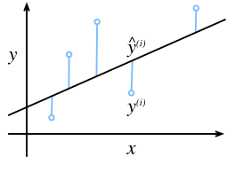
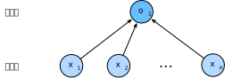
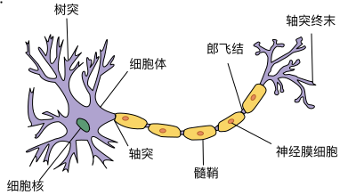

# 线性回归
:label:`sec_linear_regression`

*回归*（regression） 是指一类为一个或多个自变量与因变量之间关系建模的方法。在自然科学和社会科学领域，回归经常用来表示输入和输出之间的关系。

在机器学习领域中的大多数任务通常都与*预测*（prediction）有关。
当我们想预测一个数值时，就会涉及到回归问题。常见的例子包括：预测价格（房屋、股票等）、预测住院时间（针对住院病人）、预测需求（零售销量）等。但不是所有的*预测*都是回归问题。在后面的章节中，我们将介绍分类问题。分类问题的目标是预测数据属于一组类别中的哪一个。

## 线性回归的基本元素

*线性回归* （linear regression）在回归的各种标准工具中最简单而且最流行。它可以追溯到19世纪初。线性回归基于几个简单的假设：首先，假设自变量 $\mathbf{x}$ 和因变量 $y$ 之间的关系是线性的，即$y$可以表示为 $\mathbf{x}$ 中元素的加权和，这里通常允许包含观测值的一些噪声；其次，我们假设任何噪声都比较正常，如噪声遵循正态分布。

为了解释*线性回归*，我们举一个实际的例子：我们希望根据房屋的面积（平方英尺）和房龄（年）来估算房屋价格（美元）。为了开发一个能预测房价的模型，我们需要收集一个真实的数据集。这个数据集包括了房屋的销售价格、面积和房龄。在机器学习的术语中，该数据集称为 *训练数据集*（training data set）或*训练集* （training set），每行数据（在这个例子中是与一次房屋交易相对应的数据）称为*样本*（sample），也可以称为*数据点* （data point）或*数据样本*（data instance）。我们要试图预测的目标（在这个例子中是房屋价格）称为 *标签*（label）或 *目标*（target）。预测所依据的自变量（面积和房龄）称为 *特征*（features）或 *协变量*（covariates）。

通常，我们使用 $n$ 来表示数据集中的样本数。对索引为 $i$ 的样本，其输入表示为 $\mathbf{x}^{(i)} = [x_1^{(i)}, x_2^{(i)}]^\top$，其对应的标签是 $y^{(i)}$。

### 线性模型
:label:`subsec_linear_model`

线性假设是指目标（房屋价格）可以表示为特征（面积和房龄）的加权和，如下面的式子：

$$\mathrm{price} = w_{\mathrm{area}} \cdot \mathrm{area} + w_{\mathrm{age}} \cdot \mathrm{age} + b.$$
:eqlabel:`eq_price-area`

:eqref:`eq_price-area` 中的$w_{\mathrm{area}}$ 和 $w_{\mathrm{age}}$ 称为 *权重*（weight），$b$ 称为 *偏置*（bias），或称为*偏移量*（offset）、*截距*（intercept）。权重决定了每个特征对我们预测值的影响。偏置是指当所有特征都取值为0时，预测值应该为多少。即使现实中不会有任何房子的面积是0或房龄正好是0年，我们仍然需要偏置项。如果没有偏置项，我们模型的表达能力将受到限制。
严格来说， :eqref:`eq_price-area` 是输入特征的一个*仿射变换*（affine transformation）。仿射变换的特点是通过加权和对特征进行*线性变换*（linear transformation），并通过偏置项来进行*平移*（translation）。

给定一个数据集，我们的目标是寻找模型的权重 $\mathbf{w}$ 和偏置 $b$，使得根据模型做出的预测大体符合数据里的真实价格。输出的预测值由输入特征通过*线性模型*的仿射变换决定，仿射变换由所选权重和偏置确定。

有些学科往往只关注有少量特征的数据集。在这些学科中，建模时经常像这样通过长形式显式地表达。而在机器学习领域，我们通常使用的是高维数据集，建模时采用线性代数表示法会比较方便。当我们的输入包含 $d$ 个特征时，我们将预测结果 $\hat{y}$（通常使用 “尖角” 符号表示估计值）表示为：

$$\hat{y} = w_1  x_1 + ... + w_d  x_d + b.$$

将所有特征放到向量 $\mathbf{x} \in \mathbb{R}^d$ 中，并将所有权重放到向量 $\mathbf{w} \in \mathbb{R}^d$ 中，我们可以用点积形式来简洁地表达模型：

$$\hat{y} = \mathbf{w}^\top \mathbf{x} + b.$$
:eqlabel:`eq_linreg-y`

在 :eqref:`eq_linreg-y` 中，向量 $\mathbf{x}$ 对应于单个数据样本的特征。用符号表示的矩阵 $\mathbf{X} \in \mathbb{R}^{n \times d}$ 可以很方便地引用我们整个数据集的 $n$ 个样本。其中，$\mathbf{X}$ 的每一行是一个样本，每一列是一种特征。

对于特征集合 $\mathbf{X}$ ，预测值 $\hat{\mathbf{y}} \in \mathbb{R}^n$ 可以通过矩阵-向量乘法表示为：

$${\hat{\mathbf{y}}} = \mathbf{X} \mathbf{w} + b$$

这个过程中的求和将使用广播机制（广播机制在  :numref:`subsec_broadcasting` 中有详细介绍）。
给定训练数据特征 $\mathbf{X}$ 和对应的已知标签 $\mathbf{y}$ ，线性回归的目标是找到一组权重向量 $\mathbf{w}$ 和偏置 $b$。当给定从$\mathbf{X}$的同分布中取样的新样本特征时，找到的权重向量和偏置能够使得新样本预测标签的误差尽可能小。

虽然我们相信给定 $\mathbf{x}$ 预测 $y$ 的最佳模型会是线性的，但我们很难找到一个有$n$个样本的真实数据集，其中对于所有的 $1 \leq i \leq n$， $y^{(i)}$ 完全等于 $\mathbf{w}^\top \mathbf{x}^{(i)}+b$。无论我们使用什么手段来观察特征 $\mathbf{X}$ 和标签 $\mathbf{y}$ ，都可能会出现少量的观测误差。因此，即使确信特征与标签的潜在关系是线性的，我们也会加入一个噪声项来考虑观测误差带来的影响。

在我们开始寻找最好的 *模型参数*（model parameters）$\mathbf{w}$ 和 $b$ 之前，我们还需要两个东西：（1）一种模型质量的度量方式；（2）一种能够更新模型以提高模型预测质量的方法。

### 损失函数

在我们开始考虑如何用模型*拟合*（fit）数据之前，我们需要确定一个拟合程度的度量。*损失函数* 能够量化目标的*实际*值与*预测* 值之间的差距。通常我们会选择非负数作为损失，且数值越小表示损失越小，完美预测时的损失为0。回归问题中最常用的损失函数是平方误差函数。当样本 $i$ 的预测值为 $\hat{y}^{(i)}$，其相应的真实标签为 $y^{(i)}$ 时，平方误差可以定义为以下公式：

$$l^{(i)}(\mathbf{w}, b) = \frac{1}{2} \left(\hat{y}^{(i)} - y^{(i)}\right)^2.$$

常数$\frac{1}{2}$不会带来本质的差别，但这样在形式上稍微简单一些，表现为当我们对损失函数求导后常数系数为1。由于训练数据集并不受我们控制，所以经验误差只是关于模型参数的函数。为了进一步说明，来看下面的例子。我们为一维情况下的回归问题绘制图像，如 :numref:`fig_fit_linreg` 所示。


:label:`fig_fit_linreg`

由于平方误差函数中的二次方项，估计值 $\hat{y}^{(i)}$ 和观测值 $y^{(i)}$ 之间较大的差异将贡献更大的损失。为了度量模型在整个数据集上的质量，我们需计算在训练集$n$个样本上的损失均值（也等价于求和）。

$$L(\mathbf{w}, b) =\frac{1}{n}\sum_{i=1}^n l^{(i)}(\mathbf{w}, b) =\frac{1}{n} \sum_{i=1}^n \frac{1}{2}\left(\mathbf{w}^\top \mathbf{x}^{(i)} + b - y^{(i)}\right)^2.$$

在训练模型时，我们希望寻找一组参数 ($\mathbf{w}^*, b^*$)，这组参数能最小化在所有训练样本上的总损失。如下式：

$$\mathbf{w}^*, b^* = \operatorname*{argmin}_{\mathbf{w}, b}\  L(\mathbf{w}, b).$$

### 解析解

线性回归刚好是一个很简单的优化问题。与我们将在本书中所讲到的其他大部分模型不同，线性回归的解可以用一个公式简单地表达出来，这类解叫作解析解（analytical solution）。首先，我们将偏置 $b$ 合并到参数 $\mathbf{w}$ 中。合并方法是在包含所有参数的矩阵中附加一列。我们的预测问题是最小化 $\|\mathbf{y} - \mathbf{X}\mathbf{w}\|^2$。这在损失平面上只有一个临界点，这个临界点对应于整个区域的损失最小值。将损失关于$\mathbf{w}$的导数设为0，得到解析解（闭合形式）：

$$\mathbf{w}^* = (\mathbf X^\top \mathbf X)^{-1}\mathbf X^\top \mathbf{y}.$$

像线性回归这样的简单问题存在解析解，但并不是所有的问题都存在解析解。解析解可以进行很好的数学分析，但解析解的限制很严格，导致它无法应用在深度学习里。

### 小批量随机梯度下降

即使在我们无法得到解析解的情况下，我们仍然可以有效地训练模型。在许多任务上，那些难以优化的模型效果要更好。因此，弄清楚如何训练这些难以优化的模型是非常重要的。

本书中我们用到一种名为*梯度下降*（gradient descent）的方法，这种方法几乎可以优化所有深度学习模型。它通过不断地在损失函数递减的方向上更新参数来降低误差。

梯度下降最简单的用法是计算损失函数（数据集中所有样本的损失均值）关于模型参数的导数（在这里也可以称为梯度）。但实际中的执行可能会非常慢：因为在每一次更新参数之前，我们必须遍历整个数据集。因此，我们通常会在每次需要计算更新的时候随机抽取一小批样本，这种变体叫做*小批量随机梯度下降*（minibatch stochastic gradient descent）。

在每次迭代中，我们首先随机抽样一个小批量$\mathcal{B}$，它是由固定数量的训练样本组成的。然后，我们计算小批量的平均损失关于模型参数的导数（也可以称为梯度）。最后，我们将梯度乘以一个预先确定的正数$\eta$，并从当前参数的值中减掉。

我们用下面的数学公式来表示这一更新过程（$\partial$ 表示偏导数）：

$$(\mathbf{w},b) \leftarrow (\mathbf{w},b) - \frac{\eta}{|\mathcal{B}|} \sum_{i \in \mathcal{B}} \partial_{(\mathbf{w},b)} l^{(i)}(\mathbf{w},b).$$

总结一下，算法的步骤如下：（1）初始化模型参数的值，如随机初始化；（2）从数据集中随机抽取小批量样本且在负梯度的方向上更新参数，并不断迭代这一步骤。对于平方损失和仿射变换，我们可以明确地写成如下形式:

$$\begin{aligned} \mathbf{w} &\leftarrow \mathbf{w} -   \frac{\eta}{|\mathcal{B}|} \sum_{i \in \mathcal{B}} \partial_{\mathbf{w}} l^{(i)}(\mathbf{w}, b) = \mathbf{w} - \frac{\eta}{|\mathcal{B}|} \sum_{i \in \mathcal{B}} \mathbf{x}^{(i)} \left(\mathbf{w}^\top \mathbf{x}^{(i)} + b - y^{(i)}\right),\\ b &\leftarrow b -  \frac{\eta}{|\mathcal{B}|} \sum_{i \in \mathcal{B}} \partial_b l^{(i)}(\mathbf{w}, b)  = b - \frac{\eta}{|\mathcal{B}|} \sum_{i \in \mathcal{B}} \left(\mathbf{w}^\top \mathbf{x}^{(i)} + b - y^{(i)}\right). \end{aligned}$$
:eqlabel:`eq_linreg_batch_update`

公式 :eqref:`eq_linreg_batch_update` 中的$\mathbf{w}$ 和 $\mathbf{x}$ 都是向量。在这里，更优雅的向量表示法比系数表示法（如 $w_1, w_2, \ldots, w_d$）更具可读性。
 $|\mathcal{B}|$ 表示每个小批量中的样本数，这也称为*批量大小*（batch size）。$\eta$ 表示 *学习率*（learning rate）。批量大小和学习率的值通常是手动预先指定，而不是通过模型训练得到的。这些可以调整但不在训练过程中更新的参数称为 *超参数*（hyperparameter）。
*调参*（hyperparameter tuning） 是选择超参数的过程。超参数通常是我们根据训练迭代结果来调整的，而训练迭代结果是在独立的*验证数据集*（validation dataset）上评估得到的。

在训练了预先确定的若干迭代次数后（或者直到满足某些其他停止条件后），我们记录下模型参数的估计值，表示为$\hat{\mathbf{w}}, \hat{b}$。但是，即使我们的函数确实是线性的且无噪声，这些估计值也不会使损失函数真正地达到最小值。因为算法会使得损失向最小值缓慢收敛，但却不能在有限的步数内非常精确地达到最小值。

线性回归恰好是一个在整个域中只有一个最小值的学习问题。但是对于像深度神经网络这样复杂的模型来说，损失平面上通常包含多个最小值。幸运的是，出于某种原因，深度学习实践者很少会去花费大力气寻找这样一组参数，使得在 *训练集* 上的损失达到最小。事实上，更难做到的是找到一组参数，这组参数能够在我们从未见过的数据上实现较低的损失，这一挑战被称为 *泛化*（generalization）。

### 用学习到的模型进行预测

给定学习到的线性回归模型 $\hat{\mathbf{w}}^\top \mathbf{x} + \hat{b}$，现在我们可以通过给定的房屋面积 $x_1$ 和房龄 $x_2$来估计一个未包含在训练数据中的新房屋价格。给定特征估计目标的过程通常称为*预测*（prediction）或*推断*（inference）。

我们将尝试坚持使用*预测*这个词。虽然*推断*这个词已经成为深度学习的标准术语，但其实*推断*这个词有些用词不当。在统计学中，*推断*更多地表示基于数据集估计参数。当深度学习从业者与统计学家交谈时，术语的误用经常导致一些误解。

## 矢量化加速

在训练我们的模型时，我们经常希望能够同时处理整个小批量的样本。为了实现这一点，需要(**我们对计算进行矢量化，从而利用线性代数库，而不是在Python中编写开销高昂的for循环**)。

```{.python .input}
%matplotlib inline
from d2l import mxnet as d2l
import math
from mxnet import np
import time
```

```{.python .input}
#@tab pytorch
%matplotlib inline
from d2l import torch as d2l
import math
import torch
import numpy as np
import time
```

```{.python .input}
#@tab tensorflow
%matplotlib inline
from d2l import tensorflow as d2l
import math
import tensorflow as tf
import numpy as np
import time
```

为了说明矢量化为什么如此重要，我们考虑(**对向量相加的两种方法**)。
我们实例化两个全1的1000维向量。在一种方法中，我们将使用Python的for循环遍历向量。在另一种方法中，我们将依赖对 `+` 的调用。

```{.python .input}
#@tab all
n = 10000
a = d2l.ones(n)
b = d2l.ones(n)
```

由于在本书中我们将频繁地进行运行时间的基准测试，所以让[**我们定义一个计时器**]。

```{.python .input}
#@tab all
class Timer:  #@save
    """记录多次运行时间。"""
    def __init__(self):
        self.times = []
        self.start()

    def start(self):
        """启动计时器。"""
        self.tik = time.time()

    def stop(self):
        """停止计时器并将时间记录在列表中。"""
        self.times.append(time.time() - self.tik)
        return self.times[-1]

    def avg(self):
        """返回平均时间。"""
        return sum(self.times) / len(self.times)

    def sum(self):
        """返回时间总和。"""
        return sum(self.times)

    def cumsum(self):
        """返回累计时间。"""
        return np.array(self.times).cumsum().tolist()
```

现在我们可以对工作负载进行基准测试。

首先，[**我们使用for循环，每次执行一位的加法**]。

```{.python .input}
#@tab mxnet, pytorch
c = d2l.zeros(n)
timer = Timer()
for i in range(n):
    c[i] = a[i] + b[i]
f'{timer.stop():.5f} sec'
```

```{.python .input}
#@tab tensorflow
c = tf.Variable(d2l.zeros(n))
timer = Timer()
for i in range(n):
    c[i].assign(a[i] + b[i])
f'{timer.stop():.5f} sec'
```

(**或者，我们使用重载的 `+` 运算符来计算按元素的和**)。

```{.python .input}
#@tab all
timer.start()
d = a + b
f'{timer.stop():.5f} sec'
```

结果很明显，第二种方法比第一种方法快得多。矢量化代码通常会带来数量级的加速。另外，我们将更多的数学运算放到库中，而无需自己编写那么多的计算，从而减少了出错的可能性。

## 正态分布与平方损失
:label:`subsec_normal_distribution_and_squared_loss`

接下来，我们通过对噪声分布的假设来解读平方损失目标函数。

正态分布（normal distribution），也称为 *高斯分布*（Gaussian distribution），最早由德国数学家高斯（Gauss）应用于天文学研究。
正态分布和线性回归之间的关系很密切。
简单的说，若随机变量 $x$ 具有均值 $\mu$ 和方差 $\sigma^2$（标准差 $\sigma$），其正态分布概率密度函数如下：

$$p(x) = \frac{1}{\sqrt{2 \pi \sigma^2}} \exp\left(-\frac{1}{2 \sigma^2} (x - \mu)^2\right).$$

下面[**我们定义一个Python函数来计算正态分布**]。

```{.python .input}
#@tab all
def normal(x, mu, sigma):
    p = 1 / math.sqrt(2 * math.pi * sigma**2)
    return p * np.exp(-0.5 / sigma**2 * (x - mu)**2)
```

我们现在(**可视化正态分布**)。

```{.python .input}
#@tab all
# 再次使用numpy进行可视化
x = np.arange(-7, 7, 0.01)

# 均值和标准差对
params = [(0, 1), (0, 2), (3, 1)]
d2l.plot(x, [normal(x, mu, sigma) for mu, sigma in params], xlabel='x',
         ylabel='p(x)', figsize=(4.5, 2.5),
         legend=[f'mean {mu}, std {sigma}' for mu, sigma in params])
```

就像我们所看到的，改变均值会产生沿 $x$ 轴的偏移，增加方差将会分散分布、降低其峰值。

均方误差损失函数（简称均方损失）可以用于线性回归的一个原因是：我们假设了观测中包含噪声，其中噪声服从正态分布。噪声正态分布如下式:

$$y = \mathbf{w}^\top \mathbf{x} + b + \epsilon \text{ where } \epsilon \sim \mathcal{N}(0, \sigma^2).$$

因此，我们现在可以写出通过给定的$\mathbf{x}$观测到特定$y$的*可能性*（likelihood）：

$$P(y \mid \mathbf{x}) = \frac{1}{\sqrt{2 \pi \sigma^2}} \exp\left(-\frac{1}{2 \sigma^2} (y - \mathbf{w}^\top \mathbf{x} - b)^2\right).$$

现在，根据最大似然估计法，参数 $\mathbf{w}$ 和 $b$ 的最优值是使整个数据集的*可能性*最大的值：

$$P(\mathbf y \mid \mathbf X) = \prod_{i=1}^{n} p(y^{(i)}|\mathbf{x}^{(i)}).$$

根据最大似然估计法选择的估计量称为*最大似然估计量* 。
虽然使许多指数函数的乘积最大化看起来很困难，但是我们可以在不改变目标的前提下，通过最大化似然对数来简化。
由于历史原因，优化通常是说最小化而不是最大化。我们可以改为 *最小化负对数似然* $-\log P(\mathbf y \mid \mathbf X)$。由此可以得到的数学公式是：

$$-\log P(\mathbf y \mid \mathbf X) = \sum_{i=1}^n \frac{1}{2} \log(2 \pi \sigma^2) + \frac{1}{2 \sigma^2} \left(y^{(i)} - \mathbf{w}^\top \mathbf{x}^{(i)} - b\right)^2.$$

现在我们只需要假设$\sigma$是某个固定常数就可以忽略第一项，因为第一项不依赖于 $\mathbf{w}$和$b$。现在第二项除了常数$\frac{1}{\sigma^2}$外，其余部分和前面介绍的平方误差损失是一样的。
幸运的是，上面式子的解并不依赖于 $\sigma$。因此，在高斯噪声的假设下，最小化均方误差等价于对线性模型的最大似然估计。

## 从线性回归到深度网络

到目前为止，我们只谈论了线性模型。
尽管神经网络涵盖了更多更为丰富的模型，我们依然可以用描述神经网络的方式来描述线性模型，从而把线性模型看作一个神经网络。
首先，让我们用“层”符号来重写这个模型。

### 神经网络图

深度学习从业者喜欢绘制图表来可视化模型中正在发生的事情。
在 :numref:`fig_single_neuron` 中，我们将线性回归模型描述为一个神经网络。
需要注意的是，该图只显示连接模式，即只显示每个输入如何连接到输出，隐去了权重和偏置的值。


:label:`fig_single_neuron`

在 :numref:`fig_single_neuron` 所示的神经网络中，输入为 $x_1, \ldots, x_d$，因此输入层中的 *输入数*（或称为 *特征维度* feature dimensionality）为 $d$。网络的输出为$o_1$，因此输出层中的 *输出数* 是 1。需要注意的是，输入值都是已经给定的，并且只有一个*计算* 神经元。由于模型重点在发生计算的地方，所以通常我们在计算层数时不考虑输入层。也就是说， :numref:`fig_single_neuron` 中神经网络的 *层数* 为1。我们可以将线性回归模型视为仅由单个人工神经元组成的神经网络，或称为单层神经网络。

对于线性回归，每个输入都与每个输出（在本例中只有一个输出）相连，我们将这种变换（ :numref:`fig_single_neuron` 中的输出层）称为 *全连接层*（fully-connected layer）（或称为 *稠密层* dense layer）。下一章将详细讨论由这些层组成的网络。

### 生物学

线性回归发明的时间（1795年）早于计算神经科学，所以将线性回归描述为神经网络似乎不合适。
当控制学家、神经生物学家沃伦·麦库洛奇和沃尔特·皮茨开始开发人工神经元模型时，他们为什么将线性模型作为一个起点呢？我们来看一张图片 :numref:`fig_Neuron` ，这是一张由*树突*（dendrites，输入终端）、*细胞核*（nucleus，CPU）组成的生物神经元图片。*轴突*（axon，输出线）和*轴突端子*（axon terminals，输出端子）通过*突触*（synapses）与其他神经元连接。


:label:`fig_Neuron`

树突中接收到来自其他神经元（或视网膜等环境传感器）的信息$x_i$。该信息通过*突触权重* $w_i$来加权，以确定输入的影响（即，通过$x_i w_i$相乘来激活或抑制）。
来自多个源的加权输入以加权和$y = \sum_i x_i w_i + b$的形式汇聚在细胞核中，然后将这些信息发送到轴突 $y$ 中进一步处理，通常会通过 $\sigma(y)$ 进行一些非线性处理。之后，它要么到达目的地（例如肌肉），要么通过树突进入另一个神经元。

当然，许多这样的单元可以通过正确连接和正确的学习算法拼凑在一起，从而产生的行为会比单独一个神经元所产生的行为更有趣、更复杂，这种想法归功于我们对真实生物神经系统的研究。

当今大多数深度学习的研究几乎没有直接从神经科学中获得灵感。我们援引斯图尔特·罗素和彼得·诺维格谁，在他们的经典人工智能教科书
*Artificial Intelligence: A Modern Approach* :cite:`Russell.Norvig.2016`
中所说：虽然飞机可能受到鸟类的启发。但几个世纪以来，鸟类学并不是航空创新的主要驱动力。同样地，如今在深度学习中的灵感同样或更多地来自数学、统计学和计算机科学。

## 小结

* 机器学习模型中的关键要素是训练数据，损失函数，优化算法，还有模型本身。
* 矢量化使数学表达上更简洁，同时运行的更快。
* 最小化目标函数和执行最大似然估计等价。
* 线性回归模型也是神经网络。

## 练习

1. 假设我们有一些数据 $x_1, \ldots, x_n \in \mathbb{R}$。我们的目标是找到一个常数$b$，使得最小化 $\sum_i (x_i - b)^2$。
    1. 找到最优值 $b$ 的解析解。
    1. 这个问题及其解与正态分布有什么关系?
1. 推导出使用平方误差的线性回归优化问题的解析解。为了简化问题，可以忽略偏置$b$(我们可以通过向 $\mathbf X$ 添加所有值为1的一列来做到这一点)。
    1. 用矩阵和向量表示法写出优化问题(将所有数据视为单个矩阵，将所有目标值视为单个向量)。
    1. 计算损失对$w$的梯度。
    1. 通过将梯度设为0、求解矩阵方程来找到解析解。
    1. 什么时候可能比使用随机梯度下降更好？这种方法何时会失效？
1. 假定控制附加噪声 $\epsilon$ 的噪声模型是指数分布。也就是说，$p(\epsilon) = \frac{1}{2} \exp(-|\epsilon|)$
    1. 写出模型 $-\log P(\mathbf y \mid \mathbf X)$ 下数据的负对数似然。
    1. 你能写出解析解吗？
    1. 提出一种随机梯度下降算法来解决这个问题。哪里可能出错？（提示：当我们不断更新参数时，在驻点附近会发生什么情况）你能解决这个问题吗？


:begin_tab:`mxnet`
[Discussions](https://discuss.d2l.ai/t/1774)
:end_tab:

:begin_tab:`pytorch`
[Discussions](https://discuss.d2l.ai/t/1775)
:end_tab:

:begin_tab:`tensorflow`
[Discussions](https://discuss.d2l.ai/t/1776)
:end_tab:
