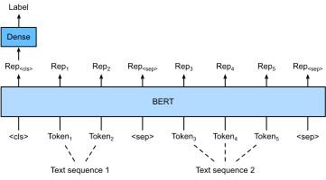
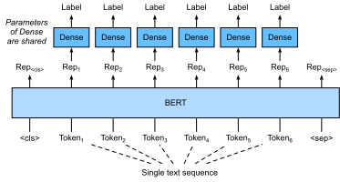
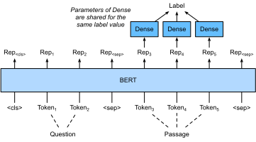

# 针对序列级和词元级应用微调BERT
:label:`sec_finetuning-bert`

在本章的前几节中，我们为自然语言处理应用设计了不同的模型，例如基于循环神经网络、卷积神经网络、注意力和多层感知机。这些模型在有空间或时间限制的情况下是有帮助的，但是，为每个自然语言处理任务精心设计一个特定的模型实际上是不可行的。在 :numref:`sec_bert`中，我们介绍了一个名为BERT的预训练模型，该模型可以对广泛的自然语言处理任务进行最少的架构更改。一方面，在提出时，BERT改进了各种自然语言处理任务的技术水平。另一方面，正如在 :numref:`sec_bert-pretraining`中指出的那样，原始BERT模型的两个版本分别带有1.1亿和3.4亿个参数。因此，当有足够的计算资源时，我们可以考虑为下游自然语言处理应用微调BERT。

下面，我们将自然语言处理应用的子集概括为序列级和词元级。在序列层次上，介绍了在单文本分类任务和文本对分类（或回归）任务中，如何将文本输入的BERT表示转换为输出标签。在词元级别，我们将简要介绍新的应用，如文本标注和问答，并说明BERT如何表示它们的输入并转换为输出标签。在微调期间，不同应用之间的BERT所需的“最小架构更改”是额外的全连接层。在下游应用的监督学习期间，额外层的参数是从零开始学习的，而预训练BERT模型中的所有参数都是微调的。

## 单文本分类

*单文本分类*将单个文本序列作为输入，并输出其分类结果。
除了我们在这一章中探讨的情感分析之外，语言可接受性语料库（Corpus of Linguistic Acceptability，COLA）也是一个单文本分类的数据集，它的要求判断给定的句子在语法上是否可以接受。 :cite:`Warstadt.Singh.Bowman.2019`。例如，“I should study.”是可以接受的，但是“I should studying.”不是可以接受的。

:label:`fig_bert-one-seq`

 :numref:`sec_bert`描述了BERT的输入表示。BERT输入序列明确地表示单个文本和文本对，其中特殊分类标记“&lt;cls&gt;”用于序列分类，而特殊分类标记“&lt;sep&gt;”标记单个文本的结束或分隔成对文本。如 :numref:`fig_bert-one-seq`所示，在单文本分类应用中，特殊分类标记“&lt;cls&gt;”的BERT表示对整个输入文本序列的信息进行编码。作为输入单个文本的表示，它将被送入到由全连接（稠密）层组成的小多层感知机中，以输出所有离散标签值的分布。

## 文本对分类或回归

在本章中，我们还研究了自然语言推断。它属于*文本对分类*，这是一种对文本进行分类的应用类型。

以一对文本作为输入但输出连续值，*语义文本相似度*是一个流行的“文本对回归”任务。
这项任务评估句子的语义相似度。例如，在语义文本相似度基准数据集（Semantic Textual Similarity Benchmark）中，句子对的相似度得分是从0（无语义重叠）到5（语义等价）的分数区间 :cite:`Cer.Diab.Agirre.ea.2017`。我们的目标是预测这些分数。来自语义文本相似性基准数据集的样本包括（句子1，句子2，相似性得分）：

* "A plane is taking off."（“一架飞机正在起飞。”），"An air plane is taking off."（“一架飞机正在起飞。”），5.000分;
* "A woman is eating something."（“一个女人在吃东西。”），"A woman is eating meat."（“一个女人在吃肉。”），3.000分;
* "A woman is dancing."（一个女人在跳舞。），"A man is talking."（“一个人在说话。”），0.000分。

:label:`fig_bert-two-seqs`

与 :numref:`fig_bert-one-seq`中的单文本分类相比， :numref:`fig_bert-two-seqs`中的文本对分类的BERT微调在输入表示上有所不同。对于文本对回归任务（如语义文本相似性），可以应用细微的更改，例如输出连续的标签值和使用均方损失：它们在回归中很常见。

## 文本标注

现在让我们考虑词元级任务，比如*文本标注*（text tagging），其中每个词元都被分配了一个标签。在文本标注任务中，*词性标注*为每个单词分配词性标记（例如，形容词和限定词）。
根据单词在句子中的作用。如，在Penn树库II标注集中，句子“John Smith‘s car is new”应该被标记为“NNP（名词，专有单数）NNP POS（所有格结尾）NN（名词，单数或质量）VB（动词，基本形式）JJ（形容词）”。

:label:`fig_bert-tagging`

 :numref:`fig_bert-tagging`中说明了文本标记应用的BERT微调。与 :numref:`fig_bert-one-seq`相比，唯一的区别在于，在文本标注中，输入文本的*每个词元*的BERT表示被送到相同的额外全连接层中，以输出词元的标签，例如词性标签。

## 问答

作为另一个词元级应用，*问答*反映阅读理解能力。
例如，斯坦福问答数据集（Stanford Question Answering Dataset，SQuAD v1.1）由阅读段落和问题组成，其中每个问题的答案只是段落中的一段文本（文本片段） :cite:`Rajpurkar.Zhang.Lopyrev.ea.2016`。举个例子，考虑一段话：“Some experts report that a mask's efficacy is inconclusive.However,mask makers insist that their products,such as N95 respirator masks,can guard against the virus.”（“一些专家报告说面罩的功效是不确定的。然而，口罩制造商坚持他们的产品，如N95口罩，可以预防病毒。”）还有一个问题“Who say that N95 respirator masks can guard against the virus?”（“谁说N95口罩可以预防病毒？”）。答案应该是文章中的文本片段“mask makers”（“口罩制造商”）。因此，SQuAD v1.1的目标是在给定问题和段落的情况下预测段落中文本片段的开始和结束。

:label:`fig_bert-qa`

为了微调BERT进行问答，在BERT的输入中，将问题和段落分别作为第一个和第二个文本序列。为了预测文本片段开始的位置，相同的额外的全连接层将把来自位置$i$的任何词元的BERT表示转换成标量分数$s_i$。文章中所有词元的分数还通过softmax转换成概率分布，从而为文章中的每个词元位置$i$分配作为文本片段开始的概率$p_i$。预测文本片段的结束与上面相同，只是其额外的全连接层中的参数与用于预测开始位置的参数无关。当预测结束时，位置$i$的词元由相同的全连接层变换成标量分数$e_i$。 :numref:`fig_bert-qa`描述了用于问答的微调BERT。

对于问答，监督学习的训练目标就像最大化真实值的开始和结束位置的对数似然一样简单。当预测片段时，我们可以计算从位置$i$到位置$j$的有效片段的分数$s_i + e_j$（$i \leq j$），并输出分数最高的跨度。

## 小结

* 对于序列级和词元级自然语言处理应用，BERT只需要最小的架构改变（额外的全连接层），如单个文本分类（例如，情感分析和测试语言可接受性）、文本对分类或回归（例如，自然语言推断和语义文本相似性）、文本标记（例如，词性标记）和问答。
* 在下游应用的监督学习期间，额外层的参数是从零开始学习的，而预训练BERT模型中的所有参数都是微调的。

## 练习

1. 让我们为新闻文章设计一个搜索引擎算法。当系统接收到查询（例如，“冠状病毒爆发期间的石油行业”）时，它应该返回与该查询最相关的新闻文章的排序列表。假设我们有一个巨大的新闻文章池和大量的查询。为了简化问题，假设为每个查询标记了最相关的文章。如何在算法设计中应用负采样（见 :numref:`subsec_negative-sampling`）和BERT？
1. 我们如何利用BERT来训练语言模型？
1. 我们能在机器翻译中利用BERT吗？

[Discussions](https://discuss.d2l.ai/t/5729)
