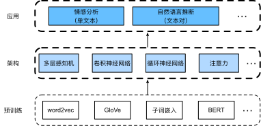

# 自然语言处理：应用
:label:`chap_nlp_app`

前面我们学习了如何在文本序列中表示词元，
并在 :numref:`chap_nlp_pretrain`中训练了词元的表示。
这样的预训练文本表示可以通过不同模型架构，放入不同的下游自然语言处理任务。

前一章我们提及到一些自然语言处理应用，这些应用没有预训练，只是为了解释深度学习架构。
例如，在 :numref:`chap_rnn`中，
我们依赖循环神经网络设计语言模型来生成类似中篇小说的文本。
在 :numref:`chap_modern_rnn`和 :numref:`chap_attention`中，
我们还设计了基于循环神经网络和注意力机制的机器翻译模型。

然而，本书并不打算全面涵盖所有此类应用。
相反，我们的重点是*如何应用深度语言表征学习来解决自然语言处理问题*。
在给定预训练的文本表示的情况下，
本章将探讨两种流行且具有代表性的下游自然语言处理任务：
情感分析和自然语言推断，它们分别分析单个文本和文本对之间的关系。


:label:`fig_nlp-map-app`

如 :numref:`fig_nlp-map-app`所述，
本章将重点描述然后使用不同类型的深度学习架构
（如多层感知机、卷积神经网络、循环神经网络和注意力）
设计自然语言处理模型。
尽管在 :numref:`fig_nlp-map-app`中，
可以将任何预训练的文本表示与任何应用的架构相结合，
但我们选择了一些具有代表性的组合。
具体来说，我们将探索基于循环神经网络和卷积神经网络的流行架构进行情感分析。
对于自然语言推断，我们选择注意力和多层感知机来演示如何分析文本对。
最后，我们介绍了如何为广泛的自然语言处理应用，
如在序列级（单文本分类和文本对分类）和词元级（文本标注和问答）上
对预训练BERT模型进行微调。
作为一个具体的经验案例，我们将针对自然语言推断对BERT进行微调。

正如我们在 :numref:`sec_bert`中介绍的那样，
对于广泛的自然语言处理应用，BERT只需要最少的架构更改。
然而，这一好处是以微调下游应用的大量BERT参数为代价的。
当空间或时间有限时，基于多层感知机、卷积神经网络、循环神经网络
和注意力的精心构建的模型更具可行性。
下面，我们从情感分析应用开始，分别解读基于循环神经网络和卷积神经网络的模型设计。

```toc
:maxdepth: 2

sentiment-analysis-and-dataset
sentiment-analysis-rnn
sentiment-analysis-cnn
natural-language-inference-and-dataset
natural-language-inference-attention
finetuning-bert
natural-language-inference-bert
```
