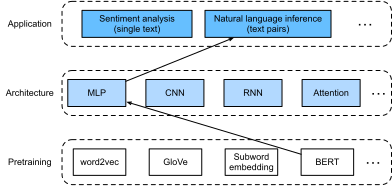

# Natural Language Inference: Fine-Tuning BERT
:label:`sec_natural-language-inference-bert`


In earlier sections of this chapter,
we have designed an attention-based architecture
(in :numref:`sec_natural-language-inference-attention`)
for the natural language inference task
on the SNLI dataset (as described in :numref:`sec_natural-language-inference-and-dataset`).
Now we revisit this task by fine-tuning BERT.
As discussed in :numref:`sec_finetuning-bert`,
natural language inference is a sequence-level text pair classification problem,
and fine-tuning BERT only requires an additional MLP-based architecture,
as illustrated in :numref:`fig_nlp-map-nli-bert`.


:label:`fig_nlp-map-nli-bert`

In this section,
we will download a pretrained small version of BERT,
then fine-tune it
for natural language inference on the SNLI dataset.

```{.python .input}
from d2l import mxnet as d2l
import json
import multiprocessing
from mxnet import gluon, np, npx
from mxnet.gluon import nn
import os

npx.set_np()
```

```{.python .input}
#@tab pytorch
from d2l import torch as d2l
import json
import multiprocessing
import torch
from torch import nn
import os
```

## Loading Pretrained BERT

We have explained how to pretrain BERT on the WikiText-2 dataset in
:numref:`sec_bert-dataset` and :numref:`sec_bert-pretraining`
(note that the original BERT model is pretrained on much bigger corpora).
As discussed in :numref:`sec_bert-pretraining`,
the original BERT model has hundreds of millions of parameters.
In the following,
we provide two versions of pretrained BERT:
"bert.base" is about as big as the original BERT base model that requires a lot of computational resources to fine-tune,
while "bert.small" is a small version to facilitate demonstration.

```{.python .input}
d2l.DATA_HUB['bert.base'] = (d2l.DATA_URL + 'bert.base.zip',
                             '7b3820b35da691042e5d34c0971ac3edbd80d3f4')
d2l.DATA_HUB['bert.small'] = (d2l.DATA_URL + 'bert.small.zip',
                              'a4e718a47137ccd1809c9107ab4f5edd317bae2c')
```

```{.python .input}
#@tab pytorch
d2l.DATA_HUB['bert.base'] = (d2l.DATA_URL + 'bert.base.torch.zip',
                             '225d66f04cae318b841a13d32af3acc165f253ac')
d2l.DATA_HUB['bert.small'] = (d2l.DATA_URL + 'bert.small.torch.zip',
                              'c72329e68a732bef0452e4b96a1c341c8910f81f')
```

Either pretrained BERT model contains a "vocab.json" file that defines the vocabulary set
and a "pretrained.params" file of the pretrained parameters.
We implement the following `load_pretrained_model` function to load pretrained BERT parameters.

```{.python .input}
def load_pretrained_model(pretrained_model, num_hiddens, ffn_num_hiddens,
                          num_heads, num_layers, dropout, max_len, devices):
    data_dir = d2l.download_extract(pretrained_model)
    # Define an empty vocabulary to load the predefined vocabulary
    vocab = d2l.Vocab()
    vocab.idx_to_token = json.load(open(os.path.join(data_dir, 'vocab.json')))
    vocab.token_to_idx = {token: idx for idx, token in enumerate(
        vocab.idx_to_token)}
    bert = d2l.BERTModel(len(vocab), num_hiddens, ffn_num_hiddens, num_heads, 
                         num_layers, dropout, max_len)
    # Load pretrained BERT parameters
    bert.load_parameters(os.path.join(data_dir, 'pretrained.params'),
                         ctx=devices)
    return bert, vocab
```

```{.python .input}
#@tab pytorch
def load_pretrained_model(pretrained_model, num_hiddens, ffn_num_hiddens,
                          num_heads, num_layers, dropout, max_len, devices):
    data_dir = d2l.download_extract(pretrained_model)
    # Define an empty vocabulary to load the predefined vocabulary
    vocab = d2l.Vocab()
    vocab.idx_to_token = json.load(open(os.path.join(data_dir, 'vocab.json')))
    vocab.token_to_idx = {token: idx for idx, token in enumerate(
        vocab.idx_to_token)}
    bert = d2l.BERTModel(len(vocab), num_hiddens, norm_shape=[256],
                         ffn_num_input=256, ffn_num_hiddens=ffn_num_hiddens,
                         num_heads=4, num_layers=2, dropout=0.2,
                         max_len=max_len, key_size=256, query_size=256,
                         value_size=256, hid_in_features=256,
                         mlm_in_features=256, nsp_in_features=256)
    # Load pretrained BERT parameters
    bert.load_state_dict(torch.load(os.path.join(data_dir,
                                                 'pretrained.params')))
    return bert, vocab
```

To facilitate demonstration on most of machines,
we will load and fine-tune the small version ("bert.small") of the pretrained BERT in this section.
In the exercise, we will show how to fine-tune the much larger "bert.base" to significantly improve the testing accuracy.

```{.python .input}
#@tab all
devices = d2l.try_all_gpus()
bert, vocab = load_pretrained_model(
    'bert.small', num_hiddens=256, ffn_num_hiddens=512, num_heads=4,
    num_layers=2, dropout=0.1, max_len=512, devices=devices)
```

## The Dataset for Fine-Tuning BERT

For the downstream task natural language inference on the SNLI dataset,
we define a customized dataset class `SNLIBERTDataset`.
In each example,
the premise and hypothesis form a pair of text sequence
and is packed into one BERT input sequence as depicted in :numref:`fig_bert-two-seqs`.
Recall :numref:`subsec_bert_input_rep` that segment IDs
are used to distinguish the premise and the hypothesis in a BERT input sequence.
With the predefined maximum length of a BERT input sequence (`max_len`),
the last token of the longer of the input text pair keeps getting removed until
`max_len` is met.
To accelerate generation of the SNLI dataset
for fine-tuning BERT,
we use 4 worker processes to generate training or testing examples in parallel.

```{.python .input}
class SNLIBERTDataset(gluon.data.Dataset):
    def __init__(self, dataset, max_len, vocab=None):
        all_premise_hypothesis_tokens = [[
            p_tokens, h_tokens] for p_tokens, h_tokens in zip(
            *[d2l.tokenize([s.lower() for s in sentences])
              for sentences in dataset[:2]])]
        
        self.labels = np.array(dataset[2])
        self.vocab = vocab
        self.max_len = max_len
        (self.all_token_ids, self.all_segments,
         self.valid_lens) = self._preprocess(all_premise_hypothesis_tokens)
        print('read ' + str(len(self.all_token_ids)) + ' examples')

    def _preprocess(self, all_premise_hypothesis_tokens):
        pool = multiprocessing.Pool(4)  # Use 4 worker processes
        out = pool.map(self._mp_worker, all_premise_hypothesis_tokens)
        all_token_ids = [
            token_ids for token_ids, segments, valid_len in out]
        all_segments = [segments for token_ids, segments, valid_len in out]
        valid_lens = [valid_len for token_ids, segments, valid_len in out]
        return (np.array(all_token_ids, dtype='int32'),
                np.array(all_segments, dtype='int32'), 
                np.array(valid_lens))

    def _mp_worker(self, premise_hypothesis_tokens):
        p_tokens, h_tokens = premise_hypothesis_tokens
        self._truncate_pair_of_tokens(p_tokens, h_tokens)
        tokens, segments = d2l.get_tokens_and_segments(p_tokens, h_tokens)
        token_ids = self.vocab[tokens] + [self.vocab['<pad>']] \
                             * (self.max_len - len(tokens))
        segments = segments + [0] * (self.max_len - len(segments))
        valid_len = len(tokens)
        return token_ids, segments, valid_len

    def _truncate_pair_of_tokens(self, p_tokens, h_tokens):
        # Reserve slots for '<CLS>', '<SEP>', and '<SEP>' tokens for the BERT
        # input
        while len(p_tokens) + len(h_tokens) > self.max_len - 3:
            if len(p_tokens) > len(h_tokens):
                p_tokens.pop()
            else:
                h_tokens.pop()

    def __getitem__(self, idx):
        return (self.all_token_ids[idx], self.all_segments[idx],
                self.valid_lens[idx]), self.labels[idx]

    def __len__(self):
        return len(self.all_token_ids)
```

```{.python .input}
#@tab pytorch
class SNLIBERTDataset(torch.utils.data.Dataset):
    def __init__(self, dataset, max_len, vocab=None):
        all_premise_hypothesis_tokens = [[
            p_tokens, h_tokens] for p_tokens, h_tokens in zip(
            *[d2l.tokenize([s.lower() for s in sentences])
              for sentences in dataset[:2]])]
        
        self.labels = torch.tensor(dataset[2])
        self.vocab = vocab
        self.max_len = max_len
        (self.all_token_ids, self.all_segments,
         self.valid_lens) = self._preprocess(all_premise_hypothesis_tokens)
        print('read ' + str(len(self.all_token_ids)) + ' examples')

    def _preprocess(self, all_premise_hypothesis_tokens):
        pool = multiprocessing.Pool(4)  # Use 4 worker processes
        out = pool.map(self._mp_worker, all_premise_hypothesis_tokens)
        all_token_ids = [
            token_ids for token_ids, segments, valid_len in out]
        all_segments = [segments for token_ids, segments, valid_len in out]
        valid_lens = [valid_len for token_ids, segments, valid_len in out]
        return (torch.tensor(all_token_ids, dtype=torch.long),
                torch.tensor(all_segments, dtype=torch.long), 
                torch.tensor(valid_lens))

    def _mp_worker(self, premise_hypothesis_tokens):
        p_tokens, h_tokens = premise_hypothesis_tokens
        self._truncate_pair_of_tokens(p_tokens, h_tokens)
        tokens, segments = d2l.get_tokens_and_segments(p_tokens, h_tokens)
        token_ids = self.vocab[tokens] + [self.vocab['<pad>']] \
                             * (self.max_len - len(tokens))
        segments = segments + [0] * (self.max_len - len(segments))
        valid_len = len(tokens)
        return token_ids, segments, valid_len

    def _truncate_pair_of_tokens(self, p_tokens, h_tokens):
        # Reserve slots for '<CLS>', '<SEP>', and '<SEP>' tokens for the BERT
        # input
        while len(p_tokens) + len(h_tokens) > self.max_len - 3:
            if len(p_tokens) > len(h_tokens):
                p_tokens.pop()
            else:
                h_tokens.pop()

    def __getitem__(self, idx):
        return (self.all_token_ids[idx], self.all_segments[idx],
                self.valid_lens[idx]), self.labels[idx]

    def __len__(self):
        return len(self.all_token_ids)
```

After downloading the SNLI dataset,
we generate training and testing examples
by instantiating the `SNLIBERTDataset` class.
Such examples will be read in minibatches during training and testing
of natural language inference.

```{.python .input}
# Reduce `batch_size` if there is an out of memory error. In the original BERT
# model, `max_len` = 512
batch_size, max_len, num_workers = 512, 128, d2l.get_dataloader_workers()
data_dir = d2l.download_extract('SNLI')
train_set = SNLIBERTDataset(d2l.read_snli(data_dir, True), max_len, vocab)
test_set = SNLIBERTDataset(d2l.read_snli(data_dir, False), max_len, vocab)
train_iter = gluon.data.DataLoader(train_set, batch_size, shuffle=True,
                                   num_workers=num_workers)
test_iter = gluon.data.DataLoader(test_set, batch_size,
                                  num_workers=num_workers)
```

```{.python .input}
#@tab pytorch
# Reduce `batch_size` if there is an out of memory error. In the original BERT
# model, `max_len` = 512
batch_size, max_len, num_workers = 512, 128, d2l.get_dataloader_workers()
data_dir = d2l.download_extract('SNLI')
train_set = SNLIBERTDataset(d2l.read_snli(data_dir, True), max_len, vocab)
test_set = SNLIBERTDataset(d2l.read_snli(data_dir, False), max_len, vocab)
train_iter = torch.utils.data.DataLoader(train_set, batch_size, shuffle=True,
                                   num_workers=num_workers)
test_iter = torch.utils.data.DataLoader(test_set, batch_size,
                                  num_workers=num_workers)
```

## Fine-Tuning BERT

As :numref:`fig_bert-two-seqs` indicates,
fine-tuning BERT for natural language inference
requires only an extra MLP consisting of two fully connected layers
(see `self.hidden` and `self.output` in the following `BERTClassifier` class).
This MLP transforms the
BERT representation of the special “&lt;cls&gt;” token,
which encodes the information of both the premise and the hypothesis,
into three outputs of natural language inference:
entailment, contradiction, and neutral.

```{.python .input}
class BERTClassifier(nn.Block):
    def __init__(self, bert):
        super(BERTClassifier, self).__init__()
        self.encoder = bert.encoder
        self.hidden = bert.hidden
        self.output = nn.Dense(3)

    def forward(self, inputs):
        tokens_X, segments_X, valid_lens_x = inputs
        encoded_X = self.encoder(tokens_X, segments_X, valid_lens_x)
        return self.output(self.hidden(encoded_X[:, 0, :]))
```

```{.python .input}
#@tab pytorch
class BERTClassifier(nn.Module):
    def __init__(self, bert):
        super(BERTClassifier, self).__init__()
        self.encoder = bert.encoder
        self.hidden = bert.hidden
        self.output = nn.Linear(256, 3)

    def forward(self, inputs):
        tokens_X, segments_X, valid_lens_x = inputs
        encoded_X = self.encoder(tokens_X, segments_X, valid_lens_x)
        return self.output(self.hidden(encoded_X[:, 0, :]))
```

In the following,
the pretrained BERT model `bert` is fed into the `BERTClassifier` instance `net` for
the downstream application.
In common implementations of BERT fine-tuning,
only the parameters of the output layer of the additional MLP (`net.output`) will be learned from scratch.
All the parameters of the pretrained BERT encoder (`net.encoder`) and the hidden layer of the additional MLP (`net.hidden`) will be fine-tuned.

```{.python .input}
net = BERTClassifier(bert)
net.output.initialize(ctx=devices)
```

```{.python .input}
#@tab pytorch
net = BERTClassifier(bert)
```

Recall that
in :numref:`sec_bert`
both the `MaskLM` class and the `NextSentencePred` class
have parameters in their employed MLPs.
These parameters are part of those in the pretrained BERT model
`bert`, and thus part of parameters in `net`.
However, such parameters are only for computing
the masked language modeling loss
and the next sentence prediction loss
during pretraining.
These two loss functions are irrelevant to fine-tuning downstream applications,
thus the parameters of the employed MLPs in 
`MaskLM` and `NextSentencePred` are not updated (staled) when BERT is fine-tuned.

To allow parameters with stale gradients,
the flag `ignore_stale_grad=True` is set in the `step` function of `d2l.train_batch_ch13`.
We use this function to train and evaluate the model `net` using the training set
(`train_iter`) and the testing set (`test_iter`) of SNLI.
Due to the limited computational resources, the training and testing accuracy
can be further improved: we leave its discussions in the exercises.

```{.python .input}
lr, num_epochs = 1e-4, 5
trainer = gluon.Trainer(net.collect_params(), 'adam', {'learning_rate': lr})
loss = gluon.loss.SoftmaxCrossEntropyLoss()
d2l.train_ch13(net, train_iter, test_iter, loss, trainer, num_epochs, devices,
               d2l.split_batch_multi_inputs)
```

```{.python .input}
#@tab pytorch
lr, num_epochs = 1e-4, 5
trainer = torch.optim.Adam(net.parameters(), lr=lr)
loss = nn.CrossEntropyLoss(reduction='none')
d2l.train_ch13(net, train_iter, test_iter, loss, trainer, num_epochs, devices)
```

## Summary

* We can fine-tune the pretrained BERT model for downstream applications, such as natural language inference on the SNLI dataset.
* During fine-tuning, the BERT model becomes part of the model for the downstream application. Parameters that are only related to pretraining loss will not be updated during fine-tuning. 


## Exercises

1. Fine-tune a much larger pretrained BERT model that is about as big as the original BERT base model if your computational resource allows. Set arguments in the `load_pretrained_model` function as: replacing 'bert.small' with 'bert.base', increasing values of `num_hiddens=256`, `ffn_num_hiddens=512`, `num_heads=4`, and `num_layers=2` to 768, 3072, 12, and 12, respectively. By increasing fine-tuning epochs (and possibly tuning other hyperparameters), can you get a testing accuracy higher than 0.86?
1. How to truncate a pair of sequences according to their ratio of length? Compare this pair truncation method and the one used in the `SNLIBERTDataset` class. What are their pros and cons?

:begin_tab:`mxnet`
[Discussions](https://discuss.d2l.ai/t/397)
:end_tab:

:begin_tab:`pytorch`
[Discussions](https://discuss.d2l.ai/t/1526)
:end_tab:
